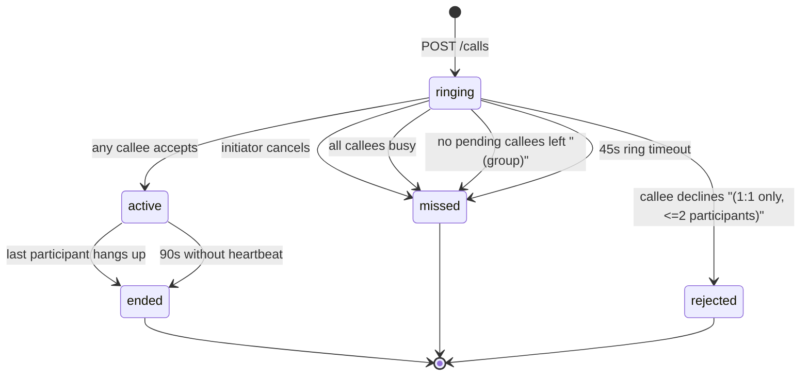
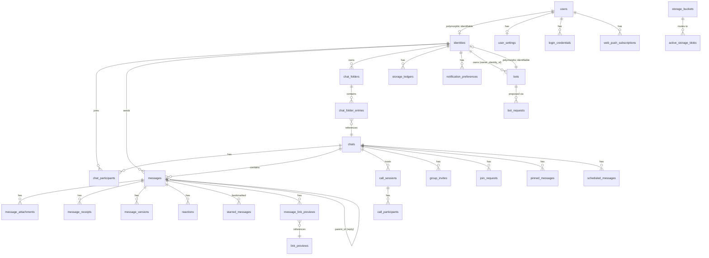
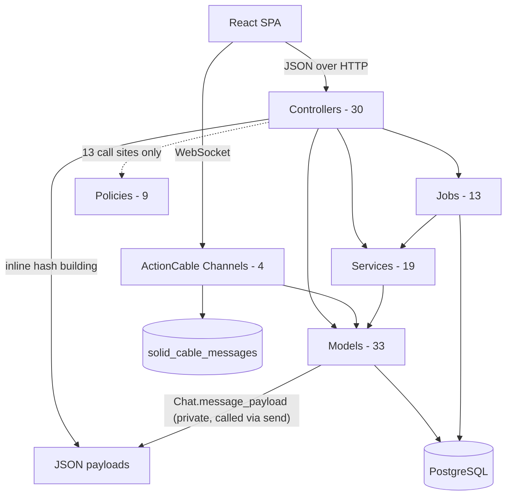
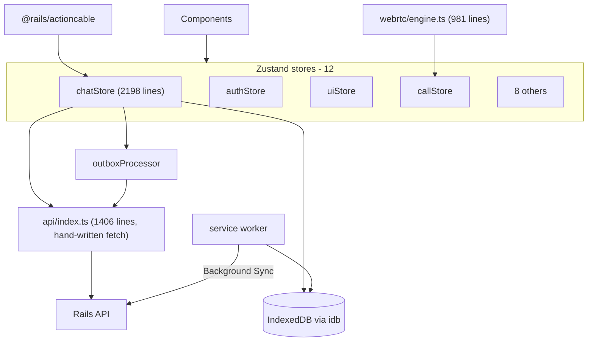

# AUDIT_REPORT.md — Ground Truth Extraction

> **Step 1 of the MASTER_PLAN process.** This document records **what is actually
> in the code today**, not what should be. It is the reference against which the
> target architecture (Step 2) and the phased plan (Step 4) will be built.
>
> **Audit date:** 2026-08-10
> **Repos audited:** `cognify/` (Rails 8.1 API), `botverse/` (React 19 + TS SPA/PWA)
> **Method:** Full read of both repos — schema, routes, all models/controllers/
> services/jobs/channels/policies, all stores/API client/hooks/components, config,
> tests, and deployment manifests. Seven parallel domain audits plus direct
> verification of high-stakes claims.

---

## How to read this document

Every claim is tagged so you can tell observation from inference:

| Tag | Meaning |
| --- | --- |
| **[V]** | **Verified** — I read the code directly and quote/cite it. |
| **[R]** | **Reported** — found by a domain audit with a file:line cite; consistent with what I read, but I did not independently re-read that exact line. |
| **[I]** | **Inferred** — a conclusion drawn from evidence, not stated in the code. Treat as a hypothesis. |
| **[?]** | **Unknown / needs your input** — listed in §9 Open Questions. |

**Nothing in this document is a recommendation.** Recommendations start in Step 2.
Where I note something is a problem, that is a factual observation about risk, not
yet a proposal for what to do about it.

---

## Table of contents

- [§0 Repository facts](#0-repository-facts-verified)
- [§1 Feature inventory](#1-feature-inventory)
- [§2 Implicit business rules and edge cases](#2-implicit-business-rules-and-edge-cases)
- [§3 Current schema map](#3-current-schema-map)
- [§4 Current architecture map](#4-current-architecture-map)
- [§5 Current API surface](#5-current-api-surface)
- [§6 Pain point confirmation](#6-pain-point-confirmation)
- [§7 Naming register](#7-naming-register)
- [§8 Test coverage reality check](#8-test-coverage-reality-check)
- [§9 Open questions — I need your answers](#9-open-questions--i-need-your-answers)
- [§10 Confidence assessment](#10-confidence-assessment)

---

## §0 Repository facts (verified)

**[V]** Measured directly.

### cognify (backend)

| Metric | Value |
| --- | --- |
| Framework | Rails **8.1.3**, Ruby **4.0.3** |
| Database | PostgreSQL (extensions: `citext`, `plpgsql`) |
| App code | ~9,000 lines of Ruby across `app/` + `lib/` |
| Migrations | **66** files, spanning `2023-03-05` → `2026-08-09` |
| Tables | **41** (25 domain + 13 infrastructure + 3 Active Storage) |
| Models | 33 |
| Controllers | 30 (25 API, 4 admin/session, 1 base) |
| Services | 19 |
| Jobs | 13 |
| Channels | 4 + 1 concern |
| Policies | 9 |
| Serializers | **0** |
| RSpec files | **66** |
| Legacy Minitest files | **~30** (a second, parallel, aging suite in `test/`) |

**Largest backend files** — these are the god objects:

```
984  app/models/chat.rb
768  app/controllers/api/v1/messages_controller.rb
604  app/controllers/api/v1/ai_controller.rb
482  app/controllers/api/v1/chats_controller.rb
368  app/services/call_lifecycle_service.rb
368  app/controllers/api/v1/users_controller.rb
306  app/controllers/admin/admin_controller.rb
282  app/services/ai_service.rb
```

### botverse (frontend)

| Metric | Value |
| --- | --- |
| Framework | React 19 + TypeScript (strict), Vite 8 |
| State | Zustand 5 — **no** React Query / SWR / RTK Query |
| Styling | Tailwind CSS v4 + CSS custom properties |
| App code | ~30,000 lines across `src/` |
| Zustand stores | 12 |
| Components | ~120 |
| Test files | 17 (Vitest) |
| E2E tests | **0** |

**Largest frontend files** — these are the god components:

```
2198  src/stores/chatStore.ts
1406  src/api/index.ts
1228  src/components/panels/GroupInfoContent.tsx
 981  src/lib/webrtc/engine.ts
 957  src/components/chat/MessageBubble.tsx
 893  src/components/chat/MessageView.tsx
 873  src/components/chat/ChatInput.tsx
 848  src/components/sidebar/BotBuilderPanel.tsx
 745  src/stores/uiStore.ts
```

### Notable stack characteristics

**[V]** The backend runs **entirely on PostgreSQL with no Redis**. It uses the
Rails 8 "Solid" trio: **Solid Queue** (jobs), **Solid Cable** (WebSocket pub/sub),
**Solid Cache** (cache store). Confirmed by `solid_cable_messages`,
`solid_queue_*`, and `solid_cache_entries` tables in `schema.rb` and by
`config/cable.yml`.

**[V]** Deployment is **a single Render web service on the free tier**, running
Puma with `SOLID_QUEUE_IN_PUMA=true` — meaning **background jobs execute inside
the web process**. There is no separate worker dyno. Frontend deploys separately
(comments reference Netlify).

---

## §1 Feature inventory

This is the contract for the rebuild: **everything listed here exists today and
must be accounted for.** Anything I recommend cutting will be flagged explicitly
in Step 2 for your approval, never silently dropped.

### 1.1 Authentication and account (7 distinct login methods)

| # | Feature | Where |
| --- | --- | --- |
| 1 | Google OAuth — GIS popup / auth-code flow | `sessions_controller.rb#create_from_code` |
| 2 | Google OAuth — legacy server redirect flow (used by admin) | `sessions_controller.rb#create` |
| 3 | Email + password (register, login, forgot, reset) | `password_auth_controller.rb` |
| 4 | Email OTP (6-digit) | `otp_auth_controller.rb` |
| 5 | Magic link (email) | `otp_auth_controller.rb` |
| 6 | Phone / SMS OTP | `otp_auth_controller.rb` + `SmsDeliverer` — **[V] not actually deliverable in production**; the production deliverer raises. Falls back to email. |
| 7 | WebAuthn passkeys | `passkey_auth_controller.rb`, `passkeys_controller.rb` |
| 8 | Dev login bypass | `sessions#dev_login` — **[V] correctly excluded from production** (`routes.rb:14`) |

Plus:

- **Passkey App Lock** — biometric re-auth overlay (`lock_options` / `assert_lock`). **[R]** Client-side only; does not revoke the JWT.
- **Multi-account** — multiple JWTs held in `localStorage`; switch without logout. **[R]** Purely client-side; server has no session registry.
- **Onboarding wizard** — profile → optional password → optional passkey.
- **Verified contact change** — email and phone change/removal via OTP (`concerns/contact_change.rb`).
- **Account deletion** — `DELETE /users/me`.

### 1.2 Messaging

**Chat types:** `direct` (1:1 human, 1:1 bot, and self-chat / "Saved Messages"),
`group`, `broadcast` (admin-post-only channel).

| Feature | Notes |
| --- | --- |
| Send text / attachments / voice notes | Up to 10 attachments per message |
| Reply (threaded quote) | `parent_id`; renders a snippet card |
| Edit | 15-minute window; full version history retained |
| Edit history viewer | `EditHistoryPopover` |
| Unsend / delete | Soft delete (tombstone) |
| Forward | Copies blob references, not re-uploads |
| Copy | Client-side |
| Pin | Chat-wide, **max 5 per chat**, with a cycling pin banner |
| Star / save | Private per-user bookmarks + a starred drawer |
| React | Multiple distinct emoji per user per message; 6 customizable quick reactions; double-tap to react |
| Schedule | Separate table; edit / reschedule / send-now / cancel |
| Regenerate | Re-run an AI bot response |
| Message info | Per-recipient delivered/read receipts sheet |
| Mentions | `@user` and `@bot` tokens; mentioning a bot in a group triggers it |
| Link previews | Server-side OpenGraph unfurling with SSRF protection |
| Markdown rendering | For bot messages: GFM + syntax highlighting. Plain text for user messages. |
| Jumbo emoji | Emoji-only messages render large, without a bubble |
| Read receipts | Three overlapping mechanisms — see §2.3 |
| Typing indicator | **[V] Bot generation only.** There is no human typing indicator on the server. |
| Delivery status ticks | sent / delivered / read |
| Cross-chat search | Global message + chat search |
| In-chat search | With prev/next navigation and result list modes |
| Jump to message | With back-restore to where you were |
| Jump to date | Date picker with shortcuts |
| Day separators | Sticky date chips |
| Unread divider + summarize card | Offers AI summary when ≥5 unread |

### 1.3 Groups and permissions

Create group · roles (member / admin / owner) · promote / demote · transfer
ownership · add / remove members · leave (blocked if you are the last admin) ·
edit title / description / avatar · invite links (expiry, max-uses,
requires-approval) · revoke invites · join request inbox with approve/reject ·
invite landing page · broadcast channels · per-chat mute (1h / 8h / 24h / until on).

### 1.4 AI and bots

- **Predefined bots** (~30 seeded personalities, no owner) and **user-created bots**.
- **Bot Builder** — users propose a bot (name, username, bio, system prompt ≥80 chars); an admin approves or declines. Same flow for edits.
- **Streaming bot replies** over ActionCable, chunk by chunk.
- **Cancel generation** mid-stream.
- **Automatic conversation summarization** — long chats get compressed into `chats.context_summary` to fit the context window.
- **AI Rewrite** — rewrite your draft in a chosen tone (SSE streaming), with follow-up suggestions.
- **Smart reply chips** — 2–3 suggested replies.
- **Translate** — per-message translation, cached in `message.metadata`.
- **Translate arbitrary text**.
- **Summarize chat** — bulleted summary of unread or recent messages (SSE).
- **Writing style profile** — the AI learns your writing style and mimics it in rewrites/smart replies. **[R] See §6 for the privacy finding here.**

### 1.5 Media

Direct browser→R2 upload (presigned) · images with blurhash placeholders and
WebP variants · video with dimension/duration probing · PDF thumbnails · audio ·
voice notes with waveform · album grid for multi-image messages · lightbox
viewer · per-chat media/files/links gallery · per-user 500 MB storage quota ·
multi-bucket routing across Cloudflare R2 accounts · orphaned blob cleanup ·
bucket health monitoring.

### 1.6 Calls

WebRTC audio and video · **group calls up to 4 participants** (full mesh) ·
incoming call banner with swipe-to-silence on mobile · accept / decline / cancel /
busy / timeout · picture-in-picture with corner snapping · minimize to a top bar ·
mute (hold for audio device menu) · camera toggle · camera flip · speaker toggle ·
call history rendered as in-chat system messages that update live · stuck-call
recovery · STUN/TURN with Metered or self-hosted coturn.

### 1.7 Settings and personalization

| Panel | Settings |
| --- | --- |
| **Privacy** | Last-seen visibility, read receipts, email/phone discoverability, show email/phone on profile, change/remove email, change/remove phone |
| **Theme** | Light / dark / system, accent color picker, **separate light and dark accents** |
| **Typography** | Font family (server-managed catalog), size multiplier, weight, line height, letter spacing — with live preview |
| **Time & date** | 12h/24h, **11 date formats** |
| **Quick reactions** | 6 customizable emoji slots |
| **Security** | Password change, passkey management (add/remove/nickname), App Lock threshold |
| **Notifications** | Preview, sound, vibration, per-type levels (all/mentions/none) for DM/group/broadcast, Do Not Disturb with time window and day selection, per-chat overrides |
| **AI** | Feature toggles, translation target language, rebuild style profile |
| **Profile** | Avatar, name, username (with availability check), bio |
| **Accounts** | Add, switch, logout, remove, delete account |

### 1.8 PWA and offline

Installable PWA · service worker with asset caching · **web push notifications**
with multi-account routing and notification stacking · **IndexedDB message cache**
(200 messages/chat) · **offline send outbox** with Background Sync API retry ·
reconnect catch-up via a `change_seq` cursor · network status banner.

### 1.9 Chat organization

Custom folders with drag-and-drop reordering · All / Unread built-in tabs ·
add/remove chats from folders · unread badges · mute indicators.

### 1.10 Admin panel

**[V]** A server-rendered ERB admin panel inside an otherwise API-only app:
user list · **arbitrary chat transcript viewer** · bot CRUD · bulk bot JSON
import · bot request approval/decline · accent theme CRUD with bulk import and
reorder · font config CRUD.

---

## §2 Implicit business rules and edge cases

**This is the most important section of the audit** — the tribal knowledge
encoded in the code that a rebuild would silently lose. Rules are numbered for
reference from later documents.

### 2.1 Message lifecycle

| # | Rule | Cite |
| --- | --- | --- |
| BR-1 | Messages are **never hard-deleted** via the API. Delete sets `deleted_at`; the row remains as a tombstone. | `message.rb:67` **[R]** |
| BR-2 | Edit window is **15 minutes** from creation. | `message.rb:26,80` **[R]** |
| BR-3 | Only **user-sent** messages are editable. Bot messages fail `editable?`. | `message.rb:76-81` **[R]** |
| BR-4 | Editing stores the *previous* body in `message_versions` before overwriting. History is append-only and unbounded. | `message.rb:83-87` **[R]** |
| BR-5 | A message must have **text or attachments**; attachment-only messages are valid. | `messages_controller.rb:267` **[R]** |
| BR-6 | Edited text may be blank **only if** the message has attachments (clearing a caption). | `messages_controller.rb:86` **[R]** |
| BR-7 | Deleting a message does **not** cascade to its pins, stars, reactions, attachments, or blobs. They all survive the tombstone. | **[R]** |
| BR-8 | A reply whose parent was deleted renders `{ deleted: true }` rather than breaking. | `chat.rb:644-649` **[R]** |
| BR-9 | There is **no reply depth limit** and no validation that `parent_id` is in the same chat. There is no FK on `parent_id`. | **[V]** schema has no FK for `parent_id` |
| BR-10 | Forwarding creates an **independent copy** with the forwarder as sender. Original-sender attribution is **not preserved**. | `message.rb:95-104` **[R]** |
| BR-11 | Forwarded attachments **share the same blob** — no re-upload, no extra storage. | `messages_controller.rb:556-575` **[R]** |
| BR-12 | Deleting the original of a forwarded message does **not** affect the forwarded copies. | **[R]** |
| BR-13 | `forwarded_count` lives on the **original** (how many times it was forwarded); `is_forwarded` lives on the **copy**. | **[R]** |
| BR-14 | You can only forward to **one** chat per request. | `messages_controller.rb:128-131` **[V]** |
| BR-15 | Regenerate soft-deletes the old bot message and creates a new one. The tombstone remains. | `messages_controller.rb:214-237` **[V]** |
| BR-16 | Max **10 attachments** per message. | `messages_controller.rb:305` **[R]** |
| BR-17 | Invalid attachment signed-IDs are **skipped silently**; the message still sends with the valid ones. `attachment_count` reflects only successes. | `messages_controller.rb:331-338` **[R]** |
| BR-18 | Voice notes max **5 minutes** (300,000 ms). | `messages_controller.rb:292` **[R]** |
| BR-19 | Voice waveforms are downsampled to a max of **64 peaks**, clamped 0–1. | `messages_controller.rb:364-374` **[R]** |
| BR-20 | Only the **first 3 URLs** in a message get link previews. | `messages_controller.rb:377` **[R]** |
| BR-21 | Max **5 pinned messages** per chat. | `pinned_message.rb:20` **[R]** |
| BR-22 | **Any active member** can pin or unpin — not just admins. There is an explicit TODO about this. | `pinned_messages_controller.rb:5-7` **[R]** |
| BR-23 | A pinned message that gets deleted stays in the pin list, shown as `{ deleted: true }`. | **[R]** |
| BR-24 | Pins survive the pinner leaving the group. `pinned_by_id` is left dangling — **and has no FK**. | **[V]** schema:347-354 has no FK for `pinned_by_id` |
| BR-25 | Reactions: multiple distinct emoji per user per message; unique on `(message_id, user_id, emoji)`. Emoji strings capped at 16 chars. | `reaction.rb:9,15` **[R]** |
| BR-26 | **Reactions do not bump `change_seq`.** A client that reconnects and catches up via `after_change_seq` will miss reaction changes. | **[R]** — significant sync hole |
| BR-27 | Sending a message **implicitly marks the chat read** for the sender (watermark + receipts). | `messages_controller.rb:392-404` **[R]** |
| BR-28 | The read watermark is **monotonic** — it never moves backwards. | `chats_controller.rb:175-177` **[R]** |
| BR-29 | `messages.status` only ever advances (sent → delivered → read), never regresses. | `message.rb:108-114` **[R]** |
| BR-30 | Catch-up sync **includes soft-deleted tombstones** so clients learn about deletions. | `chat.rb:400-405` **[R]** |

### 2.2 The dual sequence system

**[R]** There are **two independent counters per chat**, and understanding them is
essential:

```
chats.message_seq  →  messages.seq         "display order"  — allocated once, immutable
chats.change_seq   →  messages.change_seq  "mutation cursor" — bumped on create AND on edit/delete
```

| # | Rule | Cite |
| --- | --- | --- |
| BR-31 | Both are allocated atomically via a single `UPDATE chats SET … RETURNING` statement, which takes a Postgres row lock. Concurrent sends to the same chat serialize on that row. | `chat_sequencer.rb:23-48` **[R]** |
| BR-32 | Both columns are **nullable** — legacy rows predate the system. There is a partial unique index `WHERE seq IS NOT NULL`. | **[V]** schema:319,327 |
| BR-33 | Clients resync after reconnect by requesting everything with `change_seq > last_seen`. The frontend **does** implement this. | `chatStore.ts:1349-1413` **[R]** |
| BR-34 | Edit and delete call `next_change_seq!` only (not `next_seq!`), so display order is preserved while the mutation is still broadcast. | `messages_controller.rb:631-636` **[R]** |

### 2.3 Read receipts — three overlapping mechanisms

**[R]** This is the single most confusing area of the codebase. There are **three**
sources of truth that can disagree:

| Mechanism | Storage | Written by |
| --- | --- | --- |
| **(a) Per-message receipts** | `message_receipts` rows | `POST /chats/:id/mark_messages_read`, implicit-read-on-send, WebSocket subscribe |
| **(b) Watermark** | `chat_participants.last_read_message_id` + `last_read_at` | `POST /chats/:id/mark_read`, implicit-read-on-send |
| **(c) Legacy status column** | `messages.status` string | Online delivery, `ReadReceiptService` |

| # | Rule | Cite |
| --- | --- | --- |
| BR-35 | `message_receipts` has **three timestamps**: `delivered_at` (device received it), `read_at` (viewed *with receipts enabled* — disclosable to the sender), `seen_at` (viewed *with receipts disabled* — recorded privately, never disclosed). | `message_receipt.rb:31-40` **[R]** |
| BR-36 | Turning read receipts **on** does not retroactively disclose messages you read while they were off. Rows with `seen_at` but no `read_at` are permanently excluded. | `message_receipt.rb:44-50` **[R]** |
| BR-37 | Read-tick broadcast requires **both** the reader and the sender to have `allow_read_receipts` enabled — the privacy rule is symmetric. | `broadcast_read_receipt_job.rb:15,29` **[R]** |
| BR-38 | `mark_read` moves the watermark only. `mark_messages_read` writes receipts only. **A client must call both**; neither implies the other. | **[R]** |
| BR-39 | In a group chat, `messages.status = 'read'` means *one* reader read it, not all — the column is global to the message. Misleading in groups. | **[R]** |
| BR-40 | Unread count = messages in the chat, not sent by you, not deleted, with `id > last_read_message_id`. | `chat_participant.rb:60-65` **[R]** |
| BR-41 | Read receipts for **bot-sent** messages are silently skipped — the broadcast job resolves the sender through `User.find_by`, which returns nil for bots. | `broadcast_read_receipt_job.rb:25-29` **[R]** |

### 2.4 Privacy semantics

| # | Rule | Cite |
| --- | --- | --- |
| BR-42 | Last-seen is **symmetric**: if you hide yours, you cannot see anyone else's. Both parties must opt in. | `user.rb:90-91` **[R]** |
| BR-43 | `last_seen_at` is **always written** to the DB regardless of the privacy flag. The flag only gates *exposure*. | `persist_last_seen_job.rb` **[R]** |
| BR-44 | Presence goes offline **5 seconds after** the last WebSocket disconnects, and only if no reconnect happened in that window. | `presence_channel.rb:47` **[R]** |
| BR-45 | Email/phone search requires an **exact** match *and* the target's `discoverable_by_email`/`_phone` flag. | `users_controller.rb:117-129` **[R]** |
| BR-46 | **Username and name search have no discoverability gate at all** — anyone can enumerate users by name prefix (min 3 chars, limit 20). | `users_controller.rb:115-144` **[R]** |
| BR-47 | `identities.discoverable_by_username` exists in the schema but is **never read anywhere in the code**. Dead column. | **[R]** |

### 2.5 Groups, roles, and membership

| # | Rule | Cite |
| --- | --- | --- |
| BR-48 | Roles are `member: 0`, `admin: 1`, `owner: 2`. States are `active: 0`, `invited: 1`, `pending_approval: 2`, `left: 3`, `removed: 4`. | `chat_participant.rb:28,31` **[R]** |
| BR-49 | **The soft states are unused.** Leave and remove call `destroy!`, deleting the row. `left` and `removed` are never written. There is **no ban capability**. | **[R]** |
| BR-50 | Because the row is destroyed, a removed member **can rejoin via an invite link**. | **[I]** follows from BR-49 |
| BR-51 | The last admin/owner **cannot leave** while other members remain — they must transfer ownership or promote someone first. There is **no auto-transfer**. | `chat_membership.rb:110-119` **[R]** |
| BR-52 | If the last member leaves, the chat is **destroyed** entirely. | `chats_controller.rb:154-157` **[R]** |
| BR-53 | A participant cannot be removed if it would drop the active count below 2. | `chat.rb:217` **[R]** |
| BR-54 | Groups need **≥2 participants** at creation. There is **no maximum group size**. | `chats_controller.rb:278` **[R]** |
| BR-55 | Group titles default to a generated `"Group ABC123"` if left blank. | `chat.rb:109-112` **[R]** |
| BR-56 | In broadcast chats, only admins/owners can post; members can still react. | `chat.rb:146-157` **[R]** |
| BR-57 | Invite tokens are `SecureRandom.urlsafe_base64(18)` with a collision retry loop — cryptographically sound. | `group_invite.rb:43-47` **[R]** |
| BR-58 | `max_uses` is enforced by a **check-then-increment with no lock** — concurrent joins can exceed the limit. | `group_invites_controller.rb:50-64` **[R]** |
| BR-59 | `GET /invites/:token` is documented as public but **actually requires authentication** — no `skip_before_action` was added. Unauthenticated users get a 401. | **[R]** — likely a bug |
| BR-60 | A previously approved/rejected join request is **reset to pending** if the user tries to join again. | `group_invites_controller.rb:112-121` **[R]** |
| BR-61 | Leaving a chat does **not** remove it from your folders, and does **not** cancel your scheduled messages to it. | **[R]** |

### 2.6 Calls

**[R]** Session states: `ringing: 0`, `active: 1`, `ended: 2`, `missed: 3`,
`rejected: 4`. Participant states: `invited: 0` (**never written — dead**),
`ringing: 1`, `joined: 2`, `left: 3`, `rejected: 4`, `busy: 5`.



| # | Rule | Cite |
| --- | --- | --- |
| BR-62 | Max **4 human participants**, full mesh P2P. Bots are never invited to calls. | `call_session.rb:4-8` **[R]** |
| BR-63 | A **partial unique index** enforces that a user can be `ringing` or `joined` in at most **one call globally**. A second incoming call marks them `busy` instead. | **[V]** schema:90 |
| BR-64 | Ring timeout **45s**; active-call heartbeat timeout **90s**; heartbeat interval **20s**; expiry sweep runs every **30s**. | `call_session.rb:18-28`, `expire_stale_calls_job.rb:12` **[R]** |
| BR-65 | A timeout broadcasts `call_cancelled` with `reason: 'timeout'` — a *cancel* event for what is semantically a *miss*. | `call_lifecycle_service.rb:273-278` **[R]** |
| BR-66 | If the initiator's WebSocket drops mid-ring, **nothing happens** — no cleanup on `unsubscribed`. The call sits ringing until the 45s sweep. | `signaling_channel.rb:25-27` **[R]** |
| BR-67 | Each call writes **one system message** into the chat, which is then **edited in place** as the call progresses (ringing → active → ended). Looked up via a partial index on `metadata->>'call_id'`. | **[V]** schema:323; `call_history_service.rb` **[R]** |
| BR-68 | `duration_seconds` is computed only on clean end (`started_at` and `ended_at` both present). Missed/rejected calls have none. | `call_session.rb:81-85` **[R]** |
| BR-69 | WebRTC signaling payloads (SDP, ICE) are **relayed opaquely with no server-side validation**. Authorization checks sender and target are both participants. | `signaling_channel.rb:31-49` **[R]** |
| BR-70 | The frontend has **no ICE restart** — a failed peer connection is torn down, not recovered. | `engine.ts:208-211` **[R]** |
| BR-71 | TURN credentials: Metered API (cached 4h) or coturn HMAC (`expiry:user_id` username, 24h TTL). Falls back to STUN-only. | `ice_server_service.rb` **[R]** |

### 2.7 AI and bots

| # | Rule | Cite |
| --- | --- | --- |
| BR-72 | The AI provider is **OpenRouter only**, hardcoded. Model is global via `AI_MODEL` (default `meta-llama/llama-3.3-70b-instruct:free`), **not per-bot**. | `ai_service.rb:189-195` **[R]** |
| BR-73 | On HTTP 402/404/429, the service **rotates through a list of free fallback models**. | `ai_service.rb:44-45` **[R]** |
| BR-74 | Bot context = last **20 messages** (`AI_CONTEXT_MESSAGES`) + the chat's rolling summary. `max_tokens: 1024`. | `ai_service.rb:139-155` **[R]** |
| BR-75 | Chats over **40 messages** get auto-summarized: everything before the context window is compressed into `chats.context_summary` and injected as a second system message. Watermarked by `summarized_through_id`. | `conversation_summary_service.rb` **[R]** |
| BR-76 | Bot replies are idempotent via a synthetic `client_id` of `"bot_reply:<msg_id>:<bot_id>"`. | `bot_reply_job.rb:55-64` **[R]** |
| BR-77 | Cancelling mid-stream **persists the partial text** as a complete bot message if any text was accumulated. If empty, nothing is saved. | `bot_reply_job.rb:86-91` **[R]** |
| BR-78 | If the AI call **fails** mid-stream, no message row is created; `generation_cancelled` is broadcast with an error, and the job retries up to 3 times. | **[R]** |
| BR-79 | There are **two independent cancellation mechanisms** with different cache keys: `ai_cancel:chat:<id>` and `cancel:gen:<generation_id>`. | **[R]** |
| BR-80 | Bot system prompts must be **≥80 characters**. | `bot_request.rb` **[R]** |
| BR-81 | Bots are soft-deleted via `deactivated_at`; they vanish from the directory but **existing chats still resolve them**. | `bot.rb:25-27` **[R]** |
| BR-82 | Predefined bots have `owner_identity_id = nil`; user bots are owned by the requester's identity. | **[R]** |
| BR-83 | Mentioning a bot in a **group** triggers a reply. Bot messages never trigger other bots (no cascade). | `mention_dispatcher.rb:45,56-61` **[R]** |
| BR-84 | AI helper endpoints are rate-limited per user (rewrite/smart-reply 10/min, translate 20/min, summarize 5/min, style profile 1/hour) — **but bot replies themselves are not rate-limited at all**. | `ai_controller.rb` **[R]** |
| BR-85 | Rate limiting **fails open** if the cache errors. | `ai_controller.rb:304-305` **[R]** |
| BR-86 | Translations are cached in `message.metadata['translations'][lang]`. | **[R]** |

### 2.8 Media and storage

| # | Rule | Cite |
| --- | --- | --- |
| BR-87 | Per-user quota **500 MB**; global hard cap **9.5 GB** across all users. | `storage_ledger.rb` **[R]** |
| BR-88 | Per-file caps: image 10 MB, video 100 MB, audio 50 MB, other 100 MB. | `direct_uploads_controller.rb:32-37` **[R]** |
| BR-89 | Uploads are validated by **extension blocklist and client-declared MIME prefix** — there is **no MIME sniffing** and **no malware scanning**. | `direct_uploads_controller.rb:43-51` **[R]** |
| BR-90 | Uploads are **deduplicated by checksum** — an identical file reuses the existing blob. | `direct_uploads_controller.rb:107-119` **[R]** |
| BR-91 | Buckets are chosen as: lowest `priority` among `active` buckets with remaining capacity. Designed to spread across multiple Cloudflare R2 free-tier accounts (9.5 GB each). | `bucket_router.rb:19-28` **[R]** |
| BR-92 | **`StorageLedger#decrement!` is never called from application code.** Per-user `used_bytes` only ever grows. Soft-deleting a message frees nothing. | **[R]** — confirmed drift |
| BR-93 | Audio and video downloads **redirect to a signed R2 URL** (1h expiry). Everything else is **proxied through Rails** via a tempfile. | `media_controller.rb:60-71` **[R]** |
| BR-94 | Media download authorization is **possession of the signed_id** — there is no per-request chat-membership check. Signed URLs are shareable. | `media_controller.rb:16-19` **[R]** |
| BR-95 | Orphaned blobs (unattached, >1h old, not link-preview keys) are purged daily. | `orphaned_blob_cleanup_job.rb` **[R]** |
| BR-96 | `ProcessAttachmentJob` has **no retry** — it rescues all errors, logs, and exits. If `ffmpeg`/`ffprobe` is missing, processing silently no-ops and the attachment is still marked processed. | `process_attachment_job.rb:31-34` **[R]** |
| BR-97 | Link preview fetching has **real SSRF protection** (DNS pinning, private/metadata IP blocking, redirect validation) via the `radioactive` gem. OG images capped at 2 MB and resized to 400px WebP. | `link_preview_job.rb:4-9,59-64` **[R]** |

### 2.9 Notifications

| # | Rule | Cite |
| --- | --- | --- |
| BR-98 | Preference scopes form a cascade: `SYSTEM_DEFAULTS ← global ← type (dm/group/broadcast) ← chat:<id>`, resolved by hash merge. | `notification_preference_service.rb:26-38` **[R]** |
| BR-99 | Allowed setting keys are a **fixed whitelist**: `level`, `show_preview`, `sound`, `vibration`, `dnd_enabled`, `dnd_start`, `dnd_end`, `dnd_days`. Unknown keys are rejected on validation. | `notification_preference.rb:24-33` **[R]** |
| BR-100 | Do Not Disturb uses `Time.current` — **the server's timezone, not the user's**, despite a comment claiming otherwise. | `notification_preference_service.rb:116-117` **[R]** |
| BR-101 | Mute (`chat_participants.muted_until`) is checked **twice**: once at enqueue and once in the job. | **[R]** |
| BR-102 | **Bug:** the push enqueue path does not pass `message_id`, so the "mentions only" preference level evaluates against an empty message. In groups, "mentions only" therefore **suppresses all pushes including actual mentions**. | `messages_controller.rb:745-753` **[R]** |
| BR-103 | Web Push only — no APNs/FCM. Expired subscriptions are deleted on 410-equivalent errors. TTL 24h. | `web_push_service.rb:59-61` **[R]** |
| BR-104 | When one browser endpoint serves multiple accounts, the notification title is prefixed with `[@username]`. | `web_push_service.rb:27-28` **[R]** |
| BR-105 | Broadcast chats never send push notifications. | `messages_controller.rb:707` **[R]** |

### 2.10 Frontend-encoded rules

**[R]** These duplicate or extend backend rules on the client, and are a source
of drift:

| # | Rule | Cite |
| --- | --- | --- |
| BR-106 | The **15-minute edit window is hardcoded a second time on the client**. | `MessageContextMenu.tsx:67-71` |
| BR-107 | IndexedDB caches **200 messages per chat**, evicting oldest. | `db.ts:108` |
| BR-108 | Page size 50; jump-window 60. | `api/index.ts:321,919` |
| BR-109 | Read-receipt marking debounced 400 ms, fires at 50% intersection. | `useReadReceipts.ts:19,69` |
| BR-110 | Reconnect catch-up delayed 800 ms; reconnect poll every 4 s; connection poll every 3 s; presence refetch every 30 s. | `useChatChannel.ts:13-17`, `Header.tsx:105` |
| BR-111 | Group video is capped at 640×480 @ 20 fps to survive mesh bandwidth. | `engine.ts:63-67` |
| BR-112 | Search requires ≥2 chars, debounced 350 ms. | `ChatList.tsx:9-10` |
| BR-113 | Recent emoji list capped at 30; spotlight highlight clears after 2500 ms. | `useRecentEmojis.ts:4`, `MessageView.tsx:281` |
| BR-114 | The offline outbox **assumes the server deduplicates by `client_id`**, stated in a comment. See §6 for why this is dangerous. | `outboxProcessor.ts:13` |

---

## §3 Current schema map

**[V]** All table/column/index facts in this section were read directly from
`cognify/db/schema.rb`.

### 3.1 Entity relationship overview



### 3.2 Tables by group

**Identity and auth (7):** `users`, `identities`, `login_credentials`,
`user_settings`, `web_push_subscriptions`, `font_configs`, `global_accent_configs`

**Messaging (12):** `chats`, `chat_participants`, `messages`, `message_receipts`,
`message_versions`, `message_attachments`, `message_link_previews`,
`link_previews`, `reactions`, `pinned_messages`, `starred_messages`,
`scheduled_messages`

**Groups (2):** `group_invites`, `join_requests`

**Organization (2):** `chat_folders`, `chat_folder_entries`

**Bots (2):** `bots`, `bot_requests`

**Calls (2):** `call_sessions`, `call_participants`

**Notifications (1):** `notification_preferences`

**Storage (2):** `storage_buckets`, `storage_ledgers`

**Infrastructure (11):** 3 × Active Storage, 1 × Solid Cable, 1 × Solid Cache,
6 × Solid Queue

### 3.3 Schema problems found

#### P-1 — The `user_id` vs `identity_id` split is inconsistent **[V]**

Some tables key actors by `identity_id` (which can be a User *or* a Bot), others
by `user_id` (User only). This is **partially principled and partially accidental**:

| Keyed by `identity_id` | Keyed by `user_id` |
| --- | --- |
| `chat_participants` | `message_receipts` |
| `messages` | `reactions` |
| `chat_folders` | `starred_messages` |
| `notification_preferences` | `call_participants` |
| `storage_ledgers` | `web_push_subscriptions` |
| `scheduled_messages` | `login_credentials` |
| `join_requests` | `user_settings` |
| `bots.owner_identity_id` | `call_sessions.initiator_id` |
| `pinned_messages.pinned_by_id` | |

The **defensible logic** is "things a bot can do use identity; things only a human
can do use user." The **accidental part** is that `pinned_messages.pinned_by_id`
points at an identity but has **no foreign key at all** — verified, `schema.rb:347-354`
has no `add_foreign_key` entry. And read-receipt broadcasting silently breaks for
bot-sent messages because it resolves through `User.find_by`.

#### P-2 — Duplicated username columns **[V]**

`users.username` (unique) **and** `identities.username` (citext, unique) both
exist, both are written, and **neither is fully authoritative**:

- Profile updates, JWT claims, search, and `check_username` read `users.username`.
- Mentions, message sender snapshots, and bot display read `identities.username`.
- `User#sync_identity_fields` copies user → identity **and swallows `RecordInvalid` with a warning log** — so they can drift.
- `check_username` only checks `users`, so a username can be "available" while colliding with a bot's identity handle.

The same duplication exists for `bots.username`. **[I]** This looks like an
incomplete Phase-1 migration: the `unified_identity` feature flag exists, is
enabled in production YAML, and is **never checked anywhere in the code** (verified).

#### P-3 — The trigram search index is missing from the schema **[V]**

Migration `20260522150000_add_search_index_to_messages.rb` creates
`CREATE EXTENSION pg_trgm` + a GIN trigram index on `messages.text`. But
`schema.rb` contains **neither** — `enable_extension` lists only `citext` and
`plpgsql`, and `grep -c trgm db/schema.rb` returns **0**.

This means a fresh `db:schema:load` deployment gets **no search index at all**,
and both search endpoints (`ILIKE '%term%'`) will sequential-scan the messages
table. Whether the running production DB has it depends on whether it was built
by `db:migrate` or `db:schema:load`. → **Open question Q-1**.

#### P-4 — `messages.client_id` is indexed but not unique **[V]**

```
t.index ["client_id"], name: "index_messages_on_client_id"
```

No unique constraint, and no server-side find-or-create by `client_id`. Compare
`scheduled_messages.client_id`, which **does** have a unique partial index. The
frontend outbox explicitly documents "server deduplicates by client_id" — **it does
not**. See §6 F-3.

#### P-5 — `messages.identity_id` is nullable **[V]**

Nullable so that deleting a user nullifies the FK rather than cascading away their
messages. The display fallback is `sender_snapshot`. Workable, but it means
`identity_id` can never be relied upon in a join.

#### P-6 — `sender_snapshot` is captured once and never refreshed **[R]**

Contains `{ type, id, name, username }` — notably **no avatar**. Written in a
`before_create` callback, never updated. A user who renames leaves stale snapshots
behind (harmless today because live identity is preferred), but a **deleted** user's
messages lose their avatar permanently.

#### P-7 — `user_settings` requires a migration per setting **[V]**

Primary key is `user_id` (no surrogate `id`). It holds ~15 typed columns with
`CHECK` constraints enumerating allowed values, e.g.:

```sql
CHECK (date_format IN ('YYYY-MM-DD','MM/DD/YYYY','DD/MM/YYYY', ... 11 values))
```

Adding a date format requires a migration. Adding any new display setting requires
a migration + a CHECK constraint + model constants + a controller permit-list entry.
It also mixes concerns: display prefs, typography, quick reactions (jsonb), and
`ai_style_profile` (jsonb) all live in one table.

By contrast, `notification_preferences` uses `(identity_id, scope, settings jsonb)`
with a validated key whitelist — a **different pattern for the same problem**, in
the same codebase.

#### P-8 — Privacy settings are boolean columns on `users` **[V]**

`allow_last_seen`, `allow_read_receipts`, `discoverable_by_email`,
`discoverable_by_phone`, `show_email_on_profile`, `show_phone_on_profile`, plus
`identities.discoverable_by_username`. Seven booleans, three different naming
prefixes, one of them dead. Every new privacy control is a migration.

#### P-9 — `login_credentials` serves five unrelated purposes **[V]**

One table for `email_otp`, `sms_otp`, `magic_link`, `password_reset`,
`email_change`, `phone_change`, **and** `passkey`. Columns are purpose-conditional:

| Purpose | Meaningful columns |
| --- | --- |
| OTP / change codes | `code_digest` (bcrypt), `expires_at`, `attempts`, `channel` |
| Magic link / reset | `code_digest` (SHA-256), `expires_at` |
| Passkey | `external_id`, `public_key`, `sign_count`, `nickname`, `last_used_at` |

Short-lived single-use secrets and long-lived WebAuthn credentials in one table
forces most columns nullable and prevents meaningful constraints.

#### P-10 — Deprecated and dead columns **[V]**

| Column | Status |
| --- | --- |
| `users.pic` | Marked deprecated in a DB comment; **still read** in 5+ places as an avatar fallback |
| `users.token` | Not a session token — it stores the **Google OAuth `sub`**. Badly misnamed, actively used. |
| `identities.discoverable_by_username` | Never read |
| `call_participants.status = 0 (invited)` | Never written |
| `message_attachments.waveform` | Declared `jsonb default {}` but voice notes store a JSON **array** |
| Group system `event_type` values (`member_added`, `title_changed`, …) | Preview code exists; **no writer found** |

#### P-11 — Redundancy and missing indexes **[V]/[I]**

- `messages` carries both `is_forwarded` (boolean) and `forwarded_count` (integer) with different meanings on different rows.
- `messages.status` string duplicates information now held in `message_receipts`.
- `chats` carries AI concerns (`context_summary`, `summarized_through_id`) alongside chat structure.
- `web_push_subscriptions.user_id` is `integer` while every other FK is `bigint`. **[V]** schema:588.
- No index supports `messages.parent_id` reverse lookups beyond the plain FK index; no index on `message_receipts.read_at` for receipt aggregation. **[I]**

---

## §4 Current architecture map

### 4.1 Backend layering



**Observations [V]:**

- **There is no serialization layer.** No ActiveModelSerializers, Blueprinter, Alba, or jbuilder. JSON is built by private class methods on `Chat` (invoked from controllers via `Chat.send(:message_payload, …)`) and by inline hashes in controllers.
- **Business logic placement is inconsistent.** Some lives in services (`CallLifecycleService`, `ChatMembership`, `ReadReceiptService`), some in fat controllers (`MessagesController` at 768 lines does attachment handling, push fanout, bot dispatch, and scheduling), and a lot in the `Chat` model.
- **Authorization is 87% unenforced by policy.** There are exactly **13 `authorize` calls** across the entire API (verified by grep). `MessagePolicy`, `ReactionPolicy`, and `JoinRequestPolicy` are defined — `MessagePolicy` even has a passing unit spec — but **are never invoked from any controller**. There is no `verify_authorized` after-action.

The `Chat` god object (984 lines) has absorbed at least ten responsibilities:

| Lines | Responsibility |
| --- | --- |
| 66–120 | Chat creation (DM dedupe, group creation) |
| 122–224 | Membership + authorization helpers |
| 226–265 | Sidebar list serialization |
| 241–377 | Pagination engine (5 distinct query modes) |
| 380–398 | Per-chat search |
| 400–431 | Mutation-sync cursor queries |
| 466–549 | Chat/group summary shaping |
| 551–712 | **The canonical message wire format** |
| 714–786 | Sender resolution + mention rendering |
| 802–937 | Sidebar previews, system event copy, call preview text |
| 939–976 | Unread cursor computation |

### 4.2 Real-time architecture

**[V]** Solid Cable — Postgres-backed pub/sub with **100 ms polling**, 1-day
message retention in production. No Redis.

| Channel | Stream | Auth |
| --- | --- | --- |
| `ChatChannel` | `chat:<id>` | Chat exists + user is a participant |
| `UserChannel` | `user:<id>` | Any authenticated connection |
| `PresenceChannel` | `presence:<user_id>` | Any authenticated — **[R] nothing ever broadcasts to this stream** |
| `SignalingChannel` | `signaling:user:<id>` | Feature-flagged |

**[R]** Connections authenticate via **JWT in a query parameter** (`?token=`).
Critically, the cable connection **does not check `session_version`** — so a
revoked JWT can still open a WebSocket until it expires naturally. The HTTP path
does check it.

Presence is tracked as **Solid Cache counters with a 5-minute TTL**, incremented
on subscribe and decremented on unsubscribe. **[I]** Counters can drift if a
process crashes before `unsubscribed` fires; the TTL is the mitigation.

Roughly **22 distinct event types** flow over these channels. Two are ignored by
the frontend (`member_joined`, `join_request_rejected`).

### 4.3 Background jobs

**[V]** Solid Queue, running **inside the Puma web process** in production
(`SOLID_QUEUE_IN_PUMA=true`). 13 job classes.

Recurring jobs are implemented as **self-rescheduling loops kicked off from
initializers**, not via `config/recurring.yml` (which does not exist):

| Job | Interval |
| --- | --- |
| `DispatchScheduledMessagesJob` | 60 s |
| `ExpireStaleCallsJob` | 30 s |
| `BucketHealthJob` | 1 h |
| `OrphanedBlobCleanupJob` | 24 h |

**[I]** This pattern means a job crash without a rescue silently ends the loop
until the next deploy, and multiple booted processes could each start a loop.

### 4.4 Frontend architecture



**Key characteristics [R]:**

- **All server state is hand-managed in Zustand.** No React Query or equivalent. Cache invalidation, staleness, and refetching are all bespoke.
- **`chatStore` mixes server state and client state** in one store: `messages`, `chats`, `pinnedMessages` sit next to `replyTo`, `editingMessage`, `streamingText`, `firstItemIndex`.
- Messages are stored as **a single flat array for the active chat**, not normalized. Deduplication uses a module-level `Set<number>`.
- **Two reconciliation paths** exist for a sent message (outbox success callback and the WebSocket `new_message` echo), both merging by `client_id`.
- **The offline story is genuinely sophisticated**: IndexedDB cache, an outbox with a `queued → sending → failed` state machine, Background Sync API integration, and reconnect catch-up via `after_change_seq`. This is real engineering worth preserving.
- Navigation is a **custom layer stack on top of React Router**, using `history.pushState` sentinel entries so the mobile back button dismisses sheets one at a time. Complex, but it solves a real problem.
- **~39 components subscribe to a whole store** without a selector — a re-render risk.
- **Almost no code splitting** — only the emoji picker is lazy-loaded.

### 4.5 Design system state

**[R]** Tailwind v4 + a CSS custom-property token layer. Tokens that exist:
colors (semantic + accent), font family/size/weight/line-height/letter-spacing,
bubble colors. Tokens that **do not** exist: spacing scale, radius scale, shadow
scale, z-index scale, motion tokens.

There is **no shared primitive component layer** — no `Button`, `Input`, `Modal`,
`Select`, or `Tabs`. Feature components hand-roll markup: **~291 raw `<button>`
elements**, **~469 inline `style={{}}` usages**, and **~71 hardcoded hex colors**
in TSX that bypass the token system. Radix is used for dropdown/popover/tooltip
primitives only. **No `ErrorBoundary` exists anywhere.** No i18n.

Runtime theming is real and non-trivial: accent colors and full typography
settings are injected as CSS variables on `document.documentElement`, with fonts
loaded dynamically from a server-managed catalog.

### 4.6 Deployment

**[V]** From `render.yaml`:

- **One** Render web service, Ruby, Singapore region, **free tier**.
- Puma + Solid Queue in-process. **No separate worker.**
- External Postgres via `DATABASE_URL` (pooled) + `DATABASE_DIRECT_URL` (migrations).
- **No Redis.**
- Build runs assets → migrate → **seed** on every deploy.
- **No `healthCheckPath` configured, and no `/up` route in `routes.rb`.** → **Open question Q-2**.
- Frontend deploys separately (Netlify per comments); no manifest in-repo.

**27 environment variables** are documented in `.env.example` **[V]**, but several
that the code requires are **not** documented: `JWT_SECRET`, `JWT_EXPIRY_DAYS`,
`SECRET_KEY_BASE`, `WEBAUTHN_RP_NAME`, `SOLID_QUEUE_IN_PUMA`, and all `FEATURE_*`
overrides.

### 4.7 Feature flags

**[V]** Read from `config/feature_flags.yml` + `lib/feature_flag.rb`. YAML per
environment, overridable by `FEATURE_<NAME>` env vars. Not per-user, not runtime-
togglable.

**28 flags defined. 12 are never checked anywhere in Ruby code:**

| Dead flag | Reality |
| --- | --- |
| `unified_identity` | Enabled in prod; nothing reads it |
| `group_rbac` | RBAC endpoints are always mounted |
| `broadcast_channels` | Broadcast chats always work |
| `chat_folders` | Folders controller always available |
| `history_driven_ui` | Frontend concern |
| `virtualized_feed` | Frontend concern |
| `mutation_sync` | `change_seq` catch-up always available |
| `edit_messages` | Editing always on |
| `delete_for_everyone` | Soft delete always on |
| `read_receipts` | Receipts always on |
| `saved_messages` | Self-chat always works |
| — | |

**[I]** The flags map to a "Phase 0 → Phase 10" build history. They served their
purpose during development and are now mostly vestigial: production has 16 of them
set to `true` and the rest are either dead or default-false. This is a good
snapshot of how the app was built incrementally.

---

## §5 Current API surface

**[V]** Extracted from `config/routes.rb`. **~135 endpoints.**

### Auth (root-level, outside `/api/v1`)

```
POST   /auth/google                              Google GIS auth-code exchange
GET    /google/callback                          Legacy OAuth redirect (admin)
DELETE /logout
POST   /auth/dev_login                           non-production only
POST   /auth/register | /auth/login
POST   /auth/forgot_password | /auth/reset_password
POST   /auth/otp/request | /auth/otp/verify
POST   /auth/magic_link/request
GET    /auth/magic_link/verify
POST   /auth/passkeys/authentication_options
POST   /auth/passkeys/authenticate
```

### `/api/v1` by domain

| Domain | Endpoints |
| --- | --- |
| **Session** | `GET me`, `GET me/unread_chats_count`, `DELETE sessions` |
| **Users** | `GET/PATCH/DELETE users/me`, `DELETE users/me/avatar`, `POST users/me/verify_password`, `PATCH users/me/password`, `POST users/me/complete_onboarding`, email change ×3, phone change ×3, `GET users/check_username`, `GET users/search`, `GET users/:id/avatar`, `GET users/:id/profile`, `GET users/:id/chat_stats`, `GET users/:id/status` |
| **Passkeys** | `POST passkeys/registration_options`, `POST passkeys/register`, `GET passkeys`, `DELETE passkeys/:id`, `POST passkeys/lock_options`, `POST passkeys/assert_lock` |
| **Chats** | `GET/POST chats`, `PATCH chats/:id`, `GET chats/:id/messages`, `GET chats/:id/pic`, `DELETE chats/:id/leave`, `POST chats/:id/participants`, `DELETE chats/:id/participants/:type/:id`, `PATCH chats/:id/mute`, `POST chats/:id/mark_read`, `POST chats/:id/mark_messages_read`, `GET chats/:id/search`, `GET chats/:id/stats` |
| **Messages** | `POST messages`, `DELETE messages/:id`, `GET messages/:id/info`, `POST messages/:id/regenerate`, `PATCH messages/:id/edit`, `POST messages/:id/forward`, `GET messages/:id/versions`, `GET messages/scheduled`, `DELETE messages/:id/cancel_schedule`, `PATCH messages/:id/reschedule`, `PATCH messages/:id/update_scheduled`, `POST messages/:id/send_now` |
| **Reactions** | `POST/DELETE messages/:id/reactions/:emoji` |
| **Pins / Stars** | `GET/POST chats/:id/pinned_messages`, `DELETE .../:message_id`, `GET/POST/DELETE starred_messages` |
| **Groups** | invites ×5, join requests ×3, member role management ×3 |
| **Folders** | `GET/POST/PATCH/DELETE chat_folders`, `PATCH chat_folders/reorder`, `POST/DELETE chat_folders/:id/chats` |
| **Media** | `POST direct_uploads`, `GET media/:signed_id/download`, `GET media/:signed_id/thumbnail`, `GET chats/:id/media`, `GET link_previews`, `GET link_previews/image/*key` |
| **AI** | `POST ai/rewrite` (SSE), `ai/suggest_replies`, `ai/translate`, `ai/translate_text`, `ai/style_profile`, `POST chats/:id/summarize` (SSE) |
| **Bots** | `GET bots`, `DELETE bots/:id`, `GET bots/:id/avatar`, `GET bots/:id/chat_stats`, `GET/POST/PATCH/DELETE bot_requests` |
| **Calls** | `POST calls`, `GET calls/:id`, `PATCH calls/:id/respond`, `GET calls/ice_servers`, `GET calls/active` |
| **Settings** | `GET/PATCH settings`, `GET notification_preferences`, `PUT/DELETE notification_preferences/:scope`, `POST/DELETE push_subscriptions` |
| **Public config** | `GET config/accents`, `GET config/fonts` (unauthenticated) |
| **Search** | `GET search` |
| **Admin API** | `GET/POST/PATCH/DELETE admin/accents` |

### Admin (server-rendered HTML)

25 routes covering login/logout, users, bots CRUD + bulk import, bot request
approval, **arbitrary chat transcript viewing**, accents CRUD/bulk/reorder, fonts
CRUD/bulk/reorder.

### Contract observations

**[V]** There is **no API versioning strategy** beyond the `v1` namespace —
no version negotiation, no deprecation mechanism.

**[V]** Route style is inconsistent: some resources use `resources :x`, others
are hand-written path strings. `POST /chats/:id/summarize` (an AI operation) sits
outside the `ai` namespace. `resources :chats` is declared **twice** in
`routes.rb` (lines 54–62 as explicit paths, line 183 as a full `resources` block
for nesting pins).

**[R]** No OpenAPI spec, no generated client. The frontend's `api/index.ts` is
~135 hand-written fetch functions whose return types are largely untyped
(`res.json()`), so **the API contract exists only as convention**.

---

## §6 Pain point confirmation

Concrete problems found in the code, ordered by severity. Every one has a file
reference. Severity reflects impact on a production chat app, not effort to fix.

### Critical

#### F-1 — Authorization is largely unenforced **[V]**

I verified this directly. There are **13 `authorize` calls** in the entire API.
`MessagePolicy`, `ReactionPolicy`, and `JoinRequestPolicy` are defined and never
called. Consequences:

- **Any chat participant can delete any other participant's message.** `MessagesController#destroy` loads the message via `load_owned_message`, whose own comment says *"Ownership (for destroy) is enforced at the policy level"* — but no policy call follows. It only checks chat membership.
- **Any chat participant can edit any other user's message** inside the 15-minute window, for the same reason.
- **Any group member can add or remove other members**, including removing the owner. `ChatPolicy#add_participants?` and `#remove_participant?` restrict this to admins, but `ChatsController` never calls them.
- **Policy/service rules disagree.** Pundit allows admins to demote and transfer ownership; `ChatMembership` requires owner. An admin passes the policy then gets a 403 from the service.

**[I]** This is almost certainly "the UI hides the buttons" security. The API is open.

#### F-2 — No rate limiting on authentication endpoints **[R]**

`rack_attack.rb` throttles `/api/*` (120/min), messages, AI, and the Google
callback. The `/auth/*` namespace — login, register, OTP request/verify, passkey,
forgot-password — is **outside all of them**. There is no account lockout. OTP has
a 5-attempt cap per credential row, but **unlimited new OTP issuance**.

#### F-3 — Offline outbox assumes idempotency the server does not provide **[V]**

`outboxProcessor.ts:13` states: *"Idempotent: server deduplicates by client_id."*
Verified: `messages.client_id` has a **non-unique** index and there is no
`find_by(client_id:)` on the message-create path. Meanwhile the service worker's
Background Sync handler can re-POST the same payload **concurrently with** the
in-tab processor.

**[I]** Failure mode: a flaky network causes an ambiguous send; the client retries;
the user's message appears twice, permanently, with two different server IDs that
the client cannot reconcile. This is a **user-visible data-correctness bug** in the
most-used code path in the app.

#### F-4 — The sidebar query loads every message in every chat **[R]**

`Chat.formatted_chats` (`chat.rb:234-237`) does `.includes(… messages: …)` across
all of a user's chats, then computes previews and unread counts in Ruby, including
`visible_messages.max_by(&:created_at)`. `unread_chats_count_for` issues one
`exists?` **per chat**. `chat_summary_for` (`chats_controller.rb:302-307`) rebuilds
the *entire* sidebar list in order to return **one** chat summary.

**[I]** This is O(total messages) on the most frequently hit endpoint. It is
survivable at current scale and will not be at 10×.

#### F-5 — Per-user storage accounting only grows **[R]**

`StorageLedger#decrement!` exists, is unit-tested, and is **never called from
application code**. Soft-deleting a message frees nothing. Orphan cleanup
decrements the *bucket* counter but not the *user* ledger. Users will hit their
500 MB quota and be unable to reclaim space.

### High

#### F-6 — WebSocket connections bypass session revocation **[R]**

`ApplicationCable::Connection` decodes the JWT and reads `sub`, but does not check
`session_version`. Password change, password reset, and "log out everywhere" all
bump `session_version` — and none of it affects an open WebSocket. HTTP requests
*are* checked. Also: `DELETE /api/v1/sessions` (logout) does **not** bump
`session_version` at all, so the JWT stays valid until expiry.

#### F-7 — Phone number can be set without verification **[R]**

There is a full OTP-verified phone-change flow in `concerns/contact_change.rb`.
But `PATCH /users/me` also permits `:phone` directly (`users_controller.rb:272`),
bypassing it entirely.

#### F-8 — Removing your only login method has no guard **[R]**

`DELETE /users/me/email` and `DELETE /users/me/phone` clear the contact with no
check that another login method remains.

#### F-9 — "Mentions only" notifications suppress mentions **[R]**

The push enqueue path doesn't pass `message_id`, so the preference evaluator sees
an empty message and concludes there's no mention. Net effect: setting a group to
"mentions only" silences it completely.

#### F-10 — Admins can read any conversation, and there's a stored-XSS surface **[R]**

`/admin/chat/:chat_id` renders any chat's full transcript, and the ERB view does
`message.text.gsub("\n","<br>").html_safe` — raw user content into HTML. Combined
with app-wide `skip_before_action :verify_authenticity_token`, the cookie-session
admin panel also has **no CSRF protection**. And `GET /admin/delete_bot` is a
destructive GET route.

#### F-11 — The style-profile feature sends message history to a third party without consent **[R]**

`UserStyleProfileService` samples up to 80 of the user's messages and posts them to
OpenRouter to build a writing-style description. There is **no consent gate, opt-in
flag, or disclosure** anywhere in the backend. The resulting profile is then
injected into rewrite and smart-reply prompts.

#### F-12 — No cost control on bot replies **[R]**

AI *helper* endpoints are rate-limited. **Bot conversations are not.** There is no
token accounting, no per-user AI budget, and no spend tracking. A user in a bot
chat can generate unbounded OpenRouter requests.

### Medium

| ID | Finding | Cite |
| --- | --- | --- |
| F-13 | DM find-or-create is a check-then-create race — two users messaging simultaneously can create duplicate DM rows. No unique constraint on participant sets. | `chat.rb:80-93` **[R]** |
| F-14 | Invite `max_uses` has the same check-then-increment race. | `group_invites_controller.rb:50-64` **[R]** |
| F-15 | Search has no supporting index in `schema.rb` — `ILIKE '%x%'` sequential scans. | **[V]** §3 P-3 |
| F-16 | Non-AV media is proxied through Rails via a tempfile — app-server bandwidth and disk for every image download. | `media_controller.rb:67-71` **[R]** |
| F-17 | `ProcessAttachmentJob` swallows all errors with no retry; missing ffmpeg silently degrades. | `process_attachment_job.rb:31-34` **[R]** |
| F-18 | Video thumbnail generation writes to a `thumbnail_blob_id` field that **does not exist** — dead, broken code path. | `process_attachment_job.rb:130-134` **[R]** |
| F-19 | Push fanout is one job per recipient with no batching; sidebar broadcasts run inline in the request with a query per participant. | `messages_controller.rb:723-725`, `sidebar_broadcaster.rb:26-50` **[R]** |
| F-20 | Reactions never bump `change_seq` → missed by reconnect catch-up. | **[R]** BR-26 |
| F-21 | DND uses server timezone, not the user's. | `notification_preference_service.rb:116` **[R]** |
| F-22 | Account deletion is a hard `destroy!` that will likely **raise on FK violations** for users who own bots or have scheduled messages. Messages remain with PII in text/snapshots. Not GDPR-adequate. | `users_controller.rb:78-81` **[R]** |
| F-23 | OTP codes are generated with `rand(10**6)`, not `SecureRandom`. | `login_credential.rb:79` **[R]** |
| F-24 | OTP request leaks account existence (`user_not_found`), while password login correctly does not. | `otp_auth_controller.rb:93-96` **[R]** |
| F-25 | Legacy OAuth redirect puts the **JWT in a query string** — it lands in logs and Referer headers. | `sessions_controller.rb:50` **[R]** |
| F-26 | `chatStore.ts` at 2198 lines mixes server and client state with two duplicate reconciliation paths. | **[V]** |
| F-27 | No `ErrorBoundary` anywhere in the React tree — one render error blanks the app. | **[R]** |
| F-28 | Two parallel test suites: 66 RSpec files and ~30 legacy Minitest files with fixtures. | **[V]** |
| F-29 | Rubocop targets Ruby 3.4 while the runtime is Ruby 4.0.3. | **[R]** |
| F-30 | ~469 inline styles and ~71 hardcoded hex colors bypass the token system. | **[R]** |
| F-31 | Content Security Policy and Permissions Policy initializers are both **commented out**. | **[R]** |
| F-32 | No ICE restart in WebRTC — failed connections are torn down, not recovered. | `engine.ts:208-211` **[R]** |
| F-33 | Comments contradict code in at least four places (throttle "Redis" is Solid Cache; `PersistLastSeenJob`'s "30-second uniqueness window" doesn't exist; heartbeat comment misattributes expiry; `MOCK_AI` documented on `AiService` but implemented elsewhere). | **[R]** |

---

## §7 Naming register

Per your requirement, every name I found unclear, inconsistent, or actively
misleading. **These are observations only** — proposed target names will be
finalized in `SCHEMA_DESIGN.md` and `CONVENTIONS.md` for your approval, and
nothing will be renamed without appearing in an explicit old→new table.

### Actively misleading (name says something false)

| Name | Reality |
| --- | --- |
| `users.token` | Stores the **Google OAuth `sub`**, not a session token |
| `users.pic` | Marked deprecated but still actively read as an avatar fallback |
| `load_owned_message` | Checks chat **membership**, not ownership — the comment even claims a policy enforces ownership; none does |
| `messages.status` | Sounds per-viewer; is a global column that means "someone read it" in groups |
| `is_forwarded` vs `forwarded_count` | The flag is on the copy, the count is on the original |
| `call_cancelled` (timeout) | A timeout is a miss, not a cancel |
| `allow_last_seen` | Reads as "allow storing"; means "allow others to see" — and is symmetric |
| `insufficient_quote` | Typo for `insufficient_quota` |
| `MOCK_AI` | Documented on `AiService`; implemented in the job and controller |
| `webrtcManager.ts` | A 6-line deprecated shim next to a 981-line `webrtc/engine.ts` |
| `sendingMessage` (frontend) | Means "awaiting bot reply" as much as "sending" |
| `message_attachments.waveform` | Declared as a jsonb object; stores a JSON array |

### Ambiguous or unclear

| Name | Problem |
| --- | --- |
| `seq` vs `change_seq` | Two counters, neither name says what it does |
| `message_type` vs `event_type` | Both are "type"; one is an enum, one is a string subtype |
| `message_receipts.seen_at` vs `read_at` vs `delivered_at` | Three timestamps whose distinction is a subtle privacy rule |
| `mark_read` vs `mark_messages_read` | Two endpoints, near-identical names, completely different effects |
| `session_version` | Not a session row; a credentials epoch counter |
| `login_credentials.purpose` / `channel` / `external_id` | One table, five meanings; `external_id` is specifically a WebAuthn credential ID |
| `identities.display_name` vs `users.name` | Two display strings for the same person |
| `sender_snapshot` | Reasonable, but silently omits the avatar |
| `metadata` (messages) | Undocumented grab bag: `call_id`, `call_type`, `status`, `duration_seconds`, `initiated_at`, `answered_at`, `busy`, `translations`, `names`, `count`, `title` |
| `chats.title` | Used as the group name; null for DMs |
| `chats.context_summary` / `summarized_through_id` | AI concerns on a structural table |
| `BucketRouter` | Sounds like networking |
| `AiService.complete` | Also triggers summarization as a side effect |
| `client_id` (messages) | Implies idempotency it does not provide |
| `panelStore` | A Zustand store living under `navigation/`, not `stores/` |

### Inconsistent conventions

| Pattern | Instances |
| --- | --- |
| Privacy flag prefixes | `allow_*`, `show_*`, `discoverable_by_*` — three vocabularies for one concept |
| Actor foreign keys | `identity_id` vs `user_id` vs `owner_identity_id` vs `pinned_by_id` vs `initiator_id` vs `requester_identity_id` |
| Broadcast payload `type` values | Mix of symbols (`:new_message`) and strings (`'group_updated'`) |
| `messages_delivered` payload | Sometimes includes `user_id`, sometimes not |
| Frontend theme naming | `theme` vs `themeBase` vs `resolvedTheme` in one store |
| Chat type field | `chat_type` (backend) vs `kind` (frontend legacy alias) |
| Cancel cache keys | `ai_cancel:chat:<id>` and `cancel:gen:<id>` |

### Structural naming

| Observation |
| --- |
| `panels/ThemePanel.tsx`, `TextsPanel.tsx`, `SecurityPanel.tsx`, `PrivacyPanel.tsx`, `DateTimePanel.tsx` are each ~9-line wrappers; the real UI lives in `shared/*Settings.tsx`. Settings are split across two folders for no clear reason. |
| `GroupInfoContent.tsx` sits in `panels/` while everything else there is named `*Panel`. |
| The `shared/` folder mixes true atoms (`Toggle`, `Logo`, `UserAvatar`) with 600-line feature panels (`PrivacySettings`, `DisplaySettings`). |

---

## §8 Test coverage reality check

**[V]** Verified by listing both suites.

### Backend — 66 RSpec files

| Type | Count |
| --- | --- |
| Request specs | 22 |
| Model specs | 18 |
| Job specs | 11 |
| Service specs | 11 |
| Policy specs | 3 |
| Channel specs | 2 |
| **System specs** | **0** |

**No SimpleCov, no coverage reporting, no threshold.** FactoryBot + WebMock +
Shoulda are set up.

Honest coverage by domain:

| Domain | Coverage | Evidence |
| --- | --- | --- |
| Calls | **Good** | `calls_spec`, `call_session_spec`, `call_lifecycle_service_spec`, `call_history_service_spec`, `signaling_channel_spec` |
| AI / bots | **Good** | `ai_spec` (350 lines), `bot_requests_spec`, `bot_reply_job_spec`, `bot_spec` |
| Media / storage | **Partial** | `direct_uploads_spec`, `media_spec`, `process_attachment_job_spec`, `bucket_router_spec` |
| Notifications | **Partial** | `notification_preference_service_spec` (210 lines) |
| Read receipts | **Partial** | `read_receipt_service_spec`, `messages_delivery_spec`, `chat_read_state_spec` |
| Privacy | **Partial** | `users_privacy_spec`, `users_status_spec` |
| **Auth** | **Thin** | No RSpec for password/OTP/magic-link/passkey flows; only legacy Minitest |
| **Messaging CRUD** | **Thin** | No spec for create/edit/delete/forward authorization |
| **Groups / invites / join requests / RBAC** | **NONE** | Zero matching spec files — verified |
| **Message search** | **NONE** | |
| **Account deletion** | **NONE** | Which is why the FK-violation risk (F-22) is unknown |

**Plus ~30 legacy Minitest files in `test/`** with YAML fixtures, covering some of
what RSpec doesn't (sessions, users, chats, messages, `AiService`,
`ConversationSummaryService`, `MentionDispatcher`). Two suites, two philosophies,
no clear ownership.

### Frontend — 17 Vitest files

Strongest: `chatStore.test.ts` (637 lines — cable events, outbox, optimistic
updates), `calls.test.ts` (658 lines), `callUi.test.tsx`, `voiceNotes.test.tsx`,
`media.test.tsx`, `navigation.test.ts`.

**Zero coverage:** auth flows, multi-account switching, ActionCable integration,
catch-up sync, AI streaming, PWA/service worker, search, invites/RBAC, presence,
notification preferences, typography.

**No E2E tests at all** — no Playwright, no Cypress. **No coverage threshold.**

**[V]** `IMPROVEMENTS.md` documents this as a deliberate decision: *"Deferred.
Focus on feature development first… Tests will be written in a dedicated pass
after feature work stabilizes."* That pass never happened. This directly validates
your instruction that testing must be inside each phase's definition of done
rather than a later phase.

---

## §9 Open questions — I need your answers

Per your instruction to ask rather than assume. **Q-1 through Q-8 materially
affect the target design**; the rest are smaller but still real.

### Answers received — 2026-08-10

All 20 questions answered. Recorded verbatim in substance so future sessions
inherit the decisions rather than re-deriving them.

#### The five that reshape the target most

| Q | Answer | Consequence |
| --- | --- | --- |
| **Q-16** (existing data) | **Nothing is deployed. No database exists yet.** The project will be set up from scratch. | **Total clean slate.** No backward compatibility of any kind — not with data, not with API contracts, not with clients. Every "legacy" concern in this audit (nullable `seq`, dual usernames, `users.pic`, `users.token`, dead flags, the `test/` Minitest suite) can simply be designed away rather than migrated. This is the single most liberating answer. |
| **Q-8** (budget) | **Strictly $0. No payment for anything, ever.** Research alternatives freely; flexible on approach as long as it's free. | No Redis, no paid Postgres, no paid object storage, no paid TURN, no paid LLM inference, no paid SMS. Solid Queue / Cable / Cache stay. Every Step 2–4 proposal must be free-tier-achievable or it doesn't ship. |
| **Q-14** (admin) | **Full god-mode admin, intentionally.** Rebuild the admin as part of the React app for UI consistency. Admin must control **features on/off, any setting, any text** — replacing YAML/env/constants. Must include **user impersonation** for debugging. Explicitly no restrictions: this is a hackathon showcase. | The ERB admin panel is replaced by an in-app admin surface. A **runtime configuration system** becomes core architecture, not a side feature. Impersonation needs a first-class, audited design. Reading any user's DMs is a confirmed intentional capability. |
| **Q-19** (AI) | Admin-configurable models per feature area. Existing features stay. Plus: **bots share one memory across all users** (A tells the bot something, B can ask and learn it). Future: replica bot replying on the user's behalf, image understanding, image generation, and a bot that **proactively messages A to answer B's question**. | AI becomes a first-class domain with a provider abstraction, a **bot memory store**, and an agentic/proactive-message capability. This is far beyond "call an LLM and stream the reply." |
| **Q-4** (authorization) | Never focused on; everything "worked" because it was only tested through the frontend. **Should be fixed.** | Confirms F-1 is a genuine bug, not an accepted tradeoff. A complete, enforced permission model is a foundational requirement of the target. |

#### The rest

| Q | Answer |
| --- | --- |
| **Q-1** (search index) | Always ran `db:migrate`, never `db:schema:load`; `bin/render-build.sh` migrates on deploy. **[I]** The trigram migration almost certainly no-opped historically because it self-skips on non-Postgres, and was then marked as run — which explains its absence from `schema.rb`. Moot now given Q-16's clean slate. |
| **Q-2** (health check) | There is none. Needs to be added. |
| **Q-3** (User/Bot model) | Free to redesign entirely. **Shared:** name, username, pic, bio, @-tagging, sending messages, 1:1 and group membership. **Bot-only differences:** no calls, no notifications, replies in groups **only when tagged**, has a prompt. |
| **Q-5 / Q-17** (delivery ticks) | Precise semantics defined — see NR-2 below. |
| **Q-6** (R2 storage) | Keep multi-account free-tier R2 management. Improve it however possible. |
| **Q-7** (scale) | **~20 users initially** (family and close friends), growing to **50–100**. Message and media volume unpredictable — "they might go crazy on those." |
| **Q-9** (style profile) | Intent is for AI to learn how the user talks so a future **replica bot** can manage chats in their style. Improve the current implementation freely. |
| **Q-10** (SMS OTP) | Was blocked because every OTP provider found was paid. **Wants SMS OTP working**; open to alternatives if genuinely impossible for free. |
| **Q-11** (system events) | Should render as **centered text in the chat**, and appear in the chat list item's last-activity line. |
| **Q-12** (typing indicator) | **Yes for human typing.** Must reuse the standard message bubble for consistency, showing only the typing animation — no timestamp, no other content. |
| **Q-13** (banning/blocking) | **No group banning.** **Yes to user blocking:** blocked users cannot find each other or see profile info, and cannot start a new chat. Group chats are unaffected by blocking. |
| **Q-15** (feature flags) | Not needed as they exist today. Implementation left to my judgment — reconciles with Q-14's admin-managed runtime toggles. |
| **Q-18** (typography) | The `font_size` / `text_size_multiplier` split was refactoring debris — fix it. UI is **four sliders (size, weight, height, spacing), each −5 to +5, defaulting to 0.** |
| **Q-20** (navigation) | **Mobile-first**; desktop is rare. Native swipe-back gesture must work naturally. Structure: login → **chats list as the base**, everything else stacking over it in open order. |

---

### New requirements introduced by these answers

§1 is the "must preserve" contract. These are the **"must add"** items — they do
not exist in the current code and are therefore not in §1. Numbered `NR-*` for
reference from later documents.

#### Confirmed for the rebuild

| # | Requirement | Status today |
| --- | --- | --- |
| NR-1 | **User blocking** — mutual invisibility in search and profiles, cannot start new chats. Groups unaffected. | Does not exist |
| NR-2 | **Precise delivery tick semantics**: no tick while queued in the outbox → **single tick** on server acknowledgement → **double tick** when the recipient's device receives it (counts even if notifications are muted) → **accent-coloured double tick** when seen, only if both parties enabled read receipts → **red cross** on failure, with Retry already in the context menu. | Partially exists; semantics currently muddled across three mechanisms (BR-35 to BR-41) |
| NR-3 | **Human typing indicator** — reusing the standard message bubble, animation only. | Only `bot_typing` exists; no server support for human typing |
| NR-4 | **Group system event messages actually written** (member added/removed/left/promoted/demoted, ownership transferred, title/icon changed, chat created), rendered centered, and surfaced in the chat list preview. | Rendering and preview code exist; **no writer** (P-10) |
| NR-5 | **In-app admin dashboard** in React, replacing the ERB panel. | ERB panel exists, separate UI |
| NR-6 | **Runtime configuration system** — admin-editable feature toggles, settings, and UI text, replacing YAML/env/constants. | Static YAML + env only |
| NR-7 | **Admin user impersonation** for debugging and investigating reports. | Does not exist |
| NR-8 | **Admin-configurable AI models per feature area**, with fallbacks. | Global env var + hardcoded fallback list |
| NR-9 | **Working phone verification.** | Production deliverer raises |
| NR-10 | **Health check endpoint.** | Does not exist (Q-2) |
| NR-11 | **Bot shared memory across users** — knowledge one user gives a bot is retrievable by other users. | Does not exist. Context is strictly per-chat. **See open design question below.** |
| NR-12 | **AI reply awareness of the reply target** — when a user replies to a specific earlier message, the bot must understand that. | Unverified whether `parent_id` currently reaches the prompt |
| NR-13 | **Typography as four −5…+5 sliders** with a single coherent backing model. | Two overlapping columns, one legacy (Q-18) |

#### Explicitly future — design for, don't build yet

| # | Requirement |
| --- | --- |
| NR-F1 | **Replica bot** — AI replies on the user's behalf in their own style, using the style profile |
| NR-F2 | **Image understanding** (vision input on uploaded images) |
| NR-F3 | **Image generation** |
| NR-F4 | **Proactive cross-conversation agent** — B asks a bot about A; the bot messages A to find out, then answers B using A's reply |

**[I]** NR-F4 is the most architecturally demanding item in the entire project. It
requires bots to initiate conversations, maintain multi-conversation task state,
and resume a suspended answer on an asynchronous human reply. Per your
extensibility requirement, the target must leave room for it without building it —
this will be called out explicitly in the architecture docs.

---

### Follow-up decisions — 2026-08-10

Three further forks were raised by the answers above and resolved.

| Decision | Outcome | Consequence |
| --- | --- | --- |
| **Hosting** | **Open — research in Step 2.** No free cloud PaaS offers always-on Rails + WebSockets: Render's free tier sleeps after 15 idle minutes with a 30–60s wake that drops every socket. Step 2 must present a comparison covering at minimum: self-hosting on owned hardware behind Cloudflare Tunnel, Oracle Cloud Always Free, Render free with and without keep-alive, and any other genuinely $0 always-on option. | This is the **only unresolved blocking decision**. It affects real-time latency, whether a separate worker process is possible, database size limits, and how hard the reconnect path has to work. Step 2 will present the comparison; the plan will be written so the hosting choice is swappable rather than baked in. |
| **Bot shared memory (NR-11)** | **Fully shared, no restrictions.** Anything any user tells a bot is retrievable by any other user through that bot. | Bot memory is a global per-bot store, not per-chat. **Design consequence to state plainly in user-facing surfaces: bots are not private.** Per the extensibility requirement, the memory store will be designed so a visibility/scoping boundary can be added later without reworking retrieval — but no boundary ships initially. |
| **Admin-editable text** | **Every user-facing string.** Build a full string catalog with admin overrides. | This is a **foundational architectural commitment, not a feature.** Every one of ~120 components must resolve copy through a lookup rather than inline literals, backed by a database catalog with an admin editor and an aggressive cache. It must land early — retrofitting it after the UI is built means touching every component twice. Upside: it delivers i18n infrastructure as a by-product, which the app currently has none of. |

**[I]** The admin-editable-text decision is the highest-leverage and
highest-risk item introduced in this round. Done first, it is nearly free —
components are being rewritten anyway. Done late, it is one of the most expensive
possible refactors. Sequencing it correctly is a primary constraint on the phased
plan in Step 4.

---

### Step 2 addendum — phone verification (Q-10 / NR-9), resolved

Both outbound-billed paths turned out closed for related reasons, and the
resolution found during Step 2 is materially better than either "make SMS work"
or "drop phone entirely" — worth recording here since it reverses this audit's
original framing of Q-10.

| Path | Why it's closed |
| --- | --- |
| SMS OTP to Indian numbers | TRAI mandates DLT registration for all commercial SMS since Sept 2021 — a registered business entity, ₹5,900+ GST, an approved sender header, a pre-approved template. Non-compliant messages are silently dropped at the operator level (200 OK, never delivered) — almost certainly what `SmsDeliverer` hit in production. |
| WhatsApp OTP via Meta's authentication template | No free tier for authentication messages at all — billed from message one, and the Dubai user would hit the international rate (~₹2.30–2.50/msg) regardless of VPN, since Meta bills by the recipient's registered number. |

**Resolution: WhatsApp click-to-verify**, proposed by you during Step 2. Instead of
the business sending an OTP (billed), the user's own WhatsApp client sends a
code we generated back to our business number — a user-initiated message opens
an unbilled 24-hour "customer service window," inside which both the inbound
message and our free-form reply are entirely free, with no domestic/international
distinction since no template category is involved. Full mechanism, security
model, and setup requirements in `TARGET_ARCHITECTURE.md` §4.8; schema in
`SCHEMA_DESIGN.md` §2 (`phone_verification_requests`).

`NR-9` is updated accordingly: phone verification works, self-service, at $0 —
just not as a login identity, and not via either channel this audit originally
assumed.

---

**End of Step 1.** Steps 2–5 build on this document. If anything in §1, §2, or the
answers above is wrong, correcting it here is far cheaper than correcting it after
the target architecture is designed on top of it.

### Blocking — these change the architecture

**Q-1. Is the trigram search index actually live in your production database?**
The migration exists but neither `pg_trgm` nor `idx_messages_text_trgm` appears in
`schema.rb`. If production was built by `db:schema:load`, search is unindexed. If
by `db:migrate`, it's there. This determines whether search is "already fine" or
"currently a sequential scan," and it changes how I design search in the target.
Related: do you want real full-text search (Postgres `tsvector`) in the target, or
is substring matching sufficient?

**Q-2. Does your deployment have a working health check?** No `healthCheckPath` in
`render.yaml` and no `/up` or `rails/health` route in `routes.rb`. Is this
configured outside the repo, or has it genuinely never been wired?

**Q-3. Was the `users.username` → `identities.username` migration meant to
complete?** Both columns exist, both are written, `check_username` only validates
against `users`, and the `unified_identity` flag is enabled in production but read
by nothing. I want to collapse this to a single authoritative handle in the target
— confirm that's the intent, and tell me if there's a reason I'm not seeing to keep
both.

**Q-4. Is the API-level authorization gap (F-1) known and accepted, or a genuine
bug?** Any participant can delete or edit any message; any member can remove the
group owner. The policies exist and aren't called. I need to know whether the UI
was the intended enforcement layer (in which case the target needs a full
permission model designed from scratch) or whether this is simply an oversight.

**Q-5. Are message send duplicates something you've actually seen?** The outbox
assumes `client_id` idempotency the server doesn't provide (F-3). If you've
observed duplicate messages in practice, that confirms it and raises priority. If
not, it may be masked by how reliably the network behaves in testing.

**Q-6. Is the multi-bucket R2 storage system (`storage_buckets` + `BucketRouter` +
`BucketHealthJob` + per-user ledgers) a hard cost constraint you need to keep?**
It's ~400 lines of infrastructure whose sole purpose appears to be staying inside
multiple Cloudflare free tiers. If you're willing to pay for R2, most of it can go.
If not, it stays and I'll design it properly. This is a real fork in the target
architecture.

**Q-7. What are your actual scale expectations?** Everything in §6 is
scale-dependent. Concretely: roughly how many users, how many messages per day, and
largest expected group size? Current code has no group size limit and a sidebar
query that is O(all messages). I don't want to over-engineer for scale you'll never
hit, or under-engineer for scale you will.

**Q-8. Do you want to keep running on the Render free tier with jobs inside Puma
and no Redis?** This constrains real-time throughput (Solid Cable polls Postgres
every 100 ms), job reliability, and whether background work can be scaled
independently. If the budget is genuinely $0, that's a hard design input and I'll
plan around it honestly rather than proposing infrastructure you won't buy.

### Product decisions

**Q-9. The AI writing-style profile (F-11) sends your users' message history to
OpenRouter with no consent flow.** Should the target (a) add explicit opt-in,
(b) drop the feature, or (c) keep it as-is? I won't decide this for you.

**Q-10. Should SMS/phone auth actually work?** Today it's flagged off and the
production deliverer raises an exception. Is this a feature you want, or dead
weight to remove? It affects whether `phone` stays a first-class login identity.

**Q-11. Group system events (`member_added`, `title_changed`, `member_promoted`,
etc.) have rendering code but no writer** — nothing creates those messages. Was
this intended to ship? Should the target emit them?

**Q-12. Is the human typing indicator intentionally absent?** There's `bot_typing`
but no server support for user typing. Every comparable app has it. Add it, or is
it a deliberate omission?

**Q-13. Is `chat_participants` state (`invited`, `pending_approval`, `left`,
`removed`) supposed to support soft-leave and banning?** The enum exists but leave
and remove both hard-delete the row, so removed users can rejoin via an invite link
and there's no ban. Should the target support banning?

**Q-14. Should the admin panel survive the rebuild?** It's server-rendered ERB
inside an API-only app, with a destructive GET route, no CSRF, an XSS surface, and
the ability to read any user's private conversations. Options: keep as-is, rebuild
as part of the React app behind a role, or extract to a separate tool. Also: is
"admin can read any DM" an intended capability?

**Q-15. How much of the `feature_flags.yml` mechanism should the target keep?**
12 of 28 flags are dead; the rest largely map to a completed build sequence. Keep a
flag system for future dark launches, or drop it and reintroduce when needed?

### Smaller clarifications

**Q-16.** Are there still `messages` rows in production with `NULL` `seq` /
`change_seq`? If not, the target can make them non-null from day one.

**Q-17.** Should read receipts remain three mechanisms, or is the watermark alone
(plus per-message receipts only where the UI shows them) acceptable? Specifically:
does anything actually depend on `messages.status`?

**Q-18.** Was `user_settings.font_size` (small/medium/large) superseded by
`text_size_multiplier`? Both exist; the UI appears to only use the multiplier.

**Q-19.** Should bots be able to use different LLM models per bot? Currently the
model is global. This is the single biggest determinant of how the AI provider
abstraction gets designed.

**Q-20.** Is the custom mobile navigation layer-stack (history sentinels for
back-button dismissal) a UX behavior you consider essential? It's genuinely
sophisticated and genuinely complex, and it will shape the target frontend's
routing approach.

---

## §10 Confidence assessment

Per your check-in format, here is my honest self-assessment of this step.

### Overall confidence: **High** on structure and behavior, **Medium** on runtime reality

| Area | Confidence | Reasoning |
| --- | --- | --- |
| Schema map | **High** | Read `schema.rb` end to end myself |
| API surface | **High** | Read `routes.rb` end to end myself |
| File sizes, counts, migration history, test inventory | **High** | Measured directly |
| Authorization gap (F-1) | **High** | Independently verified by grep and by reading `load_owned_message` |
| Trigram index absence (P-3) | **High** | Independently verified |
| Feature flags (dead flag list) | **High** | Read the YAML and the loader myself |
| Feature inventory | **High** | Cross-checked backend routes against frontend components; two independent audits agreed |
| Business rules §2 | **Medium-High** | Every rule has a file:line cite from a full read of the relevant file. I verified a sample, not all 114. Constants and limits are more reliable than behavioral claims. |
| Call state machine | **Medium-High** | Derived from a full read of `call_lifecycle_service.rb`, but state machines are easy to get subtly wrong from static reading |
| Performance claims (N+1s) | **Medium** | Identified by code reading, **not by profiling or EXPLAIN**. Real-world impact unmeasured. |
| Runtime/production behavior | **Low-Medium** | I have not run the app, run the test suite, or inspected a live database. Anything depending on what's actually deployed (Q-1, Q-2, Q-16) is unverified. |

### What I deliberately did not do

- **I did not run anything** — no `rspec`, no `rails console`, no `npm test`, no EXPLAIN. This is a static audit. If you'd like, running the two test suites would tell us how much of the existing coverage actually passes today, which would sharpen §8 considerably.
- **I did not read `ARCHITECTURE.md`** beyond confirming it exists (30 KB, dated 2026-08-09). You told me it's outdated, and reading it risked contaminating this audit with stale claims. I'd rather diff it against this document later than let it shape my reading of the code.
- **I did not audit `db/seeds.rb` in depth** or the ~30 seeded bot personalities. If those personalities are product content you want preserved verbatim, flag it and I'll inventory them.

### Where I am most likely to be wrong

1. **Behavioral edge cases in §2** that depend on interactions between files I read separately. Concurrency behavior especially.
2. **The severity ordering in §6.** I ranked by my read of impact on a chat app; you know your users.
3. **The claim that group RBAC has zero test coverage** — verified by filename, but a group test could be hiding inside another spec file.

### Recommended next step

Answer as many of §9 as you can — particularly **Q-1, Q-4, Q-6, Q-7, and Q-8**,
which are the ones that will most change the target architecture. Correct anything
in §1 or §2 that I got wrong, since Step 2 will be built directly on top of them.

Once you approve, Step 2 produces the target architecture, target schema, and
design system direction.
