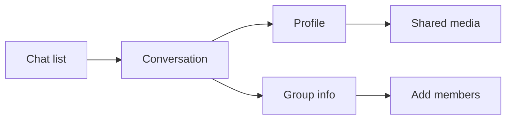

# DESIGN_SYSTEM.md

> **Step 2 of the MASTER_PLAN process.** Visual language, tokens, component
> principles, and premium UX direction.
> Companions: [`TARGET_ARCHITECTURE.md`](TARGET_ARCHITECTURE.md), [`SCHEMA_DESIGN.md`](SCHEMA_DESIGN.md).
>
> Written for a **mobile-first PWA** (Q-20), themeable at runtime by both user and
> admin (Q-14), on a **$0 budget** — so every dependency here is free and
> self-hosted. Product name: **Rajya** (`DESIGN_SYSTEM.md` §11).

---

## §1 What already works

The audit found the styling layer is not the weak part of this app. Three things
are genuinely well-engineered and are **kept, formalised, and extended**:

1. **Semantic CSS custom properties toggled by an `html.dark` class.** The code comment explains exactly why Tailwind v4's `dark:` variant was rejected — v4 emits both a class rule *and* a `prefers-color-scheme` media query, so an OS in dark mode forces the whole app dark regardless of the user's choice. Custom properties respond only to the class. That is a correct diagnosis and the right fix.
2. **A single `--color-accent-primary` with every derived tone computed via `color-mix()`.** This is why admin-created custom accents work without shipping a palette. Elegant and worth building on.
3. **A Telegram-derived dark palette with real intent** — the eight-step `tg-*` scale maps deliberately to surfaces (message area darkest, input area distinct from sidebar).

What's missing isn't taste — it's **systematisation**. There are ~291 hand-rolled
buttons (`F-30`), z-index values scattered as arbitrary literals across 20+ files,
no spacing or radius scale, no motion vocabulary, and typography sliders that were
disconnected during a refactor (`NR-13` / Q-18).

---

## §2 Design references

Three products, chosen for specific reasons rather than general admiration.

| Reference | What we take | What we don't |
| --- | --- | --- |
| **Telegram** | Information density, list scannability, gesture-driven navigation, the dark palette already in use, instant perceived response | Its visual conservatism and cluttered settings |
| **Linear** | Motion discipline (short, purposeful, never decorative), restrained shadow use, keyboard affordance, the feeling of software built with care | Its desktop-first density — wrong for a phone |
| **iOS Messages** | Bubble legibility, tail and grouping logic, tick semantics, haptic timing | Its platform lock-in and limited theming |

**The one-line brief:** *Telegram's speed and density, Linear's craft, iOS
Messages' clarity — on a phone.*

---

## §3 Token architecture

Four layers, strictly ordered. Components may only reference layer 3.

```
1. Primitives     raw values     --tg-900: #17212B, --space-4: 1rem
2. Semantic       role-based     --surface-chat, --text-secondary, --border-subtle
3. Component      scoped         --bubble-sent-bg, --composer-height
4. Runtime        JS-injected    --color-accent-primary, --app-size-multiplier
```

**Rule:** a component never uses a primitive directly. `bg-[var(--tg-700)]` is a
lint error; `bg-[var(--surface-panel)]` is correct. This is what makes a new theme
a token file rather than a find-and-replace.

### 3.1 Color — concrete values (implementation-ready)

Components reference **semantic** tokens only. Primitive hex values live in
`frontend/src/styles/tokens.css` (or equivalent) and map into semantics below.
Accent is the sole runtime-injected colour (`--color-accent-primary`); everything
accent-derived uses `color-mix()`.

#### Primitives (Telegram-inspired dark scale + light field)

| Token | Hex | Role |
| --- | --- | --- |
| `--tg-950` | `#0E1621` | Darkest chat message area |
| `--tg-900` | `#17212B` | Dark app / page background |
| `--tg-800` | `#1A2534` | Dark input area |
| `--tg-700` | `#232E3C` | Dark sidebar / panels |
| `--tg-600` | `#2C3A4B` | Dark hover |
| `--tg-500` | `#2E3D4F` | Dark borders |
| `--tg-400` | `#344A5E` | Dark selected / active |
| `--tg-300` | `#3A5068` | Dark muted foreground |
| `--blue-50` | `#EFF6FF` | Light page / chat field |
| `--slate-50` | `#F8FAFC` | Light hover / received bubble tint |
| `--slate-100` | `#F1F5F9` | Light textarea / icon hover |
| `--slate-200` | `#E2E8F0` | Light borders / skeleton |
| `--slate-400` | `#94A3B8` | Light tertiary text |
| `--slate-500` | `#64748B` | Light secondary text / icons |
| `--slate-800` | `#1E293B` | Light primary text |
| `--bubble-sent-light` | `#DBEAFE` | Light sent bubble |
| `--bubble-recv-light` | `#F8FAFC` | Light received bubble |
| `--bubble-sent-dark` | `#2B5278` | Dark sent bubble |
| `--bubble-recv-dark` | `#182533` | Dark received bubble |
| `--accent-boot` | `#4F46E5` | Boot default before JS (Cyber Indigo) |
| `--rose-100` | `#FFE4E6` | Light danger/error surface tint |
| `--status-success-hex` | `#16A34A` | Success |
| `--status-warning-hex` | `#D97706` | Warning (impersonation banner) |
| `--status-danger-hex` | `#DC2626` | Danger / failed tick |
| `--status-info-hex` | `#2563EB` | Info |

#### Semantic → light / dark mapping

| Semantic token | Light | Dark |
| --- | --- | --- |
| `--surface-app` | `#EFF6FF` | `#0E1621` |
| `--surface-chat` | `#EFF6FF` | `#0E1621` |
| `--surface-panel` | `#FFFFFF` | `#232E3C` |
| `--surface-raised` | `#FFFFFF` | `#2C3A4B` |
| `--surface-input` | `#FFFFFF` | `#1A2534` |
| `--surface-hover` | `#F8FAFC` | `#2C3A4B` |
| `--surface-active` | `#EFF6FF` | `#344A5E` |
| `--surface-selected` | `#EFF6FF` | `#344A5E` |
| `--border-subtle` | `#E2E8F0` | `#2E3D4F` |
| `--border-default` | `#E2E8F0` | `#2E3D4F` |
| `--border-strong` | `#CBD5E1` | `#3A5068` |
| `--text-primary` | `#1E293B` | `#F1F5F9` |
| `--text-secondary` | `#64748B` | `#94A3B8` |
| `--text-tertiary` | `#94A3B8` | `#64748B` |
| `--text-inverse` | `#FFFFFF` | `#0E1621` |
| `--bubble-sent-bg` | `#DBEAFE` | `#2B5278` |
| `--bubble-received-bg` | `#F8FAFC` | `#182533` |
| `--status-success` | `#16A34A` | `#22C55E` |
| `--status-warning` | `#D97706` | `#FBBF24` |
| `--status-danger` | `#DC2626` | `#F87171` |
| `--status-info` | `#2563EB` | `#60A5FA` |

**Accent derived (both themes), from `--color-accent-primary`:**

| Token | Formula |
| --- | --- |
| `--accent` | `var(--color-accent-primary)` |
| `--accent-hover` | `color-mix(in srgb, var(--color-accent-primary) 85%, black)` |
| `--accent-muted` | `color-mix(in srgb, var(--color-accent-primary) 70%, white)` (invert mix for dark) |
| `--accent-subtle` | `color-mix(in srgb, var(--color-accent-primary) 12%, transparent)` |
| `--accent-contrast` | Computed from relative luminance — white or near-black; never hand-picked |

**Rule:** a component never uses a primitive directly. `bg-[var(--tg-700)]` is a
lint error; `bg-[var(--surface-panel)]` is correct. This is what makes a new theme
a token file rather than a find-and-replace.

**Accent contrast is computed, not chosen.** An admin-set hex that would produce
unreadable text on accent surfaces is rejected at the API (NR-48) and
`--accent-contrast` always tracks luminance.

Every role is defined for both themes. Names describe *purpose*, never appearance,
so "dark" never means a literal dark value.

### 3.2 Spacing

A 4px base with a named scale. The current codebase uses arbitrary Tailwind values
freely, which is why alignment drifts between screens.

```
--space-0.5: 2px   --space-1: 4px    --space-2: 8px    --space-3: 12px
--space-4: 16px    --space-5: 20px   --space-6: 24px   --space-8: 32px
--space-10: 40px   --space-12: 48px  --space-16: 64px
```

Plus layout constants: `--touch-target-min: 44px` (Apple HIG, non-negotiable on
mobile), `--safe-area-*` for notches and home indicators.

### 3.3 Radius, elevation, motion

```
--radius-sm: 6px    --radius-md: 10px   --radius-lg: 14px
--radius-xl: 20px   --radius-bubble: 18px   --radius-full: 9999px
```

**Elevation is four named steps.** Light mode uses soft shadows; dark mode uses
near-invisible shadows and relies on surface lightness instead — reusing
light-mode shadows in dark mode produces muddy, floating panels.

```
--elevation-0: none
--elevation-1: 0 1px 2px color-mix(in oklab, black 6%, transparent)
--elevation-2: 0 4px 12px color-mix(in oklab, black 10%, transparent)
--elevation-3: 0 12px 32px color-mix(in oklab, black 16%, transparent)
```

In dark theme, each elevation's shadow alpha collapses toward 0 and the raised
surface token lightens instead. Long-press bubble lift uses `--elevation-3`.

Motion is a vocabulary, not per-component guesswork:

| Token | Duration | Use |
| --- | --- | --- |
| `--motion-instant` | 80ms | State toggles, hovers |
| `--motion-fast` | 140ms | Menus, tooltips, ticks |
| `--motion-base` | 220ms | Panel push/pop, sheets |
| `--motion-slow` | 320ms | Full-screen transitions |

Easings: `--ease-out` (entering), `--ease-in` (exiting), `--ease-spring` (gestural,
following a finger). **Everything respects `prefers-reduced-motion`** — durations
collapse to 0, opacity substitutes for movement.

The governing principle, borrowed from Linear: *motion explains a spatial
relationship or it doesn't happen.* No decorative animation anywhere.

### 3.4 Z-index — a named scale

The current arbitrary literals across 20+ files are why the incoming-call banner,
bottom sheets, and context menus have unpredictable stacking. One scale, defined
once:

```
--z-base: 0          --z-sticky: 10       --z-layer: 100
--z-drawer: 200      --z-sheet: 300       --z-popover: 400
--z-menu: 500        --z-modal: 600       --z-call-overlay: 700
--z-toast: 800       --z-critical: 900
```

`--z-call-overlay` sits above modals deliberately: an incoming call must be
reachable from any state.

### 3.5 Typography — fixing NR-13

The current pipeline stores computed CSS values (`text_size_multiplier: 1.0`,
`text_weight: 400`) while the UI presents −5…+5 sliders. The mapping broke in a
refactor and the sliders no longer do anything.

**Target: store the slider position, derive the CSS in exactly one place.**

| Slider | Range | 0 = | Derivation |
| --- | --- | --- | --- |
| Size | −5…+5 | 1.0× | `1 + (v × 0.06)` → 0.70× … 1.30× |
| Weight | −5…+5 | 400 | `400 + (v × 60)` → 100 … 700, snapped to available weights |
| Line height | −5…+5 | 1.5 | `1.5 + (v × 0.08)` → 1.10 … 1.90 |
| Letter spacing | −5…+5 | 0em | `v × 0.008em` → −0.04em … 0.04em |

One `deriveTypography(prefs)` function, unit-tested against the table above,
writing four custom properties. The persisted value is always the slider position
(`SCHEMA_DESIGN.md` §7), so UI and storage cannot desynchronize again.

Font family stays admin-managed via `font_configs` with Google Fonts URLs — which
works today. One addition: fonts are preloaded and applied with `font-display:
swap` plus a metric-matched fallback, because the current implementation causes a
visible reflow on load.

---

## §4 Component library

**shadcn/ui on Radix primitives**, with Tailwind v4.

Why this specifically:

- **Not a dependency.** shadcn copies source into the repo, so components are ours to restyle. No fighting a library's opinions, no version lock, no bundle you can't tree-shake.
- **Radix gives accessibility for free** — focus traps, escape handling, ARIA, keyboard navigation. Doing this correctly by hand across 291 buttons is not going to happen.
- **It is exceptionally well represented in LLM training data**, which matters concretely for an AI-agent-built codebase.
- **Free**, matching the constraint.

### Primitive inventory

`Button` (variants: primary, secondary, ghost, danger, icon × sm/md/lg),
`IconButton`, `Input`, `Textarea` (auto-growing), `Select`, `Switch`, `Slider`,
`Checkbox`, `Radio`, `Avatar` (with presence dot and fallback initials),
`Badge`, `Tooltip`, `Popover`, `DropdownMenu`, `ContextMenu`, `Dialog`,
`BottomSheet`, `Drawer`, `Tabs`, `Skeleton`, `Spinner`, `Toast`, `EmptyState`,
`ScrollArea`, `Separator`, `ProgressRing`.

### Chat-specific components

`MessageBubble` (the most important component in the app), `MessageGroup`,
`MessageContent`, `TickIndicator`, `ReactionBar`, `ReplyPreview`,
`AttachmentGrid`, `VoiceNote`, `TypingBubble`, `SystemMessage`, `DateDivider`,
`UnreadDivider`, `ChatListItem`, `Composer`, `MentionPicker`, `EmojiPicker`,
`CallTile`.

Added with the §12 feature set (`SCHEMA_DESIGN.md`): `PollCard` and
`PollResultsSheet`, `StickerPicker`, `GifPicker`, `LocationCard`, `ContactCard`,
`ReactionDetailsSheet`, `SelectionToolbar` (multi-select), `SlashCommandMenu`,
`SessionListItem` (device management), `ReportSheet`, `WallpaperPicker`,
`TranscriptBlock`, `QrSheet`. Each reuses existing primitives — none introduces a
new interaction pattern, which is the constraint that keeps a feature-rich app from
becoming an inconsistent one.

**`MessageContent` renders one restricted formatting set, identically for humans
and bots.** This is the DS-6 decision, and it replaces an earlier draft that gave
bots full markdown and humans plain text.

The current app has the worst version of this: **incoming messages render
formatted while your own sent messages render plain**, so the same text looks
different depending on which side of the thread it sits on. That inconsistency is
a bug to fix, not a behaviour to preserve.

The supported set — the same on both sides, in both directions:

| Supported | Not supported |
| --- | --- |
| **Bold**, *italic*, ~~strikethrough~~ | Headings |
| `inline code` | Tables |
| Fenced code blocks | Images and raw HTML |
| Bullet and numbered lists | Arbitrary CSS or inline styles |
| Block quotes | Footnotes, definition lists |
| Spoilers (tap to reveal) | Nested blockquote chains |
| Links, mentions, emoji | |

Two reasons for exactly this line. **Mobile is the primary surface**, and a table
or an `<h1>` in a 320 px-wide bubble is unreadable regardless of who sent it — so
excluding block-level layout is a rendering constraint, not a trust decision.
**Consistency beats expressiveness in a shared thread**: when everyone has the
same formatting vocabulary, nobody's message can restyle the conversation, and the
thread reads as one surface. Fenced code blocks survive the cut because they scroll
horizontally, carry a copy button, and an AI answer containing code is unusable
without them.

Concretely: `react-markdown` restricted to the allowed node types with a
sanitising rehype pipeline, plus `shiki` at build time (no runtime theme fetch) for
code. Code blocks derive their palette from the theme tokens rather than shipping a
Shiki theme, so they follow light/dark and the accent like everything else.
Anything outside the allowed set renders as literal text — a message containing
`# hello` shows `# hello`.

**Spoilers** (NR-18) use `||hidden||`, render as a blurred inline span, reveal on
tap, and re-hide when the conversation is re-entered. Cheap to implement as one
more inline node type, which is why it is in rather than deferred.

Jumbo emoji (emoji-only messages render large and bubble-less) is a
`MessageContent` branch, not a `MessageBubble` special case.

### The rule that keeps it honest

**No raw `<button>` outside `shared/ui/`.** Enforced by an ESLint rule, not by
discipline — discipline is what produced 291 of them. The same rule bans hardcoded
hex colors, arbitrary z-index literals, and user-facing string literals (which
must go through `t()`, per Q-14).

---

## §5 Key surfaces

### 5.1 Message thread — the surface that defines the app

**Bubble grouping.** Consecutive messages from one sender within 3 minutes group:
the tail appears only on the last bubble (DS-4: Telegram-style tails, not flat),
the avatar only on the last, and the timestamp only on the last unless hovered.
Radii tighten between grouped bubbles (18px outer, 6px inner edges). This one
behaviour does more for perceived quality than any other single detail.

**Ticks (NR-2).** Placed inline at the bubble's bottom-right, sharing the
timestamp's baseline:

| State | Rendering |
| --- | --- |
| Queued | No tick. Bubble at 60% opacity. |
| Sent | One tick, `--text-tertiary`. Fades in over `--motion-fast`. |
| Delivered | Two ticks, `--text-tertiary`. |
| Read | Two ticks, `--accent`. Colour transition only — no shape change, no bounce. |
| Failed | Red cross, `--status-danger`, tappable. Long-press opens the existing retry menu. |

The transition from delivered to read is a colour crossfade. It should be
noticeable if you're watching and invisible if you're not.

**Typing indicator (NR-3).** Your spec exactly: the standard `MessageBubble` in
received styling, containing only three dots animating in sequence — no timestamp,
no tail change, no separate visual language. It occupies the same position a real
message would, so the thread doesn't jump when the message arrives. In groups it
shows the typist's avatar; multiple typists collapse to "Priya and 2 others".

**System events (NR-4).** Centred, `--text-tertiary`, no bubble, generous vertical
padding, small caps optional. Text resolves through the string catalog.

**Reply quoting.** A left accent bar, the sender's name in accent, one truncated
line of the original. Tapping scrolls to and briefly highlights the original — the
highlight is a 600ms accent-subtle background fade, one of the few places a longer
animation earns its place.

**Long-press.** 400ms with haptic feedback at the threshold, opening a context menu
anchored to the bubble with the bubble itself lifted via `--elevation-3` and the
background dimmed. This is the single interaction that most separates "web app"
from "real app" on mobile.

### 5.2 Composer

Auto-growing textarea capped at ~40% viewport height. Attachment, emoji, and
voice actions inline. Reply and edit contexts appear as a dismissible strip above
the input, sharing the composer's surface so it reads as one control.

The send button morphs between mic and send based on whether there's content —
a shared-element transition, not a swap. Voice recording expands in place with a
live waveform and a slide-to-cancel gesture.

**Composer state survives navigation.** Drafts persist per conversation in
IndexedDB, restored on return. This exists today and is worth calling out because
it's easy to lose in a rebuild.

### 5.3 Chat list

Per-row: avatar with presence dot, name, last-activity line, timestamp, and either
an unread pill or a mute icon. The last-activity line shows sender prefix in
groups, an italicised system event where relevant (NR-4), an attachment icon plus
type for media, and live "typing…" in accent when someone is typing (NR-3).

Swipe-left reveals mute and archive; swipe-right marks read. Long-press opens the
full context menu. Folder tabs sit above the list, horizontally scrollable.

**Archive (NR-14) is a new capability**, not something the current app has. It is
per-account (`conversation_memberships.archived_at`, `SCHEMA_DESIGN.md` §3), so
the other party cannot tell. Archived conversations leave the default list and
return to it automatically on the next incoming message — the behaviour every
comparable product implements, and the reason archive is not just a folder.
An "Archived" entry sits at the end of the folder tab strip, showing a count only
when something in it is unread. Archive and mute are deliberately orthogonal:
archive controls placement, mute controls noise.

### 5.4 Settings and admin

Both are `features/settings` and `features/admin` built from identical primitives,
which is what you asked for in Q-14.

Settings groups: Account, Appearance (theme, accent, font, the four sliders with
live preview), Privacy, Notifications, Chats, Storage, AI, Blocked, About.

The admin dashboard is the same visual language with a distinguishing accent
treatment and a persistent "Admin" chip in the header, so it's impossible to
confuse with the user app during impersonation.

**Impersonation banner (NR-7):** a full-width, non-dismissible bar at
`--z-critical` in `--status-warning`, reading "Viewing as «name» — Exit". Present
on every screen. Deliberately slightly ugly; this state should never feel normal.

**Phone verification (NR-9, `TARGET_ARCHITECTURE.md` §4.8).** A single prominent
"Verify via WhatsApp" button generates the code and opens the `wa.me` deep link in
one tap — no code entry screen, since the user never types anything back into our
app. While pending, the button becomes an indeterminate state ("Waiting for your
message…") that resolves the moment the webhook confirms, pushed live over the
account's realtime channel rather than polled. If the confirmed number differs from
anything previously on file, a one-line toast states the number that actually got
verified. No WhatsApp installed is a real, expected case, not an error — the same
screen offers "Ask an admin to verify this for you" beneath the button.

### 5.5 Calls

Full-screen at `--z-call-overlay`. Minimises to a draggable picture-in-picture
tile that persists across navigation. Incoming calls surface as a top banner on
mobile and a corner card on desktop, always above modals.

---

## §6 Mobile-first navigation (Q-20)

Your model — a chats list as the base, everything stacking above it, native
swipe-back — is preserved and formalised.



**Contract:**

- Every push adds a history entry; browser back and edge-swipe both pop exactly one layer.
- Layers animate in from the right with `--motion-base`, and follow the finger during a gesture with `--ease-spring`.
- Scroll position is preserved per layer.
- A layer beneath a pushed layer stays mounted (so returning is instant) but is `aria-hidden` and inert.
- Desktop renders the same stack as resizable side-by-side panels — one stack model, two presentations.

This is currently emergent behaviour. In the target it's one `useLayer` hook, one
stack store, and a Playwright test asserting the back-button contract, because
history handling is exactly the kind of thing that regresses invisibly.

---

## §7 Interaction quality

The details that separate polished from adequate. Each is cheap; collectively
they're the whole impression.

| Concern | Standard |
| --- | --- |
| **Optimistic everything** | Send, react, star, pin, mute render instantly and roll back on failure. No spinner on any action the client can predict. |
| **Haptics** | On send, long-press threshold, swipe-action commit, and call connect. Via the Vibration API where supported. |
| **Skeletons over spinners** | Skeletons only where the shape is known. Cached data renders immediately and revalidates silently — no loading state on a warm cache. |
| **No layout shift** | Images carry explicit dimensions with a blurhash placeholder. Fonts use metric-matched fallbacks. |
| **Scroll anchoring** | Loading older messages never moves the viewport. New messages arriving while scrolled up show a "jump to latest" pill with a count. |
| **Empty states** | Every list has a designed empty state with an action. |
| **Error states** | Every failure is actionable — retry, or an explanation of what to do. |
| **Offline** | A persistent subtle banner, queued messages visibly queued, no false failures. |
| **Focus** | Visible focus rings, keyboard-navigable everywhere. |

### Accessibility

Not a separate track: contrast ratios enforced in the token layer (4.5:1 body,
3:1 large), 44px minimum touch targets, full keyboard navigation via Radix,
`aria-live` announcements for incoming messages, and `prefers-reduced-motion`
honoured throughout. Automated axe checks run in CI.

---

## §8 Theming architecture

```
Admin sets accents/fonts  ─┐
                           ├─► API ─► preferences.data.appearance
User sets theme/sliders   ─┘                    │
                                                ▼
                                     applyTheme(preferences)
                                                │
        ┌───────────────────────────────────────┴────────────────┐
        ▼                       ▼                                ▼
  html.dark class      --color-accent-primary        --app-size-multiplier
                                │                    --app-font-weight
                                ▼                    --app-line-height
                    color-mix() derived tones        --app-letter-spacing
```

Two rules keep this stable:

1. **One entry point.** `applyTheme()` is the only function writing theme custom properties. Currently this is split across `uiStore` and `typographyStore`, which is how the slider mapping got lost.
2. **Applied before first paint.** A small inline script in `index.html` reads cached preferences and sets the class and properties synchronously, eliminating the flash of wrong theme.

**Default theme is `system`** (DS-2 / `SCHEMA_DESIGN.md` §7): follow
`prefers-color-scheme`; when unknown, use dark. Stored value is always one of
`light` | `dark` | `system` — never a computed resolved theme.

Split accents (different accent per light/dark) already exist and are kept.
Density (`comfortable` | `compact`, default comfortable) is one token swap on
spacing/padding for message lists (DS-5).

### 8.1 Consistency and personalisation — where the line sits

Two requirements pull against each other: the interface must be **consistent
throughout**, and users must get **rich display settings**. They only conflict if
personalisation is unconstrained. The resolution is that users choose **values**
within the token system, never **structure**.

| Users may change | Users may not change |
| --- | --- |
| Theme (light / dark / system) | Layout, spacing rhythm, component shapes |
| Accent, independently per theme | Which colour role means what |
| Font family, from the admin-curated catalogue | Type scale ratios |
| Four typography sliders (−5…+5) | Absolute font sizes |
| Density (comfortable / compact) | Bubble structure, tail placement, grouping rules |
| Chat wallpaper, with dim and blur | Message alignment or tick semantics |
| Bubble corner style, timestamp visibility | Iconography, motion vocabulary |
| Media autoplay policy, reduced transparency | Z-index layering, navigation model |
| Quick reactions, emoji skin tone | Anything that changes what another user sees |

Every one of those settings resolves to a **token override, not a component
variant.** A user picking compact density swaps spacing token values; it does not
select a different `MessageBubble`. This is the mechanism that makes the app both
personalisable and consistent — there is exactly one component tree, rendered with
different token values, so a new feature inherits every personalisation for free
and no combination of settings can produce a layout nobody designed.

Two structural guarantees fall out and are worth stating as invariants:

- **No personalisation affects anyone else's view.** Wallpapers, density and
  typography are per account. This is the same rule that puts `archived_at` and
  `wallpaper` on the membership rather than the conversation.
- **Any setting can be contrast-checked**, because all colour flows through
  semantic roles. An accent, a wallpaper dim value or an admin token override that
  would push text below its WCAG ratio is rejected at the API rather than shipped
  as an unreadable screen.

### 8.2 Admin-editable tokens (NR-48)

The administrator's reach goes one layer deeper than a user's: **every semantic
colour token is editable per theme**, stored in `theme_overrides`
(`SCHEMA_DESIGN.md` §12.15) and merged beneath user preferences in the same
`applyTheme()` call — so there is still exactly one writer of custom properties.

Three constraints keep this from becoming a way to break the product:

1. **Semantic layer only.** Primitives stay fixed. Overriding
   `--text-primary` is meaningful; overriding `--gray-500` changes unrelated
   things unpredictably.
2. **Contrast-checked on write**, at the API, with the failing pair named in the
   error.
3. **Reset to default is always one action**, per token and globally. An admin who
   makes the app unreadable must be able to recover without database access.

Fonts, accent catalogues, wallpaper presets and the string catalogue are editable
on the same basis. Combined with `app_settings` and `feature_flags`, the practical
claim is that **every colour, constant, string and toggle is dashboard-editable**
— and `SCHEMA_DESIGN.md` §8 lists the enforcement that keeps that claim true as
the codebase grows.

---

## §9 Where design meets the AI features

Two places where architecture surfaces in the UI and someone has to decide how it
reads to a user.

**Bots are not private (NR-11).** You chose fully shared bot memory: what one
person tells a bot, another can learn. That is a genuine product decision, and the
UI has to be honest about it or it will feel like a betrayal the first time it
surprises someone. **Resolved (DS-1):** bot profiles carry a clear line —
*"Remembers what everyone tells it"* — **and** a first-message notice in any new
bot conversation.

**AI actions need a consistent affordance.** Suggest-reply, rewrite, and translate
are currently scattered. Target: one accent-tinted "AI" affordance in the composer
and message context menu, with streaming responses rendering token-by-token into
the destination rather than into a modal. Anything AI-generated before the user
commits it is visually marked as provisional.

---

## §10 Decisions

### Resolved

| # | Decision | Outcome |
| --- | --- | --- |
| **DS-1** | Bot shared-memory disclosure | **Both** — profile line *"Remembers what everyone tells it"* and a first-message notice in new bot conversations |
| **DS-2** | Default theme | **`system`** — follow OS; dark when unknown. Matches `preferences.data.appearance.theme` |
| **DS-3** | shadcn/ui copy-in | **Yes** — ~30 component files owned in-repo; ownership is the point |
| **DS-4** | Bubble tails | **Telegram-style tails** — this is a chat app first |
| **DS-5** | Message density | **Comfortable default**, `compact` as a user preference (`appearance.density`) |
| **DS-6** | Message formatting | **Symmetric and restricted** — the same basic set for humans and bots: bold, italic, strikethrough, inline code, fenced code blocks, lists, blockquotes, spoilers, links. No headings, tables, images or HTML. Fixes the current incoming-formatted / sent-plain inconsistency (§4 `MessageContent`) |
| **DS-7** | Conversation archive | **Ships as NR-14** — per-account `archived_at`, auto-unarchives on new activity, orthogonal to mute (§5.3) |
| **DS-8** | Consistency vs personalisation | **Users choose token values, never structure.** One component tree rendered with different token values; no setting changes layout or affects another user's view (§8.1) |
| **DS-9** | Admin token editing (NR-48) | **Semantic tokens only**, contrast-checked at the API, always resettable per token and globally (§8.2) |
| **DS-10** | New feature components | **Must reuse existing primitives and interaction patterns.** A feature that needs a new interaction pattern needs a design decision first (§4) |
| **DS-11** | Brand | **Rajya** — see §11. Reuse legacy light/dark logo assets until replaced |
| **DS-12** | Ephemeral message features | **Do not ship.** No disappearing messages (NR-16), no view-once media (NR-17). Cut in Step 5 |

### Still open

None that block Step 5 / implementation.

---

## §11 Brand and identity

**Display name:** Rajya  
**Identifier token:** `rajya` (replaces legacy `il`)  
**Public URL:** `https://rajya.pages.dev`

### Surfaces that must say "Rajya"

| Surface | Notes |
| --- | --- |
| `index.html` `<title>` | Build-time; not runtime-configurable (see SCHEMA §8 exception) |
| PWA `manifest.json` `name` / `short_name` | Same — build artefact |
| Service-worker cache prefix | e.g. `rajya-v1` |
| Logo `alt` / aria labels | Shared `Logo` component |
| Transactional email From name | "Rajya" via SendGrid single sender |
| Empty states / onboarding copy | String catalog keys, admin-editable |

### Logo

Ship with the existing assets from `legacy/botverse/src/assets/images/logo_light.png`
and `logo_dark.png`, wired through one shared `Logo` component (theme-aware).
Replace the PNG pair later without changing component API. Do not invent a second
logo path or inline SVG until a real brand mark exists.

### Identifier token (`rajya`)

| Use | Example |
| --- | --- |
| Database names | `rajya_development`, `rajya_test`, `rajya_production` |
| Redis / cache prefix | `rajya:` |
| IndexedDB | `rajya` namespaced by `account_id` |
| Cookie / storage keys if any remain | Prefer Bearer; any residual key uses `rajya_` |
| npm `package.json` `name` | `@rajya/frontend` or `rajya-frontend` |
| Compose project name | `rajya` |

**Phase ownership:** identifiers and scaffold in **P0.1 / P0.4**; polished brand
assets and store screenshots in **P13.1**. Admin can change colours and strings
(NR-6 / NR-48); they cannot change the PWA manifest name without a redeploy —
documented exception below.
