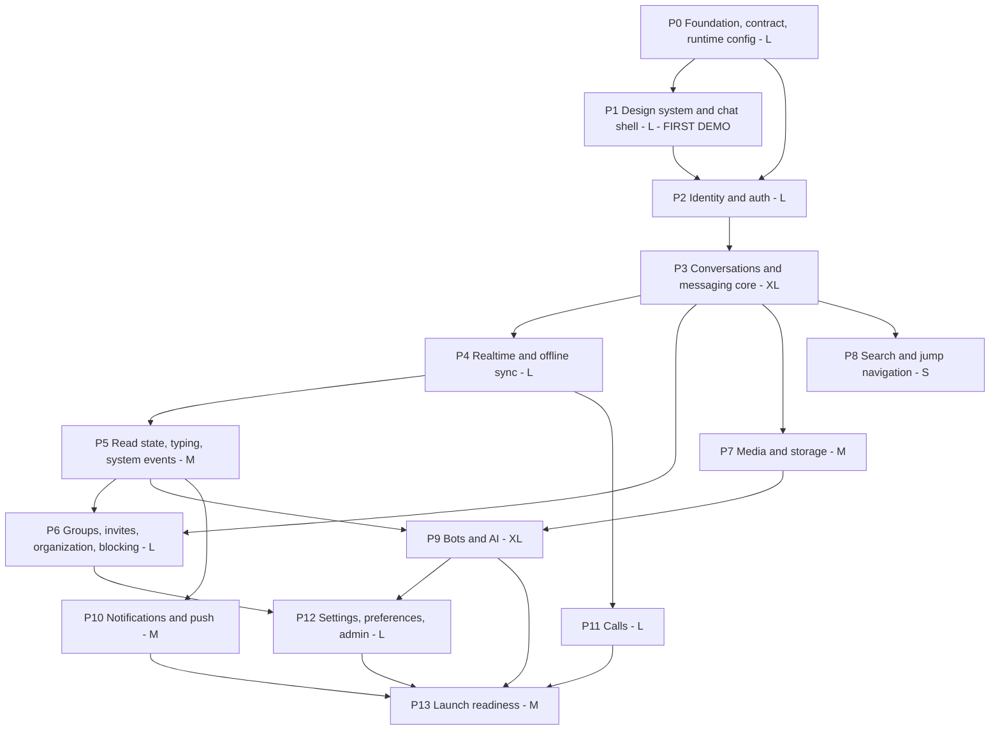

# MASTER_PLAN.md — Phased Roadmap

> **Step 4 of the MASTER_PLAN process.** The execution plan.
>
> Grounded in `[AUDIT_REPORT.md](AUDIT_REPORT.md)` (what exists), designed by
> `[TARGET_ARCHITECTURE.md](TARGET_ARCHITECTURE.md)`,
> `[SCHEMA_DESIGN.md](SCHEMA_DESIGN.md)` and
> `[DESIGN_SYSTEM.md](DESIGN_SYSTEM.md)` (what we want), diffed by
> `[GAP_ANALYSIS.md](GAP_ANALYSIS.md)` (what changes).
>
> **This document drives every future implementation session.** A session should
> need this file, `CONVENTIONS.md`, and the specific document sections named in
> its phase brief — nothing else.
>
> References: findings `F-n`, business rules `BR-n`, schema problems `P-n`,
> new requirements `NR-n`, future requirements `NR-Fn`, decisions
> `D-n` / `S-n` / `DS-n` / `Q-n`.

---


## Table of contents

- [§1 Repository strategy](#1-repository-strategy) ← **the headline decision**
- [§2 Sequencing principles](#2-sequencing-principles)
- [§3 Phase map](#3-phase-map)
- [§4 The phases](#4-the-phases)
- [§5 How to split work across AI-agent sessions](#5-how-to-split-work-across-ai-agent-sessions)
- [§6 Requirement scheduling ledger](#6-requirement-scheduling-ledger)
- [§7 Cross-phase risk register](#7-cross-phase-risk-register)
- [§8 Testing and verification strategy](#8-testing-and-verification-strategy)
- [§9 Handoff to Step 5](#9-handoff-to-step-5)

---


## §1 Repository strategy

**Recommendation: build a new single repository named** `rajya`**, containing**
`backend/` **(Rails 8, API-only),** `frontend/` **(React + TypeScript + Vite PWA) and**
`docs/`**. Keep the legacy/ (having cognify/ and botverse/) outside it as read-only reference checkouts, and never delete them.**

**Product name: Rajya** (Sanskrit for realm / kingdom / space; includes "Raj").
Public URL: `https://rajya.pages.dev` on Cloudflare Pages. The internal
identifier token replacing legacy `il` is `rajya` (databases, cache prefixes,
IndexedDB, package name). Visual logo: reuse the existing light/dark assets from
`legacy/botverse` until replaced.

Two decisions are bundled here and worth separating: **new code rather than
in-place transformation** (argued below), and **one repository rather than two**
(argued under "Why a monorepo is the right call here").

This is a *port*, not a rewrite-from-inspiration. Every phase below names the
legacy files a session must read, and every phase carries a preservation
checklist tied to numbered business rules. The distinction matters:
`MASTER_PLAN_PROMPT.md` explicitly forbids reimplementing from memory, and a new
repository is only safe because `AUDIT_REPORT.md` §2 already extracted the 114
rules that would otherwise be lost.

### Why not in-place transformation

I want to argue this properly rather than assert it, because in-place is the
correct default for most brownfield work and I would normally recommend it.

**The case for in-place, stated fairly.** You keep 246 commits of history. The
app runs continuously, so every change is verifiable against a working system.
You cannot forget a file, because no file has to be consciously carried across.
Refactoring incrementally with tests as a ratchet is the standard, well-evidenced
way to modernise a codebase, and it avoids the second-system trap where a rewrite
stalls at 80% and neither version ships.

Each of those arguments depends on a premise that does not hold here.


| Premise the in-place case needs                   | Reality here                                                                                                                                                                                                                                     |
| ------------------------------------------------- | ------------------------------------------------------------------------------------------------------------------------------------------------------------------------------------------------------------------------------------------------ |
| History has ongoing value                         | **Neither repo has a git remote.** 107 commits in `cognify`, 139 in `botverse`, all local, no PRs, no issues, no CI, no other clone. Keeping the directories preserves 100% of that value                                                        |
| There is a running system to verify against       | Nothing is deployed and **no database exists** (Q-16). There is no production behaviour to regress                                                                                                                                               |
| Incremental migration is cheaper than restatement | `SCHEMA_DESIGN.md` §9 renames or deletes nearly every table and column. In-place, that is a 41-table migration chain authored against a database that will never exist in its pre-migration form — archaeology with no payoff                    |
| The existing structure is a scaffold to build on  | The target adds four layers with no counterpart today (`operations/`, `queries/`, `serializers/`, enforced `policies/`) while logic currently sits in a 984-line `Chat` model and a 768-line controller. Both layerings would coexist for months |
| A rewrite risks stalling                          | The risk is real, and it is why P0 ships a deployable skeleton and P1 ships a demoable UI. Sequencing addresses it directly                                                                                                                      |


**The argument specific to this project, which I weight most heavily: future
sessions are AI-driven.** An agent asked to add a feature to `cognify/` will read
the surrounding code and imitate it. What it will find is two parallel test
suites, twelve dead feature flags, columns marked deprecated but still read in
five places, a 6-line `webrtcManager.ts` shim beside a 981-line engine, and 291
hand-rolled buttons. Every one of those reads as precedent. In a clean repository
with `CONVENTIONS.md` and enforcing lint rules from the first commit, the only
available precedent is the one you chose. For a codebase that will be built
mostly by agents across dozens of sessions, that is not a stylistic preference —
it is the primary quality-control mechanism.

### The costs, and what pays them down


| Cost                                            | Mitigation                                                                                                                                                                                                          |
| ----------------------------------------------- | ------------------------------------------------------------------------------------------------------------------------------------------------------------------------------------------------------------------- |
| Nothing runs until enough exists                | P0 ends with a deployable stack answering `/health`; P1 ends with a demoable premium UI. Neither waits on the other phases                                                                                          |
| Undocumented behaviour could be lost            | 114 numbered rules in `AUDIT_REPORT.md` §2, per-phase preservation checklists in §4 below, and the legacy repos on disk for direct reading. Any behaviour not in the audit and not in the legacy code did not exist |
| Loss of git history                             | Repos are moved, not deleted. `legacy/cognify` and `legacy/botverse` stay readable forever                                                                                                                          |
| Second-system syndrome — rebuilding scope creep | The feature contract is frozen: `AUDIT_REPORT.md` §1 plus NR-1…NR-48. §6 below accounts for every item. NR-F1…NR-F12 are explicitly not built                                                                       |


### Concrete layout — one repository named `rajya`

```
~/code/personal/chat/                 workspace root, not a git repo
  rajya/                              ← THE repository
    backend/                          Rails 8, API-only
    frontend/                         React 19 + TS + Vite PWA
    docs/                             every planning document
      MASTER_PLAN.md  CONVENTIONS.md  AUDIT_REPORT.md
      TARGET_ARCHITECTURE.md  SCHEMA_DESIGN.md  DESIGN_SYSTEM.md
      GAP_ANALYSIS.md
    .github/workflows/                one CI pipeline, path-filtered
    docker-compose.yml                production stack (Oracle)
    docker-compose.dev.yml            Postgres, Redis, Mailpit only
    .tool-versions                    mise / asdf — Ruby + Node
    Procfile.dev                      bin/dev: web, worker, vite
    README.md
  legacy/                             outside the repo, read-only
    cognify/                          moved as-is
    botverse/                         moved as-is
    ARCHITECTURE.md                   stale, superseded by docs/
```

**Path conventions used throughout this document.** Paths beginning `backend/`,
`frontend/` or `docs/` are relative to the `rajya/` repository root. Paths
beginning `legacy/` are relative to the workspace root, one level above the repo.

### Why a monorepo is the right call here

A monorepo is the better answer for this project, and the reasoning is worth
stating rather than asserting, because the two-repo split is the more common
default for a separately-deployed API and SPA.

- **The OpenAPI contract is a hard coupling, not a soft one.** The client's only
HTTP layer is generated from the backend's request specs. In two repos, a
breaking API change is two pull requests with a window between them where the
contract is a lie. In one repo it is a single commit in which the drift check
either passes or fails. This is the deciding argument.
- **It makes the contract check meaningful in CI.** Regenerating types and
diffing them requires both sides in one checkout. In two repos this needs a
cross-repo job, a token, and a scheduled trigger — exactly the kind of
machinery that gets disabled the first time it is inconvenient.
- **Agent sessions routinely span both sides.** Nine of the sessions in §5 touch
backend and frontend in the same slice — read receipts, offline sync, calls.
One checkout means one working tree and no cross-repo coordination.
- `docs/` **lives with the code it describes.** The plan and the implementation
version together, so a phase's commit can update the phase's section. Docs kept
outside version control, as they are today, have no history at all.
- **One CI pipeline, path-filtered**, rather than two that must agree about the
contract.

The costs are real but small at this size: a larger checkout, and CI that must
filter by path so a frontend change does not run RSpec. Both are configuration,
not architecture. The frequently-cited monorepo problems — build orchestration,
shared-dependency version skew, tooling at scale — start mattering at many more
than two packages.

Deployment stays independent despite the shared repository: the backend image
builds from `backend/`, the frontend builds to static assets, and
`docker-compose.yml` at the root composes them. A single repo does not imply a
single deployable.

### Naming

`backend/` and `frontend/` rather than "cognify" and "botverse". The old names
carry no meaning for a reader and cost a lookup in every future session.

**Product name is Rajya** — used in `index.html` title, PWA manifest
`name` / `short_name`, emails, and user-facing copy. Directory names stay
`backend/` / `frontend/` so agents do not confuse brand with package layout.
The identifier token `rajya` replaces legacy `il` (e.g. `rajya_development`,
service-worker cache prefix, IndexedDB database name).

Governmental association of "Rajya" in India (state / government) is noted: for a
private chat product the Sanskrit "realm / space" reading is the intended
connotation; keep marketing copy clear that this is a personal messaging app.

### The one thing to do before writing any code

Move the legacy repositories **out of the way first**, in a single filesystem
step, and set them read-only. They must sit outside `rajya/` — not inside it and
gitignored — because an agent working in the repository root should not be able to
reach them by accident at all. If they stay where they are while `backend/` and
`frontend/` are built, something will eventually be edited in the wrong tree.
Making that physically impossible is better than documenting it as a rule.

---


## §2 Sequencing principles

Five rules produced this order. Where a phase looks out of place, one of these is
why. Trade-offs inside a phase follow the governing priority stack in
`TARGET_ARCHITECTURE.md`: **$0 → UX → local testability → few commands**.

**Shared components and consistency.** New UI must reuse `shared/ui` primitives
and the patterns in `DESIGN_SYSTEM.md` §4 (DS-10). New backend behaviour goes
through operations / queries / policies / Alba — never a second pattern beside
them. Rails and React best practices that are not already in these docs land in
`CONVENTIONS.md` (Step 5) and are enforced by RuboCop / ESLint from P0.

**1. Anything that touches every component ships in P0.** The string catalog is
the clearest case: `AUDIT_REPORT.md` records the decision that every user-facing
string is admin-editable, and notes that retrofitting it means touching all ~120
components twice. Design tokens, the error taxonomy, and the OpenAPI contract are
the same shape of commitment. They are nearly free before the UI exists and
brutally expensive after.

**2. Premium UI lands second, not last.** You asked to see it early, and there is
an engineering reason beyond morale: building `MessageBubble`, the composer, and
the layer navigation against typed mocks forces the API contract to be designed
from the consumer's side. It also means auth screens in P2 are built with real
primitives rather than restyled later.

**3. Correctness before the features that depend on it being correct.** The
offline outbox is worthless until `client_nonce` is genuinely unique (F-3), so
P3 precedes P4. Ticks are meaningless until watermarks exist, so P5 follows both.
Notifications feed the delivered watermark, so P10 follows P5.

**4. Split by blast radius, not by size.** Messaging is XL and could be one
phase; it is three sessions inside P3 because a single session cannot hold the
permission matrix, the ordering allocator, and the pagination model at once
without something getting shallow treatment.

**5. Every phase ends demoable.** Not "code complete" — something you can open
and use. A phase that cannot be demonstrated cannot be verified by the person
who has to approve it.

### What this deliberately does not do

It does not front-load all backend work. It does not defer testing to a
"hardening phase" — `AUDIT_REPORT.md` §8 records that exact plan being made once
before, in `IMPROVEMENTS.md`, and never executed. Testing is inside every
definition of done below, and P13 is launch readiness, not catch-up.

---


## §3 Phase map




| #   | Phase                                    | Effort | Risk     | Sessions | Demoable outcome                                                             |
| --- | ---------------------------------------- | ------ | -------- | -------- | ---------------------------------------------------------------------------- |
| P0  | Foundation, contract, runtime config     | **L**  | Medium   | 4        | A deployed stack answering `/health`, themed shell, CI enforcing every rule  |
| P1  | Design system & chat shell               | **XL** | Low–Med  | 5        | A component gallery and a fully premium chat screen on mock data             |
| P2  | Identity & auth                          | **L**  | **High** | 5        | Real login by every method, onboarding, account switching, device list       |
| P3  | Conversations & messaging core           | **XL** | **High** | 6        | Real conversations: send, edit, unsend, reply, forward, react, pin, poll     |
| P4  | Realtime & offline sync                  | **L**  | **High** | 3        | Two devices in sync live; send offline, reconnect, no duplicates             |
| P5  | Read state, typing & system events       | **M**  | **High** | 2        | Correct ticks in DM, group and bot chats; live activity; system lines        |
| P6  | Groups, invites, organization & blocking | **XL** | Medium   | 5        | Create a group, invite by QR, approve, promote, permissions, archive, block  |
| P7  | Media & storage                          | **L**  | Medium   | 4        | Photo, video, voice note, file, sticker, GIF, location, gallery, quota       |
| P8  | Search & jump navigation                 | **M**  | Low      | 2        | Global and in-chat search with filters, jump to message and date             |
| P9  | Bots & AI                                | **XL** | **High** | 4        | Streaming bot replies with shared memory; slash commands; rewrite, translate |
| P10 | Notifications & push                     | **M**  | Medium   | 2        | Push on a locked phone, honouring level, mute, DND and silent send           |
| P11 | Calls                                    | **L**  | Medium   | 3        | 1:1 and 4-way audio/video with screen share, PiP and call history            |
| P12 | Settings, preferences & admin            | **XL** | Medium   | 6        | Every settings panel, full admin dashboard, moderation queue, impersonation  |
| P13 | Launch readiness                         | **L**  | Medium   | 3        | Installable PWA, CSP on, backups tested, full E2E suite green                |


**Effort scale.** S = one focused session. M = two to three. L = three to five.
XL = five or more, and must be split. These are relative sizes for an AI-assisted
single developer, not calendar estimates.

**Efforts revised upward in Step 4.1.** Two directives moved almost every phase:
thirty-four feature-breadth items (NR-15 … NR-48; **NR-16 and NR-17 later cut in
Step 5**) and a 100% line-and-branch coverage gate. Sessions went from 35 to 54.
P1 and P6 moved up a full size, P12 became the second largest phase in the plan,
and P8 and P13 are no longer small. The honest reading is that the feature-breadth
directive roughly increased the work by half, and the coverage bar accounts for
much of the rest.

---


## §4 The phases

Every phase has the same six blocks. **Definition of done includes its tests** —
a phase with passing features and missing specs is not done, it is in progress.

---


### P0 — Foundation, contract & runtime configuration

**Effort: L · Risk: Medium · Depends on: nothing · 4 sessions**

#### Goal

A deployed, empty system in which every architectural rule is already enforced by
tooling. After P0, doing the wrong thing should fail CI rather than require
review.

#### Deliverables

**Repositories and environment**

- `legacy/cognify` and `legacy/botverse` moved outside the repo and set read-only; the `rajya` repository initialised with `backend/`, `frontend/`, `docs/` (§1); planning documents (including `CONVENTIONS.md` and `READINESS_CHECKLIST.md` from Step 5) moved into `docs/` and committed
- `CONVENTIONS.md` already written in Step 5 — confirm it is in `docs/` and fed to every session; do not rewrite from scratch
- **Hybrid local DX (TARGET §1.2):** `docker-compose.dev.yml` runs **Postgres** (`pgvector`, `citext`), **Redis**, and **Mailpit** only; Rails + Vite run **natively**; `.tool-versions` + `mise`; `bin/dev` (Procfile: web, worker, vite) so one command starts the app
- **Production Compose** on Oracle: `web`, `worker` (Solid Queue as a **separate process**, not `SOLID_QUEUE_IN_PUMA`), `postgres`, `redis`, `ollama`, `coturn`
- Oracle Cloud Always Free instance provisioned (D-1), Cloudflare Tunnel, Cloudflare Pages project `rajya` → `rajya.pages.dev`, automated Postgres backup to R2 with a documented restore command
- Brand identifiers seeded: DB names / cache prefix / cookie key / IndexedDB / SW cache use `rajya`; logo assets copied from `legacy/botverse` light/dark PNGs (replaceable later)
- `CABLE_ADAPTER` / `CACHE_STORE` / `REDIS_URL` config indirection proven by booting once on Solid and once on Redis (TARGET §1 portability guarantee)
- Dev CORS / ActionCable allowlists include `https://*.trycloudflare.com` for phone testing via `cloudflared`
- SendGrid credentials + verified single sender wired for non-local environments; local ActionMailer → Mailpit (`localhost:8025`); ActionMailer previews enabled in development

**Backend skeleton**

- `ApplicationOperation` + `Result`, `ApplicationQuery`, Alba base resource, `ApplicationPolicy` with `after_action :verify_authorized` in the base controller
- Error taxonomy → HTTP mapping in one place (TARGET §4.6), response shape `{ error: { code, message, details } }` with `message` resolved through the string catalog
- **The entire target schema in one definition** — every table in `SCHEMA_DESIGN.md`, all foreign keys, CHECKs, partial indexes, the generated `tsvector`, the HNSW index. Not 66 migrations; one starting point
- FactoryBot factory for every table, with a spec that instantiates all of them
- Rack::Attack skeleton with limits read from `app_settings`
- `GET /up` (liveness, no dependency checks) and `GET /health` (readiness: Postgres, Redis, Solid Queue heartbeat, R2 reachability) — **NR-10**

**The contract pipeline** (TARGET §4.5 — the highest-leverage item in P0)

- rswag configured; request specs emit OpenAPI 3
- `openapi-typescript` → types; `openapi-fetch` → the client's only HTTP layer
- CI drift check: regenerate, and fail if the committed artefacts differ

**Runtime configuration — NR-6 (expanded), NR-48**

- `app_settings`, `translation_strings`, `prompt_templates`, `feature_flags` and `theme_overrides` with `Settings.fetch`, `Flags.enabled?`, `t()`, `Ai::PromptTemplate.fetch`, aggressive caching, invalidation on write
- **The settings registry**: every constant declared in code with type, range, category, default and description; the admin UI schema and the TypeScript types both generated from it. An `app_settings` row whose key is not registered is ignored and reported
- Every constant in the `SCHEMA_DESIGN.md` §8 table seeded as a registry entry in P0, even for features that do not exist yet — so P3 reads the edit window from settings on the first line it writes, rather than hardcoding it and coming back
- Locale defaults seeded into `translation_strings`; resolution order DB override → code default → the key itself
- i18next on the client, catalog fetched once per app version
- **The CI guards that keep configurability true**: numeric literals rejected in `app/operations`, `app/queries`, `app/policies`, `app/models`; hex and `rgb()`/`hsl()` rejected outside the token file; user-facing string literals rejected on both sides

**Frontend foundation**

- Vite + React 19 + TS strict; TanStack Query provider; router; app shell
- Error boundaries at app, route and list level — **F-27**
- All four token layers from `DESIGN_SYSTEM.md` §3: primitives, semantic, component, runtime
- `applyTheme()` as the single writer of theme custom properties, plus the inline pre-paint script in `index.html` (DESIGN_SYSTEM §8)
- `deriveTypography()` implementing the DESIGN_SYSTEM §3.5 table — **NR-13**
- shadcn/ui initialised (DS-3)
- ESLint rules that fail the build on: raw `<button>` outside `shared/ui/`, hardcoded hex, z-index literals, user-facing string literals, whole-store Zustand subscriptions

**Long-lead operational task**

- **Submit the Meta app review for** `whatsapp_business_messaging` **now.** TARGET §4.8 warns this takes calendar days, and NR-9 in P2 depends on it. Starting it in P0 costs nothing and removes it from the critical path


#### Definition of done


| Check                            | How it is proven                                                                                                                                                                                                                        |
| -------------------------------- | --------------------------------------------------------------------------------------------------------------------------------------------------------------------------------------------------------------------------------------- |
| Stack deploys                    | Production: `docker compose up` on the Oracle box; Pages deploy green at `rajya.pages.dev`. Local: `docker compose -f docker-compose.dev.yml up` + `bin/dev`; `/up` and `/health` return green with per-dependency status               |
| Email locally                    | Send a magic-link / OTP in development → message appears in Mailpit UI; preview classes render at `/rails/mailers`                                                                                                                      |
| Mobile HTTPS                     | Documented `cloudflared` one-liner reaches the Vite app on a phone over WiFi with service worker registerable                                                                                                                           |
| Schema is complete               | A spec asserts every table, FK, CHECK and index in `SCHEMA_DESIGN.md` exists; every factory instantiates                                                                                                                                |
| Authorization guard works        | A deliberately unauthorized sample action **fails CI** via `verify_authorized`. Prove the guard, do not assume it                                                                                                                       |
| Contract pipeline works          | Change a request spec without regenerating types → CI fails. Prove the drift check                                                                                                                                                      |
| Lint rules work                  | Five deliberate violations (raw button, hex, z literal, bare string, whole-store subscription) each fail CI. Prove each rule individually                                                                                               |
| Runtime config works             | Unit specs for `Settings.fetch` / `t()` / `PromptTemplate.fetch` covering default, DB override, and cache invalidation on write                                                                                                         |
| Theme works                      | Vitest for `applyTheme` and `deriveTypography` against the DESIGN_SYSTEM §3.5 derivation table, exact values; Playwright asserts no theme flash on reload                                                                               |
| Backup works                     | Restore into a scratch database and diff the schema. An untested backup is not a backup                                                                                                                                                 |
| CI is complete                   | RuboCop (+ `rubocop-rspec`), ESLint, Prettier, RSpec with the **100% line and branch** SimpleCov gate, Vitest with 100% thresholds, OpenAPI drift, `tsc`, Playwright, `mutant` on the domain core — all wired, path-filtered, and green |
| The coverage gate actually fails | Add one untested branch and confirm CI goes red. A gate nobody has seen fire is a gate that probably does not work                                                                                                                      |
| Magic-number guards work         | A numeric literal added to a sample operation fails the build; a hex colour and a bare user-facing string each fail on the frontend                                                                                                     |


#### Audit preservation

Nothing behavioural yet. Foundations for **NR-6** (expanded), **NR-10**,
**NR-13**, **NR-48**, **DS-2** (theme default `system`), **DS-5** (density),
**DS-8**/**DS-9** (the personalisation boundary and admin token editing),
**F-27**, and the `CONVENTIONS.md` comment-or-test rule closing **F-33**.

#### Risks

- **Oracle ARM64 capacity refusal at signup is common.** If the instance cannot be created, fall back to self-hosting behind Cloudflare Tunnel (TARGET §1) — same Compose file, no code change. Do not let this block P0; the stack must run locally regardless
- `pgvector` **and** `ffmpeg` **on ARM64.** Verify both in P0 even though they are not used until P7 and P9. Discovering an architecture problem in P9 is expensive
- **Over-tooling before any feature validates the tooling.** Counter-pressure: every rule above must be demonstrated failing on a deliberate violation. A rule nobody has seen fire is a rule that probably does not work
- `CONVENTIONS.md` **written too thin.** It is the contract every later session inherits. Budget real effort
- **The 100% coverage gate is hardest to establish on an empty app**, because the boring boot-path code has no natural test. Resist the temptation to open the exclusion list; the §8 list is closed for a reason, and every addition to it is a permanent hole
- **The magic-number guard will be annoying in P0 and load-bearing by P6.** Expect to fight it early. The alternative is discovering in P12 that three hundred constants need extracting

---


### P1 — Design system & chat shell (first demo)

**Effort: XL · Risk: Low–Medium · Depends on: P0 · 5 sessions**

#### Goal

The app looks finished before it is finished. Every premium surface built against
typed mocks, so the visual bar is set before feature pressure starts eroding it.

#### Deliverables

- Full primitive inventory from `DESIGN_SYSTEM.md` §4 — `Button` through `ProgressRing`, on Radix, owned in-repo (DS-3)
- `MessageBubble` with grouping: consecutive messages from one sender within 3 minutes group, tail on the last only (DS-4), avatar on the last only, radii tightening between grouped bubbles
- `MessageContent` with **one restricted formatting set applied identically to human and bot messages** (DS-6, revised): bold, italic, strikethrough, inline code, fenced code blocks with `shiki`, lists, blockquotes, spoilers (NR-18), links, mentions, emoji. No headings, tables, images or HTML — anything outside the set renders literally. Fixes the current incoming-formatted / sent-plain inconsistency. Jumbo emoji branch lives here
- `TickIndicator` rendering all five **NR-2** states — queued, sent, delivered, read, failed — including the colour-only crossfade from delivered to read
- `TypingBubble` (**NR-3**): the standard received bubble containing only three animating dots, occupying the position a real message will take
- `SystemMessage` (**NR-4**): centred, `--text-tertiary`, no bubble, copy through `t()`
- `ChatListItem` with presence dot, last-activity line, unread pill, mute icon, swipe-left mute/archive (**NR-14**), swipe-right mark-read
- `Composer`: auto-growing textarea capped at 40vh, mic ↔ send morph as a shared-element transition, voice recording with live waveform and slide-to-cancel, reply and edit strips sharing the composer surface
- Long-press at 400 ms with haptics, bubble lift at `--elevation-3`, background dim
- `useLayer` navigation primitive: one stack store, one history-sentinel rule, desktop rendering the same stack as side-by-side panels (Q-20, DESIGN_SYSTEM §6)
- Designed empty, loading, error and offline states for every list
- Typography sliders with live preview (**NR-13**); density toggle (**DS-5**)
- Accent contrast derived from relative luminance so an admin-chosen accent can never produce unreadable text
- MSW request handlers **typed from the generated OpenAPI client**, so a contract change breaks the mocks
- A `/dev/gallery` route rendering every component in both themes, both densities, and all tick states

**The new-feature components** (`SCHEMA_DESIGN.md` §12, `DESIGN_SYSTEM.md` §4) — all built here on mocks, wired to real data in their owning phase:

- `PollCard` and `PollResultsSheet` (NR-15), `ReactionDetailsSheet` (NR-27)
- `SelectionToolbar` for multi-select with bulk actions (NR-20)
- `StickerPicker` and `GifPicker` as tabs of the existing emoji sheet (NR-28, NR-29), not a new surface
- `LocationCard` (NR-30), `ContactCard` (NR-31), `TranscriptBlock` (NR-33)
- `SlashCommandMenu` (NR-45), reusing the mention-picker interaction
- `WallpaperPicker` (NR-42), `QrSheet` (NR-38), `ReportSheet` (NR-39), `SessionListItem` (NR-44)
- Pinned-conversation and mark-as-unread affordances in `ChatListItem` (NR-21, NR-22); silent-send toggle in the composer's send long-press (NR-23)

**The personalisation surface (DS-8)** — the consistency requirement made concrete:

- Every display setting resolves to a **token override, never a component variant**. Compact density swaps spacing token values; it does not select a different `MessageBubble`
- Wallpaper with dim and blur, bubble corner style, timestamp visibility, reduce-transparency, media autoplay policy, emoji skin tone — all in the `appearance` namespace
- A contrast-derivation utility shared by user accents, wallpaper dim and admin token overrides, so no setting can produce unreadable text
- **A minimal desktop shortcut set only** (NR-46): Enter to send, Escape to pop a layer, Up to edit the last message, `/` to focus search. The command palette is deferred (`NR-F12`) — this is a mobile-first product and a palette is a desktop-power-user affordance


#### Definition of done


| Check                               | How it is proven                                                                                                                                                                                                                           |
| ----------------------------------- | ------------------------------------------------------------------------------------------------------------------------------------------------------------------------------------------------------------------------------------------ |
| Components behave                   | Vitest + Testing Library for grouping logic, tick state rendering, composer morph, long-press threshold                                                                                                                                    |
| Formatting is symmetric and bounded | A spec asserting the **same input renders identically** whether sent or received, and whether authored by a human or a bot; that `# heading`, a table and raw HTML each render literally; and that `||spoiler||` hides then reveals on tap |
| Personalisation cannot break layout | A spec sweeping every combination of theme, density, corner style and the four sliders over the gallery, asserting no element overflows its container and every text/background pair passes its contrast ratio                             |
| Typography is exact                 | Vitest asserts `deriveTypography` output against every row of the DESIGN_SYSTEM §3.5 table at −5, 0 and +5                                                                                                                                 |
| Navigation contract holds           | **Playwright**: each push adds one history entry; back and edge-swipe each pop exactly one layer; scroll position is preserved per layer; a layer beneath a pushed layer stays mounted but `inert`                                         |
| Accessibility                       | Automated axe run over `/dev/gallery` passes; 44 px minimum touch targets asserted; `prefers-reduced-motion` collapses durations                                                                                                           |
| Mocks match the contract            | MSW handlers typecheck against generated types; CI fails if they drift                                                                                                                                                                     |
| It is genuinely demoable            | You can open the chat screen on a phone and it feels like a finished product                                                                                                                                                               |


#### Audit preservation

Client-side constants become configuration rather than duplicated literals:
**BR-106** (the 15-minute edit window, hardcoded a second time on the client —
now read from `app_settings`), **BR-107** (200 cached messages per chat),
**BR-108** (page size 50, jump window 60), **BR-109** (receipt debounce 400 ms at
50% intersection), **BR-110** (reconnect and poll intervals), **BR-113** (recent
emoji cap 30, spotlight highlight 2500 ms). Visual behaviours: jumbo emoji, day
separators, unread divider.

#### Risks

- **Mock drift.** Mitigated structurally — mocks are typed from the generated client, so drift is a compile error
- **Scope creep into features.** P1 builds presentation only. If a component needs a server decision, that is a P3+ concern; stub it
- **iOS Safari haptics and long-press.** The Vibration API is unavailable on iOS Safari. Long-press must feel right without haptics, with haptics as enhancement
- **Building the wrong thing beautifully.** Mitigated by `DESIGN_SYSTEM.md` §5 already specifying these surfaces concretely
- **Feature breadth eroding consistency — the main risk this phase now carries.** Sixteen new components arrive at once, and the failure mode is each one inventing its own sheet, its own spacing, its own empty state. DS-10 is the guard: a new feature reuses existing primitives and interaction patterns, and one that genuinely needs a new pattern needs a design decision before code
- **The picker sheet becoming a junk drawer.** Emoji, stickers, GIFs and saved replies all want the same slot. They ship as tabs of one sheet with one gesture model, not four surfaces

---


### P2 — Identity & auth

**Effort: L · Risk: High · Depends on: P0, P1 · 5 sessions**

#### Goal

Every login method works, sessions are revocable everywhere including WebSockets,
and multiple accounts coexist on one device without leaking into each other.

#### Deliverables

- `accounts` / `users` / `bots` live (S-1), with the three-way distinction enforced: `current_user` is the human who authenticated, `current_account` is who they act as
- Google GIS auth-code flow; email + password; email OTP; magic link; WebAuthn passkeys; passkey App Lock
- **The legacy Google server-redirect flow is not built** — closing **F-25** at the root
- Onboarding wizard: profile → optional password → optional passkey
- Verified email change via OTP; `verification_codes` and `passkeys` as separate purpose-built tables (P-9)
- **NR-9 phone verification**: WhatsApp click-to-verify (D-6) via `phone_verification_requests` and the inbound webhook, with the sender's number treated as ground truth; admin manual verification as the fallback path
- `credentials_epoch` checked on HTTP **and** on ActionCable connect — **F-6**
- `sessions` **with a per-token** `jti` **— NR-44.** Individual device revocation, a device list showing label, user agent, IP and last-seen, and "sign out this device" / "sign out all others". Today `credentials_epoch` is the only mechanism and it is all-or-nothing, so losing one phone signs out every device. `credentials_epoch` is **retained** as the blunt instrument for a password change or suspected full compromise — two mechanisms, two jobs. The revoked-`jti` set is cached and **fails closed**
- Per-contact nicknames (**NR-41**), private to the owner and never serialized to anyone else
- Rack::Attack covering `/auth/*` with limits from `app_settings` — **F-2**
- Last-credential guard as an operation-level invariant spanning `users` and `passkeys` (S-10) — **F-8**
- `SecureRandom` for every code (**F-23**); enumeration-safe uniform responses (**F-24**)
- Account deletion → deactivation; messages persist as "Deleted user" (S-3) — **F-22**
- Multi-account: per-account JWT list, exactly one active, IndexedDB and outbox **namespaced by** `account_id` (D-7)
- `blocks` table with block/unblock and the profile-visibility gate (**NR-1**). The DM-creation gate lands in P3 and the search gate in P8, each with its own test
- Privacy preferences read from `preferences.data.privacy`, not columns (P-8)


#### Definition of done


| Check                        | How it is proven                                                                                                                                                                                                                 |
| ---------------------------- | -------------------------------------------------------------------------------------------------------------------------------------------------------------------------------------------------------------------------------- |
| Every login path works       | A request spec **and** a Playwright flow per method: Google, password, email OTP, magic link, passkey                                                                                                                            |
| Revocation is total          | Channel spec: a connection opened with a token whose `credentials_epoch` is stale is rejected on connect. Request spec for the same on HTTP                                                                                      |
| Rate limits hold             | Request specs for login, OTP issuance, OTP verification, registration — each asserting the 429                                                                                                                                   |
| Enumeration is closed        | A spec asserting that OTP request returns an identical response and timing class for existing and non-existing accounts                                                                                                          |
| Last credential is protected | Unit specs per removal path: remove email with only a password; with only a passkey; with only Google. The passkey case is the one a table CHECK would have missed                                                               |
| Multi-account isolates       | **Playwright**: log in as A, queue an offline message, switch to B, confirm B's outbox and cache are empty, switch back, confirm A's message is still queued and sends                                                           |
| Sessions revoke individually | Specs asserting a revoked `jti` is refused on HTTP **and** on Cable connect while the other sessions keep working; that a cache failure denies rather than allows; and that `credentials_epoch` still revokes everything at once |
| Nicknames stay private       | A spec asserting a nickname never appears in search results, mentions, the member list or any serializer for an account other than its owner                                                                                     |
| Phone verification works     | Webhook request spec: matching code confirms and stamps; expired code does not; a sender number differing from the typed number wins and is surfaced                                                                             |
| Authorization                | 403 specs on every account-scoped endpoint                                                                                                                                                                                       |


#### Audit preservation

**BR-42** (last-seen symmetry), **BR-43** (`last_active_at` always written, flag
gates exposure only), **BR-45** (exact-match email/phone discovery behind the
preference), **BR-46** (username/name search — note it currently has *no*
discoverability gate; the target puts it behind `discoverable_by_username`,
closing the enumeration hole). All of `AUDIT_REPORT.md` §1.1 except SMS OTP and
the legacy redirect. Onboarding sequence; App Lock UX; multi-account add / switch
/ logout / remove.

#### Risks

- **This is the phase most likely to lock you out of your own app.** Every change to credential handling needs a spec before it is trusted
- **WhatsApp app review may not have cleared.** Ship admin manual verification first so NR-9 has a working path regardless; the click-to-verify button can land mid-phase
- **Passkey RP ID is domain-bound.** Decide the production domain in P0, not here, or passkeys registered in development will not work in production
- **Multi-account IndexedDB namespacing is subtle** and its failure mode — one account seeing another's drafts or queued sends — is severe. The Playwright test above is not optional
- `current_user` **vs** `current_account` **confusion** will produce authorization bugs if it blurs. `CONVENTIONS.md` must state it and policies must use `current_account`

---


### P3 — Conversations & messaging core

**Effort: XL · Risk: High · Depends on: P2 · Must be split into six sessions**

#### Goal

The product's core loop, correct at the database level: real conversations with
real permissions, ordering that cannot be null, and idempotency that is genuinely
idempotent.

#### Deliverables

**3a — Conversations, memberships, permissions**

- `conversations` with `kind ∈ direct|group|channel`; unique `direct_key` making the duplicate-DM race structurally impossible (**F-13**)
- `conversation_memberships` with roles, status, and the lifecycle rules in `SCHEMA_DESIGN.md` §3.2 (S-8)
- **The full §3.1 permission matrix enforced through Pundit** — **F-1**, the single largest correctness gap in the current app
- Denormalized `last_message_id` / `last_activity_at` plus the reconciliation job (**F-4**)
- The DM-creation block gate (**NR-1**)

**3b — Message write operations**

- Atomic `position` and `revision` allocators; `position` NOT NULL (**P-4**)
- Unique `(conversation_id, client_nonce)` and an idempotent send operation (**F-3**) — the line that makes the offline outbox honest
- Send with attachments and reply; edit with `message_revisions` history; unsend as tombstone; forward; react with `reaction_summary` and a parent `revision` bump (**BR-26**); pin; save; schedule
- Soft-delete semantics exactly as `SCHEMA_DESIGN.md` §4 specifies

**3c — Message reads and the client query layer**

- Cursor pagination as one `useInfiniteQuery` primitive plus explicit jump queries — replacing five hand-rolled pagination modes
- Message info sheet reading from watermarks (shape only; P5 makes it exact)
- TanStack Query replaces the P1 mocks; **no server entity is ever copied into Zustand**
- Optimistic send, react, save, pin with `onMutate`/`onError`/`onSettled` rollback

**3d — Polls and message children (NR-15, NR-30, NR-31)**

- `polls` / `poll_options` / `poll_votes`; create, vote, change vote, close, results with per-option breakdown
- Single-choice enforced in `Polls::Vote` inside a transaction (S-12), because a conditional unique index across tables is not expressible; **anonymity is presentation-level** and documented as such (S-13)
- `message_locations` (static points, NR-30) and `message_contacts` (NR-31), both as message children so they inherit unsend, forward and ordering

**3e — Message lifecycle additions (NR-19, NR-20, NR-23, NR-26, NR-27)**

- Permalinks (**NR-19**) resolving through authorization, not obscurity
- Multi-select bulk delete, forward, star and copy (**NR-20**) as batch operations that are individually authorized, not a loop that skips failures
- Silent send (**NR-23**): suppresses push, **still advances the delivered watermark**
- Recurring scheduled messages (**NR-26**) over the documented RRULE subset, evaluated in the account's timezone
- Reaction details (**NR-27**) as a query over existing `reactions`

**3f — Personal organization (NR-21, NR-22, NR-24, NR-25, NR-43 groundwork)**

- Pinned conversations with a configurable cap (**NR-21**) and mark-as-unread (**NR-22**), both on the membership so the other party cannot tell
- Message reminders (**NR-24**) delivered through the existing notification pipeline
- Saved replies (**NR-25**) expanding from the composer by shortcut, reusing the mention-picker interaction
- The sender and media filter indexes search will need in P8 (**NR-43**)


#### Definition of done


| Check                    | How it is proven                                                                                                                                                                                                    |
| ------------------------ | ------------------------------------------------------------------------------------------------------------------------------------------------------------------------------------------------------------------- |
| Permissions are real     | **A 403 request spec for every "no" cell in the §3.1 matrix.** This is the phase's single most important artefact — the current gap exists precisely because no test ever hit the API without the UI in front of it |
| Idempotency is real      | Send the same `client_nonce` twice → one row, same id returned. Then do it concurrently from two threads                                                                                                            |
| Ordering cannot break    | A concurrency spec issuing parallel sends to one conversation and asserting positions are unique and gapless                                                                                                        |
| No N+1                   | `n_plus_one_control` assertions on the sidebar query and the message page query. **F-4** was O(total messages); a test must prevent its return                                                                      |
| Optimistic UI rolls back | Vitest: a failing mutation restores prior cache state                                                                                                                                                               |
| Flows work               | **Playwright**: send, edit within the window, edit blocked after it, unsend, reply, forward, react, pin, save, create and vote in a poll, multi-select and bulk-forward                                             |
| Serializers are stable   | Snapshot specs for the message and conversation payloads                                                                                                                                                            |
| Polls are race-safe      | A concurrency spec voting twice simultaneously on a single-choice poll and asserting one vote survives; a spec asserting an anonymous poll's serializer omits voter identity everywhere                             |
| Configurability is real  | Change the edit window, pin cap, attachment cap and page size through the settings API and assert each takes effect with no restart — the `SCHEMA_DESIGN.md` §8 `messaging` row                                     |


#### Audit preservation

The largest checklist in the plan. **BR-1** through **BR-30**, specifically:
never hard-deleted (**BR-1**); 15-minute window from `app_settings` (**BR-2**);
only user messages editable (**BR-3**); previous body archived (**BR-4**); text
or attachments required (**BR-5**); blank edit allowed only with attachments
(**BR-6**); children survive the tombstone (**BR-7**); reply to deleted renders
`{deleted: true}` (**BR-8**); `reply_to_message_id` now has an FK (**BR-9**);
forward creates an independent copy with the forwarder as sender (**BR-10**);
forwarded attachments share the blob (**BR-11**); deleting an original does not
touch copies (**BR-12**); `forward_count` on the original, attribution on the
copy (**BR-13**); one target conversation per forward (**BR-14**); ten
attachments max (**BR-16**); invalid attachment ids skipped silently
(**BR-17**); five pins max (**BR-21**); **any active member** may pin
(**BR-22**); pinned-then-deleted stays listed as deleted (**BR-23**); pins
survive the pinner leaving, now with a real FK (**BR-24**); multiple distinct
emoji per user (**BR-25**); reactions bump `revision` (**BR-26**, a fix);
sending marks read for the sender (**BR-27**); watermarks are monotonic
(**BR-28**); catch-up includes tombstones (**BR-30**).

#### Risks

- **Half-implementing receipts here.** The tick model is P5. Build watermark *columns* now, tick *semantics* later, and resist the pull to do both
- **Forward semantics invert easily.** `is_forwarded` sits on the copy while `forwarded_count` sits on the original (**BR-13**) — genuinely confusing, and the target renames both. Read `AUDIT_REPORT.md` §2.1 before writing the operation
- **Position allocator contention.** Every send to a conversation serialises on one row `UPDATE`. Correct at this scale, but note it rather than discover it
- **The permission matrix is large and boring**, which is exactly how cells get skipped. Generate the spec from the matrix table rather than hand-writing 60 examples
- **This phase is now six sessions and holds the ordering invariants.** The additions in 3d–3f are individually small and collectively large enough to blur focus. Sessions 3.1 and 3.2 must land and be green before the additive work starts

---


### P4 — Realtime & offline sync

**Effort: L · Risk: High · Depends on: P3 · 3 sessions**

#### Goal

Two devices agree, always — live, after a reconnect, and after being offline.

#### Deliverables

- Redis cable adapter with Solid Cable fallback, selected by config (TARGET §1)
- `ConversationChannel`, `AccountChannel`, `PresenceChannel` (D-8, finally given a job), `SignalingChannel` scaffold
- `Realtime.publish` as the single entry point, flushing in `after_commit` — eliminating "client receives an event for data that rolled back"
- Batched fanout: recipients resolved in one query, one broadcast per stream (**F-19**)
- A typed, exhaustively-switched discriminated union event router writing to `queryClient.setQueryData` — so an unhandled backend event **fails the client build**, preventing the two silently-dropped events the audit found
- IndexedDB message cache namespaced per account, bounded and evicted by recency
- Outbox `queued → sending → failed` with a single-flight lock so the tab and the service worker cannot double-send
- Background Sync retry
- `revision` cursor catch-up now covering reactions (**BR-26**)
- Presence counters with TTL backstop, privacy-gated broadcasts, debounced `last_active_at` writes


#### Definition of done


| Check                           | How it is proven                                                                                                              |
| ------------------------------- | ----------------------------------------------------------------------------------------------------------------------------- |
| No events from rolled-back data | A spec wrapping an operation in a failing transaction and asserting nothing was broadcast                                     |
| Event coverage is exhaustive    | A TypeScript type-level test that the router's switch is exhaustive over the event union                                      |
| Offline send is safe            | **Playwright**: go offline, send three messages, reconnect → exactly three messages, exactly once, in order                   |
| Double-send is impossible       | Trigger the service-worker sync and the in-tab processor simultaneously → one row (this is the concrete **F-3** failure mode) |
| Catch-up is complete            | Disconnect, have another user send, edit, delete and react, reconnect → all four are reflected                                |
| Presence respects privacy       | Channel spec: presence is not broadcast to an account whose counterpart disabled `last_active`, nor to a blocked account      |
| Adapter parity                  | The channel suite runs green against both Redis and Solid Cable in CI                                                         |


#### Audit preservation

**BR-33** (catch-up via cursor), **BR-44** (offline 5 seconds after last
disconnect, only if no reconnect), **BR-110** (reconnect delay 800 ms, poll
intervals), **BR-114** (the outbox's idempotency assumption — now actually true).
The offline architecture the audit called "genuinely sophisticated" and worth
preserving.

#### Risks

- **The most coupled phase in the plan.** Messaging, realtime and the client cache all meet here, and the audit found two duplicate reconciliation paths in the old code. Deliberately choose one and delete the other
- **Solid Cable and Redis differ behaviourally** under load and ordering. The parity suite is the mitigation
- **Presence counters drift** when a process dies before `unsubscribed` fires. The TTL is the backstop; do not attempt exactness
- **Silent event drops are invisible in manual testing** — which is exactly how the current ones survived. The exhaustive union is the structural fix

---


### P5 — Read state, typing & system events

**Effort: M · Risk: High · Depends on: P4 · 2 sessions**

#### Goal

Ticks that are exactly right in every conversation type, live typing, and group
events that actually get written.

#### Deliverables

- Watermarks on memberships plus `receipt_marks` as an append-only log — exact per-message read times at roughly 1% of the row count (D-5, SCHEMA §5)
- **NR-2** end to end: no tick queued, one tick on server acknowledgement, two ticks delivered, two accent ticks read (only when both parties enabled receipts), red cross on failure with retry
- Delivery advances on any of the three signals: live socket accepted the broadcast, client acknowledged after fetch or catch-up, or **push service accepted the notification** — so "delivered even if muted" (Q-5) is structurally true
- Group semantics: `MIN(...)` across active recipients for both delivered and read
- **Bot conversations (S-9)**: bot memberships excluded from the tick recipient set, and the reply pipeline advances the bot's own watermarks so the info sheet stays coherent
- The two-watermark privacy split: `last_seen_position` always advances, `last_read_position` only when receipts are enabled (**BR-36**)
- **NR-3** human typing: throttled to once per 3 seconds, cache key with 5-second TTL, never touching the database, no cleanup job
- **NR-40** granular activity status extending the same mechanism: `typing`, `recording_audio`, `uploading_media`, `uploading_file`. One more field on an ephemeral key, not a second system — and the reason `TypingBubble` takes an activity kind rather than a boolean
- **NR-4** system event writers for every value in `SCHEMA_DESIGN.md` §4 — `member_added`, `member_removed`, `member_left`, `member_joined`, `title_changed`, `description_changed`, `avatar_changed`, `role_changed`, `message_pinned`, `message_unpinned`, `call_started`, `call_ended`, `call_missed`, `conversation_created`, plus the four added with the §12 feature set — `permissions_changed`, `slow_mode_changed`, `forwarding_restricted`, `forwarding_unrestricted` — as `kind='system'` messages with copy from the string catalog
- `unread_count` maintenance plus its reconciliation job (SCHEMA §10 rule 6)
- Message info sheet using the lateral-join query from SCHEMA §5


#### Definition of done


| Check                     | How it is proven                                                                                                                                                                     |
| ------------------------- | ------------------------------------------------------------------------------------------------------------------------------------------------------------------------------------ |
| Tick state machine        | A table-driven spec walking all five states in a DM, a group, and a bot conversation. Nine scenarios, explicitly enumerated                                                          |
| Read-receipt privacy      | **BR-36**: read messages while receipts are off, turn receipts on, assert those messages are *never* retroactively disclosed. **BR-37**: the broadcast requires both parties enabled |
| Exactness is preserved    | A spec asserting the `receipt_marks` lateral join returns the same timestamp a per-message receipt row would have held                                                               |
| Bots do not stall ticks   | A spec asserting a message to a bot reaches two accent ticks — the failure this design exists to prevent                                                                             |
| Typing is ephemeral       | Channel spec: the key expires; no row is written; no cleanup job exists. One spec per activity kind (NR-40) asserting the correct label reaches the client                           |
| System events are written | One spec per `system_event` value — all nineteen — asserting the message is created, positioned, and appears in the conversation's last-activity line                                |
| Live behaviour            | **Playwright** two-context test: A sends, B opens, A sees the tick turn accent; A types, B sees the typing bubble; B leaves the group, A sees the system line                        |
| Counters reconcile        | Corrupt `unread_count` directly, run the job, assert repair                                                                                                                          |


#### Audit preservation

**BR-27** (send implies read for the sender), **BR-28** (monotonic watermark),
**BR-35** (three timestamps: delivered, read, seen), **BR-36** (no retroactive
disclosure), **BR-37** (symmetric privacy rule), **BR-40** (unread definition:
not yours, not deleted, beyond the watermark). Two current behaviours are
deliberately *not* preserved: **BR-39** (`messages.status` meaning "someone read
it" in a group — the column is deleted) and **BR-41** (receipts silently skipped
for bot-sent messages — fixed by the accounts model).

#### Risks

- **BR-36 is the subtlest rule in the audit.** It looks like a bug the first time you read it and is deliberate: turning receipts on must not retroactively disclose past reads. Get this wrong and you leak
- **Delivery via push acceptance couples P5 to P10.** Build the seam here with a test double; wire the real push in P10
- **Watermark regression under out-of-order clients.** Enforce monotonicity in the operation, not just by convention
- **System event copy must go through** `t()` — 14 event types is 14 chances to hardcode a string

---


### P6 — Groups, invites, organization & blocking

**Effort: XL · Risk: Medium · Depends on: P3, P5 · 5 sessions**

#### Goal

Everything social around a conversation: who is in it, how they got there, what
they are allowed to do, and how you organise the result.

#### Deliverables

- Create group; roles member / admin / owner; promote, demote, transfer ownership; add and remove members
- Leave guards: the last admin or owner cannot leave without transferring or promoting first (**BR-51**), with no auto-transfer
- The `SCHEMA_DESIGN.md` §3.2 lifecycle: soft `left` / `removed`, rejoin flips the row back to `active` with watermarks retained, empty groups retained rather than destroyed, leaving clears folder entries and cancels that account's scheduled messages
- Invite links with expiry, max uses and approval requirement; revoke
- **Atomic max-uses redemption** — `UPDATE … SET uses_count = uses_count + 1 WHERE id = $1 AND (max_uses IS NULL OR uses_count < max_uses) RETURNING id`; zero rows means spent (**F-14**)
- A genuinely unauthenticated invite preview endpoint returning title, avatar and member count only (**BR-59**)
- Join request inbox with approve and reject; a previously decided request resets to pending on re-request (**BR-60**)
- Channels (`kind='channel'`): only admins and owners post, members still react (**BR-56**)
- Conversation folders with drag-and-drop reordering; All and Unread built-in tabs
- **NR-14 archive**: per-account `archived_at`, auto-unarchive on new activity, an Archived tab at the end of the folder strip
- Per-conversation mute with 1h / 8h / 24h / until-on durations
- **NR-1 blocking** enforcement completed: mutual invisibility in profiles, no new directs in either direction, groups entirely unaffected

**The group-administration additions**

- **Granular permission overrides (NR-34)**: `conversations.member_permissions` over a registry-validated key set — `send_messages`, `send_media`, `create_polls`, `add_members`, `create_invites`, `pin_messages`, `edit_info`, `mention_everyone` — each holding the minimum role required. **The resolver takes the stricter of the §3.1 matrix and the override, so a setting can only narrow, never widen** (S-17). Without that rule this becomes a privilege-escalation surface, and `F-1` is already the lesson about authorization that is easier to configure than to verify
- `@everyone` **and** `@admins` **(NR-35)** behind the `mention_everyone` permission and rate-limited
- **Slow mode (NR-36)** enforced against persisted `conversation_memberships.last_message_at` rather than a cache key, so a restart cannot silently disable it (S-18); admins and owners exempt
- **Forwarding restrictions (NR-37)** blocking forward, export and quote-copy for a conversation's messages — honestly framed as removing the one-tap path, not preventing a screenshot
- **QR codes (NR-38)** for invite links and profile deep links, generated client-side at zero cost
- **Reporting (NR-39)** from the message and profile context menus into the `reports` queue; the admin side of the queue lands in P12


#### Definition of done


| Check                      | How it is proven                                                                                                                                                                                                              |
| -------------------------- | ----------------------------------------------------------------------------------------------------------------------------------------------------------------------------------------------------------------------------- |
| Role matrix                | A policy spec covering every role against every group action, generated from the §3.1 table                                                                                                                                   |
| Leave guard                | Specs for sole admin, sole owner, admin among admins, and last member                                                                                                                                                         |
| Lifecycle                  | Specs per row of the §3.2 table, including that rejoining does **not** resurrect pre-departure unread counts                                                                                                                  |
| Invite race                | A concurrency spec issuing N parallel redemptions against `max_uses = 1` and asserting exactly one succeeds — the direct **F-14** regression test                                                                             |
| Public preview             | A request spec **without** an auth header returning 200 with title and member count, and asserting no message content is present                                                                                              |
| Blocking                   | Specs for profile invisibility both directions, DM creation refused both directions, and an existing shared group continuing to function normally                                                                             |
| Archive                    | Archive a conversation, assert it leaves the default list; receive a message, assert it returns; assert the other party sees no change whatsoever                                                                             |
| Flows                      | **Playwright**: create group, generate invite and QR, join as a second user, approve, promote, transfer, restrict permissions, archive, block, report                                                                         |
| Overrides cannot escalate  | **The critical spec of this phase.** For every permission key, assert that setting it to `member` still does not grant a member an action the §3.1 matrix denies. Generated over the key set × the role set, not hand-written |
| Slow mode survives restart | Send, restart the process, assert the cooldown is still enforced; assert admins are exempt; assert the system event is written                                                                                                |
| Reports deduplicate        | Assert a second open report on the same subject by the same reporter is refused, and that a new one is accepted after the first is resolved                                                                                   |


#### Audit preservation

**BR-48** through **BR-61**, plus **BR-56**. Deliberate changes, each recorded in
S-8: **BR-49/BR-50** (rows destroyed on leave, rejoin as a side effect) become
explicit soft status and an explicit rejoin rule; **BR-52** (last member leaving
destroys the chat) becomes retention; **BR-61** (folders and scheduled messages
left dangling) is fixed. **BR-53** (cannot drop below two active members),
**BR-54** (no maximum group size), **BR-55** (generated `Group ABC123` titles),
**BR-57** (`urlsafe_base64(18)` tokens with a collision retry) are preserved.

#### Risks

- **The matrix is large and boring**, which is how cells get missed. Generate the specs
- **Transfer-and-leave interacts with the last-admin guard** in ways that are easy to get subtly wrong. Test the sequence, not just each operation
- **Archive vs mute conflation.** They are orthogonal — archive is placement, mute is noise. Conflating them is the most likely design slip here
- **Blocking has many enforcement points** across profiles, DM creation and search (P8). A missed one is a privacy failure; enumerate them in the spec
- `member_permissions` **is the single most dangerous addition in the new feature set.** A configurable authorization layer on top of a role matrix is exactly how privilege escalation gets shipped. The narrowing-only invariant is not a guideline, it is the design, and the generated escalation spec is what proves it
- **Two permission systems now answer "can this account do X".** The matrix and the override must be resolved in one place. Two call sites that combine them differently is the bug this phase is most likely to produce

---


### P7 — Media & storage

**Effort: L · Risk: Medium · Depends on: P3 · 4 sessions**

#### Goal

Media that uploads directly, renders progressively, fails visibly, and is
accounted for honestly.

#### Deliverables

- Presigned browser → R2 direct upload; per-file caps image 10 MB, video 100 MB, audio 50 MB, other 100 MB (**BR-88**); checksum deduplication (**BR-90**)
- Multi-bucket routing across Cloudflare R2 free-tier accounts — lowest priority among active buckets with capacity (**BR-91**, Q-6 confirmed keep); bucket health monitoring
- `attachments.processing_status ∈ pending|ready|failed` with `processing_error`, and **failures surfaced in the UI** — silent failure today (**F-17**)
- Explicit `storage_bucket_id` so quota attribution is reliable
- Image blurhash and WebP variants; video dimension and duration probing; PDF thumbnails; audio; voice notes with a 64-peak clamped waveform (**BR-19**) and a documented array shape
- Album grid, lightbox, per-conversation media / files / links galleries
- `storage_quotas` with a working decrement **and** a periodic recompute against `recomputed_at` — **F-5**, the drift the old ledger never fixed
- **Membership-checked downloads (BR-94)**: resolve attachment → message → conversation, authorize, then issue a 5-minute presigned URL
- **Magic-byte MIME sniffing on ingest (BR-89)** via Marcel; the sniffed type is persisted, not the client's claim
- Direct R2 URLs rather than proxying non-AV media through Rails (**F-16**); the dead `thumbnail_blob_id` path removed (**F-18**)
- Orphaned blob cleanup (**BR-95**); `ProcessAttachmentJob` with real retry and error reporting instead of a blanket rescue (**F-17**)

**The media feature additions**

- **Sticker packs and custom emoji (NR-28)**: one table pair serving both, distinguished by `kind`. **System packs charge the global bucket, user packs charge the owner** (S-19) — an admin adding a pack must not consume someone's 500 MB
- **GIF search (NR-29)** through a server-side Tenor proxy that keeps the key off the client and stores nothing; a chosen GIF becomes an ordinary attachment. Behind a feature flag, because it is the plan's only new third-party runtime dependency
- **Voice-note transcription (NR-33)** via **Groq** `whisper-large-v3` through the AI provider registry (same path as bot reply), queued at low priority, **feature-flagged and on by default** — hosted inference avoids contending with Ollama for the Oracle box CPU; soft-fail sets `transcript_status = failed` if quota is exhausted
- Static location (**NR-30**) rendering with OpenStreetMap tiles, required attribution, and a strict client request cap — the public tile service is a courtesy, not a CDN
- Contact cards (**NR-31**) resolving to a tappable profile when the contact is an in-app account
- Export artefacts (**NR-32**) charged against the requester's quota while they exist, with a configurable TTL — an unbounded export feature is a storage-exhaustion vector on a 9.5 GB budget


#### Definition of done


| Check                           | How it is proven                                                                                                                                                                                                    |
| ------------------------------- | ------------------------------------------------------------------------------------------------------------------------------------------------------------------------------------------------------------------- |
| Upload path                     | Request specs for presign, cap rejection per type, checksum dedupe reusing a blob                                                                                                                                   |
| Authorization                   | **A request spec asserting a non-member with a valid signed id is refused** — the direct **BR-94** regression test                                                                                                  |
| MIME sniffing                   | Upload a file whose extension and declared MIME disagree with its magic bytes; assert the sniffed type wins                                                                                                         |
| Quota honesty                   | Upload, assert increment; delete, assert decrement; corrupt `used_bytes`, run reconciliation, assert repair                                                                                                         |
| Processing failures are visible | Force a failure, assert `processing_status = 'failed'`, and assert the UI renders a retryable failed state rather than nothing                                                                                      |
| Progressive rendering           | Vitest: blurhash → thumbnail → full, with explicit dimensions preventing layout shift                                                                                                                               |
| Flows                           | **Playwright**: send a photo, a voice note, a file, a sticker, a GIF and a location; open the lightbox; open the per-chat gallery                                                                                   |
| Sticker quota attribution       | A spec asserting a system pack's bytes land on the global bucket and not on any user's quota, and that a user pack's bytes land on the owner                                                                        |
| Transcription degrades safely   | With the flag off, no job is enqueued; with it on and Groq quota exhausted / provider error, the attachment is still usable and `transcript_status` is `failed` — never a silent no-op, which is the `F-17` mistake |


#### Audit preservation

**BR-87** (500 MB per user, 9.5 GB global — both now in `app_settings`),
**BR-88**, **BR-90**, **BR-91**, **BR-92** (soft delete does not free bytes until
an explicit purge — retained deliberately, but the counter is now honest),
**BR-93** (AV redirects to signed URLs), **BR-95**, **BR-18** (voice notes capped
at 5 minutes), **BR-19**. Explicitly **not** added: malware scanning — no free
scanner meets the constraint, and saying so is better than implying coverage.

#### Risks

- **ffmpeg and ffprobe on ARM64** — verified in P0 specifically to avoid discovering it here. Their absence currently degrades silently (**BR-96**); the target must fail loudly
- **R2 multi-account credential management** is fiddly and easy to misconfigure per bucket
- **Quota reconciliation over Active Storage blobs** must not double-count deduplicated blobs shared by forwarded messages (**BR-11**)
- **Short URL TTLs interact badly with slow connections.** Five minutes is a starting value in `app_settings`, not a constant
- **Groq quota exhaustion on transcription.** Soft-fail: attachment remains playable, `transcript_status = failed`, UI offers retry. Flag can be turned off from admin without a deploy. Hosted whisper removes the old Ollama CPU-contention risk
- **Tenor is the only new external runtime dependency in the whole plan.** Free tier, but it can change terms or rate-limit. Behind a flag, with GIF search degrading to "unavailable" rather than breaking the picker
- **Stickers and custom emoji are a storage-growth vector** with a global 9.5 GB ceiling. Packs need size caps per pack and a total cap, both configurable

---


### P8 — Search & jump navigation

**Effort: M · Risk: Low · Depends on: P3 (P6 for the block gate) · 2 sessions**

#### Goal

Find anything, then get back to where you were.

#### Deliverables

- Generated `tsvector` column with a GIN index, `simple` configuration for language neutrality — replacing `ILIKE '%term%'` sequential scans (**F-15**, **P-3**)
- Global search across conversations and messages; in-chat search with previous/next navigation and a result-list mode
- Jump to message with back-restore to the prior scroll position; jump to date with shortcuts
- User search honouring `discoverable_by_username`, `discoverable_by_email`, `discoverable_by_phone` — closing the current hole where username and name search have no gate at all (**BR-46**)
- Blocked accounts excluded from all search results in both directions (**NR-1**)
- Soft-deleted messages excluded from results
- **Advanced filters (NR-43)**: by sender, date range, message kind, has-attachment, has-link, in-conversation — composable, and each one an index-backed predicate rather than a post-filter over a wide result set
- Search scoped to what the account may actually see: archived and muted conversations included, conversations they have left excluded, `restrict_forwarding` respected in result actions


#### Definition of done


| Check                                  | How it is proven                                                                                                                        |
| -------------------------------------- | --------------------------------------------------------------------------------------------------------------------------------------- |
| Search is indexed                      | An `EXPLAIN` assertion that the query uses the GIN index — not merely that it returns rows                                              |
| Discoverability gates                  | A spec per gate: with the preference off, exact-match email search returns nothing                                                      |
| Blocking                               | Reciprocal exclusion specs                                                                                                              |
| Tombstones                             | Deleted messages never appear                                                                                                           |
| Jump restores                          | **Playwright**: scroll deep, search, jump to an old message, press back, assert the original scroll position is restored                |
| Client behaviour                       | Vitest for the ≥2-character minimum and 350 ms debounce (**BR-112**), both read from settings                                           |
| Filters are indexed, not post-filtered | An `EXPLAIN` assertion per filter combination; a spec asserting a sender-filtered search over a large seeded conversation does not scan |


#### Audit preservation

**BR-45**, **BR-46** (tightened, deliberately), **BR-112**. Jump-to-message with
back-restore and jump-to-date, both listed in `AUDIT_REPORT.md` §1.2.

#### Risks

- `simple` **configuration does no stemming**, so "running" will not match "run". Correct for a multilingual user base and worth stating to users; `pg_trgm` can be added later for fuzzy matching without a redesign
- **Tightening username discoverability is a behaviour change** — today anyone can enumerate users by name prefix. It is a deliberate privacy improvement, not a regression

---


### P9 — Bots & AI

**Effort: XL · Risk: High · Depends on: P5, P7 · Must be split into four sessions**

#### Goal

The feature that makes this product distinct, rebuilt from a 604-line controller
into a layered, observable, admin-configurable system.

#### Deliverables

**9a — Provider, registry, runner**

- `Ai::Provider` interface with `stream_chat`, `chat`, `embed`, `generate_image`, `tools:`, `images:`, `capabilities` — the last four unused at launch and present as seams for NR-F2, NR-F3, NR-F4
- **Groq-first** free inference with **Ollama** as the floor for embeddings and fallback (D-3); OpenRouter optional only
- `Ai::ModelRegistry`: model per capability, admin-configurable, ordered fallback chain firing on 402 / 404 / 429 / timeout (**NR-8**, **BR-73**)
- `Ai::Runner`: streaming, cancellation, fallback, usage logging
- `ai_usage_events` on every attempt including free models — **F-12**
- Prompts moved into `prompt_templates`, versioned and admin-editable (**NR-6**)
- Rate limiting extended to bot replies, which are currently unlimited (**F-12**), and **failing closed** rather than open (**BR-85**) since the failure mode is unbounded spend

**9b — Bot conversation loop**

- Streaming replies over `ConversationChannel`, chunk by chunk; cancel mid-stream persisting partial text (**BR-77**)
- Idempotent replies via a synthetic nonce (**BR-76**)
- **Regenerate (BR-15)**, scoped to bot messages and to the account whose message prompted the reply: soft-delete the old reply, create a new one, tombstone retained
- Rolling conversation summarization above 40 messages into `context_summary`, watermarked by `summarized_through_message_id` (**BR-75**)
- Mention dispatch: a bot in a group replies only when tagged, and bot messages never trigger other bots (**BR-83**)
- **NR-12** reply-target awareness: the quoted message enters the prompt as distinct context
- Bot watermark advance feeding the P5 tick model (S-9)

**9c — Memory, helpers, builder**

- `bot_memories` with pgvector, HNSW index, extraction on write and top-k retrieval across **all** users (**NR-11**), with `source_account_id` / `source_message_id` provenance recorded but unfiltered
- **DS-1 disclosure**: "Remembers what everyone tells it" on bot profiles **and** a first-message notice in every new bot conversation
- AI Rewrite with tone and follow-up suggestions; smart reply chips; per-message translate cached in `metadata` (**BR-86**); translate arbitrary text; summarize unread or recent
- Style profile behind **explicit opt-in**, stored in `preferences.data.ai.style_profile` — closing **F-11**, where up to 80 messages were sent to a third party with no consent gate. Also the NR-F1 seam
- Bot Builder: propose, admin approve or decline, same flow for edits; prompt minimum 80 characters (**BR-80**)
- Bots soft-deleted via `deactivated_at`, vanishing from the directory while existing conversations still resolve them (**BR-81**)
- **~30 fresh bot personas authored** as new content. The legacy seeds are deliberately not carried over
- **Slash commands (NR-45)**: `bot_commands` declared per bot, plus built-in commands. Typing `/` lists what is available in this conversation, reusing the mention-picker interaction. **An invocation is an ordinary message with a parsed prefix**, so it inherits idempotency, ordering and receipts rather than becoming a second write path


#### Definition of done


| Check                                | How it is proven                                                                                                                                                       |
| ------------------------------------ | ---------------------------------------------------------------------------------------------------------------------------------------------------------------------- |
| Provider abstraction                 | Unit specs against a fake provider; a spec asserting the registry falls through the chain on 429 and records a `fallback` usage event                                  |
| Cost control                         | A spec asserting bot replies are rate-limited, and that a cache error **denies** rather than allows                                                                    |
| Streaming and cancel                 | Job specs for full stream, cancel with accumulated text persisted, cancel with nothing accumulated persisting nothing, and upstream failure retrying up to three times |
| Regenerate                           | Spec asserting the old reply is tombstoned, a new one is created, and that a non-prompting account is refused                                                          |
| Memory is shared                     | A spec where account A tells the bot a fact and account B retrieves it — the literal NR-11 acceptance criterion                                                        |
| Disclosure is present                | A component test asserting the profile line and the first-message notice render                                                                                        |
| Consent gate                         | A spec asserting no message history leaves the system while `style_profile_enabled` is false                                                                           |
| Group discipline                     | **BR-83**: an untagged bot in a group does not reply; a bot message never triggers another bot                                                                         |
| Flows                                | **Playwright**: message a bot, watch it stream, cancel mid-stream, regenerate, use rewrite in the composer, invoke a slash command                                     |
| Slash commands are ordinary messages | A spec asserting an invocation goes through the same send operation, carries a `client_nonce`, and appears in the ordering — not a side channel                        |
| Configurability                      | Change the context window, summarization threshold and each rate limit through the settings API and assert the behaviour changes without a restart                     |


#### Audit preservation

**BR-72** through **BR-86**, and **BR-15**. Preserved: fallback rotation
(**BR-73**), 20-message context window plus summary (**BR-74**), summarization
watermark (**BR-75**), idempotent replies (**BR-76**), partial persistence on
cancel (**BR-77**), failure handling (**BR-78**), 80-character prompt minimum
(**BR-80**), soft-deleted bots still resolving (**BR-81**), system bots with no
owner (**BR-82**), no bot-to-bot cascade (**BR-83**), per-capability helper rate
limits (**BR-84**), translation caching (**BR-86**). Deliberately changed:
**BR-72** (single hardcoded provider and global model), **BR-79** (two
cancellation mechanisms with different cache keys — unified), **BR-85** (fail
open → fail closed).

#### Risks

- **Free-model availability changes without notice.** The registry and fallback chain exist for this; Ollama is the floor that cannot disappear
- **Memory retrieval quality is a product risk, not a code risk.** Top-k semantic search over everything anyone ever said will surface irrelevant memories. Budget iteration on extraction and the `importance` score
- **Shared memory will surprise someone.** DS-1 is not decoration — it is the mitigation, and it must ship in the same phase, not after
- `bot_reply` **is the one AI path with no user waiting on a helper endpoint**, so cost runs away quietly. Usage events plus fail-closed limits are the guard
- **The prompt-template indirection can obscure behaviour.** Every template needs a code default so a missing row degrades rather than breaks

---


### P10 — Notifications & push

**Effort: M · Risk: Medium · Depends on: P5 · 2 sessions**

#### Goal

A notification arrives when it should, stays silent when it should, and — either
way — advances the delivered watermark.

This phase exists because a consistency pass found that notifications had no
domain of their own: the preference model had lost three of its four scopes, and
two findings had no target treatment. It is now `GAP_ANALYSIS.md` §7.

#### Deliverables

- Web Push with VAPID; subscription registration and cleanup on 410-equivalent errors (**BR-103**); 24-hour TTL
- Multi-account routing on a shared browser endpoint, with the `[@username]` title prefix (**BR-104**)
- The **four-scope cascade** as a pure function over one `preferences` document: `defaults → global → kind:direct|group|channel → conversation:<id>` (**BR-98**), with all eight whitelisted keys (**BR-99**)
- **Silent send (NR-23)** and **message reminders (NR-24)** wired through the same pipeline: silent messages skip the push but still advance the delivered watermark, and a reminder is a scheduled push to one account with no new delivery machinery
- **F-9 fixed structurally**: `Notifications::Resolve(account:, conversation:, message:)` takes the message as a **required** argument, so "mentions only" can never again evaluate against an empty message and silence a group entirely
- **F-21 fixed**: `locale.timezone` stored per account and DND evaluated in it, including `dnd_days`
- A single mute check inside the resolver rather than two that can disagree (**BR-101**)
- Batched fanout — recipients resolved in one query, one job carrying a recipient list (**F-19**)
- Push acceptance advancing `last_delivered_position`, completing the third delivery signal from P5
- `DeliveryChannel` interface with web push as the only implementation


#### Definition of done


| Check                               | How it is proven                                                                                                                                                                                               |
| ----------------------------------- | -------------------------------------------------------------------------------------------------------------------------------------------------------------------------------------------------------------- |
| Cascade is correct                  | A table-driven spec over all four scopes, asserting later scopes override key-by-key and that an unknown key is rejected                                                                                       |
| **F-9 cannot recur**                | A spec asserting that a group set to "mentions only" **does** push a message containing a mention, and does not push one without. Then a type-level check that the resolver cannot be called without a message |
| **F-21 cannot recur**               | A spec with the account in `Asia/Kolkata` and the server in UTC, asserting the DND window is evaluated in the account's zone. Plus a `dnd_days` boundary case across midnight                                  |
| Delivery feeds ticks                | A spec asserting a successful push acceptance advances the delivered watermark — including when the conversation is muted (Q-5)                                                                                |
| Channels stay silent                | **BR-105**: a channel post produces no push                                                                                                                                                                    |
| Silent send is silent but delivered | A spec asserting a silent message produces no push **and still advances the delivered watermark**, so the sender's ticks stay truthful                                                                         |
| Reminders fire in the right zone    | A spec with the account in a non-UTC zone asserting the reminder fires at the local time requested                                                                                                             |
| Cleanup works                       | A 410 response deletes the subscription                                                                                                                                                                        |
| Real device                         | A manual acceptance step: locked phone, notification arrives, tapping it opens the right conversation for the right account                                                                                    |


#### Audit preservation

**BR-98** through **BR-105** in full. The eight-key whitelist is the contract,
not a starting point: `level` (all / mentions / none), `show_preview`, `sound`,
`vibration`, `dnd_enabled`, `dnd_start`, `dnd_end`, `dnd_days`.

#### Risks

- **This phase is mostly bug-fixing disguised as feature work.** F-9 and F-21 are silent failures — nothing errors, users simply stop being notified. Correctness here is test-shaped, not design-shaped
- **A notification bug is now a tick bug.** Push acceptance advances the delivered watermark, so a fanout regression shows up as wrong ticks. Note the coupling in `CONVENTIONS.md`
- **Web Push has no iOS Safari support outside an installed PWA.** Verify against the installed app, not the browser tab
- **Timezone capture at onboarding can be wrong** for travellers. Make it editable in settings and re-prompt if the browser zone diverges

---


### P11 — Calls

**Effort: L · Risk: Medium · Depends on: P4 · 3 sessions**

#### Goal

The most complex client-side subsystem in the app, ported carefully rather than
reinvented, with the two known reliability gaps closed.

#### Deliverables

- WebRTC audio and video; group calls up to **4 participants** in a full mesh (**BR-62**), independent of the uncapped group size
- `SignalingChannel` relaying SDP and ICE opaquely, authorizing that sender and target are both participants (**BR-69**)
- Call lifecycle as an operation: ringing → active → ended / missed / declined, with 45 s ring timeout, 90 s heartbeat timeout, 20 s heartbeat interval, 30 s sweep (**BR-64**)
- The partial unique index enforcing one live call per account, preserved verbatim — a second incoming call marks the callee busy (**BR-63**)
- **ICE restart on connection failure with bounded retries** before a clean "call dropped" end state — **F-32**, where a mobile network handover currently kills the call outright
- **Initiator-disconnect cleanup**: `unsubscribed` cancels a call still ringing, rather than leaving it ringing until the sweep — **BR-66**
- Call history as a single system message per call, edited in place as the call progresses (**BR-67**), now written through the NR-4 writers
- Full-screen call UI at `--z-call-overlay`, draggable picture-in-picture persisting across navigation, minimize bar, incoming banner above modals with swipe-to-silence on mobile
- Mute with hold-for-device-menu, camera toggle, camera flip, speaker toggle
- Group video capped at 640×480 at 20 fps to survive mesh bandwidth (**BR-111**)
- TURN via **self-hosted coturn on the Oracle box** with HMAC credentials, falling back to STUN-only; the Metered path retained as configuration but not the default, per the $0 constraint
- Bots excluded from calls by policy, not by schema CHECK
- **Screen sharing in 1:1 calls (NR-47)** via `getDisplayMedia` as an additional track, with `call_participants.is_screen_sharing` driving the UI. Restricted to 1:1 deliberately: a mesh already at four participants cannot absorb a second high-bitrate stream each. The Permissions Policy in P13 grants `display-capture` to self for exactly this
- The **4-participant mesh cap stands** (`BR-62`). An SFU would allow 8–50 but does not fit the free instance alongside Postgres, Ollama and coturn, and every hosted SFU meters. Recorded as `NR-F9`; `SignalingChannel` relays opaquely, so it is a transport swap later rather than a redesign


#### Definition of done


| Check                   | How it is proven                                                                                                                                                                                                                 |
| ----------------------- | -------------------------------------------------------------------------------------------------------------------------------------------------------------------------------------------------------------------------------- |
| State machine           | An operation spec per transition in the `AUDIT_REPORT.md` §2.6 diagram, including all four paths to `missed`                                                                                                                     |
| Concurrency             | A spec asserting the partial unique index rejects a second live call and the caller receives busy                                                                                                                                |
| Signaling authorization | A channel spec asserting a non-participant cannot relay to a call                                                                                                                                                                |
| ICE restart             | A client unit test simulating `iceconnectionstate = failed`, asserting restart is attempted, bounded, and then ends cleanly                                                                                                      |
| Disconnect cleanup      | A channel spec asserting `unsubscribed` during ring cancels the call                                                                                                                                                             |
| History                 | A spec asserting exactly one system message per call, edited rather than duplicated                                                                                                                                              |
| Flows                   | **Playwright** with fake media devices: 1:1 audio call connect and hang up; decline; timeout; start and stop a screen share. Multi-party mesh is verified manually — four synchronized browser contexts is beyond reasonable E2E |
| Screen share is scoped  | A spec asserting the affordance is unavailable in a group call, and that ending the share leaves the call healthy                                                                                                                |


#### Audit preservation

**BR-62** through **BR-71**, **BR-111**. Preserved: mesh cap (**BR-62**),
one-live-call index (**BR-63**), all four timeout constants (**BR-64**), duration
computed only on clean end (**BR-68**), opaque signaling relay (**BR-69**), TURN
credential strategy (**BR-71**). Deliberately changed: **BR-65** (a timeout
broadcasting `call_cancelled` with `reason: 'timeout'` when it is semantically a
*miss* — the target emits a miss), **BR-66**, **BR-70** / **F-32**.

#### Risks

- **The 981-line WebRTC engine is the single largest piece of validated logic being carried across.** Read it; do not reimplement it from the state diagram alone. This is exactly the guardrail `MASTER_PLAN_PROMPT.md` sets
- **coturn on Oracle needs firewall and security-list configuration** at both the OS and the Oracle console level. Budget time for a networking problem, not a code problem
- **Mesh at four participants is bandwidth-bound on mobile networks.** The 640×480/20 fps cap is load-bearing, not a placeholder
- **Calls are hard to test automatically**, which is why the state machine gets exhaustive unit coverage — that is where the logic lives

---


### P12 — Settings, preferences & admin

**Effort: XL · Risk: Medium · Depends on: P6, P9 · 6 sessions**

#### Goal

Every user-facing preference, and the god-mode admin surface that Q-14 defines as
core architecture rather than a side panel. This is where the configurability
requirement is either delivered or quietly missed: **every feature toggle, every
constant, every user-facing string and every colour, editable from the dashboard
with no deploy.**

#### Deliverables

**Settings**

- The `Preferences.define` registry generating validation, TypeScript types **and** the settings UI schema, so a new preference is one line in one file (SCHEMA §7)
- Panels: Account, Appearance, Privacy, Notifications, Chats, Storage, AI, Blocked, Devices, Stickers, About, Accounts
- **Appearance is the personalisation surface (DS-8)**: theme, split light/dark accents, font from the curated catalogue, the four −5…+5 sliders with live preview, density, wallpaper with dim and blur (**NR-42**), bubble corner style, timestamp visibility, reduce-transparency, media autoplay policy, emoji skin tone. Every one of these resolves to a **token override, never a component variant** — which is what keeps a highly personalisable UI a consistent one
- Time and date formats including all 11 current date formats — now registry values rather than a CHECK constraint requiring a migration (**P-7**)
- Quick reactions: six customizable slots
- Security: password change, passkey add / remove / rename, App Lock threshold, and the **device list with per-session revocation** (**NR-44**)
- Chats: transcription toggle, link previews, saved replies management (**NR-25**), per-contact nicknames (**NR-41**), chat export (**NR-32**)

**Admin — NR-5**

- React routes inside the same app, gated by `users.is_admin`, using the same design system (Q-14's UI-consistency requirement)
- **The four configuration editors, which together are the whole NR-6 claim:**
  - **Settings** — generated from the registry, grouped by the `SCHEMA_DESIGN.md` §8 categories, each field carrying its type, range, default and description, with validation from the same declaration. Every constant in that table is editable here
  - **Feature flags** — toggle, plus targeted rollout by account or percentage, with the code default shown beside the override so it is obvious what is being changed
  - **Strings** — the `translation_strings` catalogue grouped by surface, default beside override, with a search across all keys and a "used on this screen" filter
  - **Colours (NR-48)** — every semantic token editable per theme, **contrast-checked at the API** with the failing pair named, and reset-to-default available per token and globally. Plus accent catalogue, font catalogue and wallpaper presets
- `prompt_templates` with versioning and an active-version selector
- **Impersonation — NR-7, D-2**: a distinct token carrying `{ account_id, impersonator_id }`, **no blocked actions of any kind**, every action written to `audit_events` with both identities, and the non-dismissible warning banner at `--z-critical` on every screen
- User management; read any conversation (intentional per Q-14, now with an audit trail instead of `html_safe`); bot approvals; accent and font CRUD with bulk import and reorder; storage bucket health and quotas; AI usage dashboards; job and error monitoring; the audit log itself
- **Moderation queue (NR-39)**: the `reports` inbox with filters by status, subject type and age; the reported content shown in context; actions to dismiss, warn, remove content, or deactivate an account — each written to `audit_events`
- **Sticker pack management (NR-28)**: create, upload, publish and reorder system packs, with per-pack and total size caps enforced and charged to the global bucket rather than any user's quota


#### Definition of done


| Check                                 | How it is proven                                                                                                                                                                                                                                                                      |
| ------------------------------------- | ------------------------------------------------------------------------------------------------------------------------------------------------------------------------------------------------------------------------------------------------------------------------------------- |
| Registry                              | Unit specs for coercion, range enforcement, defaults, and rejection of unknown keys; a spec asserting generated TS types match the registry                                                                                                                                           |
| No migration needed                   | Add a preference in a spec by adding one registry line, and assert it round-trips through the API                                                                                                                                                                                     |
| Admin gating                          | A 403 request spec on **every** admin endpoint for a non-admin. The ERB panel's replacement must not inherit its weaknesses                                                                                                                                                           |
| Impersonation                         | Specs asserting the token shape, that both identities are logged, that a destructive action is **permitted** and audited (D-2 — capability is unrestricted by design), and a component test that the banner cannot be dismissed                                                       |
| No XSS                                | A spec rendering a message containing `<script>` in the admin transcript view and asserting it is escaped — the direct **F-10** regression test                                                                                                                                       |
| String catalog                        | Edit a string in the admin UI, assert the cache invalidates and the new value is served                                                                                                                                                                                               |
| **Everything really is configurable** | The phase's headline artefact: a spec sweeping the entire `SCHEMA_DESIGN.md` §8 constants table, changing each setting through the API and asserting observable behaviour changes with **no restart**. A row with no such assertion is a configurability claim with nothing behind it |
| Colour overrides are safe             | Specs asserting a low-contrast override is **rejected at the API** with the failing pair named; that a primitive token cannot be overridden; and that reset restores the shipped value per token and globally                                                                         |
| Feature flags degrade                 | A spec asserting a missing flag row falls back to the code default, and that an unregistered key is ignored and reported rather than silently changing behaviour                                                                                                                      |
| Moderation is audited                 | Specs asserting every moderation action writes an `audit_event` with both the acting admin and the subject, and that the action is recorded even when it raises                                                                                                                       |
| Flows                                 | **Playwright**: change theme, wallpaper and each of the four sliders and assert live application; edit a string and a colour token as admin and see it apply; triage a report; impersonate a user, confirm the banner, exit                                                           |


#### Audit preservation

Every capability in `AUDIT_REPORT.md` §1.7 and §1.10. Preserved: **BR-99**'s key
whitelist surfaced in the UI; split light/dark accents; the server-managed font
catalog; per-conversation notification overrides; the admin's ability to read any
conversation. Deliberately changed: **F-10** entirely — the ERB panel, its
`html_safe` interpolation, its missing CSRF protection, and its destructive
`GET /admin/delete_bot` route are all gone.

#### Risks

- **Unrestricted impersonation is intentional (D-2) and dangerous.** The audit log is the only control, so it must be written before the action, not after, and must capture the action even if it raises
- **The registry is powerful and easy to over-abstract.** It has one job: validate a document and describe a form. If it starts growing conditional logic, that logic belongs in the UI
- **Admin routes inside the user app widen the client bundle and the attack surface.** Route-level code splitting is required, and every endpoint needs its own 403 test — inheriting `is_admin` from a parent route is not enforcement
- **Total configurability is a foot-gun as well as a feature.** An admin can set the edit window to zero, disable sending, or make text invisible. Mitigations: ranges declared in the registry so a value cannot be absurd, contrast checks on colour, reset-to-default everywhere, and every change in `audit_events` so a mistake is traceable
- **This phase is where the P0 registry investment pays off or does not.** If earlier phases hardcoded constants despite the CI guard, P12 becomes an extraction project rather than a UI project. The §8 sweep spec is the early-warning signal — run it as soon as the settings editor exists, not at the end

---


### P13 — Launch readiness

**Effort: L · Risk: Medium · Depends on: P9, P10, P11, P12 · 3 sessions**

#### Goal

Everything that only makes sense once the whole system exists.

#### Deliverables

- PWA: installability, service worker asset caching, Background Sync verified end to end, offline banner
- Route-level code splitting for settings, admin, calls, bot builder, the picker sheet and the map view — the feature set added enough weight that this is now load-bearing rather than tidy
- Virtualized list tuning under a realistic message volume; scroll anchoring verified; "jump to latest" pill with count
- **CSP and Permissions Policy enabled and enforced** — **F-31**, the finding whose ID had been mis-bound to the typography bug and which had therefore vanished from the design. Permissions Policy grants `camera`, `microphone`, `display-capture` (screen share, NR-47) and `geolocation` (location sharing, NR-30) to self only. **CSP** `connect-src` **must cover the cross-origin API +** `wss://` **cable host + R2 + OSM + Tenor** (TARGET §1 cross-origin split) — not only same-origin
- Automated axe accessibility checks across every route in CI
- Backup and restore drill repeated against a database with real volume; retention verified
- Monitoring: uptime checks against `/health`, error reporting, Solid Queue dashboard, disk and R2 capacity alerting at 80% (S-5)
- Seed and demo data for a credible demonstration
- `ARCHITECTURE.md` regenerated from the built system, replacing the stale one now in `legacy/`
- The full Playwright suite green; `mutant` run over the whole domain core with surviving mutations triaged (the coverage gate itself needs no change — it has been at 100% since P0)
- A load sanity check at roughly 100 accounts and a realistic message volume — enough to confirm nothing is accidentally O(n²), not a benchmark


#### Definition of done


| Check            | How it is proven                                                                                                                                            |
| ---------------- | ----------------------------------------------------------------------------------------------------------------------------------------------------------- |
| Installable      | Installed on a real iOS and a real Android device; push verified on both                                                                                    |
| Security headers | Request specs asserting CSP and Permissions Policy headers are present with expected directives                                                             |
| Accessibility    | axe passes on every route in CI; manual keyboard-only pass through the core loop                                                                            |
| Restore          | A full restore into a scratch environment, with the app booted against it                                                                                   |
| Performance      | A seeded conversation of 10,000 messages scrolls without jank; the sidebar query is O(conversations), asserted                                              |
| Coverage         | Still 100% line and branch on both sides, with the exclusion list unchanged from P0. Any exclusion added along the way is reviewed and justified or removed |
| Configurability  | A spec sweep over the `SCHEMA_DESIGN.md` §8 constants table asserting every one is settable at runtime and takes effect without a restart                   |
| Documentation    | `ARCHITECTURE.md` reviewed against the running system                                                                                                       |


#### Audit preservation

The final pass: walk `AUDIT_REPORT.md` §1 end to end and confirm every feature is
either working or on the recorded cut list in `GAP_ANALYSIS.md` §14. Confirm all
114 `BR-n` rules are either covered by a test or explicitly listed as changed, and
that **NR-1 … NR-48** are shipped **except NR-16 and NR-17 (cut)**, with
**NR-F1 … NR-F12** unbuilt but seamed where applicable.

#### Risks

- **CSP will break things** — inline styles, the pre-paint theme script, Google Fonts, R2 URLs, OSM tiles, Tenor GIF URLs, the WhatsApp webhook. Enabling it in report-only mode first, then enforcing, is the sane order. Enabling it in P13 rather than P0 is a deliberate trade: earlier is safer but would slow every phase. The feature set added two more external origins, so this is a larger job than it was
- **Admin-editable colours interact with CSP.** Token overrides are custom properties written by `applyTheme()`, not inline `style` attributes on elements — verify this before enforcing, or `style-src` will break theming
- **iOS PWA push requires an installed app** and behaves differently from Android. Test on hardware, not a simulator
- **This phase absorbs slippage from every earlier phase.** If testing was skipped upstream, P13 becomes the catch-up phase this plan is designed to avoid. Guard the per-phase definitions of done

---


## §5 How to split work across AI-agent sessions


### The problem this solves

`AUDIT_REPORT.md`, `TARGET_ARCHITECTURE.md`, `SCHEMA_DESIGN.md`,
`DESIGN_SYSTEM.md`, `GAP_ANALYSIS.md` and this file together run to roughly
250 KB. Feeding all of it into every session wastes most of the context window on
material the session will not use, and — worse — dilutes the parts it must follow
exactly. A session given everything follows nothing closely.

### Four rules

**1. One session, one deliverable slice, one demo.** A session ends with
something runnable and its tests, not with "the operations layer for messaging".
If a session cannot be demonstrated, it was scoped by architecture rather than by
outcome.

**2. Every session gets the same four things, always.**


| Always fed                                                  | Why                                                                                                      |
| ----------------------------------------------------------- | -------------------------------------------------------------------------------------------------------- |
| `docs/CONVENTIONS.md`                                       | The non-negotiable rules. Without it, an agent invents its own layering                                  |
| This phase's section of `docs/MASTER_PLAN.md`               | Deliverables, definition of done, preservation checklist                                                 |
| `docs/SCHEMA_DESIGN.md` §0 (principles) and §9 (naming map) | Prevents reintroducing retired names. Cheap and high-value                                               |
| `docs/SCHEMA_DESIGN.md` §8 (the constants table)            | Every session must read its constants from settings rather than typing a number the CI guard will reject |
| The generated OpenAPI types, if the session touches the API | The contract, not a description of it                                                                    |


All document paths below are relative to the repository root, so
`SCHEMA_DESIGN.md §5` means `docs/SCHEMA_DESIGN.md §5`. Legacy paths are relative
to the workspace root, outside the repo (§1).

**3. Feed slices, not documents.** `AUDIT_REPORT.md` §2 is 114 rules; a messaging
session needs §2.1 and §2.2, not all of them. Every brief below names sections.

**4. Name the legacy files explicitly.** This is the mechanism that makes a new
repository a port rather than a rewrite. An agent that is not told to read
`legacy/cognify/app/models/chat.rb` will not read it, and will invent behaviour
that the audit spent effort documenting. Every brief that carries behaviour
forward names the files and says what to extract from them.

### A reusable prompt skeleton

```
Phase <N>, session <N.x>: <deliverable in one line>.

Read first:
  CONVENTIONS.md
  MASTER_PLAN.md §4 → P<N> (whole section)
  <named doc sections>

Port behaviour from (read, do not copy):
  legacy/<paths>
  Extract: <what specifically>

Build: <deliverables>

Done when: every row of the P<N> definition-of-done table that applies to
this slice passes, and every BR-n in the preservation list touched by this
slice has a test naming it.

Do not: touch files outside <scope>; add dependencies not in
TARGET_ARCHITECTURE.md §2; introduce user-facing strings outside the catalog.
```

That last line matters more than it looks. Most agent drift in a plan like this
is scope drift, and the cheapest fix is stating the boundary.

### Session briefs

The **Docs** column is in addition to the four always-fed items above.

**54 sessions across 14 phases.** The count rose from 35 in Step 4.1: thirty-four
new features and a 100% coverage gate. Where a phase gained sessions, the addition
is a distinct deliverable rather than "more of the same slice".

#### P0 — Foundation (4 sessions)


| Session                                                                                                                   | Deliverable                                                                                                                                                                                                                                 | Docs                                                                               | Legacy to read                                                                                                                                                                                                                                              |
| ------------------------------------------------------------------------------------------------------------------------- | ------------------------------------------------------------------------------------------------------------------------------------------------------------------------------------------------------------------------------------------- | ---------------------------------------------------------------------------------- | ----------------------------------------------------------------------------------------------------------------------------------------------------------------------------------------------------------------------------------------------------------- |
| 0.1                                                                                                                       | Legacy moved out, `rajya` repo initialised with `backend/`/`frontend/`/`docs/`, hybrid local Compose + production Compose, Oracle + Cloudflare Pages/Tunnel, path-filtered CI, Mailpit, brand identifiers                                   | TARGET §1, §1.1, §1.2, §8; AUDIT §7                                                | `cognify/render.yaml` (the current deploy target being replaced — note there is **no Dockerfile** today, so Compose is new work), `cognify/config/database.yml`, `cognify/config/cable.yml`, `cognify/config/environments/production.rb`, `cognify/Gemfile` |
| 0.2                                                                                                                       | Rails skeleton: layering base classes, error taxonomy, full schema, factories                                                                                                                                                               | TARGET §4.1–4.4, §4.6; **all of** SCHEMA §1–§9                                     | `cognify/db/schema.rb` — the source of truth for what exists today; `cognify/app/models/*.rb` for validations and callbacks worth carrying                                                                                                                  |
| 0.3                                                                                                                       | Contract pipeline, health endpoints, the **full configuration stack**: settings registry, `app_settings`, `feature_flags`, `translation_strings`, `prompt_templates`, `theme_overrides`, plus the magic-number and string-literal CI guards | TARGET §4.5, §4.9, §7.1, §7.2; **SCHEMA §8 in full** including the constants table | `cognify/config/feature_flags.yml` — the 12 flags being retired, so nothing live is dropped                                                                                                                                                                 |
| 0.4                                                                                                                       | Client scaffold, four token layers, `applyTheme` (merging admin overrides beneath user preferences), `deriveTypography`, i18next, lint rules, the 100% Vitest gate                                                                          | DESIGN_SYSTEM §1, §2, §3 (all), §8, §8.1, §8.2; TARGET §5.1–5.3                    | `botverse/src/index.css`, `botverse/src/styles/`, `botverse/src/stores/typographyStore.ts` — the existing token surface and the broken slider mapping                                                                                                       |
| `CONVENTIONS.md` **and** `READINESS_CHECKLIST.md` **already exist (Step 5)** — move into `docs/` in 0.1; do not re-author |                                                                                                                                                                                                                                             |                                                                                    |                                                                                                                                                                                                                                                             |


#### P1 — Design system & shell (5 sessions)


| Session | Deliverable                                                                                                                                                                                                                                                                                                                          | Docs                                                                                                   | Legacy to read                                                                                                                                                                                                                                    |
| ------- | ------------------------------------------------------------------------------------------------------------------------------------------------------------------------------------------------------------------------------------------------------------------------------------------------------------------------------------ | ------------------------------------------------------------------------------------------------------ | ------------------------------------------------------------------------------------------------------------------------------------------------------------------------------------------------------------------------------------------------- |
| 1.1     | Primitives on Radix, `/dev/gallery`                                                                                                                                                                                                                                                                                                  | DESIGN_SYSTEM §4 (list), §2, §7                                                                        | `botverse/src/components/shared/` — to inventory the 291 hand-rolled buttons being replaced                                                                                                                                                       |
| 1.2     | `MessageBubble`, `MessageGroup`, `MessageContent` with the symmetric formatting set and spoilers, `TickIndicator`, `SystemMessage`, dividers                                                                                                                                                                                         | DESIGN_SYSTEM §4 (incl. the DS-6 formatting table), §5.1, §5.2; AUDIT §1.2                             | `botverse/src/components/chat/MessageBubble.tsx`, `MessageView.tsx`, `SystemEventBubble.tsx`, `CallMessageBubble.tsx` — grouping rules, jumbo-emoji branch, tick rendering, **and the incoming-formatted / sent-plain inconsistency being fixed** |
| 1.3     | `Composer`, voice UI, long-press, context menu, `ChatListItem` with swipe, pin and unread affordances                                                                                                                                                                                                                                | DESIGN_SYSTEM §5.1, §5.3, §7; AUDIT §1.2                                                               | `botverse/src/components/chat/ChatInput.tsx`, `VoiceRecorder.tsx`, `MessageContextMenu.tsx`, `botverse/src/hooks/useLongPress.ts`, `useVoiceRecorder.ts`, `usePressHold.ts`                                                                       |
| 1.4     | `useLayer` navigation, error boundaries, empty/loading/error states, MSW handlers, the minimal shortcut set                                                                                                                                                                                                                          | DESIGN_SYSTEM §6, §5.4; TARGET §5.5; AUDIT Q-20                                                        | `botverse/src/navigation/`, `botverse/src/stores/uiStore.ts` — the layer model being formalised                                                                                                                                                   |
| 1.5     | **The fourteen new-feature components** and the personalisation surface: `PollCard`, `ReactionDetailsSheet`, `SelectionToolbar`, the unified picker sheet (emoji/sticker/GIF/saved-reply tabs), `LocationCard`, `ContactCard`, `TranscriptBlock`, `SlashCommandMenu`, `WallpaperPicker`, `QrSheet`, `ReportSheet`, `SessionListItem` | DESIGN_SYSTEM §4 (additions), §8.1, §8.2, DS-8/DS-9/DS-10/DS-12; SCHEMA §12 for the shapes they render | `botverse/src/components/chat/EmojiPickerSheet.tsx`, `MessageInfoBottomSheet.tsx`, `ForwardModal.tsx` — the sheet patterns the new components must reuse rather than reinvent                                                                     |


#### P2 — Identity & auth (5 sessions)


| Session | Deliverable                                                                                                                                                   | Docs                                                                                    | Legacy to read                                                                                                                                                                                                |
| ------- | ------------------------------------------------------------------------------------------------------------------------------------------------------------- | --------------------------------------------------------------------------------------- | ------------------------------------------------------------------------------------------------------------------------------------------------------------------------------------------------------------- |
| 2.1     | `accounts`/`users`/`bots`, JWT, epoch on HTTP and Cable, Rack::Attack                                                                                         | SCHEMA §1, §2; GAP §1; TARGET §4.7; AUDIT §2.4 (BR-42…47)                               | `cognify/app/services/jwt_service.rb`, `auth_service.rb`, `cognify/app/controllers/api/v1/base_controller.rb`, `cognify/app/channels/application_cable/`                                                      |
| 2.2     | Google GIS, password, OTP, magic link; enumeration and `SecureRandom` fixes                                                                                   | SCHEMA §2; GAP §1; AUDIT §1.1, §5 (F-2, F-8, F-23, F-24, F-25)                          | `cognify/app/controllers/api/v1/sessions_controller.rb`, `otp_auth_controller.rb`, `password_auth_controller.rb`, `cognify/app/controllers/sessions_controller.rb` (the legacy redirect **not** being ported) |
| 2.3     | Passkeys, App Lock, credential management, last-credential guard                                                                                              | SCHEMA §2 (incl. the S-10 note); AUDIT §1.1, §5 (F-8)                                   | `cognify/app/controllers/api/v1/passkey_auth_controller.rb`, `passkeys_controller.rb`, `cognify/app/models/login_credential.rb`, `botverse/src/stores/lockStore.ts`                                           |
| 2.4     | Onboarding, multi-account isolation, NR-9 WhatsApp verification, `blocks`                                                                                     | SCHEMA §2 (phone verification), §3 (`blocks`); TARGET §4.8; GAP §1; AUDIT Q-8, D-6, D-7 | `cognify/app/controllers/concerns/contact_change.rb`, `botverse/src/stores/accountsStore.ts`, `authStore.ts`, `botverse/src/lib/db.ts` — the IndexedDB namespacing that must become per-account               |
| 2.5     | `sessions` **with per-token** `jti` **(NR-44)**, device list, individual and bulk revocation, revoked-set cache failing closed; per-contact nicknames (NR-41) | SCHEMA §12.10, §12.12, S-20, S-22; GAP §1                                               | `cognify/app/services/jwt_service.rb` again — specifically what `credentials_epoch` does today and why it is retained alongside `jti`                                                                         |


#### P3 — Messaging core (6 sessions, hard split)


| Session | Deliverable                                                                                                                                                  | Docs                                                                                  | Legacy to read                                                                                                                                                                                                                         |
| ------- | ------------------------------------------------------------------------------------------------------------------------------------------------------------ | ------------------------------------------------------------------------------------- | -------------------------------------------------------------------------------------------------------------------------------------------------------------------------------------------------------------------------------------- |
| 3.1     | Conversations, memberships, the §3.1 permission matrix in Pundit                                                                                             | SCHEMA §3, §3.1, §3.2; GAP §2; AUDIT §2.3 (BR-48…61), §5 (F-1, F-13)                  | `cognify/app/models/chat.rb` (984 lines — the primary extraction target), `chat_participant.rb`, `app/services/chat_membership.rb`, `app/controllers/api/v1/chats_controller.rb`                                                       |
| 3.2     | Position/revision allocators, idempotent send, edit, unsend, forward, react, pin, save, schedule                                                             | SCHEMA §4, §5 (columns only); GAP §2; **AUDIT §2.1 in full** (BR-1…30), §5 (F-3, F-4) | `cognify/app/controllers/api/v1/messages_controller.rb` (768 lines), `app/services/chat_sequencer.rb`, `app/models/message.rb`, `message_version.rb`, `reaction.rb`, `pinned_message.rb`, `starred_message.rb`, `scheduled_message.rb` |
| 3.3     | Cursor pagination, message queries, TanStack Query layer replacing mocks                                                                                     | TARGET §4.4, §5.4; DESIGN_SYSTEM §5.1; AUDIT §2.1 (BR-107, BR-108)                    | `botverse/src/stores/chatStore.ts` (the store being dissolved into Query), `botverse/src/api/index.ts`, `botverse/src/components/chat/ChatBox.tsx`                                                                                     |
| 3.4     | **Polls (NR-15)** with the transactional single-choice rule, plus `message_locations` and `message_contacts` as message children (NR-30, NR-31)              | SCHEMA §12.1, §12.4, S-12, S-13, S-16                                                 | None — new features. Read `message_attachment.rb` only for the message-child pattern to imitate                                                                                                                                        |
| 3.5     | Permalinks (NR-19), multi-select bulk actions (NR-20), silent send (NR-23), recurring schedules (NR-26), reaction details (NR-27)                            | SCHEMA §12.7, §12.16; AUDIT §2.1 (BR-1 absolute — no hard-delete exception)           | `cognify/app/jobs/dispatch_scheduled_messages_job.rb` — the dispatcher gaining recurrence                                                                                                                                              |
| 3.6     | **Personal organization**: pinned conversations (NR-21), mark-as-unread (NR-22), reminders (NR-24), saved replies (NR-25), and the P8 filter indexes (NR-43) | SCHEMA §12.6, §12.9                                                                   | `botverse/src/components/chat/ScheduledDrawer.tsx`, `StarredDrawer.tsx` — the drawer pattern reminders and saved replies reuse                                                                                                         |


#### P4 — Realtime & offline (3 sessions)


| Session | Deliverable                                                        | Docs                                                          | Legacy to read                                                                                                            |
| ------- | ------------------------------------------------------------------ | ------------------------------------------------------------- | ------------------------------------------------------------------------------------------------------------------------- |
| 4.1     | Channels, `Realtime.publish`, `after_commit` flush, batched fanout | TARGET §3 (all), §1 (adapter config); GAP §8; AUDIT §5 (F-19) | `cognify/app/channels/chat_channel.rb`, `user_channel.rb`, `presence_channel.rb`, `app/services/sidebar_broadcaster.rb`   |
| 4.2     | Typed event union and router, cache writes, reconnect and catch-up | TARGET §3, §5.4; AUDIT §2.1 (BR-30, BR-33), §4 realtime notes | `botverse/src/lib/cable.ts`, `botverse/src/hooks/useChatChannel.ts`, `useUserChannel.ts`, `useConnectionState.ts`         |
| 4.3     | IndexedDB per account, outbox single-flight, Background Sync       | TARGET §5.6; AUDIT §2.7 (BR-110, BR-114), D-7                 | `botverse/src/lib/db.ts`, `botverse/src/lib/outboxProcessor.ts` — the "genuinely sophisticated" offline layer to preserve |


#### P5 — Read state, typing, system events (2 sessions)


| Session | Deliverable                                                                                                            | Docs                                                                                                   | Legacy to read                                                                                                                                                                                 |
| ------- | ---------------------------------------------------------------------------------------------------------------------- | ------------------------------------------------------------------------------------------------------ | ---------------------------------------------------------------------------------------------------------------------------------------------------------------------------------------------- |
| 5.1     | Watermarks, `receipt_marks`, tick computation incl. bots, unread counts                                                | **SCHEMA §5 in full** (incl. the bot-conversation subsection); GAP §2; AUDIT §2.2 (BR-35…41), D-5, Q-5 | `cognify/app/services/read_receipt_service.rb`, `app/models/message_receipt.rb`, `app/jobs/broadcast_read_receipt_job.rb`, `persist_last_seen_job.rb`, `botverse/src/hooks/useReadReceipts.ts` |
| 5.2     | Typing and granular activity status (NR-3, NR-40), system event writers for all nineteen events (NR-4), tick UI wiring | SCHEMA §4 (`system_event` enum); DESIGN_SYSTEM §5.1, §5.2; TARGET §3                                   | `botverse/src/components/chat/TypingIndicator.tsx`, `SystemEventBubble.tsx` — visuals exist, the write path does not                                                                           |


#### P6 — Groups, invites, organization (5 sessions)


| Session | Deliverable                                                                                                                                                                                     | Docs                                             | Legacy to read                                                                                                                                                                    |
| ------- | ----------------------------------------------------------------------------------------------------------------------------------------------------------------------------------------------- | ------------------------------------------------ | --------------------------------------------------------------------------------------------------------------------------------------------------------------------------------- |
| 6.1     | Roles, add/remove, leave guards, the §3.2 lifecycle                                                                                                                                             | SCHEMA §3.1, §3.2; GAP §2; AUDIT §2.3 (BR-48…56) | `cognify/app/services/chat_membership.rb`, `app/controllers/api/v1/group_members_controller.rb`                                                                                   |
| 6.2     | Invites with atomic redemption, public preview, join requests, QR codes (NR-38)                                                                                                                 | SCHEMA §3; AUDIT §2.3 (BR-57…60), §5 (F-14)      | `cognify/app/models/group_invite.rb`, `join_request.rb`, `app/controllers/api/v1/group_invites_controller.rb`, `join_requests_controller.rb`, `botverse/src/pages/InvitePage.tsx` |
| 6.3     | Folders, archive (NR-14), mute, blocking enforcement                                                                                                                                            | SCHEMA §3; DESIGN_SYSTEM §5.3; GAP §2, §6        | `cognify/app/models/chat_folder.rb`, `chat_folder_entry.rb`, `botverse/src/stores/folderStore.ts`                                                                                 |
| 6.4     | **Granular permission overrides (NR-34)** with the narrowing-only resolver and the generated escalation spec, `@everyone`/`@admins` (NR-35), slow mode (NR-36), forwarding restrictions (NR-37) | SCHEMA §12.8, §3.1, S-17, S-18; GAP §2           | `cognify/app/services/mention_dispatcher.rb` for mention parsing; otherwise new                                                                                                   |
| 6.5     | **Reporting (NR-39)** submission side: report sheet, dedupe, the `reports` queue and its notifications to admins                                                                                | SCHEMA §12.11, S-21                              | None — new feature                                                                                                                                                                |


#### P7 — Media (4 sessions)


| Session | Deliverable                                                                                                                                                                                                       | Docs                                                                 | Legacy to read                                                                                                                                                                                                                                                           |
| ------- | ----------------------------------------------------------------------------------------------------------------------------------------------------------------------------------------------------------------- | -------------------------------------------------------------------- | ------------------------------------------------------------------------------------------------------------------------------------------------------------------------------------------------------------------------------------------------------------------------ |
| 7.1     | Upload, buckets, quotas, processing pipeline, MIME sniffing, authorization                                                                                                                                        | SCHEMA §6; GAP §3; AUDIT §2.5 (BR-87…97), §5 (F-5, F-16, F-17, F-18) | `cognify/app/services/bucket_router.rb`, `app/models/storage_bucket.rb`, `storage_ledger.rb`, `app/jobs/process_attachment_job.rb`, `orphaned_blob_cleanup_job.rb`, `bucket_health_job.rb`, `app/controllers/api/v1/direct_uploads_controller.rb`, `media_controller.rb` |
| 7.2     | Progressive rendering, album grid, lightbox, galleries, voice playback                                                                                                                                            | DESIGN_SYSTEM §5.1, §7; AUDIT §1.3                                   | `botverse/src/components/chat/AlbumGrid.tsx`, `MediaLightbox.tsx`, `VideoBubble.tsx`, `VoiceNoteBubble.tsx`, `DocumentBubble.tsx`, `UploadPreview.tsx`, `botverse/src/hooks/useDirectUpload.ts`                                                                          |
| 7.3     | **Sticker packs and custom emoji (NR-28)** with quota attribution, **GIF proxy (NR-29)** behind a flag                                                                                                            | SCHEMA §12.5, §12.16, S-19                                           | None — new features                                                                                                                                                                                                                                                      |
| 7.4     | **Voice transcription (NR-33)** via Groq whisper through the AI registry, low-priority queue, flag-gated (default on) and failing visibly; location and contact rendering (NR-30, NR-31); **export jobs (NR-32)** | SCHEMA §12.4, §12.13, §12.16, S-23; TARGET §6.3, §8                  | `cognify/app/jobs/process_attachment_job.rb` — the pipeline transcription hangs off, and the swallowed-rescue mistake not to repeat                                                                                                                                      |


#### P8 — Search (2 sessions)


| Session | Deliverable                                                                                                                      | Docs                                                                            | Legacy to read                                                                                                                    |
| ------- | -------------------------------------------------------------------------------------------------------------------------------- | ------------------------------------------------------------------------------- | --------------------------------------------------------------------------------------------------------------------------------- |
| 8.1     | FTS, global and in-chat search, jump navigation, discoverability gates                                                           | SCHEMA §4 (`search_vector`); GAP §2; AUDIT §1.2, §2.4 (BR-45, BR-46), §5 (F-15) | `cognify/app/controllers/api/v1/search_controller.rb`, `botverse/src/components/chat/ChatSearchBar.tsx`, `SearchResultsPanel.tsx` |
| 8.2     | **Advanced filters (NR-43)** — sender, date range, kind, has-attachment, has-link — each index-backed, with `EXPLAIN` assertions | SCHEMA §12.16 (the filter index), §10 rule 5                                    | `botverse/src/components/chat/SearchResultsPanel.tsx` again, for the result-list interaction                                      |


#### P9 — Bots & AI (4 sessions, hard split)


| Session | Deliverable                                                                                                                                      | Docs                                                                                          | Legacy to read                                                                                                                                                                                                                                                                         |
| ------- | ------------------------------------------------------------------------------------------------------------------------------------------------ | --------------------------------------------------------------------------------------------- | -------------------------------------------------------------------------------------------------------------------------------------------------------------------------------------------------------------------------------------------------------------------------------------- |
| 9.1     | Provider interface, model registry, runner, usage events, prompt templates                                                                       | **TARGET §6 in full**; SCHEMA §8; GAP §4; AUDIT §2.8 (BR-72…74, 84, 85), §5 (F-12), D-3, NR-8 | `cognify/app/services/ai_service.rb`, `app/services/ai_service/stream_executor.rb`                                                                                                                                                                                                     |
| 9.2     | Bot reply loop, streaming, cancel, regenerate, summarization, mentions                                                                           | TARGET §6.4–6.6; GAP §4; AUDIT §2.8 (BR-75…83), §2.1 (BR-15)                                  | `cognify/app/jobs/bot_reply_job.rb`, `app/services/conversation_summary_service.rb`, `mention_dispatcher.rb`, `app/controllers/api/v1/ai_controller.rb`                                                                                                                                |
| 9.3     | Bot memory + pgvector, DS-1 disclosure, helpers, style profile consent, Bot Builder, personas                                                    | SCHEMA §8 (`bot_memories`); TARGET §6.7; DESIGN_SYSTEM DS-1; AUDIT NR-11, NR-F1, §5 (F-11)    | `cognify/app/services/user_style_profile_service.rb`, `app/jobs/build_style_profile_job.rb`, `app/models/bot.rb`, `bot_request.rb`, `app/services/bot_importer.rb`, `botverse/src/components/chat/RewriteModal.tsx`, `SmartReplyChips.tsx`, `TranslationCard.tsx`, `SummarizeCard.tsx` |
| 9.4     | **Slash commands (NR-45)**: `bot_commands`, built-in commands, the `/` menu, and invocation as an ordinary message through the P3 send operation | SCHEMA §12.14; DESIGN_SYSTEM §4 (`SlashCommandMenu`)                                          | `cognify/app/services/mention_dispatcher.rb` — the closest existing parsing path                                                                                                                                                                                                       |


#### P10 — Notifications (2 sessions)


| Session | Deliverable                                                                                                                      | Docs                                                                                            | Legacy to read                                                                                                                                                                         |
| ------- | -------------------------------------------------------------------------------------------------------------------------------- | ----------------------------------------------------------------------------------------------- | -------------------------------------------------------------------------------------------------------------------------------------------------------------------------------------- |
| 10.1    | Cascade resolver, timezone-aware DND, F-9 and F-21 fixes                                                                         | **GAP §7 in full**; SCHEMA §7 (cascade subsection); AUDIT §2.9 (BR-98…102)                      | `cognify/app/services/notification_preference_service.rb`, `app/models/notification_preference.rb`, `app/controllers/api/v1/notification_preferences_controller.rb`                    |
| 10.2    | Web push delivery, batched fanout, subscription lifecycle, delivered-watermark wiring, silent send (NR-23) and reminders (NR-24) | GAP §7; TARGET §9 (`DeliveryChannel`); SCHEMA §12.6, §12.16; AUDIT §2.9 (BR-103…105), §5 (F-19) | `cognify/app/services/web_push_service.rb`, `app/jobs/send_push_notification_job.rb`, `app/models/web_push_subscription.rb`, `app/controllers/api/v1/push_subscriptions_controller.rb` |


#### P11 — Calls (3 sessions)


| Session | Deliverable                                                                | Docs                                                                      | Legacy to read                                                                                                                                                                                                                               |
| ------- | -------------------------------------------------------------------------- | ------------------------------------------------------------------------- | -------------------------------------------------------------------------------------------------------------------------------------------------------------------------------------------------------------------------------------------- |
| 11.1    | Lifecycle operation, signaling authorization, timeouts, call system events | SCHEMA §3 (calls); GAP §5; **AUDIT §2.6 in full** incl. the state diagram | `cognify/app/services/call_lifecycle_service.rb`, `call_history_service.rb`, `ice_server_service.rb`, `app/channels/signaling_channel.rb`, `app/jobs/expire_stale_calls_job.rb`, `app/models/call_session.rb`, `call_participant.rb`         |
| 11.2    | WebRTC engine port with ICE restart                                        | GAP §5; AUDIT §2.6 (BR-62, BR-69, BR-70, BR-111), §5 (F-32)               | `botverse/src/lib/webrtc/engine.ts` (**981 lines — read in full; this is the largest body of validated logic being carried across**), `botverse/src/lib/webrtc/index.ts`, `botverse/src/hooks/useWebRTCManager.ts`, `useSignalingChannel.ts` |
| 11.3    | Call UI: full screen, PiP, incoming banner, controls, screen share (NR-47) | DESIGN_SYSTEM §5.5, §2 (z-index scale); SCHEMA §12.16; AUDIT §1.5         | `botverse/src/components/call/` (all 13 files), `botverse/src/hooks/useCornerSnap.ts`, `useDraggable.ts`, `useCallElapsed.ts`, `useCanFlipCamera.ts`, `botverse/src/lib/ringtone.ts`                                                         |


#### P12 — Settings & admin (6 sessions)


| Session | Deliverable                                                                                                                                                              | Docs                                                                                             | Legacy to read                                                                                                                                                      |
| ------- | ------------------------------------------------------------------------------------------------------------------------------------------------------------------------ | ------------------------------------------------------------------------------------------------ | ------------------------------------------------------------------------------------------------------------------------------------------------------------------- |
| 12.1    | Preferences registry, migration of every setting, generated types                                                                                                        | **SCHEMA §7 in full**; GAP §6; AUDIT §1.7, §2.4                                                  | `cognify/app/models/user_setting.rb`, `app/controllers/api/v1/user_settings_controller.rb`                                                                          |
| 12.2    | Settings panels: typography sliders, quick reactions, and the full personalisation surface — wallpaper (NR-42), corner style, timestamps, autoplay, skin tone            | DESIGN_SYSTEM §3.5, §5.4, §8.1, DS-8; AUDIT §1.7, NR-13                                          | `botverse/src/components/panels/`, `botverse/src/stores/typographyStore.ts`, `notificationPreferenceStore.ts`                                                       |
| 12.3    | Remaining user panels: Devices (NR-44), Chats with saved replies and nicknames, export (NR-32), Stickers                                                                 | SCHEMA §12.6, §12.10, §12.12, §12.13                                                             | None — new surfaces over P2/P3/P7 work                                                                                                                              |
| 12.4    | **The four configuration editors**: settings from the registry, feature flags with rollout, the string catalogue, and colour tokens with contrast checking (NR-6, NR-48) | **SCHEMA §8 in full** including the constants table; DESIGN_SYSTEM §8.2, DS-9; TARGET §7.1, §7.2 | `cognify/app/controllers/api/v1/admin/accents_controller.rb`, `app/models/font_config.rb`, `global_accent_config.rb` — the only existing admin-editable design data |
| 12.5    | Admin shell, user management, transcript viewer, bot approvals, impersonation, audit log, dashboards                                                                     | TARGET §7 (all); SCHEMA §8 (`audit_events`); AUDIT §1.10, §5 (F-10), D-2, Q-14, NR-5, NR-7       | `cognify/app/controllers/admin/admin_controller.rb` and its ERB views — **read to inventory capabilities, then discard entirely**                                   |
| 12.6    | **Moderation queue (NR-39)** admin side, plus sticker pack management (NR-28) with size caps                                                                             | SCHEMA §12.11, §12.5, S-19, S-21                                                                 | None — new features                                                                                                                                                 |


#### P13 — Launch readiness (3 sessions)


| Session | Deliverable                                                                                                                                     | Docs                                                     | Legacy to read                                                                                                   |
| ------- | ----------------------------------------------------------------------------------------------------------------------------------------------- | -------------------------------------------------------- | ---------------------------------------------------------------------------------------------------------------- |
| 13.1    | PWA, service worker, code splitting, virtualization, performance; **Rajya** manifest/title/SW cache name; logo assets                           | TARGET §5.6, §8; DESIGN_SYSTEM §7, §11                   | `botverse/vite.config.ts`, `botverse/public/`, `botverse/src/assets/images/logo_*.png`                           |
| 13.2    | CSP and Permissions Policy across **Pages + Tunnel API + R2 + OSM + Tenor**, axe in CI, backups, monitoring                                     | TARGET §1 (cross-origin), §4.7, §8; §5 (F-31)            | `cognify/config/initializers/content_security_policy.rb`, `permissions_policy.rb` — both currently commented out |
| 13.3    | **The final preservation and configurability walk**: every `AUDIT_REPORT.md` §1 feature, all 114 `BR-n`, NR-1…NR-48, and the §8 constants sweep | **AUDIT §1 in full**; SCHEMA §8; GAP §14; MASTER_PLAN §6 | None — verification only                                                                                         |


### Sessions that must not be merged

Some splits above are cost-saving; these five are correctness-preserving.

- **3.1 and 3.2.** The permission matrix and the write operations are each large enough to fill a session. Merged, the matrix gets the leftover attention — and the matrix is the fix for `F-1`, the largest correctness gap in the current app
- **9.1 and 9.2.** Provider abstraction and the reply loop pull in opposite directions: one wants generality, the other wants specific behaviour. Merged, the abstraction bends to fit the first caller
- **11.1 and 11.2.** Server lifecycle and client engine are different languages, different failure modes, and 981 lines of source material on the client side alone
- **5.1 and anything.** The `BR-36` privacy rule needs undivided attention. It reads like a bug and is not
- **6.4 and anything.** The permission-override resolver is the one place a configurable authorization layer can leak privilege. It needs the whole session, and the generated escalation spec is not optional


### Sessions that gate other sessions

New in Step 4.1, because the feature-breadth additions created ordering that
matters (R-13). Within a phase, the core sessions must be **green** before the
additive ones start:


| Gate                   | Because                                                                                                                                       |
| ---------------------- | --------------------------------------------------------------------------------------------------------------------------------------------- |
| 3.1–3.3 before 3.4–3.6 | Polls and reminders all build on the position allocator and the send operation. Building on an unfinished ordering invariant means rebuilding |
| 6.1–6.3 before 6.4–6.5 | The permission resolver narrows the §3.1 matrix, which must exist and be tested first                                                         |
| 7.1–7.2 before 7.3–7.4 | Stickers and transcription all hang off the upload and processing pipeline                                                                    |
| 12.1 before 12.2–12.3  | The preferences registry defines what the panels render                                                                                       |


If time runs short, an additive session **slips whole**. None of them ships
half-tested, because a half-tested feature at 100% coverage is a feature with tests
that assert nothing — which is the exact failure R-16 describes.

### Between sessions

Two habits keep later sessions cheap:

1. **Update this file.** When a phase closes, mark it and note anything that
  turned out differently. A stale plan is worse than no plan, because agents
   trust it.
2. **Grow** `CONVENTIONS.md` **from real decisions.** Every time a session asks a
  question the conventions did not answer, the answer belongs in the file. By
   P6 it should be answering most questions before they are asked.

---


## §6 Requirement scheduling ledger

Every new requirement raised during Step 1's clarifying questions, and every
future feature you flagged then, accounted for here. Nothing is silently dropped:
each item is either placed in a phase or deferred with a stated reason.

### Ship in the rebuild — NR-1 … NR-14


| ID        | Requirement                                                                                                                           | Phase                                                                                                                                    | Note                                                                                                                                                                                                                                |
| --------- | ------------------------------------------------------------------------------------------------------------------------------------- | ---------------------------------------------------------------------------------------------------------------------------------------- | ----------------------------------------------------------------------------------------------------------------------------------------------------------------------------------------------------------------------------------- |
| **NR-1**  | User blocking — mutual invisibility, no new DMs, groups unaffected                                                                    | **P2** (table, block/unblock, profile gate) → **P3** (DM-creation gate) → **P6** (enforcement completed) → **P8** (search gate)          | Deliberately spread. Blocking is not one feature, it is a rule that must be applied at four enforcement points, each with its own test                                                                                              |
| **NR-2**  | Precise delivery tick semantics, all five states                                                                                      | **P1** (all states rendered) → **P5** (semantics correct)                                                                                | Visual first so the states are designed, then made true                                                                                                                                                                             |
| **NR-3**  | Human typing indicator reusing the message bubble                                                                                     | **P1** (component) → **P5** (server support)                                                                                             | No server support exists today at all                                                                                                                                                                                               |
| **NR-4**  | Group system event messages actually written                                                                                          | **P1** (component) → **P5** (writers) → **P6** and **P11** (their event types)                                                           | Rendering exists today; the writer does not (P-10)                                                                                                                                                                                  |
| **NR-5**  | In-app React admin dashboard replacing the ERB panel                                                                                  | **P12**                                                                                                                                  | Needs the design system and most domains to exist first                                                                                                                                                                             |
| **NR-6**  | Runtime configuration — **every feature toggle, constant, user-facing string and colour, editable from the dashboard with no deploy** | **P0** (registry, all five tables, and the CI guards) → every phase (reads settings rather than literals) → **P12.4** (the four editors) | Expanded in Step 4.1 from "settings, strings, prompts" to total configurability. The mechanism in P0 is non-negotiable and now includes the magic-number guard: retrofitting is a per-constant extraction across the whole codebase |
| **NR-7**  | Admin impersonation                                                                                                                   | **P12**                                                                                                                                  | Unrestricted by design (D-2); the audit log is the control                                                                                                                                                                          |
| **NR-8**  | Admin-configurable AI models per feature area with fallbacks                                                                          | **P9** (registry) → **P12** (editing UI)                                                                                                 |                                                                                                                                                                                                                                     |
| **NR-9**  | Working phone verification                                                                                                            | **P2**                                                                                                                                   | WhatsApp click-to-verify (D-6); Meta app review submitted in **P0** because of its lead time                                                                                                                                        |
| **NR-10** | Health check endpoint                                                                                                                 | **P0**                                                                                                                                   |                                                                                                                                                                                                                                     |
| **NR-11** | Bot shared memory across users                                                                                                        | **P9** (session 9.3)                                                                                                                     | Requires pgvector, verified on ARM in P0                                                                                                                                                                                            |
| **NR-12** | AI reply awareness of the reply target                                                                                                | **P9** (session 9.2)                                                                                                                     |                                                                                                                                                                                                                                     |
| **NR-13** | Typography as four −5…+5 sliders with one coherent model                                                                              | **P0** (`deriveTypography`) → **P1** (live preview) → **P12** (settings panel)                                                           | Derivation logic in P0 because tokens depend on it                                                                                                                                                                                  |
| **NR-14** | Conversation archive                                                                                                                  | **P6** (behaviour) → **P1** (swipe affordance)                                                                                           | Added during the Step 3.1 consistency pass, at your request. Per-account `archived_at`, auto-unarchive on new activity                                                                                                              |


### Ship in the rebuild — NR-15 … NR-48 (the feature-breadth set)

Added in Step 4.1 under the directive to ship as many features as mainstream chat
applications have, within the $0 constraint. Specified in `SCHEMA_DESIGN.md` §12.
Every one lands in the phase that owns its domain — none is deferred to a
"features" phase at the end, because a feature built away from its domain's tests
is a feature built twice.


| ID        | Requirement                                   | Phase                                                        | Note                                                                                                         |
| --------- | --------------------------------------------- | ------------------------------------------------------------ | ------------------------------------------------------------------------------------------------------------ |
| **NR-15** | Polls — multiple choice, anonymous, closeable | **P1.5** (card) → **P3.4** (domain)                          | Single-choice enforced transactionally (S-12); anonymity is presentation-level and documented as such (S-13) |
| **NR-16** | Disappearing messages                         | **CUT (Step 5)**                                             | PWA cannot prevent screenshots; shipping implies false confidentiality. See S-14/S-15 / DS-12                |
| **NR-17** | View-once media                               | **CUT (Step 5)**                                             | Same reason as NR-16                                                                                         |
| **NR-18** | Symmetric basic formatting + spoilers         | **P1.2**                                                     | Reverses the earlier DS-6 asymmetry and fixes the current incoming-formatted / sent-plain bug                |
| **NR-19** | Message permalinks and deep links             | **P3.5**                                                     | Authorization on resolve, not obscurity                                                                      |
| **NR-20** | Multi-select with bulk actions                | **P1.5** (toolbar) → **P3.5**                                | Each item individually authorized, not a loop that skips failures                                            |
| **NR-21** | Pinned conversations                          | **P1.3** (affordance) → **P3.6**                             | On the membership; cap from settings                                                                         |
| **NR-22** | Mark as unread                                | **P1.3** → **P3.6**                                          | Makes the unread predicate a disjunction                                                                     |
| **NR-23** | Silent send                                   | **P3.5** (flag) → **P10.2** (suppression)                    | No push, but **still advances the delivered watermark**                                                      |
| **NR-24** | Message reminders                             | **P3.6** → **P10.2** (delivery)                              | Fires in the account's timezone                                                                              |
| **NR-25** | Saved replies                                 | **P3.6** → **P12.3** (management)                            | Reuses the mention-picker interaction                                                                        |
| **NR-26** | Recurring scheduled messages                  | **P3.5**                                                     | Documented RRULE subset, not full RFC 5545                                                                   |
| **NR-27** | Reaction details sheet                        | **P1.5** → **P3.5**                                          | A query over existing `reactions`                                                                            |
| **NR-28** | Sticker packs and custom emoji                | **P1.5** (picker tab) → **P7.3** → **P12.6** (admin)         | System packs charge the global bucket (S-19)                                                                 |
| **NR-29** | GIF search                                    | **P1.5** (picker tab) → **P7.3**                             | Tenor free tier behind a flag — the plan's only new external runtime dependency                              |
| **NR-30** | Static location sharing                       | **P1.5** (card) → **P3.4** (child) → **P7.4** (rendering)    | OSM tiles with attribution and a request cap. Live location deferred (NR-F7)                                 |
| **NR-31** | Contact / vCard sharing                       | **P1.5** → **P3.4** → **P7.4**                               | Resolves to a tappable profile when the contact is in-app                                                    |
| **NR-32** | Chat export                                   | **P7.4** (job) → **P12.3** (UI)                              | Charged against quota with a TTL. Import deferred (NR-F8)                                                    |
| **NR-33** | Voice-note transcription                      | **P1.5** (block) → **P7.4**                                  | Groq `whisper-large-v3` via registry; flag-gated and **on by default**; soft-fail on quota                   |
| **NR-34** | Granular group permission overrides           | **P6.4**                                                     | **May only narrow, never widen** (S-17). The most security-sensitive addition in the set                     |
| **NR-35** | `@everyone` / `@admins`                       | **P6.4**                                                     | Behind the `mention_everyone` permission, rate-limited                                                       |
| **NR-36** | Channel slow mode                             | **P6.4**                                                     | Persisted `last_message_at`, so a restart cannot disable it (S-18)                                           |
| **NR-37** | Forwarding restrictions                       | **P6.4** → **P8.2** (search actions)                         | Removes the one-tap path; not a screenshot control                                                           |
| **NR-38** | QR codes for invites and profiles             | **P1.5** (sheet) → **P6.2**                                  | Generated client-side, zero cost                                                                             |
| **NR-39** | Report + admin moderation queue               | **P1.5** (sheet) → **P6.5** (submission) → **P12.6** (queue) | Reason list admin-editable (S-21); every action audited                                                      |
| **NR-40** | Granular activity status                      | **P5.2**                                                     | One more field on the existing ephemeral typing key, not a second system                                     |
| **NR-41** | Per-contact nicknames                         | **P2.5** → **P12.3** (management)                            | Global per contact, private to the owner, never serialized to others (S-22)                                  |
| **NR-42** | Per-conversation wallpapers                   | **P1.5** (picker) → **P12.2**                                | On the membership, so it cannot affect the other party                                                       |
| **NR-43** | Advanced search filters                       | **P3.6** (indexes) → **P8.2**                                | Each filter index-backed, with an `EXPLAIN` assertion                                                        |
| **NR-44** | Active session / device management            | **P2.5** → **P12.3** (panel)                                 | A **material auth change**: individual revocation via `jti`, with `credentials_epoch` retained (S-20)        |
| **NR-45** | Slash commands                                | **P1.5** (menu) → **P9.4**                                   | An invocation is an ordinary message, so it inherits idempotency and ordering                                |
| **NR-46** | Minimal desktop keyboard shortcuts            | **P1.4**                                                     | Four shortcuts only. The command palette is deferred (NR-F12) — this is a mobile-first product               |
| **NR-47** | Screen sharing in 1:1 calls                   | **P11.3**                                                    | 1:1 only; a 4-way mesh cannot absorb a second high-bitrate stream each                                       |
| **NR-48** | Admin-editable semantic colour tokens         | **P0.4** (merge into `applyTheme`) → **P12.4** (editor)      | Semantic layer only, contrast-checked at the API, always resettable (S-24)                                   |


### Explicitly deferred — NR-F1 … NR-F12

Not built. For each, the plan states **which seam makes it cheap later**, so
deferral is a decision rather than an omission.


| ID         | Future feature                                       | Why deferred                                                                                                                                                                                                                                                                                   | Seam that keeps it cheap, and where it is built                                                                                                                                                                                                     |
| ---------- | ---------------------------------------------------- | ---------------------------------------------------------------------------------------------------------------------------------------------------------------------------------------------------------------------------------------------------------------------------------------------- | --------------------------------------------------------------------------------------------------------------------------------------------------------------------------------------------------------------------------------------------------- |
| **NR-F1**  | Replica bot — AI replies as the user, in their style | The style profile is the hard part and it already exists; what is missing is a product design for consent, disclosure to the other party, and control. That design work is not started, and building the plumbing without it would guess wrong                                                 | `preferences.data.ai.style_profile` with explicit opt-in, built in **P9.3** as the `F-11` fix. A replica bot is then a persona that reads it                                                                                                        |
| **NR-F2**  | Image understanding (vision on uploaded images)      | Depends on a free multimodal model being available, which is not something to design around today                                                                                                                                                                                              | `Ai::Provider#images:` capability declaration and the `capabilities` method, built in **P9.1**; attachment metadata already carries what a vision call needs, built in **P7.1**                                                                     |
| **NR-F3**  | Image generation                                     | Same availability constraint, plus it needs a storage and moderation story                                                                                                                                                                                                                     | `Ai::Provider#generate_image` in the interface (**P9.1**) returning into the existing attachment pipeline (**P7.1**). No new plumbing needed later                                                                                                  |
| **NR-F4**  | Proactive cross-conversation agent                   | The largest of the four, and the only one that changes the trust model — a bot messaging someone unprompted, on another user's behalf. Needs its own design pass                                                                                                                               | Every messaging write is an **Operation callable without an HTTP caller** (**P3.2**), so a scheduled agent can send messages through the same validated path. `agent_tasks` is deliberately **not** created — TARGET §9 declines speculative schema |
| **NR-F5**  | Slack-style thread views                             | **Cut by explicit decision** — judged too much for now                                                                                                                                                                                                                                         | `messages.reply_to_message_id` already forms the tree (**P3.2**). A thread view is a query plus a surface, with no schema change                                                                                                                    |
| **NR-F6**  | Stories / Status                                     | Declined on cost and fit. It needs an ephemeral media pipeline, viewer tracking and a whole new surface, and stories are the highest-churn media type there is against a 9.5 GB global ceiling. Value is also lowest in a small private network — stories work at social-graph scale           | Nothing pre-built. If revisited after a native wrapper exists, design from scratch — do not revive cut NR-16/NR-17 tables                                                                                                                           |
| **NR-F7**  | Live location                                        | Static points ship (NR-30); live sharing needs a session lifecycle, battery management and its own privacy model — a feature, not a column (S-16)                                                                                                                                              | `message_locations` (**P3.4**) holds the point shape; live sharing appends updates to it                                                                                                                                                            |
| **NR-F8**  | Chat import                                          | Export is a read-only projection; import writes into the §4 ordering invariants, mapping foreign identities onto real accounts and inventing positions in an existing sequence (S-23)                                                                                                          | `export_jobs` (**P7.4**) defines the interchange format, so an importer has something to target                                                                                                                                                     |
| **NR-F9**  | Calls beyond four participants (SFU)                 | **$0 constraint.** LiveKit or mediasoup would allow 8–50, but a media server does not fit the free instance alongside Postgres, Ollama and coturn, and every hosted SFU meters                                                                                                                 | `SignalingChannel` relays **opaque** payloads (**P11.1**), so an SFU is a transport swap rather than a lifecycle redesign                                                                                                                           |
| **NR-F10** | End-to-end encryption                                | **Declined on incompatibility, not cost.** E2EE means the server cannot read message content, which removes server-side AI bots, server-side full-text search, and the admin transcript access Q-14 requires — three approved capabilities. There is no version of this that is additive later | None, deliberately. Pretending otherwise would be dishonest: adopting E2EE is a different product, not a later phase. Posture instead: TLS in transit, encrypted volume at rest, short-lived membership-checked media URLs (**P7.1**, **P13.2**)    |
| **NR-F11** | Screenshot prevention and detection                  | **Impossible in a PWA.** **NR-16** and **NR-17** are **cut entirely** (Step 5) rather than shipped with caveats. A native wrapper (React Native / Capacitor) is out of roadmap until the PWA is already in real use                                                                            | None on the PWA path                                                                                                                                                                                                                                |
| **NR-F12** | Command palette                                      | Deferred as mobile-first — a palette is a desktop-power-user affordance, and almost all use will be on a phone                                                                                                                                                                                 | The four-shortcut set (**P1.4**) establishes the key-handling seam; a palette is a layer over the existing `useLayer` stack                                                                                                                         |


### Design decisions carried into phases

Recorded so a future session does not relitigate them: **D-1** Oracle hosting
(P0), **D-2** unrestricted impersonation (P12), **D-3** Groq-first AI with Ollama floor (P9),
**D-5** `receipt_marks` over per-message receipts (P5), **D-6** WhatsApp
verification (P2), **D-7** per-account client isolation (P2, P4), **D-8**
`PresenceChannel` given a real job (P4), **DS-1** shared-memory disclosure (P9),
**DS-2** `system` theme default (P0), **DS-3** shadcn/Radix (P0, P1), **DS-4**
bubble tails on last-in-group (P1), **DS-5** comfortable density default (P1),
**DS-6** symmetric restricted formatting (P1.2), **DS-7** archive semantics (P6),
**DS-8** personalisation as token values not structure (P1, P12.2), **DS-9** admin
token editing (P12.4), **DS-10** new components reuse existing patterns (P1.5),
**S-3** delete as deactivate (P2), **S-8** membership lifecycle (P6), **S-9** bot
tick semantics (P5), **S-10** credential invariant as an operation (P2), **S-11**
archive column (P6), and **S-12 … S-24** the feature-breadth decisions, each cited
in its phase above.

---


## §7 Cross-phase risk register

Phase-local risks live in each phase. These span phases and need watching from
the start.


| #    | Risk                                                                                                                                                                                                                      | Where it bites                                          | Early signal                                                                                                              | Mitigation                                                                                                                                                                                                   |
| ---- | ------------------------------------------------------------------------------------------------------------------------------------------------------------------------------------------------------------------------- | ------------------------------------------------------- | ------------------------------------------------------------------------------------------------------------------------- | ------------------------------------------------------------------------------------------------------------------------------------------------------------------------------------------------------------ |
| R-1  | **Oracle Always Free capacity refusal** — ARM instances are frequently unavailable at signup                                                                                                                              | P0, blocks deployment                                   | Instance creation fails at provisioning                                                                                   | Compose file is host-agnostic; fall back to self-hosting behind Cloudflare Tunnel. Never let the local stack depend on the remote one                                                                        |
| R-2  | **WhatsApp app review not granted**                                                                                                                                                                                       | P2 NR-9                                                 | No approval within two weeks of the P0 submission                                                                         | Ship admin manual verification first; phone verification is not on the login path (D-6), so nothing else blocks                                                                                              |
| R-3  | **Free AI model availability changes**                                                                                                                                                                                    | P9, then permanently                                    | A fallback chain firing constantly in `ai_usage_events`                                                                   | Model registry plus ordered fallbacks (NR-8); self-hosted Ollama as the floor that cannot be withdrawn                                                                                                       |
| R-4  | **Testing discipline erodes under feature pressure** — the single largest risk in this plan. `IMPROVEMENTS.md` shows this exact plan being made once before and abandoned                                                 | Everywhere; surfaces as an unshippable P13              | An exclusion appearing in the SimpleCov config; a phase closed with "tests to follow"; surviving mutations left untriaged | The gate is 100% from P0 and cannot be negotiated down without an obvious config diff. If a phase must be cut short, cut **deliverables**, never its tests                                                   |
| R-5  | **Scope creep from rebuild optimism**                                                                                                                                                                                     | P3, P9, P12                                             | Work appearing that maps to no `BR-n` and no `NR-n`                                                                       | §6 is the complete contract. Anything outside it is a new decision, made explicitly                                                                                                                          |
| R-6  | **AI-agent drift across sessions** — divergent patterns as the codebase grows                                                                                                                                             | Compounds from P3                                       | Two operations doing the same thing differently; a second HTTP client appearing                                           | `CONVENTIONS.md` fed to every session; lint rules that fail rather than warn; §5's "do not" boundary line                                                                                                    |
| R-7  | **Contract drift between server and client**                                                                                                                                                                              | P3 onward                                               | A hand-written fetch call; `any` in an API type                                                                           | The OpenAPI drift check in CI, proven working in P0                                                                                                                                                          |
| R-8  | **Single-developer bus factor and momentum loss**                                                                                                                                                                         | Any long phase                                          | A phase open for weeks with nothing demoable                                                                              | Every phase ends demoable; XL phases are split into sessions that each end demoable                                                                                                                          |
| R-9  | **The $0 constraint silently becoming $N**                                                                                                                                                                                | P7 R2 egress, P9 model spend, P11 TURN bandwidth        | Any provider dashboard approaching a free-tier ceiling                                                                    | Capacity alerting at 80% (S-5); `ai_usage_events` on every attempt (F-12); fail-closed AI rate limits (BR-85 changed)                                                                                        |
| R-10 | **Legacy repos edited by mistake**                                                                                                                                                                                        | P0 onward                                               | A diff in `legacy/`                                                                                                       | Move them **outside the** `rajya` **repository** and set them read-only in the first P0 session, so they are not reachable from the repo root at all                                                         |
| R-11 | **Realtime, messaging and cache coupling**                                                                                                                                                                                | P3–P5                                                   | Duplicate reconciliation paths reappearing                                                                                | Single `Realtime.publish` entry point; exhaustive typed event union; adapter parity suite                                                                                                                    |
| R-12 | **Privacy regressions in the rules that look like bugs** — BR-36 read receipts, BR-42 last-seen symmetry, NR-1 blocking                                                                                                   | P2, P5, P6, P8                                          | A "simplification" of one of these rules                                                                                  | Each has a named test in its phase. Flagged in `CONVENTIONS.md` as rules that must not be simplified without a decision record                                                                               |
| R-13 | **Feature breadth outrunning the foundation.** Thirty-four features added in Step 4.1 raised the plan from 35 sessions to 54. The failure mode is starting the additive work in a phase before that phase's core is green | P3 and P6 most acutely, where the additions are largest | An additive session opened while an earlier session in the same phase is still red                                        | Within a phase, sessions are ordered and the core sessions gate the rest — 3.1–3.3 before 3.4–3.6, 6.1–6.3 before 6.4–6.5. If time runs short, the additive sessions slip whole; they never ship half-tested |
| R-14 | **The consistency requirement quietly lost to feature breadth.** Fourteen new components is exactly how an interface fragments into per-feature styling                                                                   | P1.5, then visible everywhere                           | A new component introducing its own sheet, spacing or empty state                                                         | DS-10 makes reuse the rule; all fourteen land in one session (P1.5) reviewed together rather than scattered across phases, which is the main reason they are grouped                                         |
| R-15 | **"Everything configurable" decaying into "everything has a settings row nobody reads."** A registry entry that no code path consults is worse than a constant, because it implies a control that does not exist          | P12.4, but caused throughout                            | A setting with no spec asserting it changes behaviour                                                                     | Standing rule 8: every constant has a configurability spec. The P12.4 sweep over the `SCHEMA_DESIGN.md` §8 table is the backstop, and it runs as soon as the editor exists rather than at the end            |
| R-16 | **100% coverage achieved with tests that assert nothing.** The known failure mode of a hard coverage gate, and the one that would make the whole exercise theatre                                                         | Everywhere, invisibly                                   | Coverage green while a real bug ships; mutation score diverging from coverage                                             | Verified doubles, a `rubocop-rspec` rule rejecting expectation-free examples, and nightly `mutant` over the domain core. Coverage proves the line ran; mutation testing proves the test noticed              |


---


## §8 Testing and verification strategy


### What "system spec" means here

Your Step 4 brief asked for unit, request and **system** specs. Rails system
specs drive a server-rendered page through Capybara, and the target backend is
API-only with no server-rendered surface — so a literal system spec would have
nothing to render. The honest translation, used throughout §4:


| Conventional layer | This project                                                                                                           | Runs in                               |
| ------------------ | ---------------------------------------------------------------------------------------------------------------------- | ------------------------------------- |
| Model / unit spec  | Operation, query, policy, serializer, channel and job specs                                                            | RSpec, `backend/`                     |
| Request spec       | Request specs with rswag annotations, **and a 403 assertion on every authorized endpoint**                             | RSpec, `backend/`                     |
| **System spec**    | **Playwright end-to-end against the real stack** — the only place a critical flow is verified as a user experiences it | Playwright, CI                        |
| —                  | Component and hook specs                                                                                               | Vitest + Testing Library, `frontend/` |


Playwright is what makes the definition of done meaningful. Everything below it
can pass while the product is broken.

### The coverage bar: 100%, from the first commit

**100% line coverage and 100% branch coverage, on both** `backend/` **and**
`frontend/`**, enforced as a build failure from P0 onward.** Not a target, not a
ratchet — the gate is 100 on the first commit and it never moves. The reason to
say it that way: a threshold that starts at 80 and climbs is negotiated downward
every time it is inconvenient, whereas a gate at 100 fails on the first untested
line, when the author still has the context to write the test.


| Side        | Tooling                                  | Gate                                                   |
| ----------- | ---------------------------------------- | ------------------------------------------------------ |
| `backend/`  | SimpleCov with `enable_coverage :branch` | `minimum_coverage line: 100, branch: 100`              |
| `frontend/` | Vitest V8 coverage                       | `lines`, `branches`, `functions`, `statements` all 100 |


**Branch coverage is the part that matters.** Line coverage at 100% is easy to
reach while leaving half the conditionals untested — one call through a method with
three guard clauses marks every line green. Every finding in this rebuild that
came from an untaken branch (`F-9`'s empty-message path, `BR-85`'s cache-error
path, `F-17`'s swallowed rescue) is invisible to line coverage and caught by
branch coverage.

**The exclusion list is closed, and short.** Anything excluded must be listed
here; a new exclusion is a decision, not a convenience:


| Excluded                                             | Why it is acceptable                                                                                                              |
| ---------------------------------------------------- | --------------------------------------------------------------------------------------------------------------------------------- |
| `db/schema.rb`, `db/seeds.rb`, migrations            | Generated or data; asserted structurally by the P0 schema spec instead                                                            |
| `config/` initializers and environments              | Executed at boot; verified by the app booting in CI, and by request specs for the ones with observable output such as CSP headers |
| Generated OpenAPI types and the generated API client | Machine-generated; guarded by the drift check                                                                                     |
| `bin/`, Docker and CI files                          | Not Ruby or TypeScript under test                                                                                                 |
| `*.stories.tsx` / `dev/gallery`                      | Development-only surfaces                                                                                                         |


Notably **not** excluded: jobs, channels, service-worker logic, the WebRTC engine,
and error paths. Those are exactly where untested code hides, and each has a
strategy in its phase — the engine behind a fake `RTCPeerConnection`, the service
worker behind a fake registration.

**Coverage measures execution, not correctness — so two rules sit on top of it.**
100% coverage is reachable by tests that assert nothing, which is the failure mode
that makes coverage metrics disreputable:

1. **Every spec must assert.** A `rubocop-rspec` rule rejects an example with no
  expectation, and mocks are verified doubles so a stubbed method that no longer
   exists fails rather than passes.
2. **Mutation testing on the domain core**, using `mutant` (free, open source),
  scoped to `app/operations`, `app/policies` and `app/queries` and run nightly
   rather than per-commit because it is slow. If a mutation survives, a test
   asserted execution without asserting behaviour. This is the honest answer to
   "will 100% coverage actually alarm us when something breaks" — coverage proves
   the line ran, mutation testing proves the test noticed.

**What this costs, stated plainly.** Expect test code to outweigh application code
roughly two to one, and expect 100% branch coverage to be the single biggest
per-feature tax in the plan — it is the reason several phases below carry more
sessions than their feature list alone would suggest. It is affordable here for a
specific reason: the target layering makes almost everything a plain object with
injected dependencies, so there is little framework machinery to test around. It
would not be affordable against the current 984-line `Chat` model.

### Standing rules

1. **A phase is not done until its tests pass.** Not the next phase, not P13.
2. **Every authorized endpoint gets a 403 spec.** `F-1` exists because the API
  was only ever exercised through a UI that hid the missing checks. The
   `verify_authorized` guard catches a missing policy call; only a test catches a
   policy that says yes when it should say no.
3. **Every** `BR-n` **in a preservation checklist is traceable to a test.** Name the
  rule in the example description — `it "does not retroactively disclose reads  when receipts are enabled (BR-36)"` — so the audit stays greppable from the
   test suite.
4. **Bug fixes get regression tests named after the finding.** `F-9`, `F-14`,
  `F-21` and `BR-94` each have one specified above.
5. **Concurrency bugs need concurrency tests.** `F-3`, `F-13`, `F-14` and the
  position allocator are all races. A sequential test proves nothing about them.
6. **Comments that assert behaviour must have a test asserting it, or be
  deleted** (`CONVENTIONS.md`, closing `F-33`).
7. **The coverage gate is 100% line and branch from P0 and never moves.** A phase
  that would drop it below 100 does not close. Exclusions come from the closed
   list above only.
8. **Every configurable constant has a spec proving it is configurable.**
  `SCHEMA_DESIGN.md` §8 enumerates them; the acceptance criterion is that
   changing the setting changes observable behaviour with no restart. Without
   this, "admin-configurable" decays into "has a settings row nobody reads".


### Playwright coverage by phase

One critical flow per phase, cumulative and always green:

P0 boot and theme persistence · P1 layer navigation, back-button contract, and
formatting symmetry · P2 login by each method, account switching, device
revocation · P3 send, edit, unsend, reply, forward, poll vote, multi-select
bulk-forward · P4 offline send and reconnect without duplicates · P5 two-context
receipts and activity status · P6 invite by QR, join, approve, restrict
permissions, archive, report · P7 media upload, lightbox, sticker · P8 search
with filters, jump with scroll restore · P9 bot streaming, cancel, regenerate,
slash command · P10 push permission, delivery, silent send · P11 1:1 call
connect, screen share, hang up · P12 settings live-apply, admin colour edit,
report triage, impersonation · P13 the whole suite, plus axe on every route.

---


## §9 Handoff to Step 5


### Immediate prerequisite

`CONVENTIONS.md` **must be written before P0 session 0.1.** It is the Step 5
deliverable and the one document every future session receives. It should cover
at minimum:

- Layering: what belongs in an operation, a query, a policy, a serializer, a
controller — and the rule that controllers contain no business logic
- `Result` conventions and the error-code taxonomy
- `current_user` versus `current_account`, and why policies always use the latter
- Naming: the `SCHEMA_DESIGN.md` §9 map, retired names listed as forbidden
- Testing: the standing rules in §8 above, including the **100% line and branch
gate, the closed exclusion list, and the rule that every spec must assert**
- Frontend: server state in TanStack Query, client state in Zustand, and the rule
that no server entity is ever copied into a store
- Strings: every user-facing string through `t()`, no exceptions
- **Constants: no numeric literal in domain code.** Every limit, window, threshold
and interval comes from the settings registry. This is the rule the CI guard
enforces, and the one most likely to be argued with
- **Colours: no hex,** `rgb()` **or** `hsl()` **outside the token file**, and no
personalisation implemented as a component variant (DS-8)
- Soft-delete is absolute: messages are never hard-deleted via the API (`BR-1`).
There is **no** disappearing-message purge exception (NR-16 cut)
- Comments: assert nothing that a test does not also assert (`F-33`)
- The privacy rules that must not be "simplified" (R-12)
- **No ephemeral message features:** NR-16 and NR-17 do not ship


### Reading order for anyone picking this up cold

`MASTER_PLAN.md` §1 and §3 → `CONVENTIONS.md` → the phase section → that phase's
named document slices. Not the full document set. All of these live in `docs/`
inside the `rajya` repository.

### Definition of done for the whole programme

Every feature in `AUDIT_REPORT.md` §1 is working or on the recorded cut list in
`GAP_ANALYSIS.md` §14; all 114 `BR-n` rules are covered by a test or listed as
deliberately changed; **NR-1 … NR-48** are shipped **except NR-16 and NR-17
(cut in Step 5)**; **NR-F1 … NR-F12** have their seams in place and no
implementation; **coverage is 100% line and branch on both sides with the P0
exclusion list unchanged**; every constant in `SCHEMA_DESIGN.md` §8 is provably
runtime-configurable; the app is installable, deployed at $0, and every phase's
tests are green.

---

**End of Step 4.** Nothing beyond this point is started without your review.