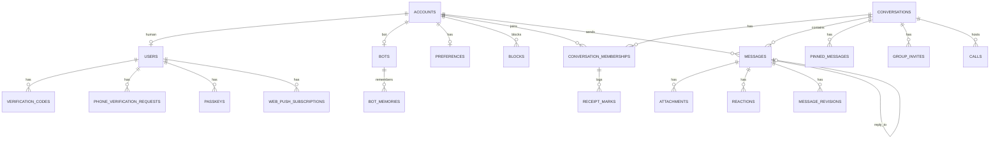

# SCHEMA_DESIGN.md

> **Step 2 of the MASTER_PLAN process.** The target database schema.
> Companions: [`TARGET_ARCHITECTURE.md`](TARGET_ARCHITECTURE.md), [`DESIGN_SYSTEM.md`](DESIGN_SYSTEM.md).
> Problems referenced as `P-n`, findings as `F-n`, business rules as `BR-n`,
> new requirements as `NR-n` — all from [`AUDIT_REPORT.md`](AUDIT_REPORT.md).
>
> **Clean slate.** Nothing is deployed, no database exists. This is a fresh design,
> not a migration path.

---

## §0 Design principles

Six rules that every table below obeys. Each exists because the audit found it
violated somewhere.

1. **One way to identify a participant.** The current schema references participants as `user_id` in six tables and `identity_id` in eight, with a polymorphic join between them (`P-1`). Exactly one column name, one foreign key target, everywhere.
2. **The database enforces its own invariants.** Not-null, foreign keys, unique constraints, and CHECKs — not model validations alone. There are currently ten missing foreign keys and a nullable ordering column that is functionally required (`P-4`, `P-5`).
3. **Denormalize where the read pattern demands it, and own the consequences.** A denormalized counter is acceptable *if* something recomputes it. `storage_ledgers` drifts permanently today because nothing does (`F-5`, `BR-92`).
4. **Hot paths read O(1) state; cold paths read history.** Tick rendering and unread counts hit a single row. Exact per-message audit hits an append-only log. Neither requires a row per message per recipient. See §5.
5. **Configuration is data, not columns.** Settings that change shape live in validated JSONB; settings that admins change live in `app_settings`. Neither should require a migration (`NR-6`).
6. **Names describe what the thing is now.** Every rename is listed in §9; nothing changes silently.

---

## §1 Domain map



Eight domains: **Identity**, **Conversations**, **Messages**, **Media**,
**Calls**, **Bots & AI**, **Preferences**, **Platform/Admin**.

---

## §2 Identity

### The core decision: `accounts` as the single participant table

The audit's worst structural problem is the half-finished user/bot unification
(`P-1`): a polymorphic `identities` table pointing at either `users` or `bots`,
with the rest of the schema split between referencing `identities` and referencing
`users` directly. `reactions`, `starred_messages`, `message_receipts`,
`call_participants`, and `web_push_subscriptions` all use `user_id` — which
silently means bots can never react, star, or join a call.

Target: **one non-polymorphic `accounts` table that everything references**, with
human-only and bot-only concerns in 1:1 side tables.

### Three words that must not blur

Since `accounts` and `users` are near-synonyms in ordinary speech, the distinction
is stated once, here, and enforced everywhere:

| Table | Means | Referenced by |
| --- | --- | --- |
| **`accounts`** | Something that **participates in conversations**. Human or bot. Owns username, display name, avatar, bio. | Every message, membership, reaction, call, block |
| **`users`** | A **human who logs in**. Owns email, phone, password, admin flag. | Auth flows only |
| **`bots`** | An **AI configuration**. Owns persona prompt, memory settings. | AI flows only |

This distinction pays for itself immediately in impersonation (`NR-7`), where the
two genuinely differ: `current_user` is the admin who authenticated,
`current_account` is whoever they're acting as. A single conflated concept would
have made that ambiguous in every controller.

```sql
CREATE TABLE accounts (
  id              bigserial PRIMARY KEY,
  kind            text NOT NULL CHECK (kind IN ('human','bot')),
  username        citext NOT NULL UNIQUE,
  display_name    text NOT NULL,
  bio             text,
  deactivated_at  timestamptz,
  created_at      timestamptz NOT NULL,
  updated_at      timestamptz NOT NULL
);
CREATE INDEX ON accounts (kind) WHERE deactivated_at IS NULL;
-- avatar via Active Storage attachment on Account
```

**Discoverability is not a column on `accounts`.** Username / email / phone
findability live only in `preferences.data.privacy` (§7) —
`discoverable_by_username`, `discoverable_by_email`, `discoverable_by_phone`.
Search and profile queries read preferences (joined or cached). One source of
truth; no denormalized boolean on the participant row to drift out of sync.

**Why not one flat table with nullable columns?** Because 95% of queries need only
`(username, display_name, avatar, kind)` and would carry ~15 irrelevant auth
columns; and because bots would need a nullable `password_digest`, which is the
kind of column that eventually gets set by accident.

**Why not keep `identities` polymorphic?** Polymorphism buys the ability to add a
third participant type without a migration. There is no third type, and the cost
is paid on every join — you cannot foreign-key a polymorphic column, which is
precisely why ten FKs are missing today. `kind` as a CHECK-constrained enum gives
the same modelling power with real referential integrity.

### `users` — human auth and account

```sql
CREATE TABLE users (
  id                   bigserial PRIMARY KEY,
  account_id           bigint NOT NULL UNIQUE REFERENCES accounts ON DELETE CASCADE,
  email                citext UNIQUE,
  email_verified_at    timestamptz,
  phone                text UNIQUE,
  phone_verified_at    timestamptz,
  password_digest      text,
  google_subject       text UNIQUE,          -- was users.token
  webauthn_handle      text UNIQUE,          -- was users.webauthn_id
  credentials_epoch    integer NOT NULL DEFAULT 0,  -- was session_version
  is_admin             boolean NOT NULL DEFAULT false,
  onboarded_at         timestamptz,
  last_active_at       timestamptz,          -- was last_seen_at
  created_at           timestamptz NOT NULL,
  updated_at           timestamptz NOT NULL
);
```

**There is deliberately no `CHECK` requiring a credential.** The obvious
constraint — "email or phone or google_subject must be present" — is wrong three
times over: `phone` is not a login identity under D-6, a passkey-only account
holds its credential in `passkeys` where a row-level CHECK cannot see it, and a
CHECK cannot count rows in another table anyway. The real invariant is *"at least
one usable login method survives this change"*, which spans `users.password_digest`,
`users.google_subject`, `users.email` (for OTP and magic link), and `passkeys` —
so it is enforced in the `Auth::RemoveCredential` operation and covered by a
unit spec per removal path. That is the `F-8` fix; a CHECK here would give the
appearance of one while permitting a passkey-only user to be locked out.

Fixes carried in this one table:

- **`users.token` → `google_subject`.** The current name is actively dangerous: it reads like an auth token, is indexed like one, and actually holds a Google OAuth subject identifier. Anyone reading `user.token` would reasonably assume it's a secret.
- **`session_version` → `credentials_epoch`.** It doesn't version sessions; incrementing it invalidates every credential the user holds. `epoch` is the standard term.
- **`last_seen_at` → `last_active_at`.** Disambiguates from message *seen* state, an entirely different concept in the same schema.
- **`pic` deleted.** Already marked deprecated in a column comment; Active Storage avatars are the real path.
- **`name` and `username` deleted** — they live on `accounts` now, ending the duplication where `users.username` and `identities.username` both existed and could disagree.
- **Privacy booleans deleted** (`allow_last_seen`, `allow_read_receipts`, `discoverable_by_email`, `discoverable_by_phone`, `show_email_on_profile`, `show_phone_on_profile`) — they move into `preferences` (§7), including username findability as `discoverable_by_username`. There is **no** `accounts.discoverable` column.
- **`email` becomes `citext`**, matching how it's actually compared. It is currently `varchar` with a unique index, so `A@b.com` and `a@b.com` are two accounts.
- **`is_admin` added.** Admin is currently determined by an environment-variable email list — unqueryable, and it breaks the moment someone changes their email.

### `bots`

```sql
CREATE TABLE bots (
  id                bigserial PRIMARY KEY,
  account_id        bigint NOT NULL UNIQUE REFERENCES accounts ON DELETE CASCADE,
  owner_account_id  bigint REFERENCES accounts ON DELETE SET NULL,  -- NULL = system bot
  persona_prompt    text NOT NULL,          -- was system_prompt
  memory_enabled    boolean NOT NULL DEFAULT true,
  model_override    text,                   -- optional per-bot model
  created_at        timestamptz NOT NULL,
  updated_at        timestamptz NOT NULL
);
```

`system_prompt` → `persona_prompt` because "system prompt" is an LLM API
implementation detail; this column holds the bot's personality, and it will be one
input among several once memory and retrieved context are assembled.

Also removed: the unique index on `bots.name`. Requiring globally unique *display
names* is a bug — usernames are the unique handle.

### Auth credentials — splitting a table that does two jobs

`login_credentials` currently stores OTP codes and WebAuthn passkeys in one table,
so `code_digest`, `public_key`, `sign_count`, and `expires_at` are all nullable and
each row uses about half of them (`P-9`). Two tables, all columns meaningful:

```sql
CREATE TABLE verification_codes (
  id           bigserial PRIMARY KEY,
  user_id      bigint NOT NULL REFERENCES users ON DELETE CASCADE,
  purpose      text NOT NULL CHECK (purpose IN
                 ('login','signup','password_reset','email_change')),
  channel      text NOT NULL DEFAULT 'email' CHECK (channel = 'email'),
  destination  text NOT NULL,             -- the address being verified
  code_digest  text NOT NULL,
  expires_at   timestamptz NOT NULL,
  attempts     integer NOT NULL DEFAULT 0,
  consumed_at  timestamptz,
  created_at   timestamptz NOT NULL
);
CREATE INDEX ON verification_codes (user_id, purpose) WHERE consumed_at IS NULL;
```

`destination` is new and closes a real gap: a code is currently tied to a user but
not to the address it was sent to, so a code issued for a phone change could in
principle be consumed by a different flow.

```sql
CREATE TABLE passkeys (
  id                      bigserial PRIMARY KEY,
  user_id                 bigint NOT NULL REFERENCES users ON DELETE CASCADE,
  webauthn_credential_id  text NOT NULL UNIQUE,   -- was external_id
  public_key              text NOT NULL,
  sign_count              integer NOT NULL DEFAULT 0,
  nickname                text,
  last_used_at            timestamptz,
  created_at              timestamptz NOT NULL
);
```

`channel` is single-valued today (only email is an outbound-delivered code) rather
than deleted outright, so a future outbound channel is one CHECK edit, not a
migration touching every row. Phone deliberately does **not** go through this
table — see below.

### Phone verification — a structurally different table

Per D-6, phone is verified via **WhatsApp click-to-verify** (`TARGET_ARCHITECTURE.md`
§4.8): we generate a code and display it, the user's own WhatsApp client sends it
to our business number, and a webhook confirms it. That is the opposite direction
of `verification_codes` — we never deliver anything to a destination we already
know; we discover the destination (the sender's WhatsApp number) from the
confirmation itself. Cramming this into `verification_codes`, which assumes
"deliver to a known destination, then the user submits it back through our own
API," would blur two genuinely different flows into one misleading shape.

```sql
CREATE TABLE phone_verification_requests (
  id               bigserial PRIMARY KEY,
  user_id          bigint NOT NULL REFERENCES users ON DELETE CASCADE,
  code_digest      text NOT NULL,          -- sha256; short-lived, no need for bcrypt cost
  expires_at       timestamptz NOT NULL,
  confirmed_phone  text,                   -- populated from the webhook's sender field
  confirmed_at     timestamptz,
  created_at       timestamptz NOT NULL
);
CREATE UNIQUE INDEX ON phone_verification_requests (code_digest)
  WHERE confirmed_at IS NULL;              -- one live code per request, globally unique while pending
CREATE INDEX ON phone_verification_requests (user_id) WHERE confirmed_at IS NULL;
```

The webhook handler's job is exactly one query: hash the inbound message body,
look up an unexpired, unconfirmed row by `code_digest`, and if found, write
`confirmed_phone` from the sender field and stamp `users.phone` /
`phone_verified_at` in the same transaction. **The sender's number is trusted over
any number the user may have typed elsewhere** — if they differ, the confirmed
number wins, and the UI tells the user which number actually got verified.

Admin manual verification (the fallback for someone without WhatsApp) skips this
table entirely: the admin sets `users.phone_verified_at` directly, and the action
is recorded in `audit_events` (§8) like every other admin write.

### `blocks` (NR-1)

```sql
CREATE TABLE blocks (
  id                  bigserial PRIMARY KEY,
  blocker_account_id  bigint NOT NULL REFERENCES accounts ON DELETE CASCADE,
  blocked_account_id  bigint NOT NULL REFERENCES accounts ON DELETE CASCADE,
  created_at          timestamptz NOT NULL,
  UNIQUE (blocker_account_id, blocked_account_id),
  CHECK (blocker_account_id <> blocked_account_id)
);
CREATE INDEX ON blocks (blocked_account_id);
```

Per your spec: mutual invisibility in user search and profiles, no new
conversations in either direction, **groups entirely unaffected**. Both indexes
matter because the check runs in both directions.

---

## §3 Conversations

```sql
CREATE TABLE conversations (
  id                bigserial PRIMARY KEY,
  kind              text NOT NULL CHECK (kind IN ('direct','group','channel')),
  title             text,
  description       text,
  direct_key        text UNIQUE,          -- 'a:b' with sorted account ids; direct only
  last_message_id   bigint,               -- denormalized; FK added after messages
  last_activity_at  timestamptz NOT NULL,
  next_position     bigint NOT NULL DEFAULT 0,   -- was message_seq
  next_revision     bigint NOT NULL DEFAULT 0,   -- was change_seq
  context_summary   text,                 -- rolling AI summary
  summarized_through_message_id bigint,
  created_at        timestamptz NOT NULL,
  updated_at        timestamptz NOT NULL,
  CONSTRAINT direct_key_only_for_direct
    CHECK ((kind = 'direct') = (direct_key IS NOT NULL)),
  CONSTRAINT groups_have_titles
    CHECK (kind = 'direct' OR title IS NOT NULL)
);
CREATE INDEX ON conversations (last_activity_at DESC);
```

Four changes worth explaining.

**`direct_key` — the DM race fix (F-13).** Today two users tapping "message" at the
same moment can create two direct conversations, because find-or-create isn't
atomic. With a unique key derived from the sorted account ids, creation becomes
`INSERT … ON CONFLICT DO NOTHING RETURNING id` and the race is structurally
impossible rather than merely unlikely.

**`last_message_id` + `last_activity_at` — the sidebar fix (F-4).** Rendering the
chat list currently issues a separate "latest message" query per conversation.
These two columns turn the sidebar into one indexed query. They're maintained in
the same operation that creates a message, with a reconciliation job behind them —
per principle 3, a denormalized value without a recomputation path is a future bug.

**`chat_type: broadcast` → `kind: channel`.** "Broadcast" suggests a one-off
send-to-many action; the value actually models a persistent one-to-many
conversation. `channel` is the term every comparable product uses.

**`summarized_through_id` gets a real type and an FK.** It is currently `integer`
while `messages.id` is `bigint`, with no foreign key — a latent overflow and a
dangling reference in one column.

### `conversation_memberships`

Renamed from `chat_participants`, and expanded because it now carries all hot-path
read state.

```sql
CREATE TABLE conversation_memberships (
  id                       bigserial PRIMARY KEY,
  conversation_id          bigint NOT NULL REFERENCES conversations ON DELETE CASCADE,
  account_id               bigint NOT NULL REFERENCES accounts ON DELETE CASCADE,
  role                     text NOT NULL DEFAULT 'member'
                             CHECK (role IN ('member','admin','owner')),
  status                   text NOT NULL DEFAULT 'active'
                             CHECK (status IN ('active','left','removed')),
  invited_by_account_id    bigint REFERENCES accounts ON DELETE SET NULL,
  joined_at                timestamptz NOT NULL,
  muted_until              timestamptz,
  archived_at              timestamptz,                 -- NR-14; per-account, not global

  -- hot-path read state (§5)
  last_delivered_position  bigint NOT NULL DEFAULT 0,
  last_read_position       bigint NOT NULL DEFAULT 0,   -- disclosed to others
  last_seen_position       bigint NOT NULL DEFAULT 0,   -- private; >= last_read
  last_delivered_at        timestamptz,
  last_read_at             timestamptz,
  unread_count             integer NOT NULL DEFAULT 0,

  created_at               timestamptz NOT NULL,
  updated_at               timestamptz NOT NULL,
  UNIQUE (conversation_id, account_id),
  CHECK (last_seen_position >= last_read_position)
);
CREATE INDEX ON conversation_memberships (account_id, status);
CREATE INDEX ON conversation_memberships (account_id) WHERE archived_at IS NULL;
```

- **`state` → `status`**, and the five-value enum (`active/left/removed/banned/pending`) drops to three. Per Q-13 you don't want banning, and `pending` is `join_requests`' job. Dead states in a CHECK constraint are misleading documentation.
- **`last_read_message_id` → `last_read_position`.** Positions are monotonic per conversation and directly comparable; message ids are global and say nothing about order within a conversation without a join.
- **The two-watermark split** implements `BR-36` cleanly: `last_seen_position` always advances when the user actually views; `last_read_position` advances only if their read-receipts preference is on. Unread counts and "jump to first unread" use the private one; what others see uses the public one. Today one nullable column tries to serve both.
- **`archived_at` is NR-14**, and it belongs here rather than on `conversations` because archiving is one person's view of a shared thread — the other party must not be able to tell. Archived conversations leave the default sidebar query (hence the partial index) and return to it on the next incoming message, which is the behaviour every comparable product implements. Muting and archiving stay orthogonal: archive controls *placement*, mute controls *noise*.

### §3.1 Permission matrix (enforced RBAC — F-1 / Q-4)

Roles are ordered: **owner > admin > member**. Policies enforce this matrix; the
API never relies on the UI. Direct conversations have no roles (both humans are
peers). Bots never hold admin/owner. Channels (`kind = 'channel'`) restrict who
may post.

| Action | Direct | Group member | Group admin | Group owner | Channel member | Channel admin/owner |
| --- | --- | --- | --- | --- | --- | --- |
| Send text / media | yes | yes | yes | yes | no | yes |
| Edit / unsend own message | yes (within edit window) | yes | yes | yes | — | yes |
| Edit / unsend others' messages | no | no | no | no | no | no |
| React / save / reply / forward | yes | yes | yes | yes | yes (read) / no send | yes |
| Pin / unpin (max 5) | yes | yes | yes | yes | no | yes |
| Start call | yes (humans only) | yes | yes | yes | no | no |
| Edit title / description / avatar | — | no | yes | yes | no | yes |
| Add members / create invite | — | no | yes | yes | no | yes |
| Approve / reject join requests | — | no | yes | yes | no | yes |
| Remove member (not owner) | — | no | yes | yes | no | yes |
| Remove owner | — | no | no | no | — | — |
| Promote / demote admin | — | no | no | yes | no | owner only |
| Transfer ownership | — | no | no | yes | — | yes |
| Leave | n/a — archive or block instead (§3.2) | yes, unless sole admin/owner | yes, unless sole admin | must transfer first | yes | must transfer / demote if sole |

Additional invariants (application + tests, not CHECKs):

- **Last admin/owner cannot leave** without transferring ownership or promoting
  another admin first (`BR-51`; preserves current leave guard, and there is still
  no auto-transfer).
- **Blocked accounts** (NR-1): cannot start new directs or appear in search/
  profiles; existing group memberships are unaffected.
- **Admin impersonation** (NR-7): bypasses this matrix entirely; every action is
  audit-logged. See `TARGET_ARCHITECTURE.md` §7.3.
- **Group size is uncapped** (`BR-54`), and a group needs ≥2 members at creation.
  Calls remain capped at **4 human participants** in a full mesh (`BR-62`), so in
  a group larger than four the call affordance is offered until four participants
  are live and then reports the call as full. The two limits are independent and
  deliberately so — capping group size to match a WebRTC topology limit would be
  the wrong constraint in the wrong place.

### §3.2 Membership lifecycle under soft status

The current code declares five membership states but writes none of them: leave
and remove both `destroy!` the row (`BR-49`), which is why a removed member can
silently rejoin through an invite link (`BR-50`). The target keeps the row and
sets `status`, so these behaviours must now be stated rather than inherited.

| Situation | Behaviour | Note |
| --- | --- | --- |
| Member leaves a group | `status = 'left'`, row retained | Preserves their authored messages' membership context and their `receipt_marks` |
| Member removed by an admin | `status = 'removed'`, row retained | Not a ban — Q-13 declined banning |
| Either rejoins via invite | Same row flips to `active`, `joined_at` refreshed | Matches `BR-50`'s outcome, now explicitly rather than as a side effect of row deletion |
| Read state on rejoin | Watermarks are **retained, not reset** | Rejoining does not resurrect hundreds of "unread" messages from before they left |
| Last member leaves a group | Conversation is **retained**, not destroyed | Changes `BR-52`. With no data-loss pressure on a clean slate, keeping an empty conversation is cheaper than a cascading delete, and it keeps message history intact for anyone later re-invited or for admin review |
| Direct conversation "leave" | Not offered | The §3.1 matrix row is corrected: directs are never left, only archived (NR-14) or blocked (NR-1). A one-sided DM deletion would need per-account message visibility, which is not in this design |
| Folders on leave | Entry removed from the leaver's `conversation_folder_entries` | Changes `BR-61`, which leaves a dangling folder entry pointing at a conversation you are no longer in |
| Scheduled messages on leave | Cancelled for that account | Changes `BR-61`. Delivering a scheduled message into a group you left is indefensible |

The `unique (conversation_id, account_id)` constraint is what makes rejoin an
`UPDATE` rather than a duplicate row, so this lifecycle is enforced structurally.

Pundit policies and request-spec 403 coverage are defined against this table —
see `TARGET_ARCHITECTURE.md` §4.4.

---

## §4 Messages

```sql
CREATE TABLE messages (
  id                         bigserial PRIMARY KEY,
  conversation_id            bigint NOT NULL REFERENCES conversations ON DELETE CASCADE,
  sender_account_id          bigint REFERENCES accounts ON DELETE SET NULL,
  position                   bigint NOT NULL,     -- was seq; immutable order
  revision                   bigint NOT NULL,     -- was change_seq; bumped on any mutation
  kind                       text NOT NULL DEFAULT 'text'
                               CHECK (kind IN ('text','system','image','video','audio','voice','file')),
  system_event               text,                -- was event_type; only when kind='system'
  body                       text,                -- was text
  client_nonce               uuid,                -- was client_id
  reply_to_message_id        bigint REFERENCES messages ON DELETE SET NULL,  -- was parent_id
  forwarded_from_account_id  bigint REFERENCES accounts ON DELETE SET NULL,
  forward_count              integer NOT NULL DEFAULT 0,
  attachment_count           integer NOT NULL DEFAULT 0,
  reaction_summary           jsonb NOT NULL DEFAULT '{}',   -- {"👍": 3, "❤️": 1}
  metadata                   jsonb NOT NULL DEFAULT '{}',
  sender_snapshot            jsonb NOT NULL DEFAULT '{}',
  search_vector              tsvector GENERATED ALWAYS AS
                               (to_tsvector('simple', coalesce(body,''))) STORED,
  edited_at                  timestamptz,
  deleted_at                 timestamptz,
  created_at                 timestamptz NOT NULL,
  updated_at                 timestamptz NOT NULL,

  UNIQUE (conversation_id, position),
  CONSTRAINT system_event_iff_system
    CHECK ((kind = 'system') = (system_event IS NOT NULL)),
  CONSTRAINT sender_required_unless_system
    CHECK (kind = 'system' OR sender_account_id IS NOT NULL OR sender_snapshot <> '{}')
);

CREATE UNIQUE INDEX ON messages (conversation_id, client_nonce)
  WHERE client_nonce IS NOT NULL;                          -- idempotency (F-3)
CREATE INDEX ON messages (conversation_id, revision);
CREATE INDEX ON messages (conversation_id, id DESC);
CREATE INDEX ON messages USING gin (search_vector);
CREATE INDEX ON messages (sender_account_id);
```

### The five substantive changes

**1. `position` is `NOT NULL` (P-4).** Today `seq` is nullable with a partial
unique index, because it was added later. Ordering is not optional — a message
without a position cannot be displayed correctly. Allocated atomically:

```sql
UPDATE conversations SET next_position = next_position + 1
 WHERE id = $1 RETURNING next_position;
```

**2. `client_nonce` is genuinely unique per conversation (F-3).** The most
important single line in the schema. The frontend's entire offline outbox assumes
that re-sending a message with the same client id is safe. The backend currently
stores `client_id` with a *non*-unique index and never checks it — so a retry after
a timeout creates a duplicate. One partial unique index makes the outbox's core
assumption true. Typed as `uuid` rather than `string` because that's what it is.

**3. `messages.status` is deleted.** A three-value column (`sent/delivered/read`)
on the message cannot represent per-recipient state in a group, and it duplicates
information the read-state model already holds. Tick state is derived — see §5.

**4. Reactions bump `revision` (BR-26).** Today reacting doesn't advance the sync
cursor, so a client that reconnects never learns about reactions added while it
was away. Since reactions are a child table, the fix is that reaction writes bump
the parent's `revision` and update `reaction_summary`. `reaction_summary` also
kills a guaranteed N+1 when rendering a page of messages.

**5. Full-text search.** A generated `tsvector` with a GIN index, using the
`simple` configuration so it's language-agnostic — appropriate for a multilingual
user base. Current search is `ILIKE '%term%'`, which cannot use an index.
`pg_trgm` can be added later for substring and fuzzy matching.

### Renames and deletions

- **`text` → `body`.** `text` is a Postgres type, a Ruby method, and an ActiveRecord column type. Every `message.text` reads ambiguously.
- **`message_type` → `kind`**, integer enum → text CHECK. Consistent everywhere in the schema, and readable in `psql` without a lookup table.
- **`event_type` → `system_event`**, with a CHECK tying it to `kind = 'system'`. Nothing currently prevents a text message carrying an event type.
- **`parent_id` → `reply_to_message_id`.** "Parent" suggests threading; this is a reply reference. It also **gains a foreign key** — currently there is none, so a deleted message leaves replies pointing at nothing (`BR-9`, `P-11`).
- **`is_forwarded` deleted**, replaced by `forwarded_from_account_id IS NOT NULL`. One source of truth, and it preserves attribution, which the boolean loses.
- **`forwarded_count` → `forward_count`.** Grammar; the count is of forwards, not of forwarded things.

### System events as first-class messages (NR-4)

You asked for group events rendered as centred text in the thread and reflected in
the chat list's last-activity line. That falls out for free: system events are
already `messages` with `kind = 'system'`, so they get a `position`, a `revision`,
and participate in `last_message_id`. No separate table, no separate sync path,
one ordering.

`system_event` values: `member_added`, `member_removed`, `member_left`,
`member_joined`, `title_changed`, `description_changed`, `avatar_changed`,
`role_changed`, `message_pinned`, `message_unpinned`, `call_started`, `call_ended`,
`call_missed`, `conversation_created`, and — added with the §12 feature set —
`permissions_changed`, `slow_mode_changed`, `forwarding_restricted`,
`forwarding_unrestricted`.

The four additions exist because each changes a rule the participants are subject
to. A conversation whose posting permissions or forwarding rules changed silently
would leave members reasoning about a contract that no longer holds — so the change
is written into the thread, exactly as a title change is.

> **Cut (Step 5):** `disappearing_timer_changed` is **not** a system event.
> Disappearing messages (NR-16) and view-once media (NR-17) are cut — a PWA cannot
> prevent screenshots, and shipping ephemeral/"secret" chat UI would imply
> confidentiality we cannot provide.

Rendered copy comes from the string catalog (§8), so it's translatable and
admin-editable — a direct consequence of Q-14.

### Unsend / soft-delete semantics (BR-1, BR-7, BR-8, BR-23, BR-30)

Messages are **never hard-deleted** via the API. Unsend sets `deleted_at` and
bumps `revision` (not `position`), so display order is preserved while clients
learn about the deletion through catch-up sync.

**There is no sanctioned exception.** Disappearing-message purge (formerly
NR-16 / S-14) was cut in Step 5 — `BR-1` is absolute.

| Rule | Behaviour |
| --- | --- |
| Tombstone row | Remains forever; included in revision catch-up so offline clients converge |
| Serializer payload | `body` cleared (or omitted); `deleted: true`; `sender_snapshot` retained for attribution |
| Children | Pins, saves, reactions, attachments, and blobs are **not** cascade-deleted |
| Reply to deleted | Renders `{ deleted: true }` snippet; does not break |
| Pin of deleted | Stays in the pin list, shown as deleted |
| Search / unread | Soft-deleted messages are excluded from unread counts and full-text hits |
| Storage quota | Soft-delete does **not** free bytes until an explicit media purge; reconciliation job remains source of truth for `used_bytes` |

Account deletion (S-3, resolved): the human's `accounts` row is deactivated;
messages persist with `sender_snapshot` and render as **"Deleted user"**. History
on the other side is not erased.

### Message children

```sql
CREATE TABLE reactions (
  id          bigserial PRIMARY KEY,
  message_id  bigint NOT NULL REFERENCES messages ON DELETE CASCADE,
  account_id  bigint NOT NULL REFERENCES accounts ON DELETE CASCADE,  -- was user_id
  emoji       text NOT NULL,
  created_at  timestamptz NOT NULL,
  UNIQUE (message_id, account_id, emoji)
);

CREATE TABLE message_revisions (            -- was message_versions
  id            bigserial PRIMARY KEY,
  message_id    bigint NOT NULL REFERENCES messages ON DELETE CASCADE,
  body          text NOT NULL,              -- was old_body
  superseded_at timestamptz NOT NULL
);

CREATE TABLE saved_messages (               -- was starred_messages
  id          bigserial PRIMARY KEY,
  account_id  bigint NOT NULL REFERENCES accounts ON DELETE CASCADE,
  message_id  bigint NOT NULL REFERENCES messages ON DELETE CASCADE,
  created_at  timestamptz NOT NULL,
  UNIQUE (account_id, message_id)
);

CREATE TABLE pinned_messages (
  id                    bigserial PRIMARY KEY,
  conversation_id       bigint NOT NULL REFERENCES conversations ON DELETE CASCADE,
  message_id            bigint NOT NULL REFERENCES messages ON DELETE CASCADE,
  pinned_by_account_id  bigint NOT NULL REFERENCES accounts ON DELETE CASCADE,  -- FK was missing
  created_at            timestamptz NOT NULL,
  UNIQUE (conversation_id, message_id)
);
```

`reactions.user_id → account_id` is what finally lets bots react. `starred` →
`saved` matches what comparable products call it and frees the star icon.

---

## §5 Read state — exact precision, minimal rows

You asked for **exact precision, strictly** — with the most efficient
implementation that guarantees it. This section is the answer, and it turns out
there is no tradeoff to make.

### What you specified (NR-2)

- No tick: queued locally, not yet acknowledged
- One tick: server accepted it
- Two ticks: delivered to the recipient
- Two accent ticks: read — **only if both parties have read receipts on**
- Red cross: send failed, retry available from the context menu

### Why `message_receipts` is still the wrong shape

One row per message per recipient. A 20-person group with 1,000 messages produces
20,000 rows and 20,000 writes — and, crucially, **those extra 19,000 rows carry no
extra information**, for a reason worth spelling out.

When a client reports "I have read through position 100," the server stamps
`read_at = now` on *every* receipt row from the previous watermark up to 100. Every
message in that batch receives an **identical timestamp**. The table stores the
same value hundreds of times.

### The design: watermarks for reads, an append-only log for exactness

Two structures, each serving one access pattern.

**Hot path — watermarks on the membership row** (already in §3). Every tick, every
unread badge, every "jump to first unread" reads one indexed row:

```
delivered to account A  ⟺  A.last_delivered_position >= message.position
read by account A       ⟺  A.last_read_position      >= message.position
```

**Cold path — `receipt_marks`**, one row per *watermark advance*, not per message:

```sql
CREATE TABLE receipt_marks (
  id             bigserial PRIMARY KEY,
  membership_id  bigint NOT NULL REFERENCES conversation_memberships ON DELETE CASCADE,
  kind           text NOT NULL CHECK (kind IN ('delivered','read')),
  position       bigint NOT NULL,        -- watermark advanced TO this position
  occurred_at    timestamptz NOT NULL,
  UNIQUE (membership_id, kind, position)
);
CREATE INDEX ON receipt_marks (membership_id, kind, position);
```

Exact read time for any message, at any age:

```sql
SELECT occurred_at
  FROM receipt_marks
 WHERE membership_id = $1 AND kind = 'read' AND position >= $2
 ORDER BY position
 LIMIT 1;
```

One index seek. The full info sheet for a message is one lateral join across the
conversation's memberships:

```sql
SELECT m.account_id, r.occurred_at
  FROM conversation_memberships m
  LEFT JOIN LATERAL (
    SELECT occurred_at FROM receipt_marks
     WHERE membership_id = m.id AND kind = 'read' AND position >= $2
     ORDER BY position LIMIT 1
  ) r ON true
 WHERE m.conversation_id = $1 AND m.status = 'active';
```

### Why this is exactly as precise, not approximately

The timestamp a per-message receipt would hold for message P is the moment the
recipient's watermark crossed P. `receipt_marks` stores precisely that moment,
once, and the query above recovers it for every message in the batch.

**The information content is identical. Only the redundancy is removed.**

There is one edge case worth naming: if a client reports reads in large batches —
say it was offline for a day and marks 500 messages read at once — both designs
record the same single timestamp for all 500. Neither can tell you when the user's
eyes passed each individual message, because the client never reported it. That is
a property of the protocol, not of the storage.

### Cost comparison

| | `message_receipts` | Watermarks + `receipt_marks` |
| --- | --- | --- |
| Rows | messages × recipients | read/delivery **events** |
| Writes per read batch | one per message in the batch | **one** |
| Tick state query | join + aggregate | **one indexed row** |
| Unread count | count query | **one integer column** |
| Exact per-message read time | yes | **yes** |
| 20-person group, 1,000 messages | ~20,000 rows | ~200–400 rows |

Row growth is bounded by how often people open conversations, not by how much they
talk. At 100 users this stays in the low millions over years, and rows are ~48
bytes.

**Compaction is available but not needed initially:** adjacent marks within a
short window can be merged, losing precision only inside that window. Not planned
until volume justifies it.

### Delivery, precisely

"Delivered" means the server successfully handed the message to the recipient, and
per your Q-5 answer it counts **even if notifications are muted**. Concretely,
`last_delivered_position` advances (and a `delivered` mark is written) when any of:

1. The recipient has a live WebSocket and the broadcast is accepted.
2. The recipient's client acknowledges receipt after a fetch or reconnect catch-up.
3. A web push is successfully accepted by the push service.

The muting question is then answered structurally: delivery is about reaching the
device; notification preferences are about whether it makes a sound.

### Group tick semantics

Two ticks when **every** active recipient has been delivered; two accent ticks when
**every** active recipient has read — matching WhatsApp. Both are
`MIN(...)` across the conversation's other memberships, computed from watermarks,
never from `receipt_marks`.

### Bot conversations

Bots are `accounts` with memberships, and nothing in a bot ever advances a
watermark — so a naive `MIN(...)` across memberships would mean a user **never
sees a double tick in any bot conversation**, which is a large share of this
product's usage. Two rules close that:

1. **Bot memberships are excluded from the recipient set** used to compute ticks.
2. The bot-reply pipeline advances the bot membership's `last_delivered_position`
   and `last_read_position` when it consumes the prompting message, so the
   exclusion is a fast path rather than a lie — the info sheet still shows a
   coherent row for the bot.

A user's message to a bot therefore shows one tick on server acknowledgement and
two accent ticks once the bot has actually read it to generate a reply. That is
both accurate and the behaviour a user expects.

---

## §6 Media and storage

Largely sound today; four corrections.

```sql
CREATE TABLE attachments (                  -- was message_attachments
  id                 bigserial PRIMARY KEY,
  message_id         bigint NOT NULL REFERENCES messages ON DELETE CASCADE,
  kind               text NOT NULL CHECK (kind IN ('image','video','audio','voice','file')),
  content_type       text NOT NULL,
  byte_size          bigint NOT NULL,
  checksum           text,
  width              integer,
  height             integer,
  duration_ms        integer,
  blurhash           text,
  waveform           jsonb,                 -- array of floats; documented shape
  processing_status  text NOT NULL DEFAULT 'pending'
                       CHECK (processing_status IN ('pending','ready','failed')),
  processing_error   text,
  storage_bucket_id  bigint REFERENCES storage_buckets,
  created_at         timestamptz NOT NULL,
  updated_at         timestamptz NOT NULL
);

CREATE TABLE storage_quotas (               -- was storage_ledgers
  account_id     bigint PRIMARY KEY REFERENCES accounts ON DELETE CASCADE,
  quota_bytes    bigint NOT NULL DEFAULT 524288000,
  used_bytes     bigint NOT NULL DEFAULT 0 CHECK (used_bytes >= 0),
  recomputed_at  timestamptz,
  updated_at     timestamptz NOT NULL
);
```

- **`processing_status` is new.** Media processing failures are currently silent — the attachment simply never renders. Making failure representable is the precondition for showing it.
- **`storage_bucket_id` is explicit.** The bucket is currently inferred from Active Storage's `service_name` string, so the ledger can't reliably attribute usage.
- **`storage_ledgers` → `storage_quotas`**, because it is not a ledger: a ledger is append-only, this is a mutable counter. Plus `recomputed_at`, backing a periodic reconciliation job — the fix for `F-5` / `BR-92`, where the counter increments on upload and never decrements on delete, so quotas drift upward permanently.
- **`waveform` defaults to `{}` today but holds an array.** Default becomes `NULL`, shape documented.

`storage_buckets` is unchanged. It's a genuinely good piece of design given the
multi-account R2 requirement.

---

## §7 Preferences — configuration as data

### The problem

`user_settings` has 17 columns and four CHECK constraints. Every new preference is
a migration. Privacy flags live on `users`. Notification preferences are in a third
table. There is no single place to ask "what are this user's settings?" (`P-7`,
`P-8`). Meanwhile Q-14 and Q-19 both expand the surface of user- and
admin-controlled options.

### The design

**One row per account, one validated JSONB document.**

```sql
CREATE TABLE preferences (
  account_id  bigint PRIMARY KEY REFERENCES accounts ON DELETE CASCADE,
  data        jsonb NOT NULL DEFAULT '{}',
  updated_at  timestamptz NOT NULL
);
```

```json
{
  "appearance": {
    "theme": "system", "accent_light": "cyber_indigo", "accent_dark": "cyber_indigo",
    "split_accents": false, "font_config_id": 3,
    "text_size": 0, "text_weight": 0, "text_line_height": 0, "text_letter_spacing": 0,
    "density": "comfortable",
    "wallpaper": { "preset": "none", "dim": 0, "blur": 0 },
    "bubble_corner_style": "rounded", "chat_font_config_id": null,
    "reduce_transparency": false, "always_show_timestamps": false,
    "media_autoplay": "wifi_only", "emoji_skin_tone": 0
  },
  "locale":  { "language": "en", "timezone": "Asia/Kolkata",
               "date_format": "MMM D, YYYY", "time_format": "12h" },
  "privacy": { "read_receipts": true, "last_active": true,
               "discoverable_by_username": true, "discoverable_by_email": false,
               "discoverable_by_phone": false,
               "show_email_on_profile": false, "show_phone_on_profile": false },
  "chat":    { "quick_reactions": ["👍","❤️","😂","😮","😭","🙏"],
               "enter_to_send": true, "voice_transcription_enabled": true,
               "link_previews_enabled": true, "save_to_gallery": false,
               "archive_muted_chats": false },
  "ai": {
    "translation_language": "en",
    "style_profile_enabled": true,
    "style_profile": null,
    "style_profile_updated_at": null
  },
  "notifications": {
    "global": {
      "level": "all", "show_preview": true, "sound": true, "vibration": true,
      "dnd_enabled": false, "dnd_start": "22:00", "dnd_end": "07:00",
      "dnd_days": [0, 1, 2, 3, 4, 5, 6]
    },
    "kind:group":      { "level": "mentions" },
    "conversation:42": { "level": "none" }
  }
}
```

### The notification cascade, preserved in full (BR-98, BR-99)

The current code resolves notification settings through a **four-scope cascade**
across three tables. Folding it into one document must not quietly flatten it to
two scopes, so the scope keys are stated here as the contract:

| Order | Scope key | Stored? |
| --- | --- | --- |
| 1 | `defaults` | No — code-defined, in the settings registry |
| 2 | `global` | Yes |
| 3 | `kind:direct` \| `kind:group` \| `kind:channel` | Yes |
| 4 | `conversation:<id>` | Yes |

Later scopes override earlier ones key-by-key, exactly as the current hash merge
does. All eight whitelisted keys (`BR-99`) survive: `level`
(`all` \| `mentions` \| `none`), `show_preview`, `sound`, `vibration`,
`dnd_enabled`, `dnd_start`, `dnd_end`, `dnd_days`. An unknown key is a validation
error, as it is today.

What changes is that resolution becomes a **pure function over a single JSONB
document** rather than a merge across `SYSTEM_DEFAULTS`, `notification_preferences`
rows, and a per-chat lookup — one row read instead of two queries, and unit-testable
without fixtures.

**`locale.timezone` is what makes DND correct.** Do Not Disturb currently
evaluates `Time.current` in the *server's* timezone despite a comment claiming
otherwise (`F-21` / `BR-100`), and no timezone is stored for a user anywhere. The
IANA name is captured from the browser at onboarding and editable in settings; the
resolver evaluates the window and `dnd_days` in it. A quiet-hours setting
evaluated in the wrong timezone is worse than no setting, because the user
believes they configured it.

**The resolver takes the message.** `Notifications::Resolve` is defined as
`(account:, conversation:, message:)`, with `message` required rather than
optional. This is the structural fix for `F-9`, where "mentions only" silences a
group entirely because the enqueue path never passed `message_id` and the
evaluator inspected an empty message. Making the argument mandatory means the bug
cannot recur without failing to compile a call site.

`ai.style_profile` holds the learned writing-style blob (today's
`user_settings.ai_style_profile`). It is the input for rewrites / suggest-reply
and the seam for **NR-F1** (replica bot). `null` until the user opts in and a
profile has been built. See `TARGET_ARCHITECTURE.md` §6.7.

`appearance.theme` defaults to **`system`** (DS-2): follow OS preference; when
the OS preference is unknown, render dark. `appearance.density` is
`comfortable` | `compact` (DS-5).

### Why this is safe, not sloppy

The obvious objection is losing CHECK constraints. Validation moves to a
**code-defined setting registry** that is strictly more expressive:

```ruby
Preferences.define do
  namespace :appearance do
    enum    :theme, %w[light dark system], default: "system"
    enum    :density, %w[comfortable compact], default: "comfortable"
    integer :text_size,   range: -5..5, default: 0
    integer :text_weight, range: -5..5, default: 0
  end
  namespace :privacy do
    boolean :read_receipts, default: true
    boolean :discoverable_by_username, default: true
    boolean :discoverable_by_email, default: false
    boolean :discoverable_by_phone, default: false
  end
  namespace :ai do
    boolean :style_profile_enabled, default: true
    # style_profile blob + updated_at validated as optional structured JSON
  end
  namespace :locale do
    string :timezone, format: :iana, default: "UTC"
  end
  # notifications is a scoped namespace: the same key set validated under
  # `global`, `kind:<direct|group|channel>`, and `conversation:<id>`
  scoped_namespace :notifications, scopes: %i[global kind conversation] do
    enum    :level, %w[all mentions none], default: "all"
    boolean :show_preview, default: true
    boolean :sound,        default: true
    boolean :vibration,    default: true
    boolean :dnd_enabled,  default: false
    time    :dnd_start,    default: "22:00"
    time    :dnd_end,      default: "07:00"
    array   :dnd_days, of: :integer, range: 0..6, default: (0..6).to_a
  end
end
```

The registry gives type coercion, ranges, defaults, deprecation, migration hooks,
**and it generates both the TypeScript types and the settings UI schema**. A new
preference is one line in one file — no migration, no serializer change, no
frontend type update.

**[Extensibility — deliberate]** One of the few places I'm trading a database
guarantee for velocity, justified specifically because you named settings as an
area that must grow without migrations.

**Notification preferences fold in** as the scoped `notifications` namespace
described above, preserving all four resolution scopes and all eight keys.

### The typography fix (NR-13)

The DB currently stores computed values (`text_size_multiplier: 1.0`,
`text_weight: 400`) while the UI shows −5…+5 sliders; the mapping broke in a
refactor and the sliders no longer do anything (`NR-13` / Q-18).

Target: **store the slider value, derive the CSS.** `text_size: 0` means "slider at
zero." The mapping to a multiplier lives in one place in the frontend, so it cannot
desynchronize. Four sliders — size, weight, line height, letter spacing — each
−5…+5, defaulting to 0, exactly as you described. Derivation table in
[`DESIGN_SYSTEM.md`](DESIGN_SYSTEM.md) §3.5.

---

## §8 Platform, admin, and AI

### Runtime configuration (NR-6)

```sql
CREATE TABLE app_settings (
  key                 text PRIMARY KEY,
  value               jsonb NOT NULL,
  category            text NOT NULL,
  updated_by_user_id  bigint REFERENCES users ON DELETE SET NULL,
  updated_at          timestamptz NOT NULL
);

CREATE TABLE translation_strings (
  id                  bigserial PRIMARY KEY,
  key                 text NOT NULL,
  locale              text NOT NULL DEFAULT 'en',
  value               text NOT NULL,
  updated_by_user_id  bigint REFERENCES users ON DELETE SET NULL,
  updated_at          timestamptz NOT NULL,
  UNIQUE (key, locale)
);

CREATE TABLE prompt_templates (
  id                  bigserial PRIMARY KEY,
  capability          text NOT NULL,
  version             integer NOT NULL DEFAULT 1,
  template            text NOT NULL,
  active              boolean NOT NULL DEFAULT true,
  updated_by_user_id  bigint REFERENCES users ON DELETE SET NULL,
  updated_at          timestamptz NOT NULL,
  UNIQUE (capability, version)
);
```

All three follow one pattern: code ships defaults, the database holds overrides,
reads are cached and invalidated on write. This replaces `config/features.yml`,
scattered constants, hardcoded strings, and inline prompts with one mechanism —
which is how "no feature flags" (Q-15) and "admin toggles features" (Q-14)
reconcile without contradiction.

Two further tables complete the picture and are specified in §12.15:
**`feature_flags`** (admin-toggleable flags with targeted rollout, replacing the
twelve historical YAML flags) and **`theme_overrides`** (admin-editable semantic
colour tokens, contrast-checked on write — NR-48).

### The configurability contract (NR-6, expanded) — **Tier 1 config system**

> **Strengthened in Step 4.1; named Tier 1 in Step 5.** The requirement is now
> explicit and maximal: as an administrator you must be able to change **any
> feature toggle, any constant, any user-facing string, and any colour** from the
> dashboard, without a deploy. This is the **Tier 1 config system** — foundational
> infrastructure, not a settings panel bolted on later.

That is a stronger claim than "settings exist", and it only holds if it is
enforced rather than intended. Four mechanisms, one per category:

| Category | Mechanism | Enforcement |
| --- | --- | --- |
| Feature toggles | `feature_flags` with code-defined defaults | A flag read for an unregistered key raises in test and in development |
| Constants and limits | `app_settings`, typed registry with category and range | **A CI guard rejects new numeric literals in domain code** (below) |
| User-facing strings | `translation_strings` + `t()` | An ESLint rule and a RuboCop cop reject literal user-facing strings |
| Colours | `theme_overrides` over semantic tokens | An ESLint rule rejects hex, `rgb()` and `hsl()` outside the token file |

**The registry, not the table, is the source of truth for what exists.** Every
setting is declared in code with a type, a range, a category, a default and a
description, exactly as preferences are (§7). The admin UI is generated from that
declaration, so adding a configurable constant is one line and it appears in the
dashboard with validation already attached. A row in `app_settings` whose key is
not in the registry is ignored and reported, so a typo cannot silently change
behaviour.

**The CI guard is what makes this stick.** Without it, the third feature written
under deadline reintroduces a hardcoded number, and the claim quietly becomes
false. The rule: a numeric literal in `app/operations`, `app/queries`,
`app/policies` or `app/models` fails the build unless it is `0`, `1`, `-1`, or
carries an explicit `# rubocop:disable` with a stated reason. The frontend
equivalent bans magic numbers outside the token and config modules. Both are
noisy to introduce late and nearly free to introduce in P0, which is why they are
P0 deliverables.

### The constants that must be settings, enumerated

Not exhaustive, but concrete enough to test against — every one of these is a
literal in the current code and a row in `app_settings` in the target:

| Category | Settings |
| --- | --- |
| `messaging` | Edit window (`BR-2`, 15 min), pins per conversation (`BR-21`, 5), attachments per message (`BR-16`, 10), reply-quote length, page size (`BR-108`, 50), jump window (60), client cache size (`BR-107`, 200), unsend window, max message length, pinned conversations cap, multi-select cap |
| `groups` | Minimum members (`BR-53`, 2), maximum members (uncapped — a null means uncapped), invite token TTL, invite max-uses ceiling, join-request expiry, slow-mode presets |
| `media` | Per-file caps by type (`BR-88`), user quota (`BR-87`, 500 MB), global quota (9.5 GB), signed-URL TTL (5 min), voice-note maximum (`BR-18`, 5 min), waveform peak count (`BR-19`, 64), image variant dimensions, capacity alert threshold (80%), export artefact TTL |
| `calls` | Ring timeout (`BR-64`, 45 s), heartbeat timeout (90 s), heartbeat interval (20 s), sweep interval (30 s), mesh participant cap (`BR-62`, 4), group video resolution and frame rate (`BR-111`), ICE restart max attempts (`F-32`) |
| `ai` | Context window (`BR-74`, 20), summarization threshold (`BR-75`, 40), prompt minimum length (`BR-80`, 80), per-capability rate limits (`BR-84`), reply rate limit, memory top-k, stream timeout, fallback attempt cap |
| `notifications` | Push TTL (`BR-103`, 24 h), fanout batch size, retry policy, digest window |
| `realtime` | Typing throttle (3 s), typing key TTL (5 s), presence TTL, reconnect delay (`BR-110`, 800 ms), receipt debounce (`BR-109`, 400 ms), poll intervals |
| `auth` | OTP length and expiry, magic-link TTL, session lifetime, App Lock threshold, all Rack::Attack limits (`F-2`) |
| `moderation` | Report reason list, auto-flag thresholds, report cooldown |
| `search` | Minimum query length (`BR-112`, 2), debounce (350 ms), result page size |

This table is also the acceptance criterion: a request spec asserts that changing
each of these through the settings API changes observable behaviour, with no
restart.

Add under `auth` / `platform` as needed: `email.provider` (`sendgrid` | …),
`email.from_address`, `email.from_name` (`Rajya`), OTP/magic-link TTLs already
listed. Local environments ignore the provider and deliver to Mailpit.

### Build-time constants — explicit exception to NR-6

NR-6 claims every string and colour is dashboard-editable. Three artefacts are
**static build outputs** and cannot change without a frontend deploy. Treat them
as documented exceptions, not holes:

| Artefact | Why it cannot be runtime |
| --- | --- |
| PWA `manifest.json` `name`, `short_name`, `theme_color`, `background_color` | Served as a static file; browsers cache aggressively |
| `index.html` `<title>` and pre-paint theme script | First paint before any API |
| Service-worker cache name / precache manifest | Generated at build; changing at runtime would orphan caches |

`theme_color` may still *visually* track admin semantic tokens after load via
`theme-color` meta updates in `applyTheme()`, but the manifest file itself stays
a build constant. Logo image files are also build assets (replace by shipping new
PNGs), while logo *alt text* lives in the string catalog.

### Audit log (NR-7)

```sql
CREATE TABLE audit_events (
  id                       bigserial PRIMARY KEY,
  admin_user_id            bigint REFERENCES users ON DELETE SET NULL,
  impersonated_account_id  bigint REFERENCES accounts ON DELETE SET NULL,
  action                   text NOT NULL,
  target_type              text,
  target_id                bigint,
  metadata                 jsonb NOT NULL DEFAULT '{}',
  ip_address               inet,
  created_at               timestamptz NOT NULL
);
CREATE INDEX ON audit_events (admin_user_id, created_at DESC);
CREATE INDEX ON audit_events (impersonated_account_id, created_at DESC);
```

The mechanism that makes unrestricted god-mode responsible rather than reckless:
capability stays unlimited, but nothing is invisible.

### Bot memory (NR-11)

```sql
CREATE TABLE bot_memories (
  id                 bigserial PRIMARY KEY,
  bot_id             bigint NOT NULL REFERENCES bots ON DELETE CASCADE,
  content            text NOT NULL,
  source_account_id  bigint REFERENCES accounts ON DELETE SET NULL,
  source_message_id  bigint REFERENCES messages ON DELETE SET NULL,
  embedding          vector(768),          -- pgvector
  importance         real NOT NULL DEFAULT 0.5,
  last_recalled_at   timestamptz,
  created_at         timestamptz NOT NULL
);
CREATE INDEX ON bot_memories (bot_id, created_at DESC);
CREATE INDEX ON bot_memories USING hnsw (embedding vector_cosine_ops);
```

Scoped to the bot, **not** to the conversation or the user — your requirement, and
what makes "A tells the bot, B can ask" work. pgvector is available because you're
on a box you control.

`source_account_id` and `source_message_id` are provenance. Nothing filters on them
today. They exist so that a future visibility boundary, a "where did you learn
that?" answer, or the ability to purge one person's contributions becomes a query
rather than an impossibility. Sixteen bytes per row.

### AI usage

```sql
CREATE TABLE ai_usage_events (
  id                 bigserial PRIMARY KEY,
  account_id         bigint REFERENCES accounts ON DELETE SET NULL,
  conversation_id    bigint REFERENCES conversations ON DELETE SET NULL,
  capability         text NOT NULL,
  provider           text NOT NULL,
  model              text NOT NULL,
  prompt_tokens      integer,
  completion_tokens  integer,
  latency_ms         integer,
  status             text NOT NULL CHECK (status IN ('success','failed','fallback')),
  error_code         text,
  created_at         timestamptz NOT NULL
);
CREATE INDEX ON ai_usage_events (created_at DESC);
CREATE INDEX ON ai_usage_events (capability, created_at DESC);
```

Recorded even for free models — it's how you spot runaway loops, compare model
quality, and see which features people actually use.

### Calls

Structurally fine; renamed and re-pointed at accounts.

```sql
CREATE TABLE calls (                        -- was call_sessions
  id                    bigserial PRIMARY KEY,
  conversation_id       bigint NOT NULL REFERENCES conversations ON DELETE CASCADE,
  initiator_account_id  bigint NOT NULL REFERENCES accounts ON DELETE CASCADE,
  kind                  text NOT NULL CHECK (kind IN ('audio','video')),  -- was call_type
  status                text NOT NULL CHECK (status IN
                          ('ringing','active','ended','missed','declined')),
  started_at            timestamptz,
  ended_at              timestamptz,
  duration_seconds      integer,
  created_at            timestamptz NOT NULL,
  updated_at            timestamptz NOT NULL
);

CREATE TABLE call_participants (
  id          bigserial PRIMARY KEY,
  call_id     bigint NOT NULL REFERENCES calls ON DELETE CASCADE,
  account_id  bigint NOT NULL REFERENCES accounts ON DELETE CASCADE,   -- was user_id
  status      text NOT NULL CHECK (status IN
                ('invited','ringing','joined','left','declined','missed')),
  joined_at   timestamptz,
  left_at     timestamptz,
  UNIQUE (call_id, account_id)
);
CREATE UNIQUE INDEX one_live_call_per_account ON call_participants (account_id)
  WHERE status IN ('ringing','joined');
```

The partial unique index enforcing one live call per participant is the single most
elegant constraint in the current schema and is preserved verbatim. Integer enums
become text for readability. Bots are excluded from calls by application policy,
not by schema — a CHECK would require a join.

### Folders and scheduled messages (renamed to match conversations)

```sql
CREATE TABLE conversation_folders (          -- was chat_folders
  id          bigserial PRIMARY KEY,
  account_id  bigint NOT NULL REFERENCES accounts ON DELETE CASCADE,
  name        text NOT NULL,
  position    integer NOT NULL DEFAULT 0,
  created_at  timestamptz NOT NULL,
  updated_at  timestamptz NOT NULL
);

CREATE TABLE conversation_folder_entries (   -- was chat_folder_entries
  id               bigserial PRIMARY KEY,
  folder_id        bigint NOT NULL REFERENCES conversation_folders ON DELETE CASCADE,
  conversation_id  bigint NOT NULL REFERENCES conversations ON DELETE CASCADE,
  position         integer NOT NULL DEFAULT 0,
  UNIQUE (folder_id, conversation_id)
);

-- scheduled_messages keeps its table name; FK renamed
-- conversation_id REFERENCES conversations (was chat_id)
-- sender_account_id REFERENCES accounts (was identity_id)
```

### Other largely unchanged tables

`storage_buckets`, `link_previews`, `message_link_previews`, `group_invites`,
`join_requests`, `bot_requests`, `font_configs`, `global_accent_configs`,
`web_push_subscriptions`, `scheduled_messages` — structure retained, with
`identity_id`/`user_id` → `account_id`, missing foreign keys added, and integer
enums converted to text. `web_push_subscriptions.user_id` also becomes `bigint`;
it is currently `integer` while `users.id` is `bigint`.

### Deferred AI seams (NR-F1–F4)

Documented so Step 3 does not treat their absence as an accidental gap:

| Requirement | Schema now | Later |
| --- | --- | --- |
| **NR-F1** Replica bot | `preferences.data.ai.style_profile` blob (§7) | A bot whose `persona_prompt` is generated from that blob — no new table |
| **NR-F2** Image understanding | Attachments already carry content type / dimensions | Provider `images:` param only |
| **NR-F3** Image generation | Attachment pipeline | Provider `generate_image`; output is a normal attachment |
| **NR-F4** Proactive agent | Operations callable without a human HTTP caller | `agent_tasks` table **not** created now — add when building the feature |

Full seam design: `TARGET_ARCHITECTURE.md` §6.7 and §9.

---

## §9 Complete naming map

Nothing renamed silently, per your requirement.

### Tables

| Old | New | Why |
| --- | --- | --- |
| `identities` + `users` + `bots` | `accounts` + `users` + `bots` | `accounts` is the single non-polymorphic participant table; `users` and `bots` become 1:1 detail tables. See §2 for the three-way distinction. |
| `chats` | `conversations` | "Chat" is ambiguous between the conversation, the UI screen, and the act; used inconsistently across the codebase |
| `chat_participants` | `conversation_memberships` | A membership has state and lifecycle; "participant" describes a person |
| `message_attachments` | `attachments` | Redundant prefix; the FK already says which message |
| `message_versions` | `message_revisions` | "Version" collides with `session_version` and API versioning |
| `message_receipts` | `receipt_marks` | Reshaped from per-message-per-recipient to per-watermark-advance (§5) |
| `starred_messages` | `saved_messages` | Matches product convention; frees the star icon |
| `call_sessions` | `calls` | "Session" adds nothing |
| `storage_ledgers` | `storage_quotas` | Not a ledger — a mutable counter |
| `login_credentials` | `verification_codes` + `passkeys` | One table doing two unrelated jobs |
| `user_settings` | `preferences` | Covers bots too, and no longer only "settings" |
| `notification_preferences` | *folded into* `preferences` | One document per account |
| `chat_folders` | `conversation_folders` | Aligns with `conversations` rename |
| `chat_folder_entries` | `conversation_folder_entries` | Same; FK is `conversation_id` |

### Columns

| Table | Old | New | Why |
| --- | --- | --- | --- |
| `users` | `token` | `google_subject` | Reads as a secret; is an OAuth subject id |
| `users` | `session_version` | `credentials_epoch` | Invalidates all credentials, not sessions |
| `users` | `last_seen_at` | `last_active_at` | Collides with message "seen" state |
| `users` | `webauthn_id` | `webauthn_handle` | Not an id of anything |
| `users` | `pic` | *deleted* | Already deprecated; Active Storage avatars |
| `users` | `name`, `username` | *moved to* `accounts` | Ends duplication with `identities` |
| `bots` | `system_prompt` | `persona_prompt` | It's the personality, not the API's system role |
| `chats` | `chat_type` | `kind` | Redundant prefix; consistent enum naming |
| `chats` | `chat_type: broadcast` | `kind: channel` | Models a persistent conversation, not an action |
| `chats` | `message_seq` | `next_position` | It's the next value to allocate |
| `chats` | `change_seq` | `next_revision` | Same |
| `chats` | `summarized_through_id` | `summarized_through_message_id` | Says what it references; also fixes `integer`→`bigint` |
| `chat_participants` | `state` | `status` | Consistency; `state` is overloaded |
| `chat_participants` | `last_read_message_id` | `last_read_position` | Positions are comparable without a join |
| `chat_participants` | `invited_by_id` | `invited_by_account_id` | Explicit target |
| `messages` | `text` | `body` | Collides with a type, a method, and a column type |
| `messages` | `seq` | `position` | Unabbreviated; now `NOT NULL` |
| `messages` | `change_seq` | `revision` | Says what changed, not that something did |
| `messages` | `message_type` | `kind` | Redundant prefix |
| `messages` | `event_type` | `system_event` | Only meaningful for system messages |
| `messages` | `client_id` | `client_nonce` | It's a deduplication nonce, not an id of a client |
| `messages` | `parent_id` | `reply_to_message_id` | Not threading; also gains an FK |
| `messages` | `is_forwarded` | *deleted* | Derived from `forwarded_from_account_id` |
| `messages` | `forwarded_count` | `forward_count` | Grammar |
| `messages` | `status` | *deleted* | Derived from watermarks (§5) |
| `messages` | `identity_id` | `sender_account_id` | Says which role the account plays |
| `message_versions` | `old_body` | `body` | "Old" is implied by the table |
| `pinned_messages` | `pinned_by_id` | `pinned_by_account_id` | Explicit; gains an FK |
| `call_sessions` | `call_type` | `kind` | Consistency |
| `call_sessions` | `initiator_id` | `initiator_account_id` | Explicit |
| `reactions`, `starred_messages`, `call_participants`, `web_push_subscriptions` | `user_id` | `account_id` | Ends the split-brain; lets bots participate |
| `conversation_folders`, `storage_quotas`, `bot_requests`, etc. | `identity_id`, `owner_identity_id`, `requester_identity_id` | `account_id`, `owner_account_id`, `requester_account_id` | Consistency |
| `chat_folder_entries` / `scheduled_messages` | `chat_id` | `conversation_id` | Matches `conversations` |
| `user_settings` | `text_size_multiplier`, `text_weight`, `text_line_height`, `text_letter_spacing` | `appearance.text_size`, `.text_weight`, `.text_line_height`, `.text_letter_spacing` in `preferences.data` | Store the slider value, derive the CSS (NR-13) |
| `user_settings` | `ai_style_profile` | `preferences.data.ai.style_profile` | Learned style blob; NR-F1 input |
| `login_credentials` | `external_id` | `passkeys.webauthn_credential_id` | Says what it is |

### New tables

Core rebuild: `blocks`, `receipt_marks`, `phone_verification_requests`,
`app_settings`, `translation_strings`, `prompt_templates`, `audit_events`,
`bot_memories`, `ai_usage_events`.

Feature breadth (§12): `polls`, `poll_options`, `poll_votes`,
`message_reminders`, `saved_replies`, `sticker_packs`, `stickers`,
`message_locations`, `message_contacts`, `export_jobs`, `reports`,
`contact_nicknames`, `sessions`, `bot_commands`, `feature_flags`,
`theme_overrides`.

> **Cut from §12 (Step 5):** `attachment_views`, `messages.expires_at`,
> `conversations.disappear_after_seconds`, `attachments.view_once` — NR-16 and
> NR-17 removed.

### Deleted tables

`identities` (absorbed into `accounts`), `notification_preferences` (folded into
`preferences`), `login_credentials` (split into two).

---

## §10 Constraint and index policy

Rules, not case-by-case judgement:

1. **Every foreign key column has a foreign key constraint**, with an explicit `ON DELETE`. Ten are missing today.
2. **Every enum is a text column with a CHECK.** Integer enums make raw SQL unreadable and reorder dangerously. The exception would be a hot column where 4 bytes matter — none exists here.
3. **Every unique business rule is a database constraint**, not just a model validation. Model validations lose races; the duplicate-DM bug is exactly that.
4. **Partial indexes for partial queries.** `WHERE deleted_at IS NULL`, `WHERE status IN ('ringing','joined')`, `WHERE client_nonce IS NOT NULL`.
5. **Composite indexes are ordered by the query**, not alphabetically. `(conversation_id, position)` because every query filters conversation then ranges over position.
6. **Every denormalized counter has a recomputation job.** `unread_count`, `used_bytes`, `attachment_count`, `forward_count`, `reaction_summary`, `last_message_id`, and both watermarks. Non-negotiable — the `storage_ledgers` drift is what this rule prevents.
7. **`timestamptz` everywhere.** The current schema mixes `datetime` and `timestamptz`.

---

## §11 Open questions

### Resolved

| # | Question | Outcome |
| --- | --- | --- |
| **S-1** | Participant table name | **`accounts`** |
| **S-2** | Per-message read timestamps | **Exact precision required** — delivered by watermarks + `receipt_marks` with no loss of accuracy (§5) |
| **S-3** | Account deletion | **Persist messages as "Deleted user"** via `sender_snapshot`; deactivate the account — do not erase the other party's history |
| **S-4** | pgvector availability | **Guaranteed** — Oracle Cloud box, self-managed Postgres |
| **S-5** | Message and media retention | **Keep everything**; admin alert at 80% R2 bucket capacity. No auto-expiry initially |
| **S-6** | Discoverability storage | **Preferences only** — no `accounts.discoverable` column (§2, §7) |
| **S-7** | Theme default | **`system`** (OS preference; dark when unknown) — aligns with DS-2 |
| **S-8** | Membership lifecycle under soft status | **Rejoin flips the existing row to `active` and retains watermarks**; empty groups are retained, not destroyed (changes `BR-52`); leaving clears folder entries and cancels scheduled messages (changes `BR-61`); directs are archived or blocked, never left (§3.2) |
| **S-9** | Tick semantics in bot conversations | **Bot memberships excluded from the tick recipient set**, and the reply pipeline advances the bot's own watermarks so the info sheet stays coherent (§5) |
| **S-10** | Credential invariant | **No table CHECK.** "At least one usable login method survives" spans `users` and `passkeys`, so it is an operation-level invariant with per-path unit specs (§2) |
| **S-11** | Conversation archive (NR-14) | **Ships.** `conversation_memberships.archived_at` + partial index; per-account, auto-unarchive on new activity |

### Still open

None that block implementation.

---

## §12 Feature-breadth schema (NR-15 … NR-48)

> **Added in Step 4.1.** A directive to make the product as feature-rich as
> possible at zero budget added roughly thirty requirements drawn from what
> mainstream chat applications ship. They are gathered here rather than threaded
> through §1–§8 so the core design above stays readable, and because they are
> additive: none of them changes a decision already made.
>
> Every table follows the §10 policy — FK with explicit `ON DELETE`, text enums
> with CHECKs, business uniqueness in the database, partial indexes for partial
> queries, `timestamptz` throughout. Counters follow rule 6 and get a
> recomputation job.

### §12.1 Polls — NR-15

```sql
CREATE TABLE polls (
  id                bigserial PRIMARY KEY,
  message_id        bigint NOT NULL UNIQUE REFERENCES messages ON DELETE CASCADE,
  question          text NOT NULL,
  allows_multiple   boolean NOT NULL DEFAULT false,
  is_anonymous      boolean NOT NULL DEFAULT false,
  closes_at         timestamptz,
  closed_at         timestamptz,
  voter_count       integer NOT NULL DEFAULT 0,   -- distinct accounts, recomputed
  created_at        timestamptz NOT NULL,
  updated_at        timestamptz NOT NULL
);

CREATE TABLE poll_options (
  id          bigserial PRIMARY KEY,
  poll_id     bigint NOT NULL REFERENCES polls ON DELETE CASCADE,
  position    smallint NOT NULL,
  label       text NOT NULL,
  vote_count  integer NOT NULL DEFAULT 0,         -- recomputed
  UNIQUE (poll_id, position)
);

CREATE TABLE poll_votes (
  id              bigserial PRIMARY KEY,
  poll_id         bigint NOT NULL REFERENCES polls ON DELETE CASCADE,
  poll_option_id  bigint NOT NULL REFERENCES poll_options ON DELETE CASCADE,
  account_id      bigint NOT NULL REFERENCES accounts ON DELETE CASCADE,
  created_at      timestamptz NOT NULL,
  UNIQUE (poll_option_id, account_id)
);
CREATE INDEX ON poll_votes (poll_id, account_id);
```

A poll is a **message child**, like an attachment — not a separate object with its
own lifecycle. Unsending the message removes the poll, and the §3.1 matrix governs
who may create one.

`poll_id` is denormalized onto `poll_votes` for one reason worth stating: the
single-choice rule ("one vote per account per poll") cannot be a database
constraint, because the unique index would have to be conditional on
`polls.allows_multiple`, which lives in another table. The database enforces the
rule it can — **one vote per option per account** — and `Polls::Vote` enforces
single-choice inside a transaction, with a concurrency spec. The denormalized
column makes that check one indexed read rather than a join.

**Anonymous polls are anonymous in presentation, not in storage.** The vote rows
must exist to prevent double voting, so `is_anonymous` suppresses voter identity
in serializers and in the results sheet. An administrator with database access can
still see who voted. This is how every implementation of this feature works, and
it is stated here so nobody later assumes a stronger guarantee.

### §12.2 Disappearing messages — NR-16 — **CUT**

> **Cut in Step 5.** A PWA cannot prevent or detect screenshots/screen
> recordings. Shipping a per-conversation disappearing timer would imply
> confidentiality we cannot provide. No `disappear_after_seconds`, no
> `messages.expires_at`, no purge-job exception to `BR-1`, no
> `disappearing_timer_changed` system event. Revisit only behind a native
> wrapper after the PWA is in real use — not on the current roadmap.

### §12.3 View-once media — NR-17 — **CUT**

> **Cut in Step 5**, for the same reason as NR-16. No `attachments.view_once`,
> no `attachment_views` table, no consume-on-view blob purge. Ordinary media
> attachments remain (lightbox, gallery, membership-checked URLs).

### §12.4 Message children — location, contacts — NR-30, NR-31

```sql
CREATE TABLE message_locations (
  id          bigserial PRIMARY KEY,
  message_id  bigint NOT NULL UNIQUE REFERENCES messages ON DELETE CASCADE,
  latitude    numeric(9,6) NOT NULL CHECK (latitude  BETWEEN -90  AND 90),
  longitude   numeric(9,6) NOT NULL CHECK (longitude BETWEEN -180 AND 180),
  accuracy_m  integer,
  label       text,
  created_at  timestamptz NOT NULL
);

CREATE TABLE message_contacts (
  id                 bigserial PRIMARY KEY,
  message_id         bigint NOT NULL REFERENCES messages ON DELETE CASCADE,
  contact_account_id bigint REFERENCES accounts ON DELETE SET NULL,
  display_name       text NOT NULL,
  phone              text,
  email              citext,
  position           smallint NOT NULL DEFAULT 0,
  UNIQUE (message_id, position)
);
```

`numeric(9,6)` rather than float: six decimal places is roughly 11 cm, exact, and
comparable. **Static location only** — a point at a moment. Live location needs
continuous updates, a session lifecycle, battery management and a privacy model of
its own, so it is deferred as `NR-F7`. Rendering uses OpenStreetMap tiles with the
required attribution and a strict client-side request cap, since the public tile
service is a courtesy and not a CDN.

`message_contacts.contact_account_id` is nullable so both cases work: sharing an
in-app account (which becomes a tappable profile) and sharing an external contact
card. `ON DELETE SET NULL` keeps the shared card readable after the referenced
account is deactivated.

### §12.5 Stickers and custom emoji — NR-28

```sql
CREATE TABLE sticker_packs (
  id                bigserial PRIMARY KEY,
  slug              citext NOT NULL UNIQUE,
  name              text NOT NULL,
  kind              text NOT NULL CHECK (kind IN ('sticker','emoji')),
  owner_account_id  bigint REFERENCES accounts ON DELETE CASCADE,  -- NULL = system pack
  published_at      timestamptz,
  position          integer NOT NULL DEFAULT 0,
  created_at        timestamptz NOT NULL,
  updated_at        timestamptz NOT NULL
);

CREATE TABLE stickers (
  id               bigserial PRIMARY KEY,
  sticker_pack_id  bigint NOT NULL REFERENCES sticker_packs ON DELETE CASCADE,
  shortcode        citext NOT NULL,
  blob_id          bigint NOT NULL REFERENCES active_storage_blobs ON DELETE RESTRICT,
  position         smallint NOT NULL DEFAULT 0,
  UNIQUE (sticker_pack_id, shortcode)
);
```

One table pair serves both stickers (sent as a message) and custom emoji (rendered
inline and usable as a reaction), distinguished by `kind` — they differ only in
presentation and size, so two parallel schemas would be duplication.

`owner_account_id IS NULL` marks a system pack, mirroring the convention system
bots already use (`BR-82`). **System pack storage is charged to the global bucket,
not to any user's 500 MB quota**, and user-created packs are charged to the owner —
otherwise an admin adding a pack would silently consume someone's allowance.
`ON DELETE RESTRICT` on the blob prevents a pack from being emptied by blob
cleanup.

### §12.6 Reminders and saved replies — NR-24, NR-25

```sql
CREATE TABLE message_reminders (
  id           bigserial PRIMARY KEY,
  account_id   bigint NOT NULL REFERENCES accounts ON DELETE CASCADE,
  message_id   bigint NOT NULL REFERENCES messages ON DELETE CASCADE,
  remind_at    timestamptz NOT NULL,
  note         text,
  completed_at timestamptz,
  created_at   timestamptz NOT NULL,
  updated_at   timestamptz NOT NULL,
  UNIQUE (account_id, message_id)
);
CREATE INDEX ON message_reminders (remind_at) WHERE completed_at IS NULL;

CREATE TABLE saved_replies (
  id         bigserial PRIMARY KEY,
  account_id bigint NOT NULL REFERENCES accounts ON DELETE CASCADE,
  shortcut   citext NOT NULL,
  body       text NOT NULL,
  position   smallint NOT NULL DEFAULT 0,
  created_at timestamptz NOT NULL,
  updated_at timestamptz NOT NULL,
  UNIQUE (account_id, shortcut)
);
```

A reminder is private to one account and delivered through the existing
notification pipeline, so it costs one job and no new delivery machinery. Saved
replies expand from the composer by `shortcut`, sharing the mention-picker
interaction rather than introducing a new one.

### §12.7 Recurring scheduled messages — NR-26

```sql
ALTER TABLE scheduled_messages
  ADD COLUMN recurrence_rule  text,          -- RRULE subset: FREQ, INTERVAL, BYDAY, COUNT, UNTIL
  ADD COLUMN next_run_at      timestamptz,
  ADD COLUMN last_run_at      timestamptz,
  ADD COLUMN occurrences_sent integer NOT NULL DEFAULT 0,
  ADD COLUMN ends_at          timestamptz;
CREATE INDEX ON scheduled_messages (next_run_at) WHERE recurrence_rule IS NOT NULL;
```

A **documented RRULE subset**, not general RFC 5545. Supporting the full
specification means a recurrence engine; supporting `FREQ` with `INTERVAL`,
`BYDAY`, `COUNT` and `UNTIL` covers every case a chat user asks for and is
testable exhaustively. `next_run_at` is recomputed after each dispatch so the
dispatcher stays a single indexed query, and it evaluates in the account's
`locale.timezone` (§7) — a weekly reminder must fire at 09:00 where the user is.

### §12.8 Group permission overrides — NR-34, NR-35, NR-36, NR-37

```sql
ALTER TABLE conversations
  ADD COLUMN member_permissions  jsonb NOT NULL DEFAULT '{}'::jsonb,
  ADD COLUMN slow_mode_seconds   integer NOT NULL DEFAULT 0
    CHECK (slow_mode_seconds >= 0),
  ADD COLUMN restrict_forwarding boolean NOT NULL DEFAULT false;

ALTER TABLE conversation_memberships ADD COLUMN last_message_at timestamptz;
```

`member_permissions` is a validated document over a fixed key set —
`send_messages`, `send_media`, `create_polls`, `add_members`, `create_invites`,
`pin_messages`, `edit_info`, `mention_everyone` — each holding the **minimum role**
required: `member`, `admin` or `owner`. It reuses the §7 registry mechanism, so
adding a permission is one registry line rather than a migration.

**The critical invariant: an override may only narrow, never widen.** The §3.1
matrix remains the ceiling. If the matrix says a member cannot remove other
members, no value of `member_permissions` can grant it — the resolver takes the
stricter of matrix and override. Without that rule this column would become a
privilege-escalation surface, and `F-1` is already a lesson about authorization
that is easier to configure than to verify.

`slow_mode_seconds` is enforced against `conversation_memberships.last_message_at`
rather than a cache key, deliberately: a cache-based limiter resets on restart, and
"slow mode stopped working after a deploy" is the kind of bug nobody
reports. The write folds into the membership row already being touched on send.
Admins and owners are exempt.

`restrict_forwarding` blocks forward, export and quote-copy for that
conversation's messages. As with §12.2 the honest framing matters: it removes the
one-tap path, not the ability to retype or screenshot.

### §12.9 Sidebar state — NR-21, NR-22, NR-42

```sql
ALTER TABLE conversation_memberships
  ADD COLUMN pinned_at           timestamptz,
  ADD COLUMN manually_unread_at  timestamptz,
  ADD COLUMN wallpaper           jsonb;
CREATE INDEX ON conversation_memberships (account_id, pinned_at DESC)
  WHERE pinned_at IS NOT NULL;
```

All three live on the membership, not the conversation, for the same reason
`archived_at` does (§3): they are one person's view of a shared thread and must be
invisible to the other party.

`manually_unread_at` makes the unread predicate a disjunction —
`manually_unread_at IS NOT NULL OR position > last_seen_position` — and is cleared
when the account next opens the conversation. Pinning is capped from
`app_settings` rather than a constant.

`wallpaper` holds either a preset identifier or an attachment reference plus dim
and blur values, validated by the registry. A per-account default lives in
`preferences.data.appearance.wallpaper`; the membership value overrides it.

### §12.10 Sessions — NR-44

```sql
CREATE TABLE sessions (
  id            bigserial PRIMARY KEY,
  user_id       bigint NOT NULL REFERENCES users ON DELETE CASCADE,
  jti           uuid NOT NULL UNIQUE,
  device_label  text,
  user_agent    text,
  ip            inet,
  created_at    timestamptz NOT NULL,
  last_seen_at  timestamptz NOT NULL,
  expires_at    timestamptz NOT NULL,
  revoked_at    timestamptz
);
CREATE INDEX ON sessions (user_id) WHERE revoked_at IS NULL;
```

This is a **material change to the auth model, not a settings screen.** Today the
only revocation mechanism is `credentials_epoch`, which is all-or-nothing: logging
out one lost device signs out every device. A `jti` per token makes revocation
individual, which is what every comparable product offers and what a user reaches
for after losing a phone.

The cost is a session lookup per authenticated request. It is mitigated by caching
the revoked-`jti` set — small, changes rarely, and fails closed — and
`credentials_epoch` is **retained** as the blunt instrument for a password change
or a suspected full compromise. Two mechanisms, two distinct jobs.

### §12.11 Moderation — NR-39

```sql
CREATE TABLE reports (
  id                   bigserial PRIMARY KEY,
  reporter_account_id  bigint NOT NULL REFERENCES accounts ON DELETE CASCADE,
  subject_type         text NOT NULL
    CHECK (subject_type IN ('message','account','conversation','bot')),
  subject_id           bigint NOT NULL,
  reason               text NOT NULL,       -- validated against an admin-editable list
  details              text,
  status               text NOT NULL DEFAULT 'pending'
    CHECK (status IN ('pending','reviewing','actioned','dismissed')),
  reviewed_by_user_id  bigint REFERENCES users ON DELETE SET NULL,
  reviewed_at          timestamptz,
  resolution_note      text,
  created_at           timestamptz NOT NULL,
  updated_at           timestamptz NOT NULL
);
CREATE INDEX ON reports (status, created_at);
CREATE UNIQUE INDEX ON reports (reporter_account_id, subject_type, subject_id)
  WHERE status = 'pending';
```

`subject_id` is polymorphic without a foreign key — the one place in this schema
that breaks §10 rule 1, because a single column cannot reference four tables. The
resolver validates existence, and the partial unique index stops one account
filing the same open report repeatedly while still allowing a new report after an
earlier one is resolved.

`reason` is a free-text column validated against an admin-editable list in
`app_settings` rather than a CHECK, because a fixed CHECK would make "add a report
category" a migration — exactly the pattern §7 exists to eliminate.

### §12.12 Nicknames — NR-41

```sql
CREATE TABLE contact_nicknames (
  id                 bigserial PRIMARY KEY,
  owner_account_id   bigint NOT NULL REFERENCES accounts ON DELETE CASCADE,
  target_account_id  bigint NOT NULL REFERENCES accounts ON DELETE CASCADE,
  nickname           text NOT NULL,
  created_at         timestamptz NOT NULL,
  updated_at         timestamptz NOT NULL,
  UNIQUE (owner_account_id, target_account_id),
  CHECK (owner_account_id <> target_account_id)
);
```

Global per-contact rather than per-conversation: a nickname is how *you* refer to
someone, and having to set it separately in every shared group would be tedious
and inconsistent. Strictly private to the owner and never serialized to anyone
else — it must not leak through search, mentions or the group member list.

### §12.13 Exports — NR-32

```sql
CREATE TABLE export_jobs (
  id              bigserial PRIMARY KEY,
  account_id      bigint NOT NULL REFERENCES accounts ON DELETE CASCADE,
  conversation_id bigint REFERENCES conversations ON DELETE CASCADE,  -- NULL = everything
  format          text NOT NULL CHECK (format IN ('json','txt','html')),
  include_media   boolean NOT NULL DEFAULT false,
  status          text NOT NULL DEFAULT 'pending'
    CHECK (status IN ('pending','processing','ready','failed')),
  blob_id         bigint REFERENCES active_storage_blobs ON DELETE SET NULL,
  error_message   text,
  expires_at      timestamptz NOT NULL,
  created_at      timestamptz NOT NULL,
  updated_at      timestamptz NOT NULL
);
```

Asynchronous, because a large export with media is not a request-cycle operation.
The artefact expires (default 7 days, from `app_settings`) and is charged against
the requester's quota while it exists — an unbounded export feature is a
storage-exhaustion vector on a 9.5 GB global budget. Export honours
`restrict_forwarding` (§12.8) and excludes conversations the account is no longer
a member of.

**Import is deliberately not built** (`NR-F8`): reconstructing an export means
mapping foreign identities onto real accounts, inventing positions in an existing
ordering, and deciding what a forged timestamp means. Export is a
read-only projection; import is a write path into the ordering invariants §4
depends on.

### §12.14 Bot commands — NR-45

```sql
CREATE TABLE bot_commands (
  id          bigserial PRIMARY KEY,
  bot_id      bigint NOT NULL REFERENCES bots ON DELETE CASCADE,
  name        citext NOT NULL CHECK (name ~ '^[a-z0-9_]{1,32}$'),
  description text NOT NULL,
  usage_hint  text,
  position    smallint NOT NULL DEFAULT 0,
  UNIQUE (bot_id, name)
);
```

Typing `/` in a conversation lists the built-in commands plus those declared by
bots present in it. A command invocation is an ordinary message with a parsed
prefix, so it inherits idempotency, ordering and receipts for free rather than
becoming a second write path.

### §12.15 Runtime configuration additions — NR-6 extension, NR-48

```sql
CREATE TABLE feature_flags (
  id                 bigserial PRIMARY KEY,
  key                citext NOT NULL UNIQUE,
  description        text NOT NULL,
  enabled            boolean NOT NULL DEFAULT false,
  rollout            jsonb NOT NULL DEFAULT '{}'::jsonb,  -- {account_ids:[], percentage:n}
  updated_by_user_id bigint REFERENCES users ON DELETE SET NULL,
  created_at         timestamptz NOT NULL,
  updated_at         timestamptz NOT NULL
);

CREATE TABLE theme_overrides (
  id                 bigserial PRIMARY KEY,
  theme              text NOT NULL CHECK (theme IN ('light','dark')),
  token_name         text NOT NULL,
  value              text NOT NULL,
  updated_by_user_id bigint REFERENCES users ON DELETE SET NULL,
  created_at         timestamptz NOT NULL,
  updated_at         timestamptz NOT NULL,
  UNIQUE (theme, token_name)
);
```

`feature_flags` replaces the twelve historical YAML flags with rows an admin can
toggle without a deploy, and adds targeted rollout so a risky feature can be
enabled for one account first. Every flag has a **code-defined default**, so a
missing row degrades to shipped behaviour rather than breaking.

`theme_overrides` is what makes "every colour configurable" (NR-48) real:
`token_name` is validated against the semantic token list in `DESIGN_SYSTEM.md`
§3, and **writes are contrast-checked** — an override that would drop text below
its WCAG ratio against its own background is rejected at the API, not warned
about in the UI. Primitive tokens are not overridable; only the semantic layer is,
which is the layer that has meaning.

### §12.16 Small columns, gathered

| Change | Requirement | Note |
| --- | --- | --- |
| `messages.silent boolean NOT NULL DEFAULT false` | NR-23 | Suppresses push; **still advances the delivered watermark**, so ticks stay truthful |
| `attachments.transcript text`, `transcript_status text`, `transcript_language text` | NR-33 | Voice-note transcription via Groq whisper; feature-flagged and **on by default** |
| `call_participants.is_screen_sharing boolean NOT NULL DEFAULT false` | NR-47 | Permissions Policy already grants `display-capture` to self (P13) |
| Index `messages (conversation_id, sender_account_id, position DESC)` | NR-43 | Sender filter in search; `attachment_count` already supports the media filter |
| `conversation_memberships.last_message_at` | NR-36 | §12.8 |

> **Removed (Step 5 cut):** `messages.expires_at`, `conversations.disappear_after_seconds`
> (NR-16), `attachments.view_once` (NR-17).


No schema is needed for basic text formatting and spoilers (NR-18 — a renderer
concern, `DESIGN_SYSTEM.md` §4), permalinks (NR-19 — a route over existing ids),
multi-select (NR-20 — batch endpoints), reaction details (NR-27 — a query over
existing `reactions`), GIF search (NR-29 — a server-side proxy that stores
nothing until a GIF is sent, at which point it is an ordinary attachment), QR
codes (NR-38 — generated client-side from an invite token), granular activity
status (NR-40 — ephemeral cache keys like typing), or keyboard shortcuts (NR-46).

### §12.17 Decisions

| # | Question | Outcome |
| --- | --- | --- |
| **S-12** | Poll single-choice enforcement | **Operation-level inside a transaction**, with `poll_id` denormalized onto votes; a conditional unique index across tables is not expressible (§12.1) |
| **S-13** | Anonymous poll storage | **Presentation-level anonymity.** Vote rows must exist to prevent double voting; documented rather than implied |
| **S-14** | Disappearing messages vs `BR-1` | **Cut (Step 5).** NR-16 does not ship. `BR-1` has **no** hard-delete exception |
| **S-15** | Screenshot prevention and detection | **Impossible in a PWA** (`NR-F11`). NR-16 and NR-17 are cut entirely rather than shipped with caveats. A native wrapper (if ever) is out of roadmap until the PWA is already in use |
| **S-16** | Location sharing scope | **Static points only.** Live location deferred as `NR-F7` — it needs a session lifecycle and a privacy model, not just a column |
| **S-17** | Group permission overrides | **May only narrow, never widen.** The §3.1 matrix is the ceiling; the resolver takes the stricter of the two |
| **S-18** | Slow mode enforcement | **Persisted `last_message_at`**, not a cache key, so a restart cannot silently disable it |
| **S-19** | Sticker pack storage accounting | **System packs charge the global bucket**, user packs charge the owner. An admin must not consume a user's quota |
| **S-20** | Individual session revocation | **`sessions.jti` ships**, with `credentials_epoch` retained for full revocation. Two mechanisms with two distinct jobs (§12.10) |
| **S-21** | Report reasons | **Admin-editable list in `app_settings`**, validated on write — not a CHECK, which would make a new category a migration |
| **S-22** | Nickname scope | **Global per contact**, private to the owner, never serialized to anyone else |
| **S-23** | Chat import | **Not built** (`NR-F8`). Export is a read-only projection; import writes into the §4 ordering invariants |
| **S-24** | Overridable design tokens | **Semantic layer only**, contrast-checked at the API. Primitives stay fixed |

---

## §13 Implementation-ready notes (Step 5)

### Required Postgres extensions

Enable in the first migration (or `structure.sql` bootstrap), before any table
that depends on them:

| Extension | Used by |
| --- | --- |
| `plpgsql` | Default |
| `citext` | `accounts.username`, `users.email`, sticker shortcodes, feature flag keys |
| `vector` (pgvector) | `bot_memories.embedding` |

### Foreign-key `ON DELETE` summary (agent checklist)

When writing migrations, every FK must declare an explicit action. Defaults used
throughout this document:

| Pattern | `ON DELETE` | Examples |
| --- | --- | --- |
| Child of a conversation / message | `CASCADE` | `messages.conversation_id`, `attachments.message_id`, `reactions.message_id` |
| Participant / ownership that must survive account soft-deactivate | `SET NULL` or retain via deactivate | `messages.sender_account_id`, `bots.owner_account_id` |
| Auth side-tables of a hard-deleted user row | `CASCADE` | `passkeys.user_id`, `verification_codes.user_id` |
| Audit / provenance | `SET NULL` | `audit_events.*`, `bot_memories.source_*` |
| Blob referenced by a sticker | `RESTRICT` | `stickers.blob_id` |

### Migration ordering (first coding sessions)

1. Extensions + `accounts` / `users` / `bots` / `preferences` / `blocks`
2. Auth: `verification_codes`, `passkeys`, `phone_verification_requests`, `sessions`, `web_push_subscriptions`
3. Conversations + memberships + folders
4. Messages + children (reactions, revisions, saved, pinned, attachments, link previews)
5. `receipt_marks`
6. Calls
7. Bots AI: `bot_memories`, `bot_commands`, `bot_requests`, `ai_usage_events`, `prompt_templates`
8. Tier 1 config: `app_settings`, `translation_strings`, `feature_flags`, `theme_overrides`, `audit_events`
9. Feature-breadth tables from §12 (excluding cut NR-16 / NR-17)

### Denormalized counters that must have recompute jobs

`conversation_memberships.unread_count`, `storage_quotas.used_bytes`,
`messages.attachment_count`, `messages.forward_count`, `messages.reaction_summary`,
`conversations.last_message_id` / `last_activity_at`, poll `voter_count` /
`vote_count`, and both delivery/read watermarks (reconciliation, not just
increment).

### Explicit non-goals in schema

No `expires_at` on messages, no `disappear_after_seconds`, no `view_once`, no
`attachment_views`, no `agent_tasks`, no E2EE ciphertext columns.
