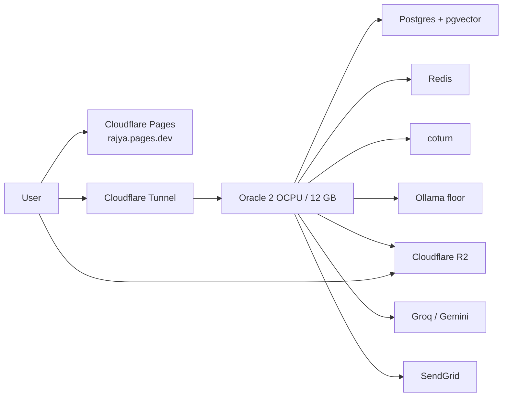
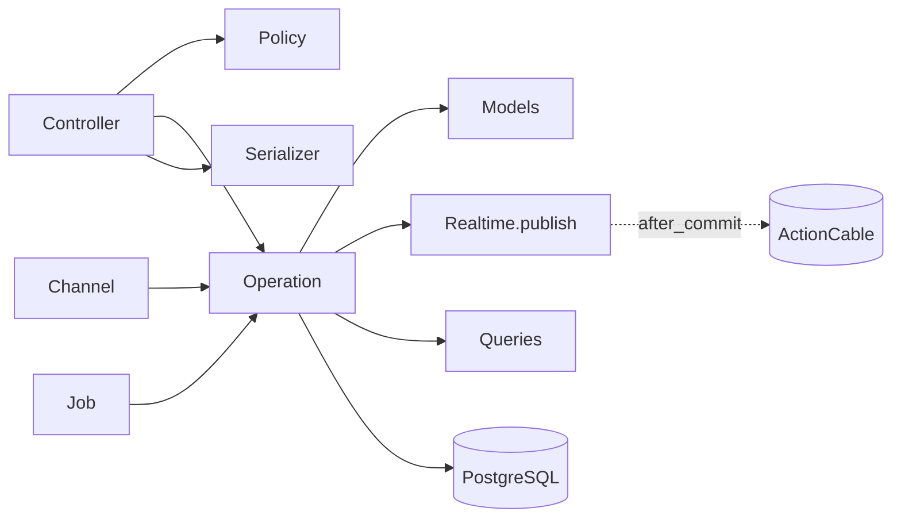
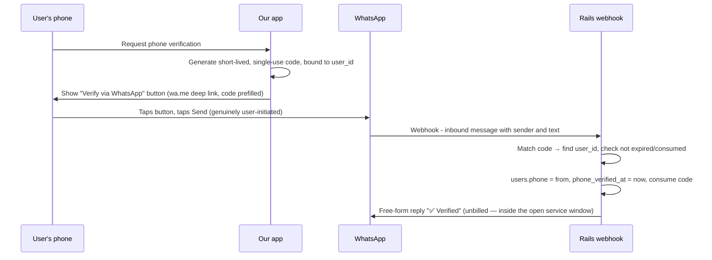
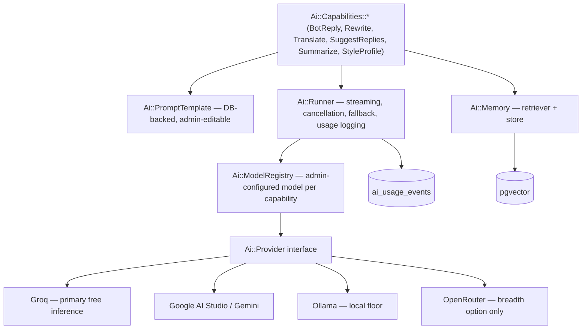

# TARGET_ARCHITECTURE.md

> **Step 2 of the MASTER_PLAN process.** The target state for the rebuild.
> Companion documents: `[SCHEMA_DESIGN.md](SCHEMA_DESIGN.md)` (database),
> `[DESIGN_SYSTEM.md](DESIGN_SYSTEM.md)` (visual/UX), and — from Step 5 —
> `CONVENTIONS.md` (coding standards).
>
> Grounded in `[AUDIT_REPORT.md](AUDIT_REPORT.md)`. Findings referenced as `F-n`,
> business rules as `BR-n`, new requirements as `NR-n`, schema problems as `P-n`.

---

## Governing constraints

Every decision below is bounded by four things you've established:

1. **$0 forever.** Not a starting budget — a permanent constraint.
2. **Clean slate.** No data, no deployed clients, no API contracts to honour.
3. **20 → 100 users**, unpredictable message and media volume.
4. **Mobile-first.** Desktop is rare.

When trade-offs conflict, resolve them in this **priority order** (highest first):

1. **Stay at $0** — no paid tiers, no purchased domain, no carded services on the default path.
2. **Best user UX** — performance, polish, consistency (edge CDN, shared components, design tokens).
3. **Easy local testing** — desktop, **phone over WiFi** (real HTTPS), email catcher UI, notification paths where free tooling allows.
4. **Few commands / terminal tabs** — one Compose for stateful deps, one `bin/dev` for the app.

And three quality bars you've set:

1. **Testable by construction**, not tested afterwards.
2. **Extensible where extension is actually planned** (AI providers, settings, notifications), simple everywhere else.
3. **Premium UI**, visible early.

**Product name: Rajya.** Repository: `rajya`. Public frontend: `https://rajya.pages.dev`.

---


## Table of contents

- [§1 Hosting decision](#1-hosting-decision)
- [§1.1 Service map](#11-service-map)
- [§1.2 Local development and mobile testing](#12-local-development-and-mobile-testing)
- [§2 Technology stack](#2-technology-stack)
- [§3 Real-time layer](#3-real-time-layer)
- [§4 Backend architecture](#4-backend-architecture)
- [§5 Frontend architecture](#5-frontend-architecture)
- [§6 AI and bot architecture](#6-ai-and-bot-architecture)
- [§7 Admin and runtime configuration](#7-admin-and-runtime-configuration)
- [§8 Testing architecture](#8-testing-architecture)
- [§9 Extensibility ledger](#9-extensibility-ledger)
- [§10 Decisions requiring your sign-off](#10-decisions-requiring-your-sign-off)

---


## §1 Hosting decision

This was the one open question from Step 1. Here is the comparison you asked for.

### The finding that reframes everything

**On a machine you control, "free" stops meaning "free-tier limits" and starts
meaning "open-source software."** Postgres, Redis, pgvector, a real background
worker, unlimited database size, no compute-hour meter, no cold start — all free,
all at once. Every managed free tier, by contrast, charges you in constraints
rather than dollars.

That single observation decides this section.

### The candidates


| Option                                | Always on?  | Cold start | DB size cap                  | Separate worker?    | Redis? | Real cost                                                    |
| ------------------------------------- | ----------- | ---------- | ---------------------------- | ------------------- | ------ | ------------------------------------------------------------ |
| **Oracle Cloud Always Free** (ARM A1) | Yes         | None       | Disk-limited (~200 GB block) | Yes                 | Yes    | Card required at signup; ARM64 only; capacity scarcity       |
| **Self-host + Cloudflare Tunnel**     | Yes         | None       | Disk-limited                 | Yes                 | Yes    | Your electricity, uptime, home internet                      |
| **Render free + Neon free**           | No          | 30–60 s    | 0.5 GB                       | No                  | No     | Sockets drop on sleep; **see the Solid Cable problem below** |
| **Render free + Supabase free**       | No          | 30–60 s    | 500 MB                       | No                  | No     | Same sleep problem; DB compute is at least unmetered         |
| **Render free + keep-alive ping**     | Effectively | None       | as above                     | No (750 h consumed) | No     | Burns the entire monthly allowance on one process            |


### The Solid Cable / metered-Postgres trap

This is worth stating plainly because it is non-obvious and it eliminates an
otherwise attractive option.

Solid Cable implements WebSocket pub/sub by **polling Postgres every 100 ms**
(`config/cable.yml`). That means the database is never idle. Neon's free tier
grants **100 compute-unit-hours per month** and scales to zero after five minutes
of inactivity — inactivity that will never occur. At Neon's minimum 0.25 CU, a
continuously-queried database consumes roughly 180 CU-hours in a 30-day month.

**You would exhaust the free tier in under two weeks, every month.** Supabase's
free tier is unmetered shared compute so it survives this, but it's still a
500 MB ceiling attached to a web service that sleeps.

### Decision — **confirmed by you**

**Oracle Cloud Always Free.** It is the only option that is genuinely
free, genuinely always-on, and lets you run the whole stack — Rails, Postgres,
Redis, a worker — on infrastructure you control. Current allowance is **2 OCPU
and 12 GB RAM** on ARM Ampere plus 200 GB block storage. That is a real server,
comfortably oversized for 100 users.

Three caveats I want on the record rather than buried:

- Oracle **halved this allowance in June 2026** (from 4 OCPU / 24 GB) with no announcement. Treat the terms as subject to change and keep the deployment portable.
- **A payment card is required at signup** for identity verification. Nothing is charged, and you've accepted this. Keep the account on the free-only tier rather than upgrading to Pay-As-You-Go, since PAYG accounts can silently accrue charges on overage where free-only accounts simply get shut down.
- Oracle **reclaims instances idle for 7 days** (p95 CPU, network, *and* memory all below 20%). A live chat app with health checks, jobs, and backups never approaches this. Do not add fake load; it's a terms violation and unnecessary.

Because you're on a box you control, this unlocks **Redis, pgvector, a separate
worker process, and unlimited database size** — all free, none of which any
managed free tier offers together.

**Documented fallback: self-host on hardware you own, behind Cloudflare Tunnel.** Identical
technical properties, no card, no vendor. The tradeoff is that your home internet
and a machine staying powered on become the uptime story — fine for family use,
riskier for a live hackathon demo.

**Rejected: Render free.** The 15-minute sleep with a 30–60 second wake is
disqualifying for a real-time chat app. It drops every WebSocket, delays the first
message of the day past the point of feeling broken, and forbids a separate worker
process.

### Portability guarantee

Because the terms of any free tier can change without notice — as Oracle just
demonstrated — the deployment is **Docker Compose from day one**, with every
infrastructure dependency behind configuration:

```
DATABASE_URL=…              # any Postgres
CABLE_ADAPTER=redis|solid   # Redis when available, Solid Cable when not
CACHE_STORE=redis|solid
REDIS_URL=…                 # optional
```

Moving hosts is then a `docker compose up` (production compose) and a DNS change,
not a rewrite. This is deliberate: the hosting choice is the *least* certain
input to this project.

### Cross-origin split (frontend ≠ API)

The static PWA is on **Cloudflare Pages** (`rajya.pages.dev`). The API and
ActionCable live behind **Cloudflare Tunnel** on the Oracle box. That is a
cross-origin deployment by design:

- **CORS** allowlist: `https://rajya.pages.dev` in production; localhost and
  `https://*.trycloudflare.com` in development (mobile tunnels).
- **Auth transport: Bearer tokens** (Authorization header), not cookies — cookies
  across origins force `SameSite=None; Secure` and a shared parent domain you do
  not have under the $0 rule.
- **CSP `connect-src`**: Pages origin + API HTTPS origin + `wss://` cable origin +
  R2 upload endpoints.
- **ActionCable `allowed_request_origins`**: same allowlist as CORS.
- Offline sync (P4) must treat the API host as a configured absolute base URL,
  not `window.location.origin`.

### §1.1 Service map

All figures verified August 2026. Default path is **$0 with no credit card**
except Oracle signup identity verification (already accepted under D-1).

| Concern | Choice | Notes |
| --- | --- | --- |
| Static PWA | **Cloudflare Pages** at `rajya.pages.dev` | Unlimited bandwidth, 500 builds/month. Chosen over Netlify for edge density / TTFB and same-vendor fit with R2 + Tunnel; legacy Netlify accounts remain fine as a fallback host behind a future custom domain |
| API / DB / jobs | **Oracle Always Free** ARM A1 | 2 OCPU / 12 GB, 200 GB block — see §1 above |
| Ingress | **Cloudflare Tunnel** | TLS, no inbound ports, WebSockets on free plan |
| Media | **Cloudflare R2** | Multi-account free tier, zero egress (Q-6) |
| TURN | **coturn on Oracle** | Uses Oracle egress (10 TB). Cloudflare Realtime TURN (1 TB free) is a **carded** escape hatch only if Dubai relay latency disappoints |
| Email (production) | **SendGrid** free + **Single Sender Verification** | No domain required. Verifies one From address you own; can send to any recipient. Deliverability is weaker than full domain auth — accepted at this volume. **Resend `onboarding@resend.dev` can only deliver to the Resend account owner's address** and is not a production path |
| Email (local) | **Mailpit** | SMTP `:1025`, UI `:8025` — see §1.2 |
| AI | **Groq → Gemini → Ollama** | See §6.3. OpenRouter demoted (50 req/day free without paid unlock) |
| Transcription | **Groq `whisper-large-v3`** | Via the same provider registry; flag on by default |
| Push | Web Push + VAPID | `mailto:` contact = personal address; no domain required |
| Errors | Sentry free | Both ends, ~5k events/month |
| Uptime | UptimeRobot free | Also catches Oracle idle reclaim |
| CI | GitHub Actions | Private repo, 2k min/month; build ARM images **on the Oracle box**, not QEMU on x86 runners |
| Analytics | Cloudflare Web Analytics | Free; no Netlify add-on |



### §1.2 Local development and mobile testing

**Hybrid Docker — not full-stack containers on the Mac.** Docker Desktop on macOS
puts Linux containers in a VM; bind-mounted Rails/Vite file watching is slower and
flakier than native. Across two MacBooks the valuable consistency is **versions and
stateful services**, not packaging the app itself.

| Layer | How it runs locally | Why |
| --- | --- | --- |
| Postgres, Redis, Mailpit | `docker compose up` (dev compose) | Identical versions on both Macs; `down -v` resets state |
| Rails + Vite | **Native** on the host | Full-speed HMR / Spring / file watchers |
| Ruby / Node versions | **`mise`** (or asdf) + checked-in `.tool-versions` | Two machines stay aligned without full-stack Docker |
| App processes | **`bin/dev`** via Procfile (`web`, `worker`, `vite`) | One command, one tab — priority #4 |
| Production on Oracle | Full Compose (`web`, `worker`, `postgres`, `redis`, `ollama`, `coturn`) | Portability when hosting terms change |

**Mobile over WiFi.** Binding Vite/Rails to `0.0.0.0` and opening a LAN IP works
for plain HTTP, but browsers refuse service workers, Web Push, and the PWA install
prompt on non-localhost insecure origins. Fix: **`cloudflared tunnel --url
http://localhost:5173`** (and a second tunnel for the API) — free HTTPS with a
publicly trusted cert, no root CA install on the phone, same tool as production
ingress. Add `https://*.trycloudflare.com` to CORS and ActionCable allowlists in
development only.

**Local email.** Mailpit catches every ActionMailer delivery; open
`http://localhost:8025`. Use Rails **ActionMailer::Preview** at `/rails/mailers`
for template iteration without a send. RSpec uses `:test` delivery and
`ActionMailer::Base.deliveries` — no network.

**Local push notifications.** Hardest free path: Web Push needs HTTPS + a real
service worker. Use the same `cloudflared` HTTPS URL on the phone; VAPID keys from
`.env`. Desktop Chrome against `localhost` also works without the tunnel.

---


## §2 Technology stack


### Kept, with justification


| Layer        | Choice                           | Why it survives scrutiny                                                                                                                                                                                                                                                                                                                                                                                         |
| ------------ | -------------------------------- | ---------------------------------------------------------------------------------------------------------------------------------------------------------------------------------------------------------------------------------------------------------------------------------------------------------------------------------------------------------------------------------------------------------------- |
| **Backend**  | **Rails 8**                      | Not inertia. A chat app is overwhelmingly CRUD plus real-time plus background work, and Rails ships all three coherently. Active Storage already handles the multi-bucket R2 requirement (`NR`/Q-6). Critically for you: **Rails is the single most heavily documented backend framework in LLM training data**, which directly serves your AI-agent-assisted workflow. Switching costs months and buys nothing. |
| **Database** | **PostgreSQL**                   | Non-negotiable and not close. You need: JSONB (preferences, metadata), `citext` (usernames), full-text search, partial and expression indexes (the call-concurrency constraint is elegant), `LISTEN/NOTIFY`, and **pgvector for bot memory** (`NR-11`). One database does all of it for free.                                                                                                                    |
| **Frontend** | **React 19 + TypeScript + Vite** | The PWA, offline outbox, and IndexedDB cache all require a real client app. React's ecosystem for the specific things this app needs — virtualized lists, WebRTC, Radix primitives — is unmatched.                                                                                                                                                                                                               |
| **Media**    | **Cloudflare R2, multi-account** | Confirmed keep (Q-6). Free tier is genuinely generous and egress is free, which matters enormously for a media-heavy chat app.                                                                                                                                                                                                                                                                                   |
| **Jobs**     | **Solid Queue**                  | Postgres-backed, durable, Rails-native, survives restarts, and has a real UI via Mission Control. At your scale Redis-backed queuing buys nothing. Must run as a **separate process**, not inside Puma (F-19 context).                                                                                                                                                                                           |


### Changed


| Layer                     | From                                                  | To                                                     | Why                                                                                                                                                                                                                                 |
| ------------------------- | ----------------------------------------------------- | ------------------------------------------------------ | ----------------------------------------------------------------------------------------------------------------------------------------------------------------------------------------------------------------------------------- |
| **Serialization**         | Inline hashes + private `Chat` methods (F-none, §4.1) | **Alba**                                               | There is currently *no* serialization layer; JSON is assembled by `Chat.send(:message_payload, …)`. Alba is fast, dependency-light, and declarative. Whatever the choice, the requirement is one canonical definition per resource. |
| **Authorization**         | Pundit defined but 87% uncalled (F-1)                 | **Pundit, enforced**                                   | Same library, actually wired: `after_action :verify_authorized` in the base controller so an unauthorized action is a *test failure*, not a silent hole.                                                                            |
| **API contract**          | Convention only                                       | **OpenAPI via rswag → generated TS types**             | See §4.5. This is the highest-leverage change in the entire stack.                                                                                                                                                                  |
| **Frontend server state** | Hand-rolled Zustand (F-26)                            | **TanStack Query**                                     | Cache, staleness, refetch, and pagination are solved problems. The 2,198-line `chatStore` is largely a hand-written, buggier version of this library.                                                                               |
| **Frontend UI layer**     | ~291 hand-rolled buttons (F-30)                       | **shadcn/ui + Radix**                                  | See `DESIGN_SYSTEM.md`.                                                                                                                                                                                                             |
| **Real-time transport**   | Solid Cable only                                      | **Redis adapter when available, Solid Cable fallback** | See §3.                                                                                                                                                                                                                             |
| **Cache**                 | Solid Cache                                           | **Redis when available, Solid Cache fallback**         | Presence counters and throttles are exactly the ephemeral, high-churn data Redis exists for.                                                                                                                                        |
| **Copy/strings**          | Hardcoded inline, no i18n                             | **i18next + DB-backed catalog**                        | Required by Q-14.                                                                                                                                                                                                                   |


### Explicitly rejected


| Considered                                               | Rejected because                                                                                                                                                                                           |
| -------------------------------------------------------- | ---------------------------------------------------------------------------------------------------------------------------------------------------------------------------------------------------------- |
| **Extracting real-time into a separate Node/Go service** | Genuine option at 100k users. At 100 it adds a deployment, a protocol boundary, and an auth-sharing problem to solve a load problem you don't have. Revisit only if Postgres pub/sub measurably saturates. |
| **Extracting AI orchestration into a service**           | Same reasoning. The provider abstraction in §6 gives the isolation benefit without the operational cost.                                                                                                   |
| **Sidekiq**                                              | Requires Redis for *durability*, not just speed. Solid Queue's Postgres durability is the better tradeoff here; Redis stays optional.                                                                      |
| **Hotwire instead of React**                             | Would forfeit the offline outbox, IndexedDB cache, and app-like mobile feel — all of which already work and are differentiators.                                                                           |
| **GraphQL**                                              | Solves over-fetching across many clients. You have one client. REST + generated types gives the type safety without the caching complexity.                                                                |
| **A cross-platform native wrapper (Capacitor/Expo / React Native)** | Out of scope for the PWA roadmap. The **only** path to screenshot prevention/detection (`NR-F11`). Not planned until the PWA is already in real use; do **not** ship disappearing messages or view-once media (NR-16 / NR-17) as PWA stand-ins. |
| **End-to-end encryption**                                | Declined on **incompatibility, not cost** (`NR-F10`). E2EE means the server cannot read message content — which removes server-side AI bots, server-side full-text search, and the admin transcript access Q-14 requires. All three are approved capabilities, so E2EE is not a feature that can be added later without giving them up. Transport is TLS, storage is on an encrypted volume, and media URLs are short-lived and membership-checked; that is the honest security posture, and it is not E2EE. |
| **A media server (SFU) for calls beyond four**           | LiveKit or mediasoup would allow 8–50 participants, but a media server does not fit the free instance alongside Postgres, Ollama and coturn, and any hosted SFU has a metered free tier that breaks the $0 rule at the first real call. The 4-way mesh stands; `SignalingChannel` relays opaquely, so an SFU is a transport swap later, not a redesign (`NR-F9`).                                                                                              |


---


## §3 Real-time layer


### Transport

**ActionCable, with a swappable adapter.** The alternatives were evaluated
honestly:


| Option                            | Verdict                                                                                                                                                                             |
| --------------------------------- | ----------------------------------------------------------------------------------------------------------------------------------------------------------------------------------- |
| **ActionCable + Redis**           | **Chosen when Redis is available.** True pub/sub, no latency floor, no database write per broadcast.                                                                                |
| **ActionCable + Solid Cable**     | **Chosen as fallback.** Works with zero extra infrastructure. Costs a 100 ms latency floor and a Postgres write per broadcast — and, as §1 showed, makes metered Postgres unusable. |
| Postgres `LISTEN/NOTIFY` directly | Effectively what Solid Cable wraps, minus the maturity. No reason to hand-roll.                                                                                                     |
| Pusher / Ably                     | Free tiers exist but are connection-capped and would become a dependency you can't afford to outgrow. Violates the $0 rule at any growth.                                           |
| Dedicated Socket.IO service       | Rejected in §2.                                                                                                                                                                     |


The adapter is a config value. Nothing in application code knows which is active.

### Channels

Still four channels, but with clearer boundaries and one of them finally doing a job:


| Channel               | Stream                   | Purpose                                                                                                       |
| --------------------- | ------------------------ | ------------------------------------------------------------------------------------------------------------- |
| `ConversationChannel` | `conversation:<id>`      | Messages, edits, deletions, reactions, typing, pins, system events                                            |
| `AccountChannel`      | `account:<id>`           | Sidebar updates, receipts, invites, cross-conversation notifications                                          |
| `PresenceChannel`     | `presence`               | Online/offline presence. **Kept** — subscribe/unsubscribe drives presence counters; privacy-gated broadcasts of online status. |
| `SignalingChannel`    | `signaling:account:<id>` | WebRTC only                                                                                                   |


### Three corrections to current behaviour

**Connections must verify credentials epoch.** Today a revoked JWT can hold a
WebSocket open until natural expiry (F-6). The connection performs the same
revocation check as HTTP.

**Every broadcast happens after commit.** A single `Realtime.publish` entry point
enqueues broadcasts and flushes them in an `after_commit` hook. This eliminates
the entire class of "client receives an event for data that then rolled back."

**Fanout is batched.** Today sending one message issues a query per participant
and enqueues a push job per recipient (F-19). Under Solid Cable each broadcast is
also a database write. The target computes recipients once, in one query, and
broadcasts once per stream. Push fanout is one job carrying a recipient list, and
a successful push acceptance advances the recipient's delivered watermark
(`SCHEMA_DESIGN.md` §5) — which is why notification delivery is a correctness
input to the NR-2 tick model, not just a convenience feature. Preference
resolution for that fanout is specified in `GAP_ANALYSIS.md` §7.

### Typing indicators (NR-3)

New capability. Ephemeral by design — **never** touches the database:

- Client sends `typing` on `ConversationChannel`, throttled to once per 3 seconds.
- Server writes a cache key `typing:<conversation>:<account>` with a 5-second TTL and broadcasts.
- Client renders the standard message bubble with animation only — no timestamp, no content — per your spec.
- Expiry is implicit. No cleanup job, no stuck state.


### Presence

`PresenceChannel` is **kept** and given a real job (today nothing broadcasts to
it). Clients subscribe while the app is foregrounded; the server:

- Increments/decrements a cache counter per `account_id` on subscribe/unsubscribe,
  with a TTL as the drift backstop.
- Broadcasts online/offline only to accounts allowed to see that presence
  (`preferences.privacy.last_active`), never to blocked accounts.
- Debounces `users.last_active_at` writes through a single job.

Typing stays on `ConversationChannel` (ephemeral, per conversation). Presence
stays on `PresenceChannel` (account-scoped, cross-conversation). Mixing them
would force every open conversation socket to carry global presence noise.

---


## §4 Backend architecture


### 4.1 The problem being solved

The audit found business logic in four places with no rule governing which:
a 984-line `Chat` model that also serializes JSON, a 768-line messages controller,
19 services with inconsistent shapes, and policies that exist but aren't called.

The target has **one rule**: *a controller authenticates, authorizes, delegates to
exactly one operation, and renders one serializer.* Everything else is a violation.

### 4.2 Layers

```
app/
  controllers/api/v1/     Thin. Target ≤15 lines per action.
  operations/             One class per use case. The only place writes happen.
  queries/                Read models. The only place complex reads happen.
  serializers/            Alba resources. The only place JSON shape is defined.
  policies/               Pundit. Enforced by verify_authorized.
  models/                 Persistence, associations, invariants. No JSON, no queries.
  channels/               Subscribe/authorize/relay. No business logic.
  jobs/                   Thin wrappers that call operations.
  services/               Cross-cutting infrastructure: Ai::, Storage::, Push::, Realtime::
```




### 4.3 Operations

Every state change is a class with one public method returning a `Result`:

```ruby
# app/operations/messages/send.rb
module Messages
  class Send < ApplicationOperation
    def call(conversation:, sender:, body:, client_nonce:, attachments: [], reply_to: nil)
      return failure(:blank_message) if body.blank? && attachments.empty?
      return failure(:not_permitted) unless conversation.postable_by?(sender)

      message = idempotent(conversation, client_nonce) do
        Messages::Persist.new.call(...)
      end

      Realtime.publish(conversation, :message_created, message)
      Notifications::FanOut.enqueue(message)
      success(message)
    end
  end
end
```

Why this shape:

- **Testable without HTTP.** A unit test constructs the operation and calls it. No request cycle, no controller, no routing.
- **Reusable across entry points.** The same operation serves the REST endpoint, a WebSocket action, a scheduled job, and — importantly for `NR-F4` — an autonomous agent.
- **Explicit failures.** `Result` with a symbolic error code maps to HTTP status in one place, ending scattered `render status: :unprocessable_entity`.
- **Honest about the current codebase's good parts.** `CallLifecycleService` and `ChatMembership` already work like this. This generalizes what already works.


### 4.4 Authorization — the F-1 fix

Three mechanisms, layered:

1. `ApplicationPolicy` **per resource**, with `after_action :verify_authorized` in the base controller. A missing `authorize` call raises — so it fails in CI, not in production.
2. **Scopes, not filters.** `policy_scope(Message)` returns only visible records, so forgetting a check yields an empty set rather than a leak.
3. **Mandatory negative tests.** Every request spec asserts the 403 path. This is a `CONVENTIONS.md` rule, and the reason the current gap survived is that no test ever tried the API without the UI in front of it.

The permission matrix (who may do what, per role) is defined in
[`SCHEMA_DESIGN.md` §3.1](SCHEMA_DESIGN.md) alongside the membership model.
Policies and request-spec 403 coverage are written against that table — not
against ad-hoc controller conditionals.

### 4.5 API contract — request specs generate the types

The highest-leverage decision in this document:

```
  RSpec request specs
        │  (rswag annotations)
        ▼
  OpenAPI 3 document  ──►  Swagger UI (docs)
        │
        ▼  openapi-typescript
  TypeScript types  ──►  openapi-fetch typed client  ──►  React
```

The frontend's ~135 hand-written, largely untyped fetch functions are replaced by
a generated typed client. The consequences compound:

- A backend change that breaks the contract **fails the frontend build**, not production.
- Documentation cannot drift, because it's generated from passing tests.
- Writing a request spec is no longer optional overhead — it's how the client gets its types. Testing becomes load-bearing rather than virtuous.

**[Extensibility note]** This is deliberate over-investment for a 100-user app.
It is justified because the codebase will be developed largely by AI agents across
many sessions, and a machine-checkable contract is the single most effective guard
against an agent inventing a field that doesn't exist.

### 4.6 Errors

One taxonomy, one translation point:

```ruby
:not_found → 404   :unauthenticated → 401   :forbidden → 403
:validation_failed → 422   :conflict → 409   :rate_limited → 429
:quota_exceeded → 507   :upstream_failed → 502
```

Every response body is `{ error: { code, message, details } }`, where `message` is
resolved through the string catalog (§7) so it's admin-editable and translatable.

### 4.7 Rate limiting — the F-2 fix

Rack::Attack with **authentication endpoints actually covered**, which is the gap
today. Limits themselves live in runtime config (§7), so you can tune them from the
admin dashboard without a deploy:


| Scope               | Default                          |
| ------------------- | -------------------------------- |
| Login attempts      | 10 / 15 min per IP + per account |
| OTP issuance        | 3 / 15 min per destination       |
| OTP verification    | 5 per code, then invalidate      |
| Registration        | 5 / hour per IP                  |
| Messages            | 60 / min per account             |
| AI (per capability) | configurable per capability      |
| General API         | 300 / min per account            |


### 4.8 Phone verification — the NR-9 problem, resolved

You asked for working phone verification, ideally via SMS, then via WhatsApp OTP.
Both **outbound**, business-initiated paths are closed: SMS by TRAI's DLT
regulation (₹5,900+ registration, non-compliant messages silently dropped at the
operator level — very likely what happened in the original implementation), and
WhatsApp's official authentication template by Meta's billing model, which has no
free tier for OTPs at all and bills your Dubai user at the international rate
regardless of VPN, since billing follows the recipient's registered number.

**You then proposed inverting the direction, and it works — genuinely, at $0.**
The mechanism:



**Why this is free and the OTP path isn't.** Meta's billing applies specifically to
*business-initiated* template categories (marketing/utility/authentication). A
message the user sends to your number opens a 24-hour **customer service window**,
inside which the inbound message and any free-form reply you send back are both
entirely unbilled — no template, no category, no charge, and critically, **no
domestic/international distinction**, because there's no authentication template
involved at all. This closes the exact gap that killed WhatsApp OTP for the Dubai
user.

**wa.me deep links are exactly built for this.** `https://wa.me/<business_number>?text=<code>`
opens WhatsApp with the code pre-filled in the compose box — the user still has to
tap Send themselves, which is what keeps this genuinely user-initiated rather than
something we could be accused of routing around Meta's billing for.

**Security is code-secrecy, not phone-secrecy.** We never need to know the phone
number in advance — the webhook's `from` field tells us definitively which number
sent it. The scheme's entire integrity rests on the code: short-lived (~10 min),
single-use, cryptographically random, and bound to the requesting `user_id` at
generation time — never to a pre-declared phone number. If the sender's number
differs from whatever the user typed into a phone field (multiple SIMs, WhatsApp
registered on a different number), **the webhook's sender is treated as ground
truth** and the user is shown which number actually got verified — friendlier than
rejecting a legitimate mismatch.

**Setup is an operational task, not a budget one.** Two real gates, both free:

- A **dedicated phone number** for the WhatsApp Business Account — cannot be a number already active on a personal WhatsApp account.
- Moving the app out of Meta's 5-tester development sandbox, via app review for the `whatsapp_business_messaging` permission, so arbitrary family/friend numbers can message the business number without being individually added as testers first. Free, but budget real calendar days for it, not minutes — do this early in the build phase, not the week you need it.
- Full **business verification** (legal documents) is *not* required — that only gates the unverified tier above 250 conversations/24h, far beyond 20–100 users.

**Decision — confirmed by you:** phone returns as a real, self-service,
first-class verification path — **WhatsApp click-to-verify** as primary, **admin
manual verification** (§7) retained as the fallback for the rare person without
WhatsApp installed. Phone still doesn't become a *login* identity — this verifies
who owns a number for profile/discovery purposes (`BR`-relevant: username-based
discovery already exists; phone discovery per Q-19's privacy toggles now has a
real verified number behind it), while login stays on email OTP, password,
passkey, and Google.

**The design response: verification is two distinct patterns, not one interface
stretched to fit both.**

```ruby
module Verification
  class OutboundChannel   # we send a code out. deliver(destination:, code:, purpose:)
  end
  # Channels::Email — ships now, unchanged

  class InboundConfirmation  # we display a code; the user's action sends it back to us
  end
  # WhatsappClickToVerify — webhook-driven, matches code to sender, sets users.phone

  # Manual — admin marks a phone number verified directly, no code at all
end
```

Modeling these as one `deliver(destination:, code:, purpose:)` interface would have
been a lie — email *sends* a code somewhere; WhatsApp click-to-verify *displays* a
code and waits for a message to arrive. Splitting them is what §0 principle 6
("names describe what the thing is now") would require anyway.

This also closes `F-7`, where `PATCH /users/me` currently lets anyone set a phone
number with no verification at all, bypassing the OTP flow that does exist.

### 4.9 Operational endpoints (NR-10)

Absent today, and Oracle needs them for restart supervision:

- `GET /up` — liveness. Process is running. No dependency checks, always fast.
- `GET /health` — readiness. Checks Postgres, Redis, Solid Queue heartbeat, and R2 bucket reachability, returning per-dependency status.

Split deliberately: a liveness probe that fails when the database blips causes
restart loops, which is a classic way to turn a brief outage into a long one.

---


## §5 Frontend architecture


### 5.1 Folder structure — feature modules

```
src/
  app/                 providers, router, shell, error boundary
  features/
    auth/  conversations/  messages/  composer/  calls/
    bots/  media/  settings/  admin/  search/
      api/         TanStack Query hooks (the only place fetch happens)
      components/  feature UI
      hooks/
      store/       client-only state (Zustand slice)
      model/       types, mappers, pure logic
  shared/
    ui/          design system primitives (shadcn) — see DESIGN_SYSTEM.md
    lib/         generated api client, cable, db, outbox, i18n
    hooks/
  styles/        tokens, base, motion
```

A feature owns its data hooks, its components, and its client state. Cross-feature
imports go through `shared/` or an explicit feature-level `index.ts`.

### 5.2 Server state vs client state — the `chatStore` fix

The core architectural correction. Today one 2,198-line store holds `messages`
next to `replyTo` and `firstItemIndex`. Target:


| Kind                | Owner                       | Examples                                                  |
| ------------------- | --------------------------- | --------------------------------------------------------- |
| **Server state**    | TanStack Query              | conversations, messages, profiles, settings, bots         |
| **Client state**    | Zustand slices, per feature | reply target, edit draft, panel stack, call UI, selection |
| **Ephemeral UI**    | React local state           | hover, focus, open/closed                                 |
| **Durable offline** | IndexedDB                   | message cache, outbox, auth handles                       |


Rules that follow:

- No server entity is ever copied into Zustand. Realtime events write to the **query cache**, not to a store.
- Message history is an `useInfiniteQuery` with cursor pagination — the five hand-rolled pagination modes collapse into one primitive plus explicit "jump" queries.
- Optimistic updates use `onMutate`/`onError`/`onSettled`, which gives rollback for free. The audit found a star-rollback bug that this pattern makes structurally impossible.


### 5.3 Realtime → cache

```
ActionCable ──► typed event router ──► queryClient.setQueryData(...)
```

One router, exhaustively switched over a discriminated union of event types, so
**TypeScript fails the build if the backend adds an event the client ignores** —
directly preventing the two silently-dropped events found in the audit.

### 5.4 Offline — keep what works

The audit was clear that the offline layer is genuinely good engineering. It is
preserved, with corrections:


| Keep                                    | Fix                                                                                                                                   |
| --------------------------------------- | ------------------------------------------------------------------------------------------------------------------------------------- |
| IndexedDB message cache                 | Bound it per conversation, evict by recency                                                                                           |
| Outbox with `queued → sending → failed` | **Server-side idempotency is now real** (unique `(conversation_id, client_nonce)`) — the outbox's core assumption (F-3) finally holds |
| Background Sync retry                   | Single-flight lock so tab and service worker cannot double-send                                                                       |
| `revision` cursor catch-up              | Now covers reactions too (BR-26)                                                                                                      |


### 5.5 Performance


| Concern            | Approach                                                                                     |
| ------------------ | -------------------------------------------------------------------------------------------- |
| Long message lists | Keep `react-virtuoso` — it works                                                             |
| Bundle size        | Route-level `React.lazy` for settings, admin, calls, bot builder, emoji picker               |
| Re-renders         | Selector-based subscriptions only; the ~39 whole-store subscriptions are a lint rule         |
| Images             | Blurhash placeholder → thumbnail → full, with explicit dimensions to prevent layout shift    |
| Perceived speed    | Optimistic send, cached-first render, skeletons only where data genuinely can't be predicted |


### 5.6 Navigation (Q-20)

Your spec — mobile-first, chats list as the base, everything stacking above it,
native swipe-back — is preserved, because the existing layer-stack solves a real
problem that a plain router does not.

What changes is that it becomes **a documented primitive rather than emergent
behaviour**: one `useLayer` hook, one stack store, one rule about history
sentinels, and tests for the back-button contract. Desktop renders the same stack
as side-by-side panels.

### 5.7 Multi-account switching (login accounts — not R2)

**Product requirement (AUDIT §1):** hold multiple logged-in humans on one device
and switch without logout. Today this is purely client-side (multiple JWTs in
`localStorage`); the server has no session registry. At 20–100 users that remains
correct — do not invent a server session table for a problem the client already
solves.

**Target rules:**

| Concern | Rule |
| --- | --- |
| Credential storage | Per-user JWT (and refresh metadata) in an accounts list in secure client storage |
| Active account | Exactly one active JWT; all HTTP + ActionCable use it |
| Isolation | IndexedDB message cache, outbox, and draft store are **namespaced by `account_id`** — switching never mixes threads or queued sends |
| Cable | Disconnect and reconnect with the new token on switch; presence follows the active account |
| Revocation | `credentials_epoch` still invalidates that user's tokens; other saved accounts on the device are unaffected |
| Impersonation | Separate from multi-account — impersonation uses a distinct token shape (`account_id` + `impersonator_id`) and the admin banner (§7.3) |

**Naming disambiguation:** "multi-account" elsewhere in this document for
**Cloudflare R2 bucket accounts** (Q-6 / storage) is a different concept. Login
multi-account is client session switching; R2 multi-account is storage tenancy.

---


## §6 AI and bot architecture

The most-expanded domain. Today: a 604-line controller with prompts inline, one
hardcoded provider, a global model, no usage accounting, and no memory (F-11, F-12).

### 6.1 Layers




### 6.2 Provider abstraction (Q-19)

One interface, deliberately shaped for capabilities you don't have yet:

```ruby
module Ai
  class Provider
    # messages: [{role:, content:}]
    # tools:    optional function-calling schema  → enables NR-F4
    # images:   optional vision inputs            → enables NR-F2
    def stream_chat(messages:, model:, tools: nil, images: nil, &on_delta); end
    def chat(messages:, model:, tools: nil, images: nil); end
    def embed(texts:, model:); end       # bot memory
    def generate_image(prompt:, model:); end  # NR-F3
    def capabilities; end                # what this provider actually supports
  end
end
```

**[Extensibility — deliberate]** `tools:`, `images:`, `embed`, and
`generate_image` exist in the interface from day one even though only text chat
ships initially. Each is a parameter, not a redesign. Adding a provider is one new
class; nothing in messaging changes. This is a direct response to your requirement
that new AI providers must not touch core messaging logic.

**Free inference (D-3, resolved):** **Groq-first**, then Google AI Studio (Gemini),
then **Ollama on the Oracle box** as the floor that cannot be withdrawn. Quotas
verified August 2026 (subject to change; the registry exists because they will):

| Capability | Primary free path | Notes |
| --- | --- | --- |
| `bot_reply` | Groq Llama 3.3 70B → Groq Llama 3.1 8B → Gemini Flash → Ollama | Groq 70B ~1k RPD; 8B ~14.4k RPD |
| `rewrite` / `translate` / `suggest_replies` | Groq 8B → Ollama | Latency-sensitive short tasks |
| `transcribe` | Groq `whisper-large-v3` | ~2k RPD / 28.8k audio-sec/day; soft-fail if exhausted |
| `embedding` | Ollama `nomic-embed-text` | Stays local — privacy + no quota |
| Vision / image gen | Unconfigured | NR-F2 / NR-F3; Gemini multimodal makes NR-F2 cheap to revisit later |

**OpenRouter is demoted** to an optional breadth provider. Its free tier is ~50
requests/day (1,000 only after a one-time $10 unlock), which is too small for
bot replies as a primary path. Keep the adapter so a future paid unlock is config,
not code.

Local Ollama still matters: no data leaves the machine for embeddings, and it is
the only provider that cannot disappear overnight.

### 6.3 Model registry (NR-8)

Model choice per capability, editable from the admin dashboard, with an ordered
fallback chain:

```
bot_reply       → [groq/llama-3.3-70b-versatile, groq/llama-3.1-8b-instant, gemini-2.5-flash, ollama/llama3.2]
rewrite         → [groq/llama-3.1-8b-instant, ollama/llama3.2]
translate       → [groq/llama-3.1-8b-instant, ollama/llama3.2]
suggest_replies → [groq/llama-3.1-8b-instant, ollama/llama3.2]
summarize       → [groq/llama-3.3-70b-versatile, gemini-2.5-flash, ollama/llama3.2]
transcribe      → [groq/whisper-large-v3]
embedding       → [ollama/nomic-embed-text]
vision          → […]   (NR-F2, unconfigured — Gemini multimodal is the natural first fill)
image_gen       → […]   (NR-F3, unconfigured)
```

Fallback triggers on 402/404/429/timeout. Every attempt writes an
`ai_usage_events` row — even for free models — so you can see usage, spot loops,
and enforce budgets later without re-plumbing.

### 6.4 Prompts as data

Every prompt moves from Ruby string literals into the DB-backed template store,
editable from the admin dashboard with versioning. This falls naturally out of
Q-14 ("update any text") and has a real payoff: **prompt iteration stops requiring
a deploy**, which is most of the work in making an AI feature feel good.

### 6.5 Bot memory (NR-11)

Per your decision: **fully shared, no restrictions.** What one user tells a bot,
any user can learn from that bot.

```
Message to bot
   → extract candidate memories (async, LLM-assisted)
   → embed + store in bot_memories (bot-scoped, with provenance)

Bot reply
   → retrieve: recent conversation turns
             + top-k semantically similar memories across ALL users
             + rolling conversation summary
   → assemble prompt → stream
```

Provenance (`source_account_id`, `source_message_id`) is recorded on every memory
even though nothing filters on it today. **[Extensibility — deliberate]** That one
column is what makes a future visibility boundary a query change rather than a
data migration. It costs nothing now.

Retrieval is behind a `MemoryRetriever` interface: pgvector semantic search where
available, recency-plus-keyword where not.

**Design consequence to surface in the UI:** bots are not private. `DESIGN_SYSTEM.md`
covers where that gets said.

### 6.6 Reply-target awareness (NR-12)

When a user replies to a specific earlier message, the prompt explicitly includes
that message as quoted context, distinct from ordinary history. Small, cheap, and
currently unverified as working.

### 6.6a Style profile persistence (Q-9 / NR-F1)

The learned writing-style profile is stored in
`preferences.data.ai.style_profile` (jsonb blob) with
`style_profile_enabled` and `style_profile_updated_at`. Building/rebuilding the
profile requires explicit opt-in (closes F-11's consent gap). The same blob is
the input for rewrite / suggest-reply today and for a future replica bot
(NR-F1) — no separate table.

### 6.7 Designing for the future features


| Requirement                                  | Seam that makes it additive                                                                                                                                                                                                                                                                                                                                         |
| -------------------------------------------- | ------------------------------------------------------------------------------------------------------------------------------------------------------------------------------------------------------------------------------------------------------------------------------------------------------------------------------------------------------------------- |
| **NR-F1** Replica bot                        | Style profile blob lives in `preferences.data.ai.style_profile` (`SCHEMA_DESIGN.md` §7). A replica is a bot whose `persona_prompt` is generated from that blob and whose sender is that bot. No new table.                                                                                                                                                         |
| **NR-F2** Image understanding                | `images:` parameter on the provider interface; attachments already carry content type and dimensions.                                                                                                                                                                                                                                                               |
| **NR-F3** Image generation                   | `generate_image` on the interface; output enters the existing attachment pipeline.                                                                                                                                                                                                                                                                                  |
| **NR-F4** Proactive cross-conversation agent | The hard one. Requires: (a) bots able to originate messages — satisfied because operations don't assume a human caller; (b) suspended task state — an `agent_tasks` table, **not built now**; (c) resumption on an async human reply — the bot-reply path is already an idempotent job. The architecture leaves all three seams open. Building it is a later phase. |


**[Simplicity — deliberate]** `agent_tasks` is *not* in the target schema. Adding
a table later is trivial; carrying an unused table through every migration,
factory, and serializer is not. This is the line between designing for the future
and speculatively building it.

---


## §7 Admin and runtime configuration

Q-14 turns admin from a side panel into core architecture.

### 7.1 Three stores, one dashboard


| Store                 | Holds                                                                                             | Read path                                                             |
| --------------------- | ------------------------------------------------------------------------------------------------- | --------------------------------------------------------------------- |
| `app_settings`        | Feature toggles, AI model mappings, rate limits, tunable constants (edit window, pin cap, quotas) | `Settings.fetch(:message_edit_window)` — cached, invalidated on write |
| `translation_strings` | Every user-facing string                                                                          | `t('…')` — code ships defaults, DB rows override                      |
| `prompt_templates`    | Every AI prompt                                                                                   | `Ai::PromptTemplate.fetch(:bot_reply)`                                |


All three are the same pattern: **code-defined defaults, database overrides,
aggressive cache, admin editor.** One mechanism, three uses — which is how Q-15
("no feature flags") and Q-14 ("admin toggles features") reconcile. The YAML file
disappears; the capability grows.

This also retires a live annoyance: `IMPROVEMENTS.md` complains that the 15-minute
edit window is hardcoded with no configurability. It becomes a row.

### 7.2 The string catalog (Q-14)

The most invasive commitment in this plan, so it must land in the foundation phase:

- Defaults live in versioned locale files, seeded into the DB.
- Resolution order: DB override → code default → the key itself (never a blank screen).
- Frontend loads the catalog once per app version and caches it; i18next handles interpolation and pluralisation.
- The admin editor lists keys grouped by surface, showing default and override side by side.
- A lint rule fails the build on a hardcoded user-facing string.

**[Extensibility — deliberate]** This exists because you asked for editable copy.
The by-product is complete i18n infrastructure, which the app has none of today.

### 7.3 Impersonation (NR-7)

Unrestricted, per your instruction — **no blocked actions, no limits of any kind**.
"Safely" here means fully observable, not constrained: capability is total, and
every action taken while impersonating is attributable after the fact.

- Admin starts impersonation → a **distinct token** carrying `{ account_id, impersonator_id }`.
- Every request logs both identities.
- A persistent, non-dismissible banner shows the active impersonation (see `DESIGN_SYSTEM.md` §5.4) — so it's always visible which mode you're in, even though nothing is restricted.
- **Every** action taken while impersonating — including deletes — is recorded in `audit_events` with both identities, the action, and its target.
- No action is blocked, including destructive ones. The audit log is the only mechanism here; it is deliberately observability rather than a gate.


### 7.4 Admin capabilities (NR-5)

Everything the ERB panel does, plus: user management and impersonation, all
conversations, feature toggles, AI models and prompts, the string catalog, theme
and font configs, bot approvals, storage bucket health and quotas, job and error
monitoring, AI usage dashboards, and an audit log.

Delivered as a route group inside the React app, gated by `users.is_admin`, using
the same design system — per your request for UI consistency.

---


## §8 Testing architecture

Per your requirement, testing is structural, not a phase. The architecture above
is shaped by testability: operations are testable without HTTP, queries without
controllers, policies in isolation, serializers as pure functions.

### Backend


| Layer       | Tool                  | Rule                                                               |
| ----------- | --------------------- | ------------------------------------------------------------------ |
| Operations  | RSpec unit            | Every operation, success **and** every failure branch              |
| Queries     | RSpec unit            | Correctness plus an N+1 assertion via `n_plus_one_control`         |
| Policies    | RSpec unit            | Full role matrix per resource                                      |
| Serializers | RSpec unit            | Shape snapshot                                                     |
| Endpoints   | RSpec request + rswag | Every endpoint; **403 tests mandatory**; generates the OpenAPI doc |
| Channels    | RSpec channel         | Subscribe authorization + payload shape                            |
| Jobs        | RSpec job             | Including retry and idempotency                                    |
| Coverage    | SimpleCov             | Threshold enforced in CI (there is none today)                     |


### Frontend


| Layer                     | Tool                                                                                                      |
| ------------------------- | --------------------------------------------------------------------------------------------------------- |
| Pure logic, hooks, stores | Vitest                                                                                                    |
| Components                | Vitest + Testing Library                                                                                  |
| Critical flows            | **Playwright** — login, send/receive, offline send and reconnect, bot reply, call setup, group management |
| Contract                  | Generated types make the build itself a contract test                                                     |


Playwright's absence is the biggest testing gap today. The flows above are exactly
the ones where a regression is invisible in unit tests.

### CI

GitHub Actions free tier: lint (RuboCop, ESLint, Prettier) → backend specs with
coverage gate → OpenAPI generation and drift check → type generation → frontend
tests → Playwright. Free at this scale.

**One pipeline in one repository.** The code lives in a single repository named
`rajya` with `backend/`, `frontend/` and `docs/` (see `MASTER_PLAN.md` §1), so
the workflow is path-filtered: a change under `docs/` runs only the markdown link
check, a `frontend/` change skips RSpec, and **any change touching either side of
the API contract runs the drift check**. That last case is the reason the repo is
not split — regenerating the OpenAPI document and diffing the generated
TypeScript against the committed copy requires both sides in one checkout. Across
two repositories it needs a cross-repo trigger and a token, which is precisely the
kind of machinery that gets switched off the first time it is inconvenient.

A single repository does not imply a single deployable: the backend image builds
from `backend/`, the frontend builds to static assets on **Cloudflare Pages**, and
the production `docker-compose.yml` on Oracle composes API + worker + deps.

### Coverage policy

**100% line and branch coverage on both sides, enforced from the first commit.**
See `MASTER_PLAN.md` §8 for the exclusion policy and the reasoning. The relevant
architectural consequence is that this is only achievable because the layering
above makes almost everything a plain object with injected dependencies:
operations, queries, policies and serializers have no framework coupling to work
around, and the parts that genuinely resist unit testing — the WebRTC engine, the
service worker — are isolated behind interfaces that can be faked.

---


## §9 Extensibility ledger

Per your requirement, an explicit account of where complexity was added for future
extension versus where simplicity was chosen. This is the honest version — every
"extensible" claim has a cost, and speculative flexibility is a real failure mode.

### Built for extension — justified


| Area                                          | Investment                                                                     | Justification                                                                                                                                         |
| --------------------------------------------- | ------------------------------------------------------------------------------ | ----------------------------------------------------------------------------------------------------------------------------------------------------- |
| **AI provider interface**                     | `tools`, `images`, `embed`, `generate_image` in the interface unused at launch | You named four future AI capabilities. Each becomes an adapter method, not a redesign.                                                                |
| **Model registry**                            | Indirection between capability and model                                       | You explicitly asked to configure models from admin.                                                                                                  |
| **Prompts as data**                           | DB templates + admin editor                                                    | Prompt iteration is most of AI quality work; a deploy per tweak kills it.                                                                             |
| **Preferences as a validated JSONB document** | Loses per-column CHECK constraints                                             | Directly answers "new settings shouldn't require schema migrations every time." Constraints move to a code-defined registry that's *more* expressive. |
| **Runtime settings + string catalog**         | Two tables, a cache layer, a lint rule                                         | Required by Q-14; also yields i18n.                                                                                                                   |
| **Bot memory provenance columns**             | Two unused FKs                                                                 | Makes a future privacy boundary a query change, not a migration. Cost: ~16 bytes/row.                                                                 |
| **Swappable cable/cache adapters**            | One config indirection                                                         | The hosting decision is your least certain input; being able to move hosts cheaply is worth one indirection.                                          |
| **OpenAPI contract**                          | rswag annotations on every request spec                                        | Over-engineering for 100 users; correct for a codebase built by AI agents across many sessions.                                                       |


### Kept simple — extension not worth it


| Area                                      | Choice                                                    | Why                                                                                                                                              |
| ----------------------------------------- | --------------------------------------------------------- | ------------------------------------------------------------------------------------------------------------------------------------------------ |
| `agent_tasks` **for NR-F4**               | Not built                                                 | Adding a table later is trivial; carrying an unused one through every migration and factory is not.                                              |
| **Monolith**                              | One Rails app                                             | Service extraction solves problems of scale and team size. You have neither.                                                                     |
| **Read receipts**                         | Watermarks + an append-only mark log, no per-message rows | See `SCHEMA_DESIGN.md` §5. Exact per-message read times at roughly 1% of the row count.                                                          |
| **Multi-tenancy**                         | None                                                      | Never mentioned. Retrofitting is expensive; building it unasked is worse.                                                                        |
| **Message encryption (E2EE)**             | Excluded, confirmed                                       | Fundamentally incompatible with server-side AI, search, and bot memory. You've confirmed the AI features are the product. Effectively permanent. |
| **Plugin system for message types**       | None                                                      | Message kinds are a closed enum. Adding one is a migration and a component.                                                                      |
| **Generic event-sourcing / CQRS**         | No                                                        | Operations and queries give the separation benefit without the operational weight.                                                               |
| **Notification channels beyond web push** | Interface only                                            | A `DeliveryChannel` interface exists so email or native push is an adapter — but only web push is implemented.                                   |


---


## §10 Decisions


### Resolved

| # | Decision | Outcome |
| --- | --- | --- |
| **D-1** | Hosting | **Oracle Cloud Always Free** for API/DB/jobs; **Cloudflare Pages** for the PWA (`rajya.pages.dev`); **Cloudflare Tunnel** for ingress. Card-on-file for Oracle signup only. Self-host behind Tunnel documented as fallback. |
| **D-2** | Impersonation restrictions | **None.** No blocked actions, no limits of any kind — admin is unrestricted god-mode by design (Q-14, reaffirmed). The audit log (§7.3) is observability, not a gate. |
| **D-4** | End-to-end encryption | **Excluded, permanently.** The AI features require server-side plaintext. |
| **D-5** | Read receipts | **Exact precision required.** Delivered via watermarks plus an append-only mark log — same exactness as per-message receipts at ~1% of the rows. See `SCHEMA_DESIGN.md` §5. |
| **D-6** | Phone verification | **WhatsApp click-to-verify** — user-initiated, so it lands in the unbilled "customer service window" rather than a billed authentication template. Genuinely $0, including for the Dubai user. Admin manual verification stays as fallback. Phone still isn't a login identity. See §4.8. |
| **S-1** | Participant table name | **`accounts`.** `accounts` participate in conversations, `users` are humans who log in, `bots` are AI configurations. |
| **D-3** | Free AI | **Groq-first** for chat/rewrite/translate/transcribe; **Ollama** as floor for embeddings and offline fallback; OpenRouter demoted to optional breadth (§6.2–6.3). |
| **D-7** | Client multi-account | **Client-only multi-JWT**, namespaced IndexedDB/outbox per account. No server session registry (§5.7). |
| **D-8** | PresenceChannel | **Kept** with real presence fanout (§3). |
| **D-9** | Product name / URL | **Rajya**; frontend `https://rajya.pages.dev`; repo `rajya`. |
| **D-10** | Email | **SendGrid + Single Sender Verification** in production (no domain). **Mailpit** locally. Resend shared sender is not production-capable. |
| **D-11** | Local DX | **Hybrid Docker** (deps only) + native Rails/Vite + `mise` + `bin/dev`; mobile HTTPS via `cloudflared` (§1.2). |

### Still open

None that block implementation.


